# Event Driven Microservices with CQRS, Saga, Event Sourcing.

**Agenda.**
1. Database-per-service pattern.
2. API composition pattern.
3. Command Query Responsibility Segregation (CQRS).
4. Event Sourcing Pattern.
5. Materialized View Pattern.
6. Transactional Outbox Pattern.
7. Saga Pattern.

## Database-per-service pattern.

The Database-per-service pattern is a microservice architecture approach where each microservice is assigned its own
dedicated database. This pattern enhances separation of concerns, ensuring data isolation, loose coupling, decentralized
data management, technology diversity and improves scalability etc.
In a microservice architecture, services are intended to be small, specialized, and independent, each handling a specific
function. To uphold this separation, it's crucial that each microservice independently manages its data. 
The Database-per-service pattern supports this by assigning a distinct database to each microservice.
Implementing the Database-per-service pattern allows you to select the most suitable data stores (such as relational or
non-relational databases) based on your application and business needs.
This approach ensures that microservices do not share a data layer, meaning changes to a microservice's database don't
affect others. Each microservice's data store is inaccessible to other services directly, and persistent data is accessed
solely through API.
By decoupling data stores, the overall resiliency of your application is enhanced, preventing any single database from
becoming a single point of failure.

**Benefits.**
* Loose Coupling.
* Independent Scaling.
* Faster development.
* Resilience, Fault tolerance.
* Freedom to choose different databases.
* Prevents unauthorized access to another service's data.

**Challenges.**
* Cross-Service Queries: Joining data across services is not straightforward. This often requires additional efforts like
data replication or using an API to aggregate data.
* Data Consistency: Ensuring data consistency across services can be challenging, especially when a business process spans
multiple services.
* Complex Transactions: Distributed transactions across multiple services and their databases are difficult to manage.
Techniques like Saga patterns or eventual consistency are often used.
* Data Duplication: Sometimes, the same data needs to be stored in multiple services, leading to data duplication and
challenges in keeping this data synchronized.

### Cross-Service Queries.

In a monolithic architecture, complex queries that join data from multiple tables are straightforward. However, in
microservices with the Database-per-service pattern, performing queries that span multiple services becomes complex 
because the data is distributed across different databases. For example, inside bank microservices, the consumer might
want to see a summary of his data including the personal information, Accounts, Loans and Cards data. Joining data across
these services to provide a combined search result is challenging.

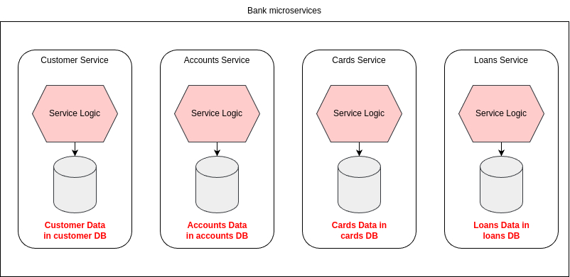

The Cross-Service Queries challenge can be addressed by using the following approaches.
* API composition pattern: This is the simplest approach and should be used whenever possible. It works by making the 
clients responsible for invoking the services that own the data and then combining the results.
* CQRS pattern: Command Query Responsibility Segregation (CQRS) pattern is more powerful but also more complex. It involves
maintaining one or more view databases whose sole purpose is to support queries, making it easier to retrieve and combin
data from multiple services.

#### API composition pattern.

The API composition pattern handles query operations by calling the services that own the required data and then combining
their responses. There are two key participants in this pattern:
* API Composer: This component executes the query by interacting with the provider services.
* Provider Service: This is the service responsible for managing part of the data returned by the query.

While implementing this pattern, one has to decide who plays the role of API Composer. In general, one end up choosing
any of the below 3 options:
1. Client like frontend web application itself acts as an API composer.
2. The API gateway can act as an API composer.
3. A standalone service can act as an API composer.

It is a best practice for the API composer component to leverage the Reactive programming model to make the dependent 
service invocations parallely with minimum number of threads, memory etc.

While the API composition pattern offers a straightforward and intuitive approach to implementing query operations in a
microservice architecture, it codes come with several drawbacks:
1. Increased Latency.
2. The logic of composing the results can become complex.
3. Error Handling.
4. Data Consistency.
5. Limited Scalability.
6. Dependency on Service Availability.
7. Testing Challenges.

#### Gateway Aggregator / Composition pattern.

In microservices architecture, a Gateway Aggregator or Gateway Composition pattern is used when a request from a client
needs to retrieve or process data from multiple backend microservices. Instead of having the client make multiple calls
to various microservices, the API Gateway consolidates the requests into a single response.

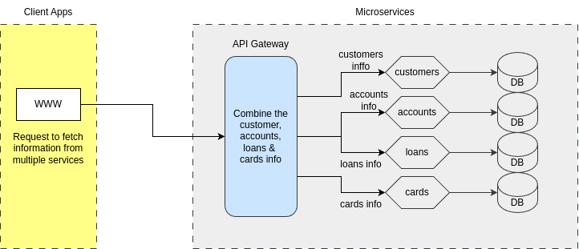

#### Data Consistency & Complex Transactions.

Consider an e-commerce platform with separate microservices for orders, payments, and inventory. When a customer places 
an order, the system needs to:
* Create an order in the Order Service.
* Deduct the payment in the Payment Service.
* Update the inventory in the Inventory Service.

If any these steps fails (e.g. payment fails after the order is created), the system must ensure that the data remains 
consistent across all services. Without a sharded database, this consistency is difficult to achieve. 

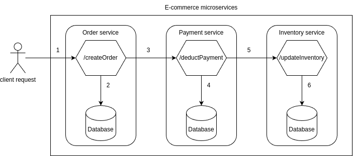

In a banking application, consider a credit card payment from a saving account. Ensuring that both the debit and credit 
operations are executed as a single atomic transaction is challenging because they involve different services and databases.

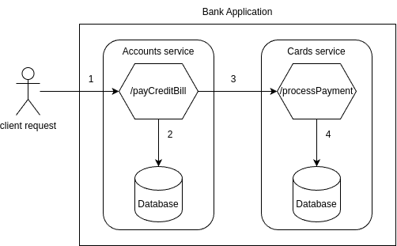

The Data consistency and complex transactions challenges can be addressed by using the following pattern.
**Saga Pattern.**
* The Saga pattern can be used to manage distributed transactions. Each microservice executes a local transaction and 
publishes an event to trigger the next step. If a step fails, the previous steps are compensated.
* For example, if payment fails after an order is created the Saga pattern can automatically trigger a cancellation of the
order.

### Data duplication.

In microservices, some data might need to be available to multiple services, leading to data duplication. For example, in
a bank system, the accounts, loans and cards microservices need customer data. If three services maintain their own copies
of customer data, ensuring the updates to customer information (e.g. a change in mobile number) are reflected in all 
services becomes complex.

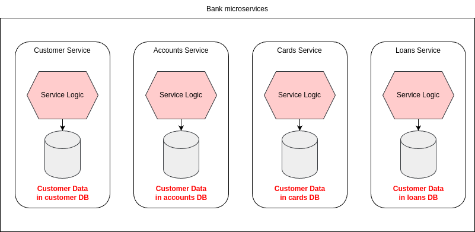

The Data duplication challenge can be addressed by using the following approaches.
**Event-Driven Architecture.**
* When data in one service changes, it can publish an event that other services listen to and update their copies of the
data accordingly.

# Command Query Responsibility Segregation (CQRS).

The Command Query Responsibility Segregation (CQRS) design pattern is an architectural pattern used in software development
that separates the responsibilities of handling commands (which change the state of the system) and queries (which read
the state of the system). This separation allows for more flexibility, scalability, and optimization in handling
operations, particularly in complex or distributed systems.

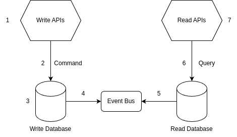

For example, inside bank microservices, the customer might want to see a summary of his data including the personal information,
Accounts, Loans and Cards data. In this scenario, all the individual services, when ever a data changes happens they send
an event to the read service which handles all the services data in a ready to read DB.

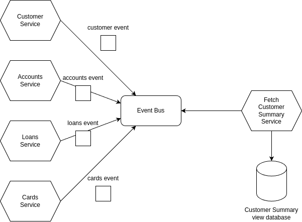

## Advantages of CQRS.

CQRS has both benefits and drawbacks. The benefits are as follows:
* Scalability: By separating reads and writes, you can independently scale each side based on its specific needs. For
instance, if read operations are more frequent than write operations, you can scale the read side accordingly.
* Optimized Data Models: The write model can be optimized for data consistency and transactional integrity, while the
read model can be optimized for fast data retrieval. This allows you to use different data storage mechanisms for each
model.
* Flexibility: CQRS allows you to easily implement different query models, such as projections, to accommodate various
views of the data without affecting the write side.
* Event Sourcing: CQRS is often used in conjunction with event sourcing, where every change to the state is captured as
an event. This provides a complete audit trails of all changes and allows the system to be rebuilt from the event log if
necessary.

## Disadvantages of CQRS.

CQRS has below drawbacks:
* Increased Complexity: Separating the read and write models can add complexity to the system, particularly in terms of
maintaining data consistency and handling eventual consistency.
* Eventual Consistency: Since the read and write sides are separated, there can be a delay between when data is written 
and when it becomes available for reading. This eventual consistency can be challenging to manage in certain scenarios.
* Development Overhead: Implementing CQRS requires additional effort in terms of designing, developing, and maintaining
separate models and handling communication between them.

## Event sourcing pattern.

Event sourcing is a powerful architectural pattern used in software development to persist the state of an application.
Instead of only saving the final state, every change is recorded as an event. These events are stored in an event log/event
store, maintaining their sequence to capture the entire history. By replaying the event log from the beginning, you can
completely reconstruct the application's state.

**Key Concepts of Event Sourcing:**
* Command: A command represent an intent to perform an action in the system, such as "DebitMoney" or "CreditMoney".
Commands trigger changes, which are recorded events.
* Event: An event represents a change in the state of the system. It's an immutable record of something that has occurred
in the past, such as "MoneyDebited", "MoneyCredited" etc.
* Event Store: This is a specialized database where events are stored. Events are appended to the store in the order they
occur and can be replayed to recreate the state of the system.
* Aggregate: In Event Sourcing, aggregates are the primary objects that encapsulate state and behavior. They produce and
process events. For example, a Transaction might be an aggregate that processes events like "MoneyDebited" or "MoneyCredited".
* Projections: Projections are read-only views or models built from the sequence of events. They are often used to query
the current state of the system or generate reports. Projections can be updated in real-time as new events occur.

Let's consider a bank account as an example. Suppose you want to keep track of the balance in your bank.
You could have a MoneyCredited event that logs the account ID and the amount credited each time you deposit money.
Similarly, when you withdraw money, you would record a MoneyDebited event with the account ID and amount withdrawn.
By replaying all the events in sequence, you can always determine the current account balance, regardless of how many
transactions have occurred.
Event sourcing is incredibly useful for scenarios where you need a complete audit trail of all changes over time. It's
definitely worth considering if you want your applications to maintain a detailed history of transactions.

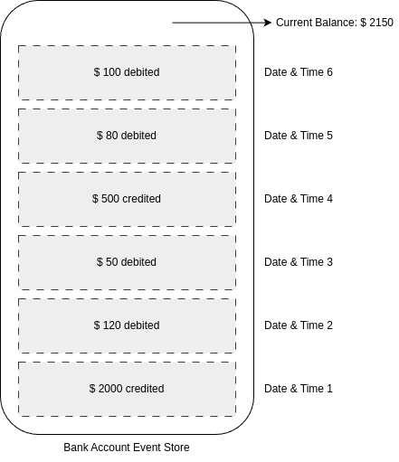

**Benefits of Event Sourcing:**
* Auditability: Every state change is logged as an event, providing a complete audit trail of all changes in the system.
* Replay-ability: The system can recreate past states by replying events. This is useful for debugging or restoring data. 
Provides developers with a time machine.
* Scalability: By decoupling the write and read modules (using Command Query Responsibility Segregation or CQRS), the system
can scale more effectively.
* Flexibility: Projections can be created on-the-fly for new reporting requirements without modifying the core data model.

### Technical flow of CQRS and Event Sourcing.

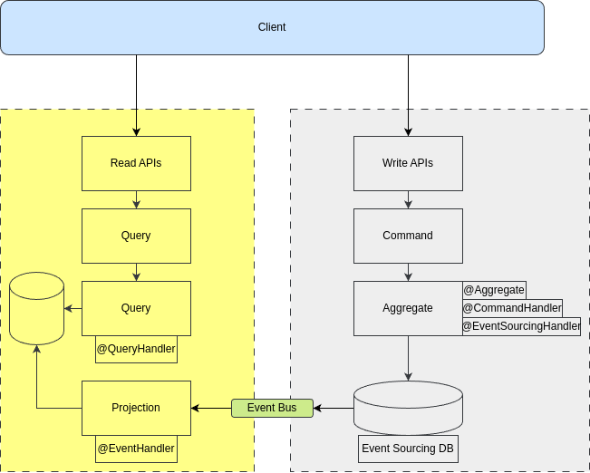

#### CQRS with Single Read/Write Model, Single Database.

* A Single Read/Write Model with a single database is the simplest for of CQRS. Commands and Queries share the same models,
offering strong consistency with low complexity.
* While performance and scalability are limited, it's ideal for small to medium apps of for those new to CQRS.
* The key benefit is clean, modular code with clear separation of concerns, adhering to the Single Responsibility 
Principle (SRP), making the system flexible and easy to test.

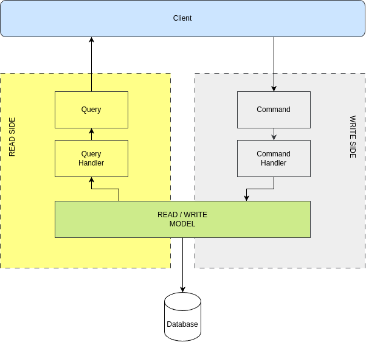

#### CQRS with Different Read/Write Models, Single Database.

* Using different Read and Write models with a single database allows for performance optimization on both sides. While
both share the same database, you can use a heavier ORM for writing and a lightweight model for querying. This setup 
maintains strong consistency with low to medium complexity and scalability.
* Write model often involve Domain-Driven Design (DDD), while simpler DTOs handle Reads, optimized for fast serialization
and querying with minimal mapping.
* Since changes are committed in a single atomic transaction, consistency is ensured, allowing for better query performance
without added complexity.

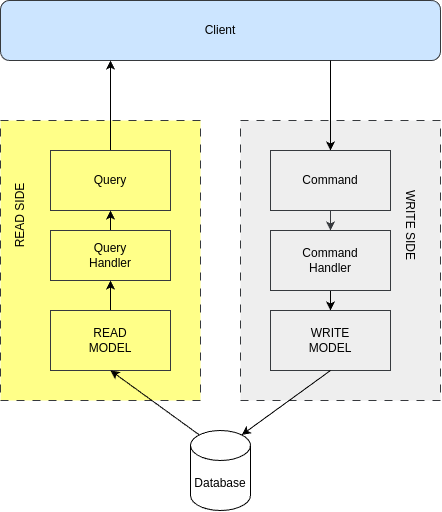

#### CQRS with Different Read/Write Databases.

* This is where CQRS gets more interesting - and much more complex. Using separate databases for Reads and Writes allows
for Ployglot Architecture, enabling you to choose the best database for each side based on your app's needs.
* This setup offers high performance and scalability, as each side can scale independently.
* However, the trade-off is high complexity and eventual consistency. Since you can't commit both sides in a single
transaction, Write changes are typically propagated to Read models via asynchronous events, leading to changes like
handling out-of-order events, lost messages, or failed Read updates.
* This architecture is powerful but should only be used when your app's non-functional requirements justify the added
complexity of managing distributed systems and eventual consistency.

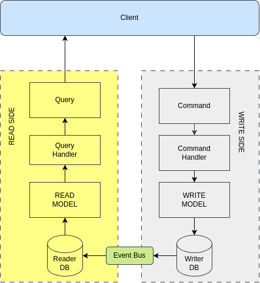

#### CQRS with Event Sourcing, different Read/Write Databases/

* Maintaining sync between separate Read/Write databases with Eventual Consistency can be tricky, especially when event
ordering matters. For example, if a Write model is updated twice in quick succession, and the first event is processed
after the second, the Read model could end up with outdated data.
* Most synchronous message buses prioritize availability and performance, which means they don't guarantee message order.
Event Sourcing offers a solution by storing Write models as event streams instead of their current state.

**Event Sourcing with Different Read/Write Databases:**
* Consistency: Eventual Consistency.
* Complexity: High.
* Performance/Scalability: High.

#### CQRS with Event Sourcing, single database.

* If you want to benefit from CQRS and Event Sourcing without needing massive scale, using a single database for both
Event Streams and materialized Read Models is a great option. By committing both in a single transaction, you avoid
consistency issues.
* In a NoSQL database, storing Event Streams and Read Models is straightforward. For relational databases, Event Streams 
can be stored as JSON text. This setup provides a balanced approach with simpler consistency management.

**Event Sourcing with Single Database.**
* Consistency: Strong.
* Complexity: Medium.
* Performance/Scalability: Medium.

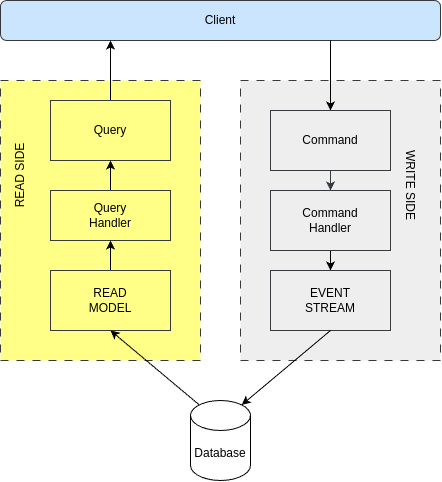

#### CQRS with CDC.

* CQRS with CDC is a highly effective architectural pattern for managing complex microservices. By separating the command
and query responsibilities and using CDC to synchronize the data between the Write and Read sides, you get the benefit of 
decoupling, scalability, and responsiveness, while maintaining consistency through event-driven microservices.
* While the pattern adds some complexity, especially in terms of managing eventual consistency and setting up the
infrastructure, it is a powerful solution for large-scale, distributed systems where high scalability and performance are
critical.

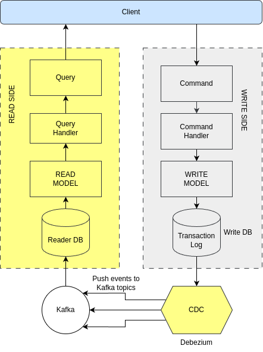

### Change Data Capture (CDC).

Change Data Capture (CDC) is a technique that monitors and captures changes in a database and propagates these changes to
other systems in real-time.
In microservices, where each service typically owns its own database, CDC can be used to keep the state of various services
synchronized without tight coupling or the need for direct service-to-service communication.

**How CDC Works:**

Change Data Capture (CDC) allows us to track row-level changes in database tables triggered by CREATE, UPDATE, and DELETE
operations. With CDC, database changes can be treated as events to which we can respond. This technique enables incremental
data loading and synchronizing data across different systems.
CDC can be implemented through various strategies, such as polling, dual writes, or log tailing. Most CDC pipelines utilize
the log tailing approach, which monitors the database's engine-specific logs.
For instance, in MySQL, changes are captured from the binary log (binlog), while PostrgreSQL uses WAL (Write-Ahead Logging)
via publication and replication slots. Similarly, MongoDB tracks changes through the OpLog.

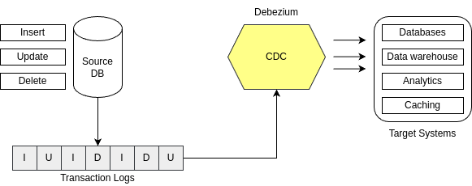

Debezium is a popular open-source CDC tool built on top of Apache Kafka. It captures changes from databases like MySQL,
PostgreSQL, MongoDB, and SQL Server by monitoring their transaction logs.

**Benefits of CDC in Microservices:**
* Loose Coupling: Microservices don't need to directly communicate for data synchronization. They simply listen to changes
happening in other services' databases.
* Asynchronous Communication: Using CDC, changes are propagated asynchronously, reducing the tight coupling of synchronous
API calls between services.
* Event-Driven: CDC aligns with event-driven architectures, where changes in one service can be used to trigger workflows
in other services. 
* Scalability: Since services, remain decoupled, CDC can help improve scalability by avoiding direct dependencies between
microservices.

**Use Cases of CDC Microservices:**
* Data Synchronization.
* Event-Driven Systems.
* Event Sourcing.

# Materialized View Pattern.

The Materialized View Pattern in microservices is a design approach used to optimize read operations by maintaining a 
precomputed, denormalized copy of data (a materialized view) for efficient querying. This pattern is particularly
useful when data needs to be aggregated or queried from multiple microservices, but querying them in real time would
introduce high latency, availability issues, or complexity.

**Key Concepts:**
* Denormalized View: A materialized view contains a denormalized version of the data, meaning it stores data in a form
optimized for reading, rather than normalized data (which is optimized for storage efficiency). It might combine data
from multiple sources into a single view.
* Event-Driven Updates: The materialized view is kept up-to-date by subscribing to events published by the microservices
that own the data. Whenever a microservice changes data (e.g. updates a consumer profile, adds a transaction, etc.), it
publishes an event. The service maintaining the materialized view listens to these events and updates the view accordingly.
* Optimized for Read Operations: The primary reason to use a materialized view is to speed up read operations, especially
in scenarios where data is spread across multiple microservices. Instead of querying each service in real time, the
materialized view provides a precomputed result, significantly reducing the time required to fetch data.

Let's consider a bank scenario where there are four microservices: Customer, Accounts, Loans, and Cards. Each service
maintains its own data and uses Kafka to publish domain events.
The bank wants to introduce a customer-facing portal where users can view their aggregated banking information in one place,
including their profile details, account balance, loan status, and card transactions. The challenge is to pull data from
multiple microservices and display it in a single view on the UI.
One way to solve this issue is using the API Composition pattern. A new service called CustomerBankView could orchestrate
the Customer, Accounts, Loans, and Cards services, fetching the required data from each microservice via API calls and 
merging the results in memory.
To avoid the performance and availability issues of API Composition, the bank can use the CQRS pattern with materialized
views. This involves maintaining a local copy of the required data in a CustomerBankView service, which will act as the
query side.

* **Materialized View:** The CustomerBankView service keeps a local, denormalized view of customer data, containing their 
profile details, account balances, loan statuses, and card transactions.
* **Event-driven Updates:** To keep the materialized view up-to-date, CustomerBankView subscribes to events
(e.g., CustomerProfileUpdated, AccountTransactionPerformed, LoanStatusChanged, and CardTransactionProcessed). 
These events are used to update the materialized view in near real-time.
* **Serving Queries:** When the UI requests customer data, the CustomerBankView service performs a simple lookup from
its local materialized view, ensuring fast response times without making network calls to other services.

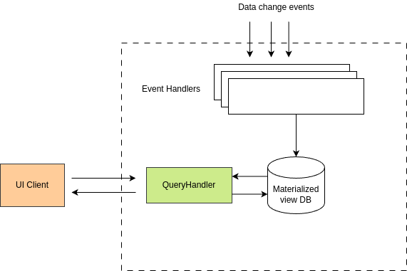

### Transactional Outbox Pattern.

Let's assume we're persisting bank account data into a DB. The data science team wants to perform analytics on the data.
We have a few options:
1. Grant direct DB access: Creates tight coupling, requiring coordination on schema changes.
2. Use 2PC for data writing: Ensures consistency but is slow and blocking due to node coordination.
3. Push data to Kafka: Decouples services; the data team consumes from Kafka, stores it independently, and runs analytics.

Though option 3 looks decent, it has the following limitations:
* Account Service crashes after DB write, but before sending to Kafka.
* Account sent to Kafka, but DB write fails.

The Transactional Outbox Pattern solves this issue. The Account Service writes to both the Account table and an Outbox 
table in the same transaction, ensuring atomicity. An asynchronous process then reads from the Outbox and publishes the
data to the Message broker, guaranteeing reliable delivery.

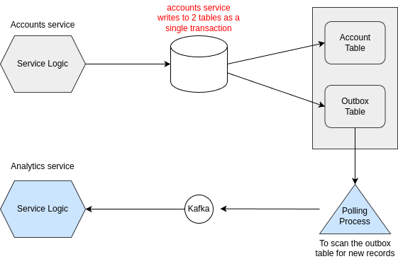

### Transactional Outbox Pattern with CDC.

Instead of continuously polling the database, CDC tools detect changes in near real-time by reading the database logs,
making the process more efficient and scalable.

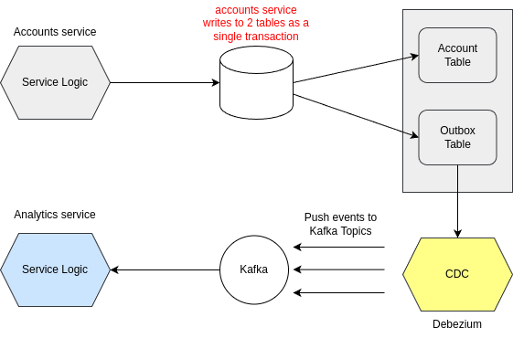

The Outbox Pattern offers key advantages over other messaging patterns:
1. Decoupling: Promotes loose coupling, letting microservices focus on their own logic without worrying about message
transformation details.
2. Reliability: Messages are saved transactional with the business data, ensuring delivery even during failures.
3. Scalability: It handles high message volumes efficiently, as messages are stored in the DB and consumed by the broker
at a controlled pace.
4. Performance: Improves speed by separating the business transaction from message sending, allowing asynchronous processing.

### Materialized View Pattern vs Transactional Outbox Pattern.

**Materialized View Pattern:**
* Primary Purpose: Optimizes read operations by creating a query-friendly view.
* Focus: Improving query performance.
* Data Synchronization: Data is replicated/updated asynchronously for read efficiency.
* Typical Use Case: Query-heavy systems needing aggregated data from multiple sources.
* Challenges: Consistency and additional storage requirements.

**Transactional Outbox Pattern:**
* Primary Purpose: Ensures reliable event publishing between database and message broker.
* Focus: Maintaining data consistency and reliability in event publishing.
* Data Synchronization: Data is recorded in an outbox table and later published as an event.
* Typical Use Case: Event;driven systems requiring reliable inter-service communication.
* Challenges: Outbox table management and processing overhead.

# Sage Pattern.

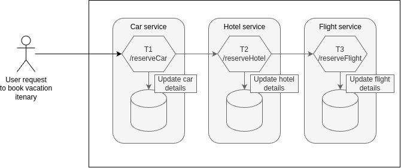

The Saga Pattern is a design pattern used to maintain data consistency in distributed systems, particularly in 
microservices architectures. When a business spans multiple services, ensuring consistency across these services becomes
challenging. The Saga Pattern addresses this by breaking down a large transaction into a series of smaller, independent
transactions that can be managed by individual service:
Saga pattern can be implemented using 2 options:
1. Choreography: In this approach, each service involved in the transaction knows what to do and whom to notify next.
It is a decentralized approach where services autonomously execute their part of the transaction and then trigger the next
step.
2. Orchestration: Here, a central orchestrator (or saga manager) coordinates the execution of the transaction.
The orchestrator sends commands to each service, dictating the flow of the transaction. 
Orchestration option is commonly used when the CQRS pattern is implemented.

If the (n + 1) transaction in a saga fails, the effects of the previous n transactions need to be reversed. Each of those
steps, Ti, has an associated compensating transaction, Ci, which is designed to undo the effect of Ti. To roll back the
saga, each Ci must be executed in reverse order, starting from the last successful transaction.
The changes from T1 to Tn are committed by individual microservices into their respectiveDB.
The compensation transactions in the reverse order will undo the changes made by T1 ... Tn.

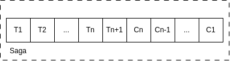

A Saga can have multiple paths based on the outcome of each transaction. If all steps are successful, the Saga completes.
If a step fails, the system might trigger a rollback path, executing compensating transactions.

**Benefits of Saga pattern.**
* Data Consistency: The Saga Pattern helps maintain consistency across distributed services without the need for traditional
distributed transactions, which can be complex and challenging to implement.
* Scalability: Since each step in a Saga is an independent transaction, services can scale independently, allowing for
better performance and fault tolerance.
* Resilience: The use of compensating transactions allows the system to recover from failures gracefully, ensuring that
the system remains in a consistent state.
* Flexibility: The Saga Pattern allows for both choreography and orchestration approaches, giving developers flexibility
in how they design and implement their distributed transactions.

**Drawbacks of Saga Pattern.**
* Complexity: Implementing the Saga Pattern can add complexity to the system, especially when dealing with compensating
transactions and failure scenarios.
* Eventual Consistency: The Sage Pattern often relies on eventual consistency, meaning that there might be a delay before
all services reflect the latest state. This requires careful handling to ensure a consistent user experience.
* Testing and Debugging: Testing and debugging Sagas can be challenging due to the distributed nature of the transactions
and the need to simulate various failure scenarios.

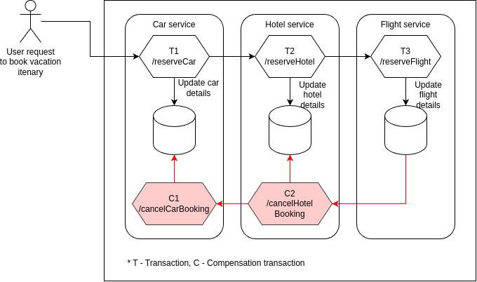

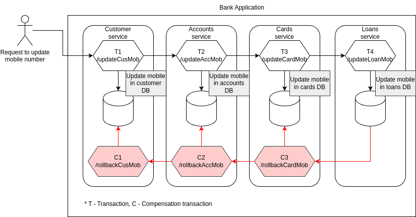

### Orchestration Saga Pattern.

The term comes from the way an orchestra is conducted by conductor, who directs and coordinates the performance of musicians
to play in harmony. Similarly, in the Orchestration Saga Pattern, a centralized orchestrator directs, and sequences the 
calls to different services to ensure that the overall business transaction is completed successfully or rolled back in
the case of failure.
Saga term originally comes from storytelling and refers to a long story of heroic exploits. In computing, the Saga pattern
was named to represent a long-running transaction composed of a sequence of operations. 

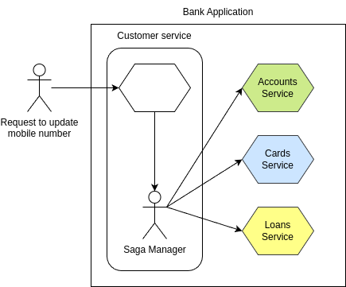

## What happens in ES when a new Event being stored?

Aggregates in event-sourced systems load and apply all past events to accurately rebuild an entity's current state.
Each change is captured as an immutable event, stored in sequence to serve as a single source of truth.
When an aggregate needs to perform an operation, it replays these events to ensure consistency, support complex calculations,
and maintain a full audit log. This approach enables accurate decision-making, even when logic evolves over time, and provides 
traceability for debugging and auditing purposes.
Loading all events for an aggregate may become inefficient as the number of events grows. To address this, many event-sourcing
systems use snapshots.
While inserting a new event, Aggregates in event-sourced systems load and apply all past events to accurately rebuild the
current state of an entity.

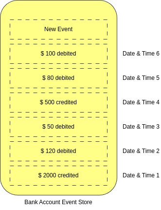

### Snapshots in Event sourcing pattern.

Snapshots in event sourcing are a vital tool for improving performance and scalability by reducing the need to reply all
events from the beginning of an aggregate's history. They provide a balance between maintaining a detailed event history 
and ensuring that the system remains efficient and responsive, particularly as the volume of event grows.
Snapshots are especially useful in applications with high transaction volumes or where performance and recovery times are
crucial considerations.
To get the current value, the application need not reply the events from 1. Instead, the application only has to retrieve
the snapshots and events that occur after it.

**How Snapshots Work.**
* Creation of a Snapshot: A snapshot is typically created after a certain number of events has been applied to an aggregate.
For example, after 100 events, the system might save a snapshot of the aggregate's current state.
* Restoring State from a Snapshot: When the system needs to restore an aggregate's state, it loads the most recent snapshot,
replays only the events that have occurred since the snapshot was taken and applies these events to the snapshot to reach
the current state.
* Snapshot Storage: Snapshots are stored in a database or another persistent storage medium. They are often stored separately 
from the event log but associated with the same aggregate identifier to ensure consistency.

**When to Use Snapshots.**
* High Event Volumes.
* Performance Concerns.
* Periodic Consistency Checks.

**Trade-offs and Considerations.**
* Storage Overhead.
* Snapshot Frequency.
* Snapshot Integrity.

