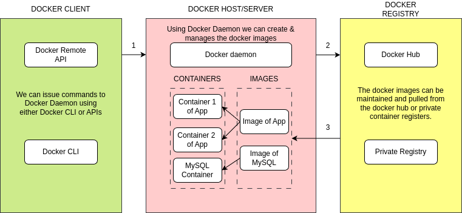
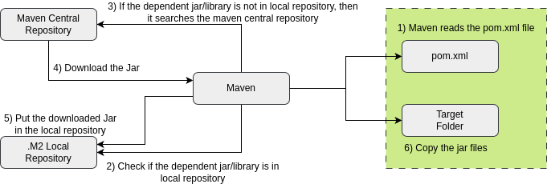
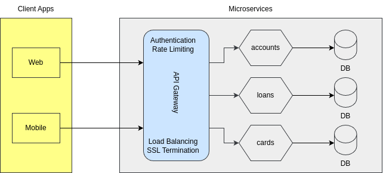

# Master Microservices with Spring Boot, Docker, Kubernetes.

## What are Microservices?

To understand microservices, lets imagine a bank called Bank. Typically, banks comprise various departments, including
Accounts, Cards, and Loans.

## The Monolith.

Back a decade, all the applications used to be deployed as a Single unit where all functionality deployed together inside a single
server. We call this architecture approach as Monolith.

### Pros.

- Simpler development and deployment for smaller teams and applications.
- Fewer cross-cutting concerns.
- Better performance due to no network latency.

### Cons.

- Difficult to adopt new technologies.
- Limited agility.
- Single code base and difficult to maintain.
- Not Fault tolerance.
- Tiny update and feature development always need a full deployment.

We have various forms of Monolithic with the names like Single-Process Monolith, Modular Monolith, Distributed Monolith.

In a monolithic approach, developers work with a single code base, which is then packaged as a unified unit, such as an
EAR/WAR file, and deployed onto a single web/application server. Additionally, the entire application is supported by a
single database.

## The SOA (Service Oriented Architecture).

SOA emerged as an approach to combat the challenges of large, monolithic applications. It is an architectural style that 
focuses on organizing software systems as a collection of loosely coupled, interoperable services. It provides a way to 
design and develop large-scale applications by decomposing them into smaller, modular services that can be independently
developed, deployed, and managed.

### Pros.

- Reusability of services.
- Better maintainability.
- Higher reliability.
- Parallel development.

### Cons.

- Complex management due to communication protocols (e.g. SOAP).
- High investment costs due to vendor in middleware.
- Extra overload.

Numerous instances of SOA where teams aimed to create smaller services, yet they remained tightly coupled
to a shared database and required deploying everything as a cohesive unit. While they followed a service-oriented approach, 
it cannot be classified as microservices.


## The Great Microservices.

Microservices are independently releasable services that are modeled around a business domain. A service encapsulates 
functionality and makes it accessible to other services via networks - you construct a more complex system from these
building blocks. One microservice might represent Accounts, another Cards, and yet another Loans, but together they might
constitute an entire bank system.

### Pros.

- Easy to develop, test, and deploy.
- Increase agility.
- Ability to scale horizontally.
- Parallel development.
- Modeled Around a Business Domain.

### Cons.

- Complexity.
- Infrastructure overhead.
- Security concerns.

If there's one crucial takeaway from this course and the concept of microservices, it is to prioritize the independent
deploy-ability of your microservices. Develop the habit of deploying and releasing changes to a single microservice in
production without requiring the deployment of other components. By doing so, numerous benefits will naturally emerge. 


### Monolithic vs SOA vs Microservices.

**Monolithic.**

* Parallel deployment: NOT OK.
* Agility: NOT OK.
* Scalability: NOT OK.
* Usability: NOT OK.
* Complexity & Operational overhead: Great.
* Security Concerns & Performance: Great.

**SOA.**

* Parallel Development: OK.
* Agility: OK.
* Scalability: OK.
* Usability: OK
* Complexity & Operational overhead: OK.
* Security Concerns & Performance: OK.

**Microservices.**

* Parallel Development: Great.
* Agility: Great.
* Scalability: Great.
* Usability: Great.
* Complexity & Operational overhead: NOT OK.
* Security Concerns & Performance: NOT OK.

## Definition of microservice?

Microservices is an approach to developing a single application as a suite of small services, each running its own process
and communicating with lightweight mechanism, built around business capabilities and independently deployable by fully
automated deployment machinery.

## How to build Microservices?

When considering a web application, the traditional approach involves packaging it as a WAR or EAR file. These archive 
formats are commonly used to bundle Java applications, which are then deployed to web servers like Tomcat or application
servers like WildFly. Do you think the same approach works for building microservices? Of course not, because Organizations 
may need to build 100s of microservices. Building, packaging, and deploying all the microservices using traditional
methods can be an extremely challenging and practically impossible task. How to overcome this challenge? The clue is
**Spring Boot**.

## Why Spring Boot for Microservices?

Why Spring Boot is the best framework to build microservice. Spring Boot is a framework that simplifies the development and
deployment of Java applications, including microservices. With Spring Boot, you can build self-container, executable JAR files 
instead of the traditional WAR or EAR files. These JAR files contain all the dependencies and configurations required to run
the microservice. This approach eliminates the need for external web servers or application servers.
- Provides a range of built-in features and integrations such as autoconfiguration, dependency injection, and support for
various cloud platforms.
- Provides an embedded Tomcat, Jetty, or Undertow server, which can run the microservice directly without the need for a
separate server installation.
- Inbuilt support of production-ready features such as metrics, health checks, and externalized configuration.
- We can quickly bootstrap a microservice project and start coding with range of starter dependencies that provide
pre-configured settings for various components such as databases, queues etc.
- Well-suited for cloud-native development. It integrates smoothly with cloud platforms like Kubernetes, provides support
for containerization, and enables seamless deployment to popular cloud providers.

In the traditional approach, applications are typically packages as WARs and rely on the presence of a server in the
execution environment for running. However, in the microservices paradigm, applications are packages as self-contained JARs,
also called fat-JARs or uber-JARs, since they contain the application itself, the dependencies, and the embedded server.


### Implementing REST Services.

REST (Representational state transfer) services are one of the most often encountered ways to implement communication 
between two web apps. REST offers access to functionality the server exposes through endpoints a client can call.
Below are the different use cases where REST services are being used most frequently these days.
- Mobile App - Communication using REST - Backend Server.
- Backend Server 1 - Communication using REST - Backend Server 2.
- Web App build using Angular, React JS etc. - Communication using REST - Backend Server.

Typically, REST services are built to expose the business functionality and support CRUD operations on the storage system.
Attached are the standards that we need to follow while building REST services.

- Business logic supporting CRUD operations:
  - Create - HttpMethod.POST.
  - Read - HttpMethod.GET.
  - Update - HttpMethod.PUT / PATCH.
  - Delete - HttpMethod.DELETE.
- Proper input validation & Exception Handling:
  - Make sure all the REST services perform input validations, handle the runtime and business exceptions properly. In all
  kind of scenarios, REST services should send a meaningful response to the clients.
- Document REST Services:
  - With the help of standards like Open API Specification, Swagger, make sure to document your REST APIs. This helps
  your client, third party developers to understand your services clearly.

### DTO (Data Transfer Object) pattern.

The Data Transfer Object (DTO) pattern is a design pattern that allows you to transfer data between different parts of 
your application. DTOs are simple objects that contain only data, and they do not contain any business logic. This makes
them ideal for transferring data between different layers of your application, such as the presentation layer and the data 
access layer.


**Here are some of the benefits of using the DTO pattern.**

- Reduces network traffic: DTOs can be used to batch up multiple pieces of data into a single object, which can reduce the
number of network requests that need to be made. This can improve performance and reduce the load on your servers.
- Encapsulates serialization: DTOs can be used to encapsulate the serialization logic for transferring data over the wire.
This makes it easier to change the serialization format in the future, without having to make changes to the rest of
your application.
- Decouples layers: DTOs can be used to decouple the presentation layer from the data access layer. This makes it easier
to change the presentation layer without having to change the data access layer.

### Different Annotations & Classes that supports building REST services.

- '@RestController' - can be used to put on top of a call. This will expose your methods as REST APIs. Developers can also 
use '@Controller' + '@ResponseBody' for same behavior.
- 'ResponseEntity<T>' - Allow developers to send response body, status, and headers on the HTTP response.
- 'RequestEntity<T>' - Allow developers to receive the request body, header in a HTTP request.
- '@ResponseBody' - can be used on top of a method to build a Rest API when we are using '@Controller' on top of a Java class.
- '@ControllerAdvice' - is used to mark the class as a REST controller advice. Along with '@ExceptionHandler', this can be
used to handle exceptions globally inside app. We have another annotation '@RestControllerAdvice' which is same as
'@ControllerAdvice' + '@ResponseBody'.
- '@RequestHeader' & '@RequestBody' - is used to receive the request body and header individually.

### Summary of the steps followed to build microservices.

1. Build empty Spring Boot applications: First we created empty Spring Boot applications with the required starter 
dependencies related to web, actuator, JPA, devtools, validations, H2 DB, Lombok, spring doc open API etc.
2. Build DB related logic, entities & DTOs: We created required DB tables schema, established connection details with H2 DB,
created JPA related entities, repositories. Post that using DTO pattern guidelines, we built DTO classes and mapper logic
inside all the microservices.
3. Build business logic: Inside all the microservices, we created REST APIs supporting CRUD operations with the help of
various annotations like '@PostMapping', '@GetMapping', '@PutMapping', '@DeleteMapping' etc.
4. Build Global Exception handling logic: We built global exception handling logic using annotations like '@ControllerAdvice' &
'@ExceptionHandler'. Also created custom business exceptions like **CustomerAlreadyExistsException**.
5. Perform data validations on the input: Perform validations on the input data using annotations present inside the
**jakarta.validation** package. These annotations are like '@NotEmpty', '@Size', '@Email', '@Pattern', '@Validated',
'@Valid' etc.
6. Perform auditing using Spring Data JPA: With the help of annotations like '@CreatedDate', '@CreatedBy', '@LastModifiedDate',
'@LastModifiedBy', '@EntityListeners' & '@EnableJpaAuditing', we implemented logic to populate audit columns in DB.
7. Documenting REST APIs: With the help of OpenAPI specifications, Swagger, Spring Doc library, we documented our REST APIs. 
In the same process, we used annotations like '@Schema', '@Tag', '@Operation', '@ApiResponse' etc.

## How to right size & identify service boundaries of microservices?

One of the most challenging aspects of building a successful microservices system is the identification of proper microservice
boundaries and defining the size of each microservice. Below are the most common approaches in the industry.
- Domain-Driven Sizing: Since many of our modifications or enhancements driven by the business needs, we can size/define
boundaries of our microservices that are closely aligned with Domain-Driven design & Business capabilities. But this process
takes lot off time and need good domain knowledge.
- Event Storming Sizing: Conducting an interactive fun session among various stakeholder to identify the list of important
events in the system like 'Completed Payment', 'Search for Product', etc. Based on the events we can identify 'Commands',
'Reactions' and can try to group them to a domain-driven services.

### Right Sizing & identifying service boundaries.

Now, let's take an example of a bank application the needs to be migrated or built base on microservice architecture and
attempt to determine the appropriate sizing for the services.
- Serving Account & Trading Account, Cards & Loans: Not correct sizing as we can see independent modules like cards & loans
clubbed together.
- Service Account, Trading Account, Cards, Loans: This might be the most reasonable correct sizing as we can see all
independent modules have separate service maintaining loosely coupled & highly cohesive.
- Saving Accounts, Trading Accounts, Debit Card, Credit Card, Home Loan, Vehicle Loan, Personal Loan: Not correct sizing
as we can see too many services under loans & cards.

### Monolith to Microservices.

Migration use case. Now let's take a scenario where an E-Commerce startup is following monolithic architecture and try to 
understand what's the challenges with it.

Problem that E-Commerce team is facing due to traditional monolithic design.

- Initial Days:
  - It is straightforward to build, test, deploy, troubleshoot and scale during the launch and when the team size is less.
- Later after few days the app/site is a super hit and started evolving a lot. Now team has below problems:
  - The app has become so overwhelmingly complicated that no single person understands it.
  - You fear making changes - each change has unintended and costly side effects.
  - New features/fixes become tricky, time-consuming, and expensive to implement.
  - Each release as small as possible and requires a full deployment of the entire application.
  - One unstable component can crash the entire system.
  - New technologies and frameworks aren't an option.
  - It's difficult to maintain small isolated teams and implement agile delivery methodologies.

So the E-Commerce company decided and adopted the cloud-native design by leveraging Microservices architecture to make
their life easier and less risk with the continuous changes.

### Strangler Fig Pattern.

The Strangler Fig Pattern is a software migration pattern used to gradually replace or refactor a legacy system with a new
system, piece by piece, without disrupting the existing functionality. This pattern gets its name from the way a strangler
Fig plant grows around an existing tree, slowly replacing it until the original tree is no longer needed.

**When to Use the Strangler Fig Pattern.**

- When you need to modernize a large or complex legacy system.
- When you want to avoid the risk associated with a complete system rewrite or "big bang" migration.
- When the legacy system needs to remain operational during the transition to the new system.

The Strangler Fig Pattern facilitates the migration of the monolithic application to a modern microservices architecture
by leveraging a Domain-Driven Design (DDD) approach.
The legacy monolith is carefully analyzed, broken down into distinct domains, and services are gradually rewritten using
newer technologies. This incremental transformation ensures that each service is refactored independently, allowing for a
smooth transition from the monolith to a fully microservices-based architecture while maintaining functionality through 
the process.

Next, a Strangler Facade is introduced to manage traffic routing between the legacy monolithic application and the new
microservices. This routing can also be handled via an API Gateway, if preferred. During this phase, both the monolith 
and microservice coexists.
As the microservices are fully developed and stabilized, the corresponding functionality on the monolith is gradually
phased out or "strangled" and eventually removed. The process involves four key steps: identification, transformation,
co-existence, and elimination.

# Deployment, Portability & Scalability of Microservices.

* **Deployment**: How do we deploy all the tiny 100s of microservices with less effort & cost?
* **Portability**: How do we move our 100s microservices across environments with less effort, configuration & cost?
* **Scalability**: How do we scale our applications based on the demand on the fly with minimum effort & cost?

To overcome the above challenges, we should **containerize** our microservices. Why? Containers offer a self-contained
and isolated environment for applications, including all necessary dependencies. By containerizing an application, it
becomes portable and can run seamlessly in any cloud environment. Containers enable unified management of applications 
regardless of the language or framework used.
**Docker** is an open source platform that "provides the ability to package and run an application in a loosely isolated
environment called a container".

## What are containers & how they are different from VMs?


Main difference between virtual machines and containers. Containers don't need the Guest OS nor the hypervisor to assign
resources; instead, they use the container engine.

## What are Containers & Docker?

**What is software containerization?**

Software containerization is an OS virtualization method that is used to deploy and run containers without using a virtual
machine (VM). Containers can run on physical hardware, in the cloud, VMs, and across multiple OSs.

**What is a container?**

A container is a loosely isolated environment that allows us to build and run software packages. These software packages 
include the code and all dependencies to run applications quickly and reliably on any computing environment. We call these
packages as container images.

**What is Docker?**

Docker is an open-source platform that enables developers to automate the deployment, scaling, and management of applications
using containerization. Containers are lightweight, isolated environments that encapsulate an application along with its
dependencies, libraries, and runtime components.

## What exactly happens in containerization?

Containers are based on the concept of operating system (OS) virtualization, where multiple containers can run on the same
physical or virtual machine, sharing the same OS kernel. This differs from traditional virtualization, where each virtual
machine (VM) runs a separate OS instance.
In containerization, Linux features such as namespaces and cgroups play a crucial role in providing isolation and 
resource management. Here's a brief explanation of these concepts.

**Namespaces.**

Linux namespaces allow for the creation of isolated environments within the operating system. Each container has its own
set of namespaces, including process, network, mount, IPC (Inter Process Communication), and user namespaces. These
namespaces ensure that processes within a container are only aware of and can interact with resources within their specific
namespace, providing a level of isolation.

**Control Groups.**

cgroups provide resource management and allocation capabilities for containers. They allow administrators to control and
limit the resources (such as CPU, memory, disk I/O, and network bandwidth) that containers can consume. By using cgroups, 
container runtimes can enforce resource restrictions and prevent one container from monopolizing system resources, ensuring
fair allocation among containers.

Here you may have a question. If containerization works based on Linux concepts like kernel, namespaces, cgroups etc. then
how is Docker supposed to work on a macOS or Windows machine. Let's try to understand this.

### How does docker works on Mac & Windows OS?

When you install Docker on a Linux OS, you receive the complete Docker Engine on your Linux host. However, if you opt for
Docker Desktop for Mac or Windows, only the Docker client is installed on your macOS or Windows host. Behind the scenes,
a lightweight virtual machine is configured with Linux, and the Docker server component is installed within that virtual
machine.
As a user, your experience will be very similar to using Docker on a Linux machine, with minimal noticeable differences.
However, when you utilize the Docker CLI to execute commands, you are actually interacting with a Docker server running
on a separate machine, which in this case is the Linux-based virtual machine.
To confirm this configuration, you can start Docker and execute 'docker version' command. You will observe that the Docker
client is running on the 'darwin/amd64' architecture (on macOS) or 'windows/amd64' (on Windows), while the Docker server
is opening on the 'linux/amd64' architecture.

### Docker Architecture?

**Docker Client.**

Docker remote API, Docker CLI. We can issue commands to Docker Daemon using either Docker CLI or APIs.

**Docker Host/Server.**

Docker Daemon. Using Docker Daemon we can create & manages the docker images.

**Docker Registry.**

Docker Hub, Private Registry. The docker images can be maintained and pulled from the docker hub or private container 
registries.

Steps:
1. Instruction from Docker Client to Server to run a container.
2. Docker server finds the image in registry if not found locally.
3. Docker server pulls the image from registry into local.
4. Docker server creates a running container from the image.



### Generate Docker Images.

To generate docker images from our existing microservices, we will explore the below three different commonly used approaches. 

1. Dockerfile: We need to write a dockerfile with the list of instructions which can be passed to Docker server to generate
docker image based on given instructions.
2. Buildpacks: A project initiated by Heroku & Pivotal and now hosted by the CNCF. It simplifies containerization since with
it, we don't need to write a low-level dockerfile.
3. Google Jib: Jib is an open-source Java tool maintained by Google for building Docker images of Java applications. It
simplifies containerization since with it, we don't need to write a low-level dockerfile.

### Running a Spring Boot app as a container using Dockerfile.

**Steps to be followed.**

1. Run maven command, 'mvn clean install' from the location where **pom.xml** is present to generate a fat jar inside 
**target** folder.
2. Write instructions to Docker inside a file with the name **Dockerfile** to generate a Docker image.
3. Execute the docker command: 'docker build . -r panda/accounts:s4' from the location where Dockerfile is present. This
will generate the docker image based on the tag name provided.
4. Execute the docker command: 'docker run -p 8080:8080 panda/accounts:s4'. This will start the docker container based on
the docker image name and port mapping provided.

**Sample Dockerfile.**

```dockerfile
# Start with a base image containing Java runtime
FROM openjdk:17-jdk-slim

# Information around who maintains the image
MAINTAINER pandatronik.com
 
# Add the application's jar to the container
COPY target/accounts-0.0.1-SNAPSHOT.jar accounts-0.0.1-SNAPSHOT.jar

# execute the application
ENTRYPOINT ["java", "-jar", "/accounts-0.0.1-SNAPSHOT.jar"]
```

### Port Mapping in Docker.

**What is port mapping or port forwarding or port publishing?**

By default, containers are connected to an isolated network within the Docker host. To access a container from your local
network, you need to configure port mapping explicitly. For instance, when running the accounts Service application, we
can provide the port mapping as an argument in the docker run command: '-p 8081:8080' (where the first value represents
the external port and second value represent the container port).


### Running a Spring Boot app as a container using Buildpacks.

**Steps to be followed.**

1. Add the configurations inside **pom.xml**. Make sure to pass the image name details.
    ```xml
    <build>
        <plugins>
            <plugin>
                <groupId>org.springframework.boot</groupId>
                <artifactId>spring-boot-maven-plugin</artifactId>
                <configuration>
                    <image>
                        <name>panda/${project.artifactId}:s5</name>
                    </image>
                </configuration>
            </plugin>
        </plugins>
    </build>
    ```
2. Run the maven command: 'mvn spring-boot:build-image' from the location where **pom.xml** is present to generate the docker
image without the need of Dockerfile.
3. Execute the docker command 'docker run -p 8090:8090 panda/loans:s4'. This will start the docker container based on the 
docker image name and port mapping provided.

Cloud Native Buildpacks offer an alternative approach to Dockerfiles, prioritizing consistency, security, performance, and
governance. With Buildpacks, developers can automatically generate production-ready OCI images from their application source
code without the need to write a Dockerfile.

### Running a Spring Boot app as a container using Google Jib.

**Steps to be followed.**

1. Add the configurations inside the **pom.xml**. Make sure to pass the image name details.
    ```xml
    <build>
        <plugins>
            <plugin>
                <groupId>com.google.cloud.tools</groupId>
                <artifactId>jib-maven-plugin</artifactId>
                <version>3.3.2</version>
                <configuration>
                    <to>
                        <image>panda/${project.artifactId}:s5</image>
                    </to>
                </configuration>
            </plugin>
        </plugins>
    </build>
    ```
2. Run the maven command 'mvn compile jib:dockerBuild' from location where **pom.xml** is present to generate the docker image
without the need of Dockerfile.
3. Execute the docker command 'docker run -p 9000:9000 panda/cards:s4'. This will start the docker container based on the
docker image name and port mapping provided.

Google Jib offer an alternative approach to Dockerfiles, prioritizing consistency, security, performance and governance.
With Jib, developers can automatically generate production-ready OCI images from their application source code without the
need to write a Dockerfile and even local Docker setup.

### Using Docker Compose to handle multiple containers.

**What is a Docker Compose?**

It is a tool provided by Docker that allows you to define and manage multi-container applications. It uses a YAML file to
describe the services, networks, and volumes required for your application. Using it, you can easily specify the configuration
and relationships between different containers, making it simpler to set up and manage complex application environments.

**Why can't we run multiple containers using CLI?**

When dealing with the execution of multiple containers, utilizing the Docker CLI can be error-prone. Writing commands
directly in a Terminal window can introduce errors, make the code difficult to comprehend, and pose challenges when
attempting to implement version control.

**Advantages of Docker Compose?**

By using a single command, you can create and start all the containers defined in your Docker Compose file. Docker Compose
handles the orchestration and networking aspects, ensuring that the containers can communicate with each other as specified
in the configuration. It also provides options for scaling services, controlling dependencies, and managing the application
lifecycle.

### Important Docker Commands.

1. 'docker images': To list all the docker images present in the Docker server.
2. 'docker image inspect [image-ID]': To display detailed image information for a given image ID.
3. 'docker image rm [image-ID]': To remove one or more images for a given image IDs.
4. 'docker build . -t [image-name]': To generate a docker image based on a Dockerfile.
5. 'docker run -p [hostport]:[containerport] [image_name]': To start a docker based on a given image.
6. 'docker ps': To show all running containers.
7. 'docker ps -a': To show all containers including running and stopped.
8. 'docker container start [container-ID]': To start one or more stopped containers.
9. 'docker container pause [container-ID]': To pause all processed within one or more container.
10. 'docker container unpause [container-ID]': To resume/unpause all processed within one or more containers.
11. 'docker container stop [container-ID]': To stop one or more running containers.
12. 'docker container kill [container-ID]': To kill one or more running container instantly.
13. 'docker container restart [container-ID]': To restart one or more containers.
14. 'docker container inspect [container-ID]': To inspect all the details for a given container ID.
15. 'docker container logs [container-ID]': To fetch the logs of a given container ID.
16. 'docker container logs -f [container-ID]': To follow log output of a given container ID.
17. 'docker rm [container-ID]': To remove one or more containers based on container IDs.
18. 'docker container prune': To remove all stopped containers.
19. 'docker image push [container_registry/username:tag]': To push an image to a container registry.
20. 'docker image pull [container_registry/username:tag]': To pull an image form a container registry.
21. 'docker image prune': To remove all unused images.
22. 'docker container stats': To show all containers statistics like CPU, memory, I/O usage.
23. 'docker system prune': Remove stopped containers, dangling images, and unused networks, volumes, and cache.
24. 'docker rmi [image-ID]': To remove one or more images based on image IDs.
25. 'docker login -u [username]': To login in to docker hub container registry.
26. 'docker logout': To login out from docker hub container registry.
27. 'docker history [image-name]': Displays the Intermediate layers and commands that were executed when building the image.
28. 'docker exec -it [container-ID] sh': To open a shell inside a running container and execute commands.
29. 'docker compose up': To create and start containers based on given docker compose file.
30. 'docker compose down': To stop and remove containers from services defined in the Compose file.

# What are cloud native applications?

**The Layman definition.**

Cloud-native applications are software applications designed specifically to leverage cloud computing principles and take
full advantage of cloud-native technologies and services. These applications are built and optimized to run in cloud environments,
utilizing the scalability, elasticity, and flexibility offered by the cloud.

**The Cloud Native Computing Foundation (CNCF) definition.**

Cloud native technologies empower organizations to build and run scalable applications in modern, dynamic environments 
such as public, private, and hybrid clouds. Containers, service meshes, microservices, immutable infrastructure, and
declarative APIs exemplify this approach.
These techniques enable loosely coupled systems that are resilient, manageable, and observable. Combined with robust 
automation, they allow engineers to make high-impact changes frequently and predictably with minimal toil.

## Important characteristics of cloud-native applications.

- **Microservices**: Often built using a microservice architecture, where the application is broken down into smaller,
loosely coupled services that can be developed, deployed, and scaled independently.
- **Containers**: Typically packaged and deployed using containers, such as Docker containers. Containers provide a 
lightweight and consistent environment for running applications, making them highly portable across different cloud
platforms and infrastructure.
- **Scalability & Elasticity**: Designed to scale horizontally, allowing them to handle increased loads by adding more 
instances of services. They can also automatically scale up or down based on demand, thanks to cloud-native orchestration
platform like Kubernetes.
- **DevOps Practices**: Embrace DevOps principles, promoting collaboration between development and operations teams. They
often incorporate continuous integration, continuous delivery, and automated deployment principles to streamline the software
development and deployment processes.
- **Resilience & Fault Tolerance**: Designed to be resilient in the face of failures, They utilize techniques such as
distributed architecture, load balancing, and automated failure recovery to ensure highly availability and fault tolerance.
- **Cloud-Native Solutions**: Take advantage of cloud-native services provided by the cloud platform, such as managed
databases, message queues, caching systems, and identity services. This allows developers to focus more on application
logic and less on managing infrastructure components.

## Difference between Cloud Native & Traditional apps.

**Cloud Native Applications.**

1. Predictable Behavior.
2. OS abstraction.
3. Right-sized capacity & Independent.
4. Continuous delivery.
5. Rapid recovery & Automated scalability.

**Traditional Enterprise Applications.**

1. Unpredictable behavior.
2. OS dependent.
3. Oversized capacity & Dependent.
4. Waterfall development.
5. Slow recovery.

## Development Principles of Cloud Native: 12 Factors & Beyond.

How to get succeeded in building Cloud Native Apps & what are the guiding principles that can be considered?
The engineering team at Heroku cloud platform introduced the 12 factor methodology, a set of development principles aimed 
at guiding the design and construction of cloud-native applications. These principles are the result of their expertise 
and provide valuable insight for building web applications with specific characteristics:

1. Cloud Platform Deployment: Applications designed to be seamlessly deployed on various cloud platforms.
2. Scalability as a Core Attribute: Architectures that inherently support scalability.
3. System Portability: Applications that can run across different systems and environments.
4. Enabling Continuous Deployment and Agility: Facilitating rapid and agile development cycles.

These principles were developed to assist developers in building effective cloud-native applications, emphasizing the key
factors that should be considered for optimal outcomes.

Subsequently, Kevin Hoffman expended upon the original factors and introduced additional ones in his book, "Beyond the
Twelve-Factor App". This revised approach, referred as the 15-Factor methodology, refreshing the content of the original
principles and incorporates three new factors.

### 15-Factor methodology.

1. One codebase, one application.
2. API first.
3. Dependency management.
4. Design, build, release, run.
5. Configuration, credentials & code.
6. Logs.
7. Disposability.
8. Backing services.
9. Environment parity.
10. Administrative process.
11. Port binding.
12. Stateless processes.
13. Concurrency.
14. Telemetry.
15. Authentication & authorization.

### 1. One codebase, one application.

The 15-Factor methodology ensures a one-to-one correspondence between an application and its codebase, meaning each application
has a dedicated codebase. Shared code is managed separately as a library, allowing it to be utilized as a dependency or as
a standalone service, serving as a backing service for other applications. It is possible to track each codebase in its own 
repository, providing flexibility and organization.
In this methodology, a deployment refers to an operational instance of the application. Multiple deployments can exist across
different environments, all leveraging the same application artifact. It is unnecessary to rebuild the codebase for each
environment-specific deployment. Instead, any factors that vary between deployments, such as configuration settings, should
be maintained externally from the application codebase.

### 2. API first.

In a cloud-native ecosystem, a typical setup consists of various services that interact through APIs. Adopting an API-first
approach during the design phase of a cloud-native application encourages a mindset aligned with distributed systems and
promotes the division of work among multiple teams. Designing the API as a priority allows other teams to build their
solutions based on that API when using the application as a backing service.
This upfront design of the API contract results in more reliable and testable integration with other systems as part of the
deployment pipeline. Moreover, internal modifications to the API implementation can be made without impacting other applications
or teams they rely on it.

### 3. Dependency management.

It is crucial to explicitly declare all dependencies of an application in a manifest and ensure that they are accessible
to the dependency manager, which can download them from a central repository.
In the case of Java applications, we are fortunate to have robust tolls like Maven or Gradle that facilitates adherence to
this principle. The application should only have implicit dependencies on the language runtime and the dependency manager
tool, while all private dependencies must be resolved through the dependency manager itself. By following this approach,
we maintain a clear and controlled dependency management process for our application.

**Sample flow when use Maven as build tool.**

1. Maven reads the **pom.xml** file.
2. Check if the dependency jar/library is in local repository.
3. If the dependent jar/library is not in local repository, then it searches the maven central repository.
4. Download the jar.
5. Put the downloaded jar in the local repository.
6. Copy the jar files.



### 4. Design, build, release, run.

Codebase progression from design to production deployment involves below stages.
* Design stage: Determine technologies, dependencies, and tools for specific application features.
* Build stage: Compile and package the codebase with dependencies, creating an immutable artifact (build). Unique identification
of the build artifact is essential.
* Release stage: Combine the build with a specific deployment configuration. Each release is immutable and uniquely identifiable,
such as through semantic versioning, or timestamp. Central repository storage facilitates easy access, including rollbacks
if needed.
* Run stage: Execute the application in the designated runtime environment using a specific release.

Following the 15-Factor methodology, these stages must maintain strict separation, and runtime code modifications are
prohibited to prevent mismatches with the build stage. Immutable build and release artifacts should bear unique identifiers,
ensuring reproducibility.


### 5. Configuration, credentials & code.

According to the 15-Factor methodology, configuration encompasses all elements prone to change between deployments. It 
emphasizes the ability to modify application configuration independently, without code changes or the need to rebuild the
application.
Configuration may include resource handles for backing services (e.g., databases, messaging systems), credentials for
accessing third-party APIs, and features flags. It is essential to evaluate whether any confidential or environment-specific
information would be at risk if the codebase were exposed publicly. This assessment ensures proper externalization of
configuration.
To comply with this principle, configuration should not be embedded within the code or tracked in the same codebase, except for 
default configuration, which can be bundled with the application. Other configurations can still be managed using separate
files, but they should be stored in a distinct repository.
The methodology recommends utilizing environment variables to store configuration. This enables deploying the same application
in different environments while adapting its behavior based on the specific environment's configuration.

### 6. Logs.

In a cloud-native application, log routing and storage are not the application's concern. Instead, applications should direct
their logs to the standard output, treating them as sequentially ordered events based on time. The responsibility of log
storage and rotation is now shifted to an external tool, known as a log aggregator. This tool retrieves, gathers, and provides
access to the logs for inspection purposes.


### 7. Disposability.

In a traditional environment, ensuring the continuous operation of applications is a top priority, striving to prevent
any terminations. However, in a cloud environment, such meticulous attention is not necessary. Applications in the cloud
are considered ephemeral, meaning that if a failure occurs and the application becomes unresponsive, it can be terminated
and replaced within a new instance. Similarly, during high-load periods, additional instances of the application can be
spun up to handle the increased workload. This concept is referred to as application disposability, where applications can
be started or stopped as needed.
To effectively manage application instances in this dynamic environment, it is crucial to design them for quick startup
when new instances are required and for graceful shutdown when they are no longer needed. A fast startup enables system
elasticity, ensuring robustness and resilience. Without fast startup capabilities, performance and availability issues may
arise.
A graceful shutdown involves application, upon receiving a termination signal, ceasing to accept new requests, completing any
ongoing ones, and the exiting. This process is straightforward for web processes. However, for worker processes or other
types, it involves returning any pending jobs to the work queue before exiting.
Docker containers along with an orchestrator like Kubernetes inherently satisfy this requirement.

### 8. Backing services.

Backing services refer to external resources that an application relies on to provide its functionality. These resources 
can include databases, message brokers, caching systems, SMTP servers, FTP servers, or RESTful web services. By treating
these services as attached resources, you can modify or replace them without needing to make changes to application code.
Consider the usage of databases throughout the software development lifecycle. Typically, different databases are used in
different stages such as development, testing, and production. By treating the database as an attached resource, you can
easily switch to a different service depending on the environment. This attachment is achieved through resource binding,
which involves providing necessary information like a URL, username, and password for connecting to the database.
In example, we can see that a local DB can be swapped easily to a third part DB like AWS DB without any code changes.


### 9. Environment Parity.

Environment parity aims to minimize differences between various environments & avoiding costly shortcuts. Here, the adoption
of containers can greatly contribute by promoting the same execution environment.
There are three gaps that this factor addresses:
* Time gap: The time it takes for a code change to be deployed can be significant. The methodology encourages automation and
continuous deployment to reduce the time between code development and production deployment.
* People gap: Developers create applications, while operators handle their deployment in production. To bridge this gap, DevOps
culture promotes collaboration between developers and operators, fostering the "you build it, you run it" philosophy.
* Tools gap: Handling of backing services differs across environments. For instance, developers might use the H2 database
locally but PostgreSQL in production. To achieve environment parity, it is recommended to use the same type and version
of backing services across all environment.

### 10. Administrative processes.

Management task required to support applications, such as database migrations, batch jobs, or maintenance task, should
be treated as isolated processes. Similar to application processes, the code for these administrative tasks should be
version controlled, packaged alongside the application, and executed within the same environment.
It is advisable to consider administrative tasks as independent microservices that are executed once and then discarded,
or as functions configured within a stateless platform to respond to specific events. Alternatively, they can be integrated
directly into the application, activated by calling a designated endpoint.

### 11. Port binding.

Cloud native applications, adhering to the 15-Factor methodology, should be self-contained and expose their services through
port binding. In production environment, routing services may be employed to translate requests from public endpoints to the 
internally port-bound services.
An application is considered self-contained when it doesn't rely on an external server within the execution environment.
For instance, a Java web application might typically run within a server container like Tomcat, Jetty, or Undertow. In
contrast, a cloud native application does not depend on the presence of a Tomcat server in the environment; it manages
the server as a dependency within itself. For example, Spring Boot enables the usage of embedded server, where the application
incorporates the server instead of relying on its availability in the execution environment. Consequently, each application
is mapped to its own server, diverging from the traditional approach of deploying multiple applications on a single server.
The services offered by the application are then exposed through port binding. For instance, a web application binds its
HTTP services to a specific port and can potentially serve as a backing service for another application. This is a common
practice within cloud native systems.

### 12. Stateless processes.

Cloud native applications are often developed with high scalability in mind. One of the key principles to achieve scalability
is designing applications as stateless processes and adopting a share-nothing architecture. This means that no state should
be shared among different instances of the application. It is important to evaluate whether any data would be lost if an 
instance of the application is destroyed and recreated. If data loss would occur, then the application is not truly stateless.
However, it's important to note that some form of state management is necessary for applications to be functional. To address
this, we design applications to be stateless and delegate the handling and storage of state to specific stateful services,
such as data stores. In other words, a stateless application relies on a separate backing service to manage and store the
required state, while application itself remains stateless. This approach allows for better scalability and flexibility while
ensuring that necessary state is still maintained and accessible when needed.

### 13. Concurrency.

Scalability is not solely achieved by creating stateless applications. While stateless is important, scalability also requires
ability to serve a large number of users. This means the applications should support concurrent processing to handle multiple
users simultaneously.
According to the 15-Factor methodology, processes play a crucial role in application design. These processes should be
horizontally scalable, distributing the workload across multiple processes on different machines. This concurrency is only
feasible when applications are stateless. In Java Virtual Machine (JVM) applications, concurrency is typically managed through
the use of multiple threads, which are available from thread pools.
Processes can be categorized based on their respective types. For instance, there are web processes responsible for handling
HTTP requests, as well as worker processes that execute scheduled background jobs. By classifying processes and optimizing
their concurrency, applications can effectively scale and handle increased workloads.

### 14. Telemetry.

Observability is a fundamental characteristics of cloud native applications. With the inherent complexity of managing a
distributed system in the cloud, it becomes essential to have access to accurate and comprehensive data from each component
of the system. This data enables remote monitoring of the system's behavior and facilitates effective management of its
intricacies. Telemetry data, such as logs, metrics, traces, health status, and events, plays a vital role in providing this
visibility.
In Kevin Hoffman's analogy, he emphasizes the significance of telemetry by comparing applications to separate probes. Just
like telemetry is crucial for monitoring and controlling space probes remotely, the same concept applies to applications. To
effectively monitor and control applications remotely, you need various types of telemetry data.
Consider the kind of telemetry that would be necessary to ensure remote monitoring and control of your applications. This
includes information such as detailed logs for troubleshooting, metrics to measure performance, traces to understand request
flows, health status to assess system well-being, and events to capture significant occurrences. By gathering and utilizing
these types of telemetry data you can gain valuable insights into your applications and make informed decisions to manage
them effectively from a remote location.

### 15. Authentication and Authorization.

Security is critical aspect of a software system, yet it often doesn't receive the necessary emphasis it deserves. To uphold a
zero-trust approach, it is essential to ensure that security of every interaction within the system, encompassing architectural
and infrastructural levels. While security involves more than just authentication and authorization, these aspects serve
as a solid starting point.
Authentication enables us to track and verify the identity of users accessing the application. By authenticating users, we
can then proceed to evaluate their permissions and determine if they have the necessary authorization to perform specific
actions. Implementing identity and access management standards can greatly enhance security. Notable examples include
'OAuth 2.1' and 'OpenID Connect'.

# Configuration Management in Microservices.

**Separation of configs/properties.**

How do we separate the configurations/properties form the microservices so that same Docker image can be deployed in 
multiple environments.

**Inject configs/properties.**

How do we inject configurations/properties that microservice need during start up of the service.

**Maintain configs/properties.**

How do we maintain configurations/properties in a centralized repository along with versioning of them.

There are multiple solutions available in Spring Boot ecosystem to handle this challenge. Below are the solutions.
Let's try to identify which one, suites for microservices:
1. Configuring Spring Boot with properties and profiles.
2. Applying external configuration with Spring Boot.
3. Implementing a configuration server with Spring Cloud Config Server.

### How configurations handled in traditional apps & microservices.

Traditional applications were typically bundled together with their source code and various configuration files that contained
environment-specific data. This meant that the configuration required rebuilding the entire application, or creating separate 
builds for each environment. As a result, there was no guarantee that the application would behave consistently across
different environments, leading to potential issues when moving from staging to production.

According to the 15-Factor methodology, configuration encompasses any element likely to change between deployments, such as
credentials, resource handles, and service URLs. Cloud native applications address this challenge by maintaining the immutability
of the application artifact across environments. Regardless of the deployment environment, the application build remains 
unchanged. In cloud native applications, each deployment involves combining the build with specific configuration data.
This allows the same build to be deployed to multiple environments while accommodating different configuration requirements.

### How Configurations work in Spring Boot?

Spring Boot lets you externalize your configuration so that you can work with the same application code in different
environments. You can use variety of external configuration sources, include Java properties files, YAML files,
environment variables, and command-line arguments.

* By default, Spring Boot look for the configurations or properties inside application.properties/yaml present in the 
classpath location. But we can have other property files as well and make Spring Boot to read from them.
* Spring Boot uses a very particular order that is designed to allow sensible overriding of values. Properties are considered
in the following order (with the values from lower items overriding earlier ones):

1. Properties present inside files like application.properties.
2. OS Environmental variables.
3. Java System properties (System.getProperty()).
4. JNDI attributes from java:comp/env.
5. ServletContext init parameters.
6. ServletConfig init parameters.
7. Command line arguments.

### How to read properties in Spring Boot apps.

In Spring Boot, there are multiple approaches to reading properties. Below are the most commonly used approaches.
1. Using '@Value' Annotation. You can use the '@Value' annotation to directly inject property values into your beans.
This approach is suitable for injecting individual properties into specific fields.
    ```java
    @Value("${property.value}")
    private String propertyValue;
    ``` 
2. Using Environment. The Environment interface provides methods to access properties from the application's environment.
You can autowire the Environment bean and use its methods to retrieve property values. This approach is more flexible and
allows accessing properties programmatically.
    ```java
    @Autowired
    private Environment environment;
   
    public void getProperty() {
        String propertyValue = environment.getProperty("property.name");
    }
    ```
3. Using '@ConfigurationProperties'. Recommended approach as it avoids hard coding the property keys. The '@ConfigurationProperties'
annotation enables building of entire groups of properties to a bean. You define a configuration class with annotated fields
matching the properties, and Spring Boot automatically maps the properties to the corresponding fields.
    ```java
    @Configuration("prefix")
    public class MyConfig {
        private String property;
        // getters and setters
    }
    ```
    In this case, properties with the prefix "prefix" will be mapped to the fields of the MyConfig class.

### Profiles.

Spring provides a great tool for grouping configuration properties into so-called profiles (DEV, QA, PROD) allowing us to
activate a bunch of configurations based on the active profile.

Profiles are perfect for setting up our application for different environments, but they're also being used in another use
cases like Bean creation based on a profile etc.

So basically a profile can influence the application properties loaded and beans which are loaded into the Spring context.

The default profile is always active. Spring Boot loads all properties in 'application.properties' into the default profile.
We can create another profiles by creating property files like 'application_prod.properties' or 'application_qa.properties'.
We can activate a specific profile using 'spring.profiles.active' property like 'spring.profiles.active=prod'.

An important point to consider is that once an application is built and packaged, it should not be modified. If any 
configuration changes are required, such as updating credentials or database handles, they should be made externally. 

### How to externalize configurations using command-line arguments?

Spring Boot automatically converts command-line arguments into key/value pairs and adds them to the Environment object. In
a production application, this becomes the property source with the highest precedence. You can customize the application
configuration by specifying command-line arguments when running the JAR you built earlier.

```bash
java -jar accounts-service-0.0.1-SNAPSHOT.jar --build.version="1.1"
```

The command-line argument follows the same naming convention as the corresponding Spring property, with the familiar -- prefix
for CLI arguments.

### How to externalize configurations using JVM system properties?

JVM system properties, similar to command-line arguments, can override Spring properties with a lower priority. This approach
allows for externalizing the configuration without the need to rebuild the JAR artifact. The JVM system property follows the
same naming convention as the corresponding Spring property, prefixed with '-D' for JVM arguments. In the application, the
message defined as a JVM system property will be utilized, taking precedence over property files.

```bash
java -Dbuild.version="1.2" -jar accounts-service-0.0.1-SNAPSHOT.jar
```

In the scenario where both a JVM system property and a command-line argument are specified, the precedence rules dictate
that Spring will prioritize the value provided as a command-line argument. This means that the value specified through the
CLI will be utilized by the application, taking precedence over the JVM properties.

### How to externalize configurations using environment variables?

Environment variables are widely used for externalized configuration as the offer portability across different operating
systems, as they are universally supported. Most programming languages, including Java, provide mechanism to access
environment variables, such as the 'System.getenv()' method.

To map a Spring property key to an environment variable, you need to convert all letters to uppercase and replace any dots
or dashes with underscores. Spring Boot will handle this mapping correctly internally. For example, an environment variable
named 'BUILD_VERSION' will be recognized as the property 'build.version'. This feature is known as relaxed binding.
* Windows: 'env:BUILD_VERSION="1.3"; java -jar accounts-service-0.0.1-SNAPSHOT.jar'.
* Linux based OS: 'BUILD_VERSION="1.3" java -jar accounts-service-0.0.1-SNAPSHOT.jar'.

### Drawbacks of externalized configurations using Spring Boot alone.

1. CLI arguments, JVM properties, and environment variables are effective ways to externalize configuration and maintain
the immutability of the application build. However, using these approaches often involves executing separate commands and
manually setting up the application, which can introduce potential errors during deployment.
2. Given that configuration data evolves and requires changes, similar to application code, what strategy should be employed
to store, track revisions and audit the configuration used in release?
3. In scenarios where environment variables lack granular access control features, how can you effectively control access to
configuration data?
4. When the number of application instances grows, handling configuration in a distribute manner for each instance becomes
challenging. How can such challenges be overcome?
5. Considering that neither Spring Boot properties nor environment variables support configuration encryption, how should
secrets be managed securely?
6. After modifying configuration data, how can you ensure that the application can read it at runtime without necessitating
a complete restart?

### Spring Cloud Config.

A centralized configuration server with Spring Cloud Config can overcome all the drawbacks that we discussed in the previous
slide. Spring Cloud Config provides server and client-side support for externalized configuration in a distributed system.
With the Config Server you have a central place to manage external properties for applications across all environments.

Centralized configuration resolves around two core elements:
* A data store designed to handle configuration data, ensuring durability, version management, and potentially access control.
* A server that oversees the configuration data within the data store, facilitating its management and distribution on 
multiple applications.

1. Microservices act as Config clients & load configurations during startup by connecting to Configuration service.
2. Spring Cloud Config Server load all the configurations by connecting to central repository.
3. Central repositories where properties get stored (database, github, file system/classpath).


### What is Spring Cloud? Using Spring Cloud for microservices development.

Spring Cloud provides frameworks for developers to quickly build some of the common patterns of Microservices.
1. Spring Cloud Config: Ensures that no matter how many microservice instances you bring up; they'll always have the same
configuration.
2. Service Registration & Discovery: New services will be registered & later consumers can invoke them through a logical
name rather than physical location.
3. Routing & Tracing: Make sure that all calls to your microservices go though a single "front door" before the targeted 
service is invoked & the same will be traced.
4. Load Balancing: Load balancing effectively distributes network traffic to multiple backend services or server pool.
5. Spring Cloud Security: Provides features related to token-based security in Spring Boot applications/microservices.
6. Distributed tracing & messaging: Incorporate components that helps in understanding the complex interactions between
services and asynchronous communication, allowing for scalable and resilient systems.

### Refresh configurations at runtime using /refresh path.

What occurs when new updates are committed to the Git repository supporting the Config Service? In a typical Spring Boot 
application, modifying a property would require restart. However, Spring Cloud Config introduces the capability to dynamically
refresh the configuration in client applications during runtime. When a change is pushed to the configuration repository,
all integrated applications connected to the config server can be notified, prompting them to reload portions affected by
the configuration modification.
Let's see an approach for refreshing the configuration, which involves sending a specific POST request to a running instance
of the microservice. This request will initiate the reloading of the modified configuration data, enabling a hot reload
of the application. Below are the steps to follow:
1. Add actuator dependency in the Config Client services: Add Spring Boot Actuator dependency inside **pom.xml** of the 
individual microservices like accounts, loans, cards to expose the '/refresh' endpoint.
2. Enable '/refresh' API: The Spring Boot Actuator library provides a configuration endpoint called "/actuator/refresh"
that can trigger a refresh event. By default, this endpoint is not exposed, so you need to explicitly enable it in the
**application.yaml** file.

```yaml
management:
  endpoints:
    web:
      exposure:
        include: refresh
```

### Refresh configurations at runtime using /refresh path.

1. User: Push new configuration data into Config repo.
2. User: Invokes '/actuator/refresh' using HTTP POST method.
3. Accounts microservice: Load latest configuration data related to accounts microservices.
4. Config Service: Pull latest changes from remote GitHub config repo.
5. GitHub: Return latest config data related to accounts microservice.
6. Config Service: Return latest config data related to accounts microservice.
7. Accounts microservice: Reload of the new configurations data inside the microservice without restart of the app.


You invoked the refresh mechanism on Accounts Service, and it worked fine, since it was just one application with 1 instance. 
How about in production where there may be multiple services? If a production has many microservices, then team may prefer
to have an automated and efficient method for refreshing configuration instead of manually triggering each application 
instance.

### Refresh configurations at runtime using Spring Cloud Bus.

Spring Cloud Bus, facilitates seamless communication between all connected application instances by establishing a convenient
event broadcasting channel. It offers an implementation of AMQP brokers, such as RabbitMQ, and Kafka, enabling efficient
communication across the application ecosystem.
Below are the steps to follow:
1. Add actuator dependency in the Config Server & Client services: Add Spring Boot Actuator dependency inside **pom.xml**
of the individual microservices like accounts, loans and cards to expose the '/busrefresh' endpoint.
2. Enable '/busrefresh' API: The Spring Boot Actuator library provides a configuration endpoint called "/actuator/busrefresh"
that can trigger a refresh event. By default, this endpoint is not exposed, so you need to explicitly enable it in the
**application.yaml** file.
    ```yaml
    management:
      endpoints:
        web:
          exposure:
            include: busrefresh
    ```
3. Add Spring Cloud Bus dependency in the Config Server & Client services: Add Spring Cloud Bus dependency
'spring-cloud-starter-bus-amqp' inside **pom.xml** of the individual microservices like accounts, loans, cards and Config server.
4. Set up a RabbitMQ: Using Docker, setup RabbitMQ service. If the service is not started with default values, then configure
the rabbitmq connection details in the **application.yaml** file of all the individual microservices and Config Server.

### Refresh configurations at runtime using Spring Cloud Bus.

1. User: Push new configuration data into Config repo.
2. GitHub: Invoke '/actuator/busrefresh' on any of the microservice instance & config service will load the latest config data.
3. Config Service - Message Broker: Trigger a config change event & initiate refresh on all the subscribed nodes.
4. Microservices: Reload of the new configurations data from Config Server inside all the microservices without restart.


Though this approach reduce manual work to a great extent, but still there is a single manual step involved which is invoking
the '/actuator/busrefresh' on any of the microservice instance. Let's see how we can avoid and completely automate the process.

### Refresh configurations at runtime using Spring Cloud Bus & Spring Cloud Config Monitor.

Spring Cloud Config offers the Monitor library, which enables the triggering of configuration change events in the Config
Service. By exposing the '/monitor' endpoint, it facilitates the propagation of these events to all listening applications
via the Bus. The Monitor library allows push notifications from popular code repository providers such as GitHub, GitLab, and
Bitbucket. You can configure webhooks in these services to automatically send a POST request to the Config Service after
each new push to the configuration repository. Below are steps to follow:
1. Add actuator dependency in the Config Server & Client services: Add Spring Boot Actuator dependency inside **pom.xml** of the
individual microservices like accounts, loans, cards, and Config Server to expose the '/busrefresh' endpoint.
2. Enable '/busrefresh' API: The Spring Boot Actuator library provides a configuration endpoint called "/actuator/busrefresh"
that can trigger a refresh event. By default, this endpoint is not exposed, so you need to explicitly enable it in
**application.yaml** file.
    ```yaml
    management:
      endpoints:
        web:
          exposure:
            include: busrefresh
    ```
3. Add Spring Cloud Bus dependency in the Config Server & Client services: Add Spring Cloud Bus dependency
(spring-cloud-starter-bus-amqp) inside **pom.xml** of the individual microservices like accounts, loans, cards and Config server.
4. Add Spring Cloud Config monitor dependency in the Config Server: Add Spring Cloud Config monitor dependency 
(spring-cloud-config-monitor) inside **pom.xml** of Config server and this exposes '/monitor' endpoint.
5. Set up a RabbitMQ: Using Docker, setup RabbitMQ service. If the service is not started with default values, then configure
the rabbitmq connection details in the **application.yaml** file of all the individual microservices and Config Server.
6. Set up a WebHook in GitHub: Set up a webhook to automatically send a POST request to Config Service '/monitor' path
after each new push to the config repo.

### Refresh configurations at runtime using Spring Cloud Bus & Spring Cloud Config Monitor.

1. User: Push new configuration data into Config repo.
2. GitHub: Webhook invokes '/monitor' on config server.
3. Config Service - Message Broker: Trigger a config change event & initiate refresh on all the subscribed nodes.
4. Microservices: Reload of the new configurations data from Config Server inside all the microservices without restart.


In this solution, there is no manual step involved and everything is automated.

### Liveness and Readiness probes.

A liveness probe sends a signal that the container or application is either alive (passing) or dead (failing). If the 
container is alive, then no action is required because the current state is good. If the container is dead, then an attempt
should be made to heal the application by restarting it. In simple word, liveness answers a true-or-false question:
"Is the container alive?".

A readiness probe used to know whether the container or app being probed is ready to start receiving network traffic. 
If your container enters a state where it is still alive but cannot handle incoming network traffic (a common scenario
during startup), you want the readiness probe to fail. So that, traffic will not be sent to a container which isn't ready for it.
If someone prematurely send network traffic to the container, it could cause the load balancer (or router) to return a 502
error to the client and terminate the request. The client would get a "connection refused" error message.
In simple words, readiness answers a true-or-false question: "Is this container ready to receive network traffic?".

Inside Spring Boot apps, actuator gathers the "Liveness" and "Readiness" information from the ApplicationAvailability
interface and uses that information in dedicated health indicators: LivenessStateHealthIndicator and ReadinessStateHealthIndicator.
These indicators are shown on the global health endpoint ("/actuator/health"). They are also exposed as separate HTTP
Probes by using health groups: "/actuator/health/liveness" and "/actuator/health/readiness".

# Service Discovery & Registration in Microservices.

**How do services locate each other inside a network?**

Each instance of a microservice exposes a remote API with it's own host and port. How do other microservices & clients
know about these dynamic endpoint URLs to invoke them. So where is my service?

**How do new service instances enter into the network?**

If a microservice instance fails, new instances will be brought online to ensure constant availability. This means that
the IP address of the instances can be constantly changing. So how does these new instances can start serving to the clients?

**Load balance, info sharing between microservice instances.**

How do we make sure to properly load balance between the multiple microservice instances especially a microservice is
invoking another microservice? How do a specific service information shared across the network?

These challenges in microservices can be solved using below concepts or solution.
1. Service discovery.
2. Service registration.
3. Load balancing.

## How service communication happens in Traditional apps?

Inside web network, when a service/app want to communicate with another service/app, it must be given the necessary information
to locate it, such as an IP address or a DNS name. Let's examine the scenario of two services, Accounts and Loans. If there
was only a single instance of Loans microservice. Upstream Service (Accounts) internal communication between microservices
using hostname, DNS, or IP address. No Service Discovery or Load Balancing involved. Loans Microservice (Downstream Service).
Loans microservice will be a backing service with respect to Accounts microservice.


When there is only one instance of the Loans microservice running, managing the DNS name and its corresponding IP address
mapping is straightforward. However, in a cloud environment, it is common to deploy multiple instances of a service, with each
instance having its own unique IP address.

To address this challenge, one approach is to update DNS records with multiple IP addresses and rely on round-robin name
resolution. This method directs requests to one of the IP addresses assigned to the service replicas in a rotating manner.
However, this approach may not be suitable for microservices, as containers or services change frequently. This rapid change
makes it difficult to maintain accurate DNS records and ensure efficient communication between microservices.

Unlike physical machines or long-running virtual machines, cloud-based service instances have shorter lifespan. These 
instances are designed to be disposable and can be terminated or replaced for various reasons, such as unresponsiveness.
Furthermore, auto-scaling capabilities can be enabled by automatically adjust the number of application instances based
on the workload.

### How Traditional LoadBalancers works?

Clients like other services uses generic DNS along with the service specific path to invoke a specific service.
DNS name for load balancers.
Traditional Service location resolution architecture using DNS & a load balancer.


### Limitations with Traditional LoadBalancers?

With traditional approach each instance of a service used to be deployed in one or more application servers. The number
of these application servers was often static and even in the case of restoration it would be restored to the same state
with the same IP and other configurations.

While this type of model works well with monolithic and SOA based applications with a relatively small number of servers
running on a group of static servers, it doesn't work well for cloud-based microservice applications for the following
reasons:
1. Limited horizontal scalability & license costs.
2. Single point of failure & Centralized choke-points.
3. Manually managed to update any IPs, configurations.
4. Complex in nature & not containers friendly.

The biggest challenge with traditional load balancers is that someone has to manually maintain the routing tables which
is an impossible task inside the microservices network. Because containers/services are ephemeral in nature.

### How to solve the problem for cloud native applications?

For cloud native applications, service discovery is the perfect solution. It involves tracking and storing information
about all running service instances in a service registry.

Whenever a new instance is created, it should be registered in the registry, and when it is terminated, it should be
appropriately removed automatically.

The registry acknowledges the multiple instances of the same application can be active simultaneously. When an application
needs to communicate with a backing service, it performs a lookup in the registry to determine the IP address to connect to.
If multiple instances are available, a load balancer strategy is employed to evenly distribute the workload among them.

Client-side service discovery and server-side service discovery are distinct approaches that address the service discovery
problem in different contexts.

In modern microservice architecture, knowing the right network location of an application is a much more complex problem
for the clients as service instances might have dynamically assigned IP addresses. Moreover, the number instances may vary
due to autoscaling and failures.
Microservices service discovery & registration is a way for applications and microservices to locate each other on a network.
This includes:
1. A central server (or servers) that maintain a global view of addresses.
2. Microservices/clients that connect to the central server to register their address when they start & ready.
3. Microservices/clients need to send their heartbeats at regular intervals to central server about their health.
4. Microservices/clients that connect to the central server to deregister their address when they are about to shut-down.

Service discovery & registrations deals with the problems about how microservices talk to each other, i.e, perform API calls.

### Client-side service discovery and load balancing.

In client side service discovery, applications are responsible for registering themselves with a service registry during 
startup and unregistering when shutting down. When an application needs to communicate with a backing service, it queries the
service registry for the associated IP address. If multiple instances of the service are available, the registry returns a 
list of IP addresses. The client application then selects one based on its own defined load-balancing strategy. 
Below workflow illustrates this process:
1. Loans service registers with Service registry during startup & send regular heart beats.
2. Accounts microservice to Service Registry. What are address details of loans service?
3. Service Registry to Accounts microservice. Here are the IP addresses of Loans instances.
4. Accounts microservice is going to invoke one of the instance of loans based on the load balancing strategy configured.


Client-side service discovery is an architectural pattern where client applications are responsible for locating and connecting
to services they depend on. In this approach, the client application communicates directly with a service registry to discover
available service instances, and obtain the necessary information to establish connection.
Here are the key aspects of client-side service discovery:
1. Service Registration: Client applications register themselves with the service registry upon startup. They provide essential
information about their location, such as IP address, port, and metadata, which helps identify and categorize the service.
2. Service Discovery: When a client application needs to communicate with a specific service, it queries the service registry
for available instances of that service. The registry responds with the necessary information, such as IP address and connection
details.
3. Load Balancing: Client-side service discovery often invokes load balancing to distribute the workloads across multiple 
service instances. The client application can implement load-balancing strategy to select a specific instance based on
factors like round-robin, weighted distribution, or latency.

The major advantage of client-side service discovery is load balancing can be implemented in various algorithms, such as
round-robin, weighted round-robin, the least connection, or even custom algorithms. A drawback is the client service discovery
assigns more responsibility to developers. Also, it results in one more service to deploy and maintain (the service registry).
Server-side discovery solutions (like Kubernetes) solve these issues.

Spring Cloud projects provides several alternatives for incorporating client-side service discovery in Spring Based microservice.

### How Client-side service discovery works?

1. When a service comes online it register its IP address with a service discovery agent and let it know that it is ready to
take requests.
2. Service discovery nodes communicate with each other about new services, health of the services etc.
3. Service instances send a heartbeat to the service discovery agent. If a service didn't send a heartbeat, service discovery
will remove the IP of the dead instance from the list.
4. A service actual location will be looked up based on the given logical name.

Client Applications (Microservices) never worry about the direct IP details of the microservice. They will just invoke service
discovery later with a logical service name.


### How load balancing works in Client-side service discovery?

If the client finds a service IP in the cache, it will directly invokes the backing service. Otherwise it goes to the
service discovery.
When a microservice want to connect with other microservice, it will check the local cache for the service instances IPs.
Load balancing also happens at the service level itself without depending on the Service Discovery.
Periodically the client side cache will be refreshed with the service discovery layer.
Service discovery nodes communicate with each other about new services, health of the service etc.
Service instances send a heartbeat to the service discovery agent. If a service didn't send a heartbeat, service discovery
will remove the IP of the dead instance from the list.


### Spring Cloud Support for Client-side service discovery.

Spring Cloud project makes Service Discovery & Registration setup trivial to undertake with the help of the below concepts:
1. Spring Cloud Netflix's Eureka service which will act as a service discovery agent.
2. Spring Cloud Load Balancer library for client-side load balancing.
3. Netflix Feign client to look up for a service between microservices.

Though in this course we use Eureka since it is mostly used, but they are other service registries such as etcd, Consul,
and Apache Zookeeper which are also good.
Through Netflix Ribbon client-side is also good and stable product, we are going to use Spring Cloud Load Balancer for
client-side load balancing. This is because Ribbon has entered a maintenance mode, and it will not be developed anymore.

Advantages of Service Discovery approach includes:
1. No limitations on availability.
2. Peer to peer communication between Service Discovery agents.
3. Dynamically managed IPs, configurations & Load balanced.
4. Fault-tolerant & Resilient in nature.

### Steps to build Eureka Server.

Below are the steps to build a Eureka Server application using Spring Cloud Netflix's Eureka:
1. Set up a new Spring Boot project: Start by creating a new Spring Boot project using Spring Initializr. Include the
**spring-cloud-starter-eureka-server** maven dependency.
2. Configure the properties: In the application properties or YAML file.
    ```yaml
    server:
      port: 8070
   
    eureka:
      instance:
        hostname: localhost
      client:
        fetchRegistry: false
        registerWithEureka: false
        serviceUrl:
          defaultZone: http://${eureka.instance.hostname}:${server.port}/eureka/
    ```
3. Add the Eureka Server annotation: In the main class of your project, annotate it with '@EnableEurekaServer'. This 
annotation configures the application to act as a Eureka Server.
4. Build and run the Eureka Server: Build your project and run it as a Spring Boot application. Open a web browser and
navigate to localhost on port 8070 (as configured in step 2). You should see the Eureka Server dashboard, which displays
information about registered service instances.

### Steps to register a microservice as a Eureka Client.

Below are the steps to make a microservice application to register and act as a Eureka Client.
1. Set up a new Spring Boot project: Start by creating a new Spring Boot project using Spring Initializr. Include the
**spring-cloud-starter-netflix-eureka-client** maven dependency.
2. Configure the properties: In the application properties or YAML file.
    ```yaml
    eureka:
      instance:
        preferIpAddress: true
      client:
        fetchWithEureka: true
        fetchRegistry: true
        serviceUrl:
          defaultZone: "http://localhost:8070/eureka/"
    ```
3. Build and run the application: Build your project and run it as a Spring Boot application. Open a web browser and
navigate to localhost on port 8070 (as configured in step 2). You should see the microservice registered itself as an
application and the same can be confirmed inside the Eureka Server dashboard.

### Eureka self-preservation to avoid traps in network.

In a distributed system using Eureka, each service instance periodically sends a heartbeat signal to the Eureka server
to indicate that it is still alive and functioning. If the Eureka server does not receive a heartbeat from a service instance
within a certain timeframe, it assumes that the instance has become unresponsive or has crashed. In normal scenarios, this
behavior helps the Eureka server maintain an up-to-date view of the registered service instances.

However, in certain situations, network glitches or temporary system delays may cause the Eureka server to miss a few
heartbeats, leading to false expiration of service instances. This can result in unnecessary evictions of healthy service
instances from the registry, causing instability and disruption in the system.

To mitigate this issues, Eureka enters into Self-Preservation mode. When Self-Preservation mode is active, the existing
registry entries will not be removed even if it stops receiving heartbeats from some of the service instances. This
prevents the Eureka server from evicting all the instances due to temporary network glitches or delays.

In Self-Preservation mode, the Eureka server continues to serve the registered instances to client applications, even if
it suspects that some instances are no longer available. This helps maintain the stability and availability of the service
registry, ensuring that clients can still discover and interact with the available instances.

Self-preservation mode never expires, until and unless the down microservices are brought back or the network glitch is
resolved. This is because eureka will not expire the instances till it  is above the threshold limit.

Eureka Server will not panic when it is not receiving heartbeats from a majority of the instances, instead it will be calm
and enters into Self-preservation mode. This feature is a savior where the networks glitches are common and help us to
handle false-positive alarms.

Healthy Microservice System with all 5 instances up before entering network problems. Heartbeats by all the instances for
every 30 seconds.

2 of the instances not sending heartbeat. Eureka enters self-preservation mode since it met threshold percentage.
During Self-preservation, eureka will stop expiring the instances though it is not receiving heartbeat from instance 3.

Configurations which will directly or indirectly impact self-preservation behavior of eureka:
1. 'eureka.instance.lease-renewal-interval-in-seconds=30': Indicates the frequency the client sends heartbeats to server that
is still alive.
2. 'eureka.instance.lease-expiration-duration-in-seconds=90': Indicates the duration the server waits since it received the
last heartbeat before it can evict an instance.
3. 'eureka.server.eviction-interval-timer-in-ms=60*1000': A scheduler (EvictionTask) run at this frequency which will
evict instances from the registry if the lease of the instances are expired as configured by 
'lease-expiration-duration-in-seconds'. It will also check whether the system has reached self-preservation mode 
(by comparing actual and expected heartbeats) before evicting.
4. 'eureka.server.renewal-percent-threshold=0.85': The value is used to calculate the expected % of heartbeats per minute
eureka is expecting.
5. 'eureka.server.renewal-threshold-update-interval-ms= 15 * 60 * 1000': A scheduler is run at this frequency which calculates 
the expected heartbeats per minute.
6. 'eureka.server.enable-self-preservation=true': By default self-preservation mode is enabled but if you need to disable
it you can change it to 'false'.

# Routing, cross-cutting concerns in microservices.

**How do we maintain a single entrypoint into microservices network?**

How do we build a single gatekeeper for all the inbound traffic to our microservices. This way the client doesn't need to
keep track of the different services involved in a transaction, simplifying the client's logic.

**How do we handle cross-cutting concerns?**

In a distributed microservices architecture, how do we make sure to have a consistently enforced cross-cutting concerns
like logging, auditing, tracing and security across multiple microservices.

**How do we route based on custom requirements?**

How to provide dynamic routing capabilities, which allows to define routing rules based on various criteria such as HTTP
headers, request parameters etc. inside microservices network?

These challenges in microservices can be solved using an Edge server.

In a scenario where multiple clients directly connect with various services, several challenges arise. For instance, clients
must be aware of the URLs of all the services, and enforcing, common requirements such as security, auditing, logging, and
routing becomes a repetitive task across all services. To address these challenges, it becomes necessary to establish a
single gateway as the entry point to the microservice network.

Edge servers are applications positioned at edge of a system, responsible for implementing functionalities such as API gateways
and handling cross-cutting concerns. By utilizing edge servers, it becomes possible to prevent cascading failures when
invoking downstream services, allowing for the specification of retries and timeouts for all internal service calls.
Additionally, these servers enable control over ingress traffic, empowering the enforcement of quota policies. Furthermore,
authentication and authorization mechanism can be implemented at the edge, enabling the passing of tokens to downstream
services for secure communication and access control.


### Few important tasks that API Gateway does?

1. Request Validation.
2. Include & Exclude List.
3. Authentication & Authorization.
4. Rate Limit.
5. Dynamic Routing.
6. Service Discovery.
7. Modify request/response.
8. Protocol Conversion.
9. Exception Handling.
10. Circuit Breaker.
11. Logging Monitoring: Observability Tools like Grafana.
12. Cache: Redis.


### Spring Cloud Gateway.

Spring Cloud Gateway streamlines the creation of edge services by emphasizing ease and efficiency. Moreover, due to its
utilization of reactive framework, it can seamlessly expand to handle the significant workload that typically arises at
the system's edge while maintaining optimal scalability.
Here are the key aspects of Spring Cloud Gateway:
1. The service gateway sits as the gatekeeper for all inbound traffic to microservice calls within our application. With
a service gateway in place, our service clients never directly call the URL of an individual service, but instead place all
calls to the service gateway.
2. Spring Cloud Gateway is a library for building an API gateway, so it looks like any another Spring Boot application. 
If you're a Spring developer, you'll find it's very easy to get started with Spring Cloud Gateway with just a few lines of code.
3. Spring Cloud Gateway is intended to sit between a requester and a resource that's being requested, where it intercepts,
analyzes, and modifies every request. That means you can route requests based on their context. Did a request include a
header indicating an API version? We can route that request to the appropriately versioned backend. Does the request
require sticky session? The gateway can keep track of each user's session.

Spring Cloud Gateway is the preferred API gateway compared to zuul. Because Spring Cloud Gateway built on Spring Reactor &
Spring WebFlux, provides circuit breaker integration, service discovery with Eureka, non-blocking in nature, has a superior
performance compared to that of Zuul.

The service gateway sits between all calls from the client to the individual services & acts as a central Policy Enforcement 
Point (PEP) like below.
1. Routing (Both Static & Dynamic).
2. Security (Authentication & Authorization).
3. Logging, Auditing and Metrics collection.

### Spring Cloud Gateway Internal Architecture.


When the client makes a request to the Spring Cloud Gateway, the Gateway Handler Mapping first checks if the request matches
a route. This matching is done using the predicates. If it matches then the request is sent to the pre-filters followed
by actual microservices. The response will travel through post filters.
1. Request.
2. Gateway Handler Mapping using Routing configs.
3. Request.
4. Predicates, to check if the requests fulfill a set of given condition.
5. Pre Filters.
6. Request.
7. Microservices.
8. Response.
9. Post Filters.
10. Gateway Handler Mapping using Routing Configs.
11. Response.

### Steps to create Spring Cloud Gateway.

Steps to make a microservice application to register and act as a Eureka client.
1. Set up a new Spring Boot project: Start by creating a new Spring Boot project using Spring
Initializr. Include the **spring-cloud-starter-gateway**, **spring-cloud-starter-config** & 
**spring-cloud-starter-netflix-eureka-client** maven dependencies.
2. Configure the properties: In the application properties or YAML file. Make routing configurations using RouteLocatorBuilder.
    ```yaml
    eureka:
      instance:
        preferIpAddress: true
      client:
        registerWithEureka: true
        fetchRegistry: true
        serviceUrl:
          defaultZone: http://localhost:8070/eureka
    spring:
      cloud:
        gateway:
          discovery:
            locator:
              enabled: true
              lowerCaseServiceId: true
    ```
3. Configure the routing config: Make routing configurations using RouteLocatorBuilder.
    ```java
    @Bean
    public RouteLocator myRoutes(RouteLocatorBuilder builder) {
        return builder.routes()
                .route(p -> p
                        .path("/bank/accounts/**")
                        .filters(f -> f.rewritePath("/bank/accounts/(?<segment>.*)", "/${segment}")
                                .addResponseHandler("X-Response-Time", new Date().toString()))
                        .uri("lb://ACCOUNTS"))
                .route(p -> p
                        .path("/bank/loans/**")
                        .filters(f -> f.rewritePath("/bank/loans/(?<segment>.*)", "/${segment}")
                                .addResponseHandler("X-Response-Time", new Date().toString()))
                        .uri("lb://LOANS"))
                .route(p -> p
                        .path("/bank/cards/**")
                        .filters(f -> f.rewritePath("/bank/cards/(?<segment>.*)", "/${segment}")
                                .addResponseHandler("X-Response-Time", new Date().toString()))
                        .uri("lb://CARDS")).build();      
    }
    ```
4. Build and run the application: Build your project and run it as a Spring Boot application. Invokes the APIs using
localhost at port 8072 (or other configured) which is the gateway path.

### API Gateway Pattern.

The API Gateway Pattern is a crucial architectural component in microservice design, offering a unified entry point for
multiple microservices. It acts as a gateway between the external clients (e.g. web apps, mobile apps) and the internal
microservices, helping streamline communication, security, and routing. This pattern is essential when managing the complexities
of microservice-based applications.


### Gateway Routing Pattern.

The Gateway Routing Pattern is a design pattern used in microservices architectures where an API Gateway routes incoming
client requests to the appropriate backend microservices based on various factors like the URL, headers, or request parameters.

### Gateway offloading Pattern.

The Gateway Offloading Pattern is an architectural pattern used in microservices to offload certain cross-cutting concerns
such as security, caching, rate limiting, and monitoring - from individual microservice to the API Gateway. This pattern
helps centralize and simplify the implementation of these concerns, allowing the microservices to focus solely on business
logic.



### Backend For Frontend (BFF) Pattern.

The Backend for Frontend (BFF) Pattern is a design pattern used in microservices architectures where a separate backend
service is created for each client type (e.g. web, mobile, tablet). Each frontend (client) has its own specialized backend
to optimize communication between the frontend and the microservices, providing a tailored experience for different clients.

 Pattern")

### Gateway Aggregator / Composition Pattern.

In microservices architecture, a Gateway Aggregator or Gateway Composition pattern is used when a request from a client needs
to retrieve or process data from multiple backend microservices. Instead of having the client make multiple calls to various
microservices, the API Gateway consolidates the requests into a single response.


# Resiliency in microservices.

**How do we avoid cascading failures?**
One failed or slow service should not have a ripple effect on the other microservice. Like in the scenarios of multiple 
microservices are communicating, we need to make sure that the entire chain of microservices does not fail with the failure
of a single microservice.

**How do we handle failures gracefully with fallbacks?**
In a chain of multiple microservices, how do we build a fallback mechanism if one of the microservice is not working.
Like returning the default value or return values from cache of call another service/database to fetch the results etc.

**How to make our services self-healing capable?**
In the cases of slow performing services, how do we configure timeouts, retries and give time for a failed services to
recover itself.

Ensuring system stability and resilience is crucial for providing a reliable service to users. One of the critical aspects
in achieving a stable and resilient system for production is managing the integration points between services over a network.

There exist various patterns for building resilient applications. In the Java ecosystem, Hystrix, a library developer by Netflix, 
was widely used for implementing such patterns. However, Hystrix entered maintenance mode in 2018 and is no longer being 
actively developed. To address this, Resilience4J has gained significant popularity, stepping in to fill the gap left by Hystrix.
Resilience4J provides a comprehensive set of features for building resilient applications and has become a go-to choice for
Java developers.

### Resiliency using Resilience4J.

Resilience4J is a lightweight fault tolerance library designed for functional programming. It offers the following patterns
for increasing fault tolerance due to network problems or failure of any of the multiple services:
1. Circuit breaker: Used to stop making requests when a service invoked is failing.
2. Fallback: Alternative paths to failing requests.
3. Retry: Used to make retries when a service has temporarily failed.
4. Rate limit: Limits the number off calls that a service receives in a time.
5. Bulkhead: Limits the number of outgoing concurrent requests to a service to avoid overloading.

### Typical scenario in microservices.


When a microservice responds slowly or fails to function, it can lead to the depletion of resource threads on the Edge server and
intermediate services. This, in turn, has a negative impact on the overall performance of the microservice network.
To handle this kind of scenarios, we can use Circuit Breaker pattern.

### Circuit Breaker Pattern.

In an electrical system, a circuit breaker is a safety device designed to protect the electrical circuit from excessive
current, preventing damage to the circuit or potential fire hazards. It automatically interrupts the flow of electricity
when it detects a fault, such as short circuit or overload, to ensure the safety and stability of the system.

The Circuit Breaker pattern in software development takes its inspiration from the concept of an electrical circuit breaker
found in electrical systems.

In a distributed environment, calls to remote resources and services can fail due to transient faults, such as slow network
connections, timeouts, or the resources being over-committed or temporarily unavailable. These faults typically correct 
themselves after a short period of time, and a robust cloud application should be prepared to handle them.

The Circuit Breaker pattern which inspired from electrical circuit breaker will monitor the remote calls. If the calls take
too long, the circuit breaker will intercede and kill the call. Also, the circuit breaker will monitor all calls to a remote
resource, and if enough calls fail, the circuit breaker implementation will pop, failing fast and preventing future calls
to the failing remote resource.

The Circuit Breaker pattern also enables an application to detect whether the fault has been resolved. If the problem appears
to have been fixed, the application can try to invoke the operation.

The advantages with circuit breaker pattern are:
1. Fail fast.
2. Fail gracefully.
3. Recover seamlessly.

**Circuit breaker states.**
In Resilience4J, the circuit breaker is implemented via three states.
1. Closed: Initially the circuit breaker starts with closed status and accepts client requests.
2. Open: If circuit breaker sees a threshold requests are failing, then it will OPEN the circuit which will make request 
fail fast.
3. Half_open: Periodically circuit breaker checks if the issue is resolved by allowing few requests. Based on the results
it will either go to CLOSED or OPEN.


**Spring Cloud Gateway filter.**
Below are the steps to build a circuit breaker pattern using Spring Cloud Gateway filter.
1. Add maven dependency: Add **spring-cloud-starter-circuitbreaker-reactor-resilience4j** maven dependency inside **pom.xml**.
2. Add circuit breaker filter: Inside the method where we are creating a bean of RouteLocator, add a filter of circuit
   breaker.
    ```java
    @Bean
    public RouteLocator myRoutes(RouteLocatorBuilder builder) {
        return builder.routes()
                    .route(p -> p.path("/bank/accounts/**")
                            .filters(f -> f.rewritePath("/bank/accounts/(?<segment>.*)", "/${segment}")
                            .addResponseHeader("X-Response-Time", new Date().toString())
                            .circuitBreaker(config -> config.setName("accountsCircuitBreaker")
                            .setFallbackUri("forward:/contactSupport")))
                            .uri("lb://ACCOUNTS")).build();
    }
    ```
3. Add properties: Add properties inside the **application.yaml** file.
    ```yaml
    resilience4j.circuitbreaker:
      configs:
        slidingWindowSize: 10
        permittedNumberOfCallsInHalfOpenState: 2
        failureRateThreshold: 50
        waitDurationInOpenState: 10000
    ```

**Spring Boot service.**

Below are the steps to build a circuit breaker pattern using normal Spring Boot service.
1. Add maven dependency: Add **spring-cloud-starter-circuitbreaker-resilience4j** maven dependency inside **pom.xml**.
2. Add circuit breaker relate changes in Feign Client interface like below:
    ```java
    @FeignClient(name="cards", fallback=CardsFallback.class)
    public interface CardsFeignClient {
        @GetMapping(value = "/api/fetch", consumes = "application/json")
        public ResponseEntity<CardsDto> fetchCardDetails(@RequestHandler("bank-correlation-id") String correlationId, 
                                                         @RequestParam String mobileNumber);
    }
    
    @Component
    public class CardsFallback implements CardsFeignClient {
        @Override
        public ResponseEntity<CardsDto> fetchCardDetails(String correlationId, String mobileNumber) {
            return null;
        } 
    }
    ```
3. Add properties: Add properties inside the **application.yaml** file:
    ```yaml
    spring:
      cloud:
        openfeign:
          circuitbreaker:
            enabled: true
    resilience4j.circuitbreaker:
      configs:
        default:
          slidingWindowSize: 5
          failureRateThreshold: 50
          waitDurationInOpenState: 10000
          permittedNumberOfCallsInHalfOpenState: 2
    ```

### Retry Pattern.

The retry pattern will make configured multiple retry attempts when a service has temporarily failed. This pattern is very
helpful in the scenarios like network disruption where the client request may successful after retry attempt.
Here are some key concepts and considerations of implementing the Retry pattern in microservices:
1. Retry Logic: Determine when and how many times to retry an operation. This can be based on factors such as error codes,
exceptions, or response status.
2. Backoff Strategy: Define a strategy for delaying retries to avoid overwhelming the system or exacerbating the underlying
issue. This strategy can involve gradually increasing the delay between each retry, known as exponential backoff.
3. Circuit Breaker Integration: Consider combining Retry pattern with the Circuit Breaker pattern. If a certain number
of retries fail consecutively, the circuit breaker can be opened to prevent further attempts and preserve system resources.
4. Idempotent Operations: Ensure that the retried operation is idempotent, meaning it produces the result regardless of how
many times it is invoked. This prevents unintended side effects or duplicate operations.

**Steps to build a retry pattern using Spring Cloud Gateway filter.**
1. Add Retry filter: Inside the method where we are creating a bean of RouteLocator, add a filter of retry.
    ```java
    @Bean
    public RouteLocator myRoutes(RouteLocatorBuilder builder) {
      return builder.routes()
              .route(p -> p.path("/bank/loans/**")
                .filters(f -> f.rewritePath("/bank/loans/(?<segment>.*)","/{segment}")
                  .addResponseHeader("X-Response-Time", new Date().toString())
                  .retry(retryConfig -> retryConfig.setRetries(3).setMethods(HttpMethod.GET)
                    .setBackoff(Duration.ofMillis(100), Duration.ofMillis(1000), 2, true)))
                .uri("lb://LOANS")).build();
    }
    ```

**Steps to build a retry pattern using normal Spring Boot Service.**
1. Add Retry pattern annotations: Choose a method and mention retry pattern related annotation along with the below configs.
Post that create a fallback method matching the same method signature.
    ```java
    @Retry(name = "getBuildInfo", fallbackMethod = "getBuildInfoFallback")
    @GetMapping("/build-info")
    public ResponseEntity<String> getBuildInfo() {}
   
    private ResponsEntity<String> getBuildInfoFallback(Throwable t) {}
    ```
2. Add properties: Add properties inside the **application.yaml** file:
    ```yaml
    resilience4j.retry:
      configs:
        default:
          maxRetryAttempts: 3
          waitDuration: 500
          enableExponentialBackoff: true
          exponentialBackoffMultiplier: 2
          retryExceptions:
          - java.util.concurrent.TimeoutException
          ignoreExceptions:
          - java.lang.NullPointerException
    ```
   
### Rate Limit Pattern.

The Rate Limiter pattern in microservices is a design pattern that helps control and limit the rate of incoming requests to 
a service or API. It is used to prevent abuse, protect system resources, and ensure fair usage of the service.
In a microservice architecture, multiple services may depend on each other and make requests to communicate. However, 
undirected and uncontrolled requests can lead to performance degradation, resource exhaustion, and potential denial-of-service 
(DoS) attacks. The Rate Limiter pattern provides a mechanism to enforce limits on the rate of incoming requests.
Implementing the Rate Limiter pattern helps protect microservices from being overwhelmed by excessive or malicious requests.
It ensures the stability, performance, and availability of the system while providing controlled access to resources.
By enforcing rate limits, the Rate Limiter pattern helps maintain a fair and reliable environment for both the service
provider and its consumers.
When a user surpasses the permitted number of requests within a designated time frame, any additional requests are declined
with an HTTP 429 - Too Many Requests status. The specific limit is enforced based on a chosen strategy, such as limiting 
requests per session, IP address, user, or tenant. The primary objective is to maintain system availability for all users,
especially during challenging circumstances. This exemplifies the essence of resiliency. Additionally, the Rate Limiter
pattern proves beneficial for providing services to users based on their subscription tiers. For instance, distinct rate
limits can be defined for basic, premium, and enterprise users.

**Steps to build a rate limiter pattern using Spring Cloud Gateway filter.**
1. Add maven dependency: Add **spring-boot-starter-data-redis-reactive** maven dependency inside **pom.xml**, and make sure a redis
container started. Mention redis connection details inside the **application.yaml** file.
2. Add rate limiter filter: Inside the method where we are creating a bean of RouteLocator, add a filter of rate limiter
and creating supporting beans of RedisRateLimiter and KeyResolver.
    ```java
    @Bean
    public RouteLocator myRoutes(RouteLocatorBuilder builder) {
      return builder.routes()
              .route(p -> p.path("/bank/cards/**"))
              .filters(f -> f.rewritePath("/bank/cards/(?<segment>.*)", "/${segment}")
                      .addResponseHeader("X-Response_Time", new Date().toString())
                      .requestRateLimiter(config ->
                              config.setReteLimitter(redisRateLimiter()).setKeyResolver(userKeyResolver()))
                      .uri("lb://CARDS")).build();
    }
    
    @Bean
    public RedisReteLimiter redisReteLimiter() {
        return new RedisRateLimiter(1, 1, 1);
    }
    
    @Bean
    KeyResolver userKeyResolver() {
        return exchange -> Mono.justOrEmpty(exchange.getRequest().getHeaders().getFirst("user"))
                .defaultIfEmpty("anonymous");
    }
    ```

**Steps to build a rate limiter using Spring Boot service.**
1. Add rate limiter annotations: Choose a method and mention rate limiter pattern related annotation along with the below
configs. Post that create a fallback method matching the same method signature.
    ```java
    @RateLimiter(name = "getJavaVersion", fallbackMethod = "getJavaVersionFallback")
    @GetMapping("/java-version")
    public ResponseEntity<String> getJavaVersion() {}
   
    private ResponseEntity<String> getJavaVersionFallback(Throwable t) {}
    ```
2. Add properties: Add the below properties inside the **application.yaml** file.
    ```yaml
    resilience4j.ratelimiter:
      configs:
        default:
          timeoutDuration: 5000
          limitRefreshPeriod: 5000
          limitForPeriod: 1
    ```

### Bulkhead pattern.

The Bulkhead pattern in software architecture is a design pattern that aims to improve the resilience and isolation of
components or services within a system. It draws inspiration from the concept of bulkheads in ships, which are physical 
partitions that prevent the flooding of one compartment from affecting others, enhancing the overall stability and safety
of the vessel.

In the context of software systems, the Bulkhead pattern is used to isolate and limit the impact of failures or high loads
in one component from spreading to other components. It helps ensure that a failure or heavy load in one part of the system
does not bring down the entire system, enabling other components to continue functioning independently.

Bulkhead Pattern helps us to allocate limit the resources which can be used for specific services. So that resource exhaustion
can be reduced.

The Bulkhead pattern is particularly useful in systems that require high availability, fault tolerance, and isolation 
between components. By compartmentalizing components and enforcing resource boundaries, the Bulkhead pattern enhances the
resilience and stability of the system, ensuring that failures or heavy loads in one area do not bring down the entire system.


Without Bulkhead, '/myCustomerDetails' will start eating all the threads, resources available which will affect the performance
of '/myAccount'.
With Bulkhead, '/myCustomerDetails' and '/myAccount' will have their own resources, thread pool defined.

**Resiliency Patterns Summary.**
- Circuit Breaker.
- Fallback.
- Retry.
- Rate Limit.
- Bulkhead.

# Observability and monitoring of microservices.

**Debugging a problem in microservices?**

How do we trace transactions across multiple services, containers and try to find where exactly the problem or bug is?
How do we combine all the logs from multiple services into a central location where they can be indexed, searched, filtered,
and grouped to find bugs that are contributing to a problem?

**Monitoring performance of service calls?**

How can we track the path of a specific chain service call through our microservices network, and see how long it took to
complete at each microservice?

**Monitoring services metrics & health?**

How can we easily and efficiently monitor the metrics like CPU usage, JVM metrics, etc. for all the microservices applications
in our network?
How can we monitor the status and health of all of our microservices applications in a single place, and create alerts
and notifications for any abnormal behavior of the services?

Observability and monitoring solve the challenge of identifying and resolving above problems in microservices architectures
before they cause outages.

## What is Observability?

Observability is the ability to understand the internal state of a system by observing its outputs. In the context of 
microservices, observability is achieved by collecting and analyzing data from a variety of sources, such as metrics, logs,
and traces.
The three pillars of observability:
1. Metrics: Metrics are quantitative measurements of the health of a system. They can be used to track things like CPU
usage, memory usage, and response times.
2. Logs: Logs are a record of events that occur in a system. They can be used to track things like errors, exceptions, and
other unexpected events.
3. Traces: Traces are a record of the path that a request takes through a system. They can be used to track the performance
of a request and to identify bottlenecks.

By collecting and analyzing data from these three sources, you can gain a comprehensive understanding of the internal state
of your microservices' architecture. This understanding can be used to identify and troubleshoot problems, improve performance,
and ensure the overall health of your system.

## What is monitoring?

Monitoring in microservices involves checking the telemetry data available for the application and defining alerts for known
failure states. This process collects and analyzes data from a system to identify and troubleshoot problems, as well as track
the health of individual microservices and the overall health of microservices network.
Monitoring in microservices is important because it allows you to:
1. Identify and troubleshoot problems: By collecting and analyzing data from your microservices, you can identify problems
before they cause outages or other disruptions.
2. Track the health of your microservices: Monitoring can help you to track the health of your microservices, so you can 
identify any microservices that are under-performing or that are experiencing problems.
3. Optimize your microservices: By monitoring your microservices, you can identify areas where you can optimize your microservices
to improve performance and reliability.

Monitoring and observability can be considered as two sides of the same coin. Both rely on the same types of telemetry data
to enable insight into software distributed systems. Those data types - metrics, traces, and logs - are often referred to
as the three pillars of observability.

## Observability vs Monitoring.

**Monitoring.**
1. Purpose: Identify and troubleshoot problems.
2. Data: Metrics, traces, and logs.
3. Goal: Identify problem.
4. Approach: Reactive.

**Observability.**
1. Purpose: Understand the internal state of a system.
2. Data: Metrics, traces, logs, and other data sources.
3. Goal: Understand how a system works.
4. Approach: Proactive.

| Feature | Monitoring | Observability |
|---|---|---|
| Purpose | Identify and troubleshoot problems | Understand the internal state of a system |
| Data | Metrics, traces, and logs | Metrics, traces, logs, and other data sources |
| Goal | Identify problems | Understand how a system works |
| Approach | Reactive | Proactive |

In other words, monitoring is about collecting data and observability is about understanding data.
Monitoring is reacting to problems while observability is fixing them in real time. 

## Logging.

Logs are discrete records of events that happen in software applications over time. They contain a timestamp that indicates
when the event happened, as well as information about the event and its context. This information can be used to answer
questions like "What happened at this time?", "Which thread was processing the event?", or "What user/tenant was in the context?".
Logs are essential tools for troubleshooting and debugging tasks. They can be used to reconstruct what happened at a specific
point in time in a single application instance. Logs are typically categorized according to the type or severity of the event,
such as trace, debug, info, warn, and error. This allows us to log only the most severe events in production, while still
giving us the change to change the log level temporarily during debugging.

**Logging in Monolithic Apps.**

In monolithic apps, all the code is in a single codebase. This means that all the logs are also in a single location.
This makes it easy to find and troubleshoot problems, as you only need to look in one place.

**Logging in Microservices.**

Logging in microservices is complex. This is because each service has its own logs. This means that you need to look in multiple
places to find all the logs for a particular request.
To address this challenge, microservices architectures often use centralized logging. Centralized logging collects logs from
all the services in the architecture and stores them in a single location. This makes it easier to find and troubleshoot
problems, as you only need to look in one place.

### Managing logs with Grafana, Loki & Promtail.

Grafana is an open-source analytics and interactive visualization web application. It provides charts, graphs, and alerts for
the web when connected to supported data sources. It can be easily installed using Docker or Docker Compose.
Grafana is a popular tool for visualizing metrics, logs, and traces from various of sources. It is used by organizations 
of all sizes to monitor their applications and infrastructure.
Grafana Loki is a horizontally scalable, highly available, and cost-effective log aggregation system. It is designed to be easy
to use and to scale to meet the needs of even the most demanding applications.
Promtail is a lightweight log agent that ships logs from your containers to Loki. It is easy to configure and can be used
to collect logs from a wide variety of sources.
Together, Grafana Loki and Promtail provide a powerful logging solution that can help you to understand and troubleshoot
your applications.
Grafana provides visualization of the log lines captured within Loki.

### Managing Logs with Grafana, Loki & Alloy.

Grafana is an open-source analytics and interactive visualization web application. It provides charts, graphs, and alerts for
the web when connected to supported data sources. It can be easily installed using Docker or Docker Compose.

Grafana is a popular tool for visualizing metrics, logs, and traces from various of sources. It is used by organizations
of all sizes to monitor their applications and infrastructure.

Grafana Loki is a horizontally scalable, highly available, and cost-effective log aggregation system. It is designed to be easy
to use and to scale to meet the needs of even the most demanding applications.

Grafana Alloy is a lightweight log agent that ships logs from your containers to Loki. It is easy to configure and can be
used to collect logs from a wide variety of sources.

Together, Grafana Loki and Alloy provide a powerful logging solution that can help you to understand and troubleshoot
your applications.

Grafana provides visualization of the log lines captured within Loki.

1. Alloy: Collects logs from containers, processes & forwards them to Loki.
2. Loki: log aggregation system.
3. Grafana: Query, search, visualize the logs with Loki as datasource.


### Demo of logging using Grafana, Loki & Promotail.

Cloud-native applications generate logs as events and send them to the standard output, without being concerned about the
processing or storage of those logs.
One advantage of treating logs as event streams and emitting them to stdout is that it decouples the application from the
log processing infrastructure. The application can focus on its core functionality without being tied to a specific logging
implementation or storage solution. The infrastructure, on the other hand, can handle the collection, aggregation, and
storage of logs using appropriate tools and services.
15-Factor methodology recommends the same to treat logs as events streamed to the standard output and not concern with
how they are processed or stored.

### Metrics & monitoring with Spring Boot Actuator, Micrometer, Prometheus & Grafana.

Event logs are essential for monitoring applications, but they don't provide enough data to answer all of the questions we 
need to know. To answer questions like CPU usage, memory usage, thread usage, error requests etc. & properly monitor, manage,
and troubleshoot an application in production, we need more data.
Metrics are numerical measurements of an application's performance, collected and aggregated at regular intervals. They
can be used to monitor the application's health and performance, and to set alerts or notifications when threshold are 
exceeded.
1. Actuator: Actuator is mainly used to expose operational information about the running application - health, metrics, info,
dump, env, etc. It uses HTTP endpoints or JMX beans to enable us to interact with it.
2. Micrometer: Micrometer automatically exposes '/actuator/metrics' data into something your monitoring system can understand.
All you need to do is include that vendor-specific micrometer dependency in your application. Think SLF4J, but for metrics.
3. Prometheus: The most common format for exporting metrics is the one used by Prometheus, which is "an open-source systems
monitoring and alerting toolkit". Just as Loki aggregates and stores event logs, Prometheus does the same with metrics.
4. Grafana: Grafana is a visualization tool that can be used to create dashboards and charts from Prometheus data.
Microservices with the help of actuator and micrometer exposes metrics information.
Prometheus metrics aggregator & monitoring system.
Grafana: Query, search, visualize the metrics, build dashboard, alerts with Prometheus as datasource.


### Distributed tracing in microservices.

Event logs, health probes, and metrics offer a wealth of valuable information for deducing the internal condition of an application.
Nevertheless, these sources fail to account for the distributed nature of cloud-native applications. Given that a user
request often traverses multiple applications, we currently lack the means to effectively correlate data across application
boundaries.

Distributed tracing is a technique used in microservices or cloud-native applications to understand and analyze the flow
of requests as they propagate across multiple services and components. It helps in gaining insights into how requests are
processed, identifying performance bottlenecks, and diagnosing issues in complex, distributed systems.

* One possible solution to address this issue is to implement a straightforward approach where a unique identifier, known
as correlation ID, is generated for each request at the entry point of the system. This correlation ID can then be utilized
in event logs and passed along to other relevant services involved in processing the request. By leveraging this correlation
ID, we can retrieve all log messages associated with a specific transaction from multiple applications.
* Distributed tracing encompasses three primary concepts:
  * Tag serve as metadata that offer supplementary details about the span context, including the request URI, the username
  of the authenticated user, or the identifier for a specific tenant.
  * A trace denotes the collection of actions tied to a request of transaction, distinguishing by a trace ID. It consists of
  multiple spans that span across various services.
  * A span represent each individual storage of request processing, encompassing start and end timestamps, and is uniquely
  identified by combination of trace ID and span ID.

1. When a client request received at the edge server if the first service inside the network, a trace ID like 'abc123def' will
be generated, and it is going to be same through the request.
2. Apart from trace ID and span ID, a metadata information can also be attached to the logs using Tags. For example, here
we added service name which is accounts.
3. A span ID is going to be generated which is specific to a service and the same will be present in all the logs of the
service in a request.


### Distributed tracing with OpenTelemetry, Tempo & Grafana.

1. OpenTelemetry: Using OpenTelemetry generate traces and spans automatically. OpenTelemetry also known as OTel for short,
is a vendor-neutral open-source Observability framework for instrumenting, generating, collecting, and exporting telemetry
data such as traces, metrics, logs.
2. Tempo: Index the tracing information using Grafana Tempo. Tempo is an open-source, highly scalable, and cost-effective
distributed tracing backend designed for observability in cloud-native environments. It is a part of Grafana observability
stack and provides a dedicated solution for efficient storage, retrieval, and analysis of trace data.
3. Grafana: Using Grafana, we can connect to Tempo as a datasource and see the distributed tracing in action with the 
help of visuals. We can integrate Loki and Tempo as well, so that we can jump to tracing details directly from logs inside
Loki.

OpenTelemetry java agent JAR dynamically injects bytecode to add trace information & send to Tempo.
Tempo Trace aggregator & distributed tracing system.
Grafana Query, search, visualize the traces with Tempo as datasource.


# Microservices Security.

**Securing Microservices from unauthorized access?**

How to secure our microservices and protect them from unauthorized access by client applications or end users? Right now
all our services doesn't have security and any one can invoke them to get a response which have sensitive data.

**Authentication and Authorization.**

How can our microservices can authenticate and authorize users and services to access them. Our microservices should be
capable of performing identification, authentication & authorization.

**Centralized identity and access management (IAM).**

How to maintain a centralized component to store user credentials, handling identity & access management.

Using OAuth2 / OpenID Connect, KeyCloak (IAM), Spring Security we can secure the microservices and handle all the above 
challenges.

## Problem that OAuth2 solves.

Why should we use OAuth2 framework for implementing security inside our microservice? Why can't we use the basic authentication?
To answer this, first lets try to understand the basic authentication & it's drawbacks.

Early websites usually ask for credentials via an HTML form, which the browser will send to the server. The server
authenticates the information and writes a session value in the cookie; as long as the session is still marked active, 
user can access protected features and resources.

**Drawbacks of Basic authentication.**

* Backend server or business logic is tightly coupled with the Authentication/Authorization logic. Not mobile flow/REST
API friendly.
* Basic authentication flow does not accommodate well the use case where users of one product or service would like to grant
third-party clients access to their information on the platform.
* How come, Google let me use the same account in all it's products? Though they are different websites/Apps?
Well the answer is with the help of OAuth2. OAuth2 recommend to use a separate Auth server for Authentication & Authorization.

### Introduction to OAuth2.

OAuth stands for Open Authorization. It's a free and open protocol, built on IETF standards and licenses from the Open Web
Foundation. OAuth2.1 is a security standard where you give one application permission to access your data in another application.
The steps to grant permission, or consent, are often referred to as authorization or even delegated authorization. You
authorize one application to access your data, or use features in another application on your behalf, without giving them
your password.
Below are the few advantages of OAuth2 standard:
* Supports all kinds of Apps: OAuth2 supports multiple use cases addressing different device capabilities. It supports
server-to-server apps, browser-based apps, mobile/native apps, IoT devices and consoles/TVs. It has various authorization
grant flows like Authorization Code grant, Client Credentials Grant Type etc. to support all kind of apps communication.
* Separate of Auth logic: Inside OAuth2, we have Authorization Server which receives requests from the Client for Access
Tokens and issues them upon successful authentication. This enable us to maintain all the security logic in a single place.
Regardless of how many applications an organization has, they all can connect to Auth server to perform login operation.
All user credentials & client application credentials will be maintained in a single location which is inside Auth Server.
* No need to share Credentials: If you plan to allow a third-party applications and services to access your resources, then
there is no need to share your credentials.

In many ways, you can think of the OAuth2 token as an "access card" at any office/hotel. These tokens provides limited access
to someone, without hanging over full control in the form of the master key.

### OAuth2 terminology.

* Resource owner: It is you the end user. In the scenario of Stackoverflow, the end user who want to use the GitHub services
to get his details. In other words, the end user owns the resources (email, profile), that's why we call him as Resource
owner.
* Client: The website, mobile app or API will be the client as it is the one which interacts with GitHub services on behalf
of the resource owner/end user. In the scenario of Stackoverflow, the Stackoverflow website is Client.
* Authorization Server: This is the server which knows about resource owner. In other words, resource owner should have
an account in this server. In the scenario of Stackoverflow, the GitHub server which has authorization logic acts as
Authorization server.
* Resource Server: This is the server where the resources that client want to consume are hosted. In the scenario of
Stackoverflow, the resources like User Email, Profile details are hosted inside GitHub server. So it will act as a resource
server.
* Scopes: These are the granular permissions the Client wants, such as access to data or to perform certain actions. The
Auth server can issue an access token to client with the scope of Email, READ etc.

### What is OpenID Connect & why it is important?

**What is OpenID Connect?**
* OpenID Connect is a protocol that sits on top of the OAuth 2.0 framework. While OAuth 2.0 provides authorization via an
access token containing scoped, OpenID Connect provides authentication by introducing a new ID token which contains a new
set of information and claims specifically for identity.
* With the ID token, OpenID Connect brings standards around sharing identity details among the applications.

OpenID Connect - Authentication.
OAuth 2.0 - Authorization.


The OpenID connect flow looks the same as OAuth. The only differences are, in the initial request, a specific scope of
openid is used, and in the final exchange the client receives both an Access Token and an ID Token.

**Why is OpenID Connect important?**
* Identity is the key to any application. At the core of modern authorization is OAuth 2.0, but OAuth 2.0 lacks on authentication
component. Implementing OpenID Connect on top of OAuth 2.0 completes an IAM (Identity & Access Management) strategy.
* As more and more application need to connect with each other and more identities are being populated on the internet, the 
demand to be able to share these identities is also increased. With OpenID connect, applications can share the identities
easily and standard way.

OpenID Connect add below details to OAuth 2.0:
1. OIDC standardizes the scoped of openid, profile, email, and address. 
2. ID Token using JWT standard.
3. OIDC exposes the standardized "/userinfo" endpoint.


### Client credentials grant type flow in OAuth2.

1. Client: I want to access protected resources. Here are my client credentials. No user involved in this.
2. Auth Server: Hey Client, The credentials provided are correct. Here is the ACCESS TOKEN to access the protected resources.
3. Client: Hey Resource Server, I want to access a protected resources. Here is the access token issued by Auth Server.
4. Resource Server: Hey Client. Your token is validated successfully. Here are the resources you requested.


In the step 1, where client is making a request to Auth Server endpoint, have to send the below important details:
* client_ID & client_secret - the credentials of the client to authenticate itself.
* scope - similar to authorities. Specifies level of access that client is requesting like EMAIL, PROFILE.
* grant_type - With the value 'client_credentials' which indicates that we want to follow client credentials grant type.

This is the simplest grant type flow in OAuth2.
We use this authentication flow only if there is no user and UI involved. Like in the scenarios where 2 different applications
want to share data between them using backend APIs.

### Securing Gateway using client credentials grant type flow in OAuth2.

1. Client (External service/API): Client connects with Auth server with client credentials and get access token.
2. Client (External service/API): Client invokes a path in edge server using access token issued by Auth server.
3. Resource Server (Gateway/Edge Service): Edge server validates the access token issued by Auth server.
4. Resource Server (Gateway/Edge Service): If the access token is valid, edge server allows the request to the actual services.
5. Unsecured services deployed behind the docker network or Kubernetes firewall network. So can't be accessed directly.

When ever an external system trying to communicate with Spring Cloud Gateway where there is no end user involved, then we
need to use the OAuth2 Client Credentials grant flow for Authentication & Authorization.


1. Client: External client trying to invoke '/bank/accounts/api/**' without any authentication.
2. Resource Server: Gateway/Resource server replies, "Sorry, I can only process the requests who provide an access
token from Auth server. Go and get an access token from Auth Server".
3. Client: External client asked KeyCloak which is an Auth Server for Access token.
4. Auth Server: Auth Server laughed and replied, I can't give access token just like that. In order to get access token
from me, you need to register with me and the same needs to be approved by my admin.
5. Client: External client asked KeyCloak which is an Auth Server for Access token. But this time, it passed Client ID &
Client Secret which it received during the registration process that it did offline with the admin of Auth server.
6. Auth Server: Auth Server replied, "Congratulations. Your details are correct. Here is your access token.".
7. Client: External client trying to invoke '/bank/accounts/api/**' with the access token that it received during step 6.
8. Spring Cloud Gateway: Gateway shared the received access token to the Auth Server to confirm whether it is valid or not.
9. Auth Server: Auth Server confirmed back to the Gateway that the access token is valid.
10. Spring Cloud Gateway: Gateway/Resource Server invokes the actual microservice API & respond back with the successful
response.


### Authorization code grant type flow in OAuth2.

1. User: I want to access my resources.
2. Client: Tell the Auth Server that you are fine to do this action.
3. User: Hello Auth Server please allow the client to access my resources. Here are my credentials to prove my identity.
4. Auth Server: Hey Client, User allowed you to access his resources. Here is AUTHORIZATION CODE.
5. Client: Here are my client credentials, AUTHZ CODE. Please provide me an access token.
6. Auth Server: Here is the access token from Auth Server.
7. Client: Hey Resource Server, I want to access the resources. Here is the access token from Authz server.
8. Resource Server: Hey Client, your token is validated successfully. Here are the resources you requested.


In the steps 2 & 3, where client is making a request to Auth Server endpoint have to send the below important details:
* client_ID: the ID which identifies the client application by the Auth Server. This will be granted when the client register
first time with the Auth server.
* redirect_url: the URI value which the Auth server needs to redirect post successful authentication. If a default value
is provided during the registration then this value is optional.
* scope: similar to authorities. Specifies level of access that client is requesting like READ.
* state: CSRF token value to protect from CSRF attacks.
* response_type: With the value 'code' which indicates that we want to follow authorization code grant.

In the step 5 where client after received an authorization code from Auth server, it will again make a request to Auth
server for a token with the below values:
* code: the authorization code received from the above steps.
* client_ID & client_secret: the client credentials which are registered with the auth server. Please note that these are
not user credentials.
* grant_type: with the value 'authorization_code' which identifies the kind of grant type is used.
* redirect_uri.

We may wonder that why in the Authorization Code grant type client is making request 2 times to Auth Server for authorization
code and access token.
* In the first step, authorization server will make sure that user directly interacted with it along with the credentials. 
If the details are correct, auth server send the authorization code to client.
* Once it receives the authorization code, in this step client has to prove its identity along with the authorization code
& client credentials to get the access token.

Well you may ask why can't Auth Server directly club both the steps together and provide the token in a single step. The answer
is that we used to have that grant type as well which is called 'implicit grant type'. But this grant type is deprecated as
it is less secure.

### Securing Gateway using Authorization Code grant type flow in OAuth2.

1. Client (UI Web App/Mobile App): End user uses a website/app & try to access a secure page where it invokes APIs hosted
at Gateway Server.
2. Client (UI Web App/Mobile App): Client app forwards the request to KeyCloak where User enters his credentials on a login
page. Post successful authentication, access token will be received by client.
3. Client (UI Web App/Mobile App): Client invokes a path in edge server using access token issued by Auth Server.
4. Resource Server (Gateway/Edge Service): Edge server validates the access token issued by Auth Server.
5. Resource Server (Gateway/Edge Service): If the access token valid, edge server allows the request to the actual services.
6. Unsecured services deployed behind the docker network or Kubernetes firewall network. So can't be accessed directly.

Whenever an end user involved & trying to communicate with Spring Cloud Gateway, then we need to use the OAuth2 Authorization
Code grant flow for Authentication & Authorization.


1. Client: Client app trying to invoke '/bank/accounts/api/**' without any authentication on behalf of end user.
2. Resource Server: Gateway/Resource server replies, "Sorry, I can only process the requests who provide an access
token from Auth server. Go and get an access token from Auth Server".
3. Client: Client application asked KeyCloak which is an Auth Server for Access token.
4. Auth Server: Auth Server replied, I can't give access token just like that. In order to get access token from
me, you and end user, need to register with me and the same needs to be approved by my admin.
5. Client: Client application asked KeyCloak which is an Auth Server for Access token. But this time, it passed Client ID which it
received during registration process. The KeyCloak shows the login page for the end user.
6. Client: end user says "Hello Auth Server, please allow the client app to access the secured resources on my behalf. Here
are my credentials to prove my identity".
7. Auth Server: Hey Client, User allowed you to access resources on his behalf. Here is AUTHORIZATION CODE.
8. Client: Hey Auth Server, here are my Client ID, Client Secret & AUTHORIZATION CODE which shared in step 7. Please provide
me a token.
9. Auth Server: Auth Server replied, "Congratulations. Your details are correct. Here is the end user access token. Don't misuse it.".
10. Client: Client app trying to invoke '/bank/accounts/**' with the access token that it received during step 9.
11. Spring Cloud Gateway: Gateway shared the received access token to the Auth Server to confirm whether it is valid or not.
12. Auth Server: Auth Server confirmed back to the Gateway that the access token is valid.
13. Spring Cloud Gateway: Gateway/Resource server invokes the actual microservice API & respond back with the successful
response.

# Building Event-driven microservices.

**Avoiding temporal coupling whenever possible.**

Temporal coupling occurs when a caller service expects an immediate response from a callee service before continuing its
processing. If the callee experiences any delay in responding, it negatively impacts the overall response time of the caller.
This scenario commonly arises in synchronous communication between services. How can we prevent temporal coupling and
mitigate its effects?

**Using asynchronous communication.**

Synchronous communication between services is not always necessary. In many real-world scenarios, asynchronous communication
can fulfill the requirements effectively. So, how can we establish asynchronous communication between services?

**Building event driven microservices.**

An event, as an incident, signifies a specific occurrence within a system, such as a state transition. Multiple sources
can generate events. When an event takes place, it is possible to alert the concerned parties. How can one go about
constructing event-driven services with these characteristics.

Event-driven microservices can be built using Event-driven architecture, producing and consuming events using Async
communication, event brokers, Spring Cloud Function, Spring Cloud Stream. Let's explore the world of event-driven microservices.

## Event driven models.

Event-driven architectures can be built using two primary models.
1. Publisher/Subscriber (Pub/Sub) Model: This model revolves around subscriptions. Producers generate events that are distributed
to all subscribers for consumption. Once an event is received, it cannot be replayed, which means new subscribers joining
later will have access to past events. RabbitMQ.
2. Event Streaming Model: In this model, events are written to a log in a sequential manner. Producers publish events as
they occur, and these events are stored in a well-ordered fashion. Instead of subscribing to events, consumers have the ability
to read from any part of the event stream. One advantage of this model is that events can be replayed, allowing clients to
join at any time and receive all past events. Kafka.

The pub/sub model is frequently paired with RabbitMQ as a popular option. On the other hand, Apache Kafka is a robust
platform widely utilized for event stream processing.

### What we are going to build using a pub/sub model.

1. User: Someone try to create a new account.
2. Accounts Microservice: New account get created and a request to send communication will be published into event broker & response to end
user will be initiated.
3. Event Broker: The event broker receives the event details and push it into a queue which the message service subscribed.
4. Message Service: Receives the notification from event broker and read the details from the queue. The data will be processed
and an email, sms will be sent to the consumer.
5. Message Service: Once the message service process the communication, it publishes an event asynchronously to confirm the message.
6. Event Broker: The event broker receives the event details and push into a queue which the accounts service subscribed.
7. Accounts Microservice: Receives the notification from event broker and update the DB columns accordingly about communication
to consumer.


### Using RabbitMQ for publish/subscribe communications.

RabbitMQ, an open-source message broker, is widely recognized for its utilization of AMQP (Advanced Message Queuing Protocol)
and its ability to offer flexible asynchronous messaging, distributed deployment, and comprehensive monitoring. Furthermore,
recent versions of RabbitMQ have incorporated event streaming functionalities into their feature set.

When using an AMQP-based solution such as RabbitMQ, the participants engaged in the interaction can be classified into the
following categories:
* Producer: The entity responsible for sending messages (also known as the publisher).
* Consumer: The entity tasked with receiving messages (also known as the subscriber).
* Message broker: The middleware that receives messages from producers and directs them to appropriate consumers.

Producer, sends or produce message to message broker. Consumer receive or subscribe message from message broker.


The messaging model of AMQP operates on the principles of exchanges and queues, as depicted in the illustration.
Producers transmit messages to an exchange. Based on a specified routing rule, RabbitMQ determines the queues that should
receive a copy of the message. Consumers, in turn, read messages from a queue.


### Why to use Spring Cloud Function?

Spring Cloud Function facilitates the development of business logic by utilizing functions that adhere to the standard 
interfaces introduced in Java 8, namely Supplier, Function and Consumer.
* Supplier: A supplier is a function that produces an output without requiring any input. It can also be referred to as
a producer, publisher, or source.
* Function: A function accepts input and generates an output. It is commonly referred to as a processor.
* Consumer: A consumer is a function that consumes input but does not produce any output. It can also be called a subscriber
or sink.

**Spring Cloud Function features.**
* Choice of programming styles - reactive, imperative or hybrid.
* POJO functions (i.e., if something fits the `@FunctionalInterface` semantics we'll treat it as function).
* Function composition which includes composing imperative functions with reactive.
* REST support to expose functions as HTTP endpoints etc.
* Streaming data (via Apache Kafka, Solace, RabbitMQ and more) to/from functions via Spring Cloud Stream framework.
* Packaging functions for deployments, specific to the target platform (e.g., AWS Lambda and possibly other "serverless"
service providers).

#### Steps to create functions using Spring Cloud Functions.

1. Initialize a spring cloud function project: Start by creating a new Spring Boot project using Spring Initializr.
Include the `spring-cloud-function-context` maven dependency.
2. Implement the business logic using functions.
Develop two functions with the name `email()` and `sms()`. 
To enable Spring Cloud Function to recognize our functions, we need to register them as beans. Proceed with annotating
the MessageFunction class as `@Configuration` and the methods `email()` & `sms()` as `@Bean` to accomplish this.
    ```java
    @Configuration
    public class MessageFunctions {
      private static final Logger log = LoggerFactory.getLogger(MessageFunctions.class);
    
      @Bean
      public Function<AccountsMsgDto, AccountsMsgDto> email() {
        return accountsMsgDto -> {
          log.info("Sending email with the details : " + accountsMsgDto.toString());
          return accountsMsgDto;
        };
      }
    
      @Bean
      public Function<AccountsMsgDto, Long> sms() {
          return accountsMsgDto -> {
              log.info("Sending sms with the details : " + accountsMsgDto.toString());
              return accountsMsgDto.accountNumber();
          };
      }
    }
    ```
3. Composing functions: If our scenario needs multiple functions to be executed, then we need to compose them otherwise we 
can use them as individual functions as well. Composing functions can be achieved by defining a property in `application.yaml`
like shown below.
    ```yaml
    spring:
      cloud:
        function:
          definition: email|sms
    ```
The property `spring.cloud.function.definition` enables you to specify which functions should be managed and integrated by
Spring Cloud Function, thereby establishing a specific data flow. In the previous step, we implemented the `email()` and 
`sms()` functions. We can now instruct Spring Cloud Function to utilize these functions as building blocks and generate a 
new function derived from their composition.

In serverless applications designed for deployment on FaaS platforms like AWS Lambda, Azure Functions, Google Cloud Functions,
or Knative, it is common to have one function defined per application. The definition of cloud functions can align directly
with functions declared in your application on a one-to-one basis. Alternatively, you can employ the pipe (|) operator to
compose functions together in a data flow. In cases where you need to define multiple functions, the semicolon (;) character
can be used as a separator instead of the pipe (|).

Based on the provided functions, the framework offers various ways to expose them according to our needs. For instance,
Spring Cloud Function can automatically expose the functions specified in `spring.cloud.function.definition` as REST
endpoints. This allows you to package the application, deploy it on a FaaS platform such as Knative, and instantly have
a serverless Spring Boot application. But that is not what we want. Moving forward, the next step involves integrating
with **Spring Cloud Stream** and binding the function to message channel within an event broker like RabbitMQ. 

### Why to use Spring Cloud Stream?

Spring Cloud Stream is a framework designed for creating scalable, event-driven, and streaming applications. Its core 
principle is to allow developers to focus on the business logic while the framework takes care of infrastructure-related
tasks, such as integrating with a message broker.

Spring Cloud Stream leverages the native capabilities of each message broker, while also providing an abstraction layer
to ensure a consistent experience regardless of the underlying middleware. By just adding a dependency to your project,
you can have functions automatically connected to an external message broker. The beauty of this approach is that you
don't need to modify any application code; you simply adjust the configuration in the `application.yaml` file.

The framework supports integrations with RabbitMQ, Apache Kafka, Kafka Streams, and Amazon Kinesis. There are also
integrations maintained by partners for Google PubSub, Solace PubSub+, Azure Event Hubs, and Apache RocketMQ.

The core building blocks of Spring Cloud Stream are:
* Destination Binders: Components responsible to provide integration with the external messaging systems.
* Destination Bindings: Bridge between the external messaging system and application code (producer/consumer) provided
by the end user.
* Message: The canonical data structure used by producers and consumers to communicate with Destination Binders (and thus
other applications via external messaging systems). 

Spring Cloud Stream equips a Spring Boot application with a destination binder that seamlessly integrates with an external
messaging system. This binder takes on the responsibility of exhausting communication channels between the application's
producers and consumers and the entities within the messaging system (such as exchanges and queues in the case of RabbitMQ).
These communication channels, known as destination bindings, server as connections between applications and brokers.

A destination binding can function as input channel or an output channel. By default, Spring Cloud Stream maps each binding,
both input and output, to an exchange within RabbitMQ (specifically, a topic exchange). Additionally, for each input binding,
it binds a queue to the associated exchange. This queue serves as the source from which consumers receive and process events.
This configuration provides the necessary infrastructure for implementing event-driven architectures based on the pub-sub model.


#### Steps to create bindings using Spring Cloud Stream.

1. Add the Stream related dependencies: Add the maven dependencies `spring-cloud-stream`, `spring-cloud-stream-binder-rabbit` 
inside `pom.xml` of message service where we defined functions.
2. Add the stream binding and rabbitmq properties inside `application.yaml` of message service.
3. We need to define input bindings for each function accepting input data and an output binding for each function returning
output data. Each binding can have a logical name following the below convention. Unless you use partitions (for example,
with Kafka), the '[index]' part of the name will always be 0. The '[functionName]' is computed from the value of the 
'spring.cloud.function.definition' property.

```
Input binding: '[functionName] + -in- + [index]'.
Output binding: '[functionName] + -out- + [index].
```

The binding names exist only in Spring Cloud Stream and RabbitMQ doesn't know about them. So to map between the Spring
Cloud Stream binding and RabbitMQ, we need to define destination which will be the exchange inside the RabbitMQ. Group 
is typically application name, so that all the instances of the application can point to same exchange and queue.

The queues will be created inside RabbitMQ based on the queue-naming strategy ('[destination].[group]') includes a parameter
called consumer group.

```yaml
spring:
  application:
    name: message
  cloud:
    function:
      destination: email|sms
    stream:
      bindings:
        emailsms-in-0:
          destination: send-communication
          group: $(spring.application.name)
        emailsms-out-0:
          destination: communication-sent
  rabbitmq:
    host: localhost
    port: 5672
    username: quest
    password: quest
    connection-time: 10s
```

### Event producing and consuming in accounts microservice.

1. Autowire StreamBridge class: StreamBridge is a class inside Spring Cloud Stream which allows user to send data to an
output binding. So to produce the event, autowire the StreamBridge class into the class from where you want to produce
an event.
2. Use `send()` of StreamBridge to produce an event.
    ```java
    @Override
    public void createAccount(CustomerDto customerDto) {
        Customer customer = CustomerMapper.mapToCustomer(customerDto, new Customer());
        Optional<Customer> optionalCustomer = customerRepository.findByMobileNumber(customerDto.getMobileNumber());
        if (optionalCustomer.isPresent()) {
            throw new CustomerAlreadyExistsException("Customer already registered with given mobileNumber " + customerDto.getMobileNumber());
        }
        Customer savedCustomer = customerRepository.save(customer);
        Accounts savedAccount = accountsRepository.save(createNewAccount(savedCustomer));
        sendCommunication(savedAccount, savedCustomer);
    }
    
    private void sendCommunication(Account account, Customer customer) {
        var accountsMsgDto = new AccountsMsgDto(account.getAccountNumber(), customer.getName(), customer.getEmail(), 
                customer.getMobileNumber());
        log.info("Sending Communication request for the details: {}", accountsMsgDto);
        var result = streamBinding.send("sendCommunication-out-()", accountsMsgDto);
        log.info("Is the Communication request successfully processed? {}", result);
    }
    ```
3. Create a function to accept the event: Inside accounts microservice, we need to create a function that accepts the event
and update the communication status inside the DB.
    ```java
    @Configuration
    public class AccountsFunctions {
      private static final Logger log = LoggerFactory.getLogger(AccountsFunctions.class);
    
      @Bean
      public Consumer<Long> updateCommunication(IAccountsService accountsService) {
          return accountNumber -> {
              log.info("Updating Communication status for the account number: " + accountNumber.toString());
              accountsService.updateCommunicationStatus(accountNumber);
          };
      }
    }
    ```
4. Add the stream binding and rabbitmq properties inside `application.yaml` of accounts service.
When accounts microservice want to produce an event using StreamBridge, we should have a supporting stream binding and
destination. The same we created with the names 'sendCommunication-out-0' and 'send-communication'.
Similarly, we need to define input binding for the function `updateCommunication` to accept the event using the destination
`communication-sent`. So when the message service push an event into the exchange of `communication-sent`, the same will
be processed by the function `updateCommunication`.
    ```yaml
    spring:
      application:
        name: accounts
      cloud:
        function:
          definition: updateCommunication
        stream:
          bindings:
            updateCommunication-in-0:
              destination: communication-sent
              group: ${spring.application.name}
            sendCommunication-out-0:
              destination: send-communication
      rabbitmq:
        host: localhost
        port: 5672
        username: guest
        password: guest
        connection-timeout: 10s
    ```

### Apache Kafka vs RabbitMQ.

Kafka and RabbitMQ are both popular messaging systems, but they have some fundamental differences in terms of design philosophy,
architecture, and use cases. Here are the key distinctions between Kafka and RabbitMQ.
* Design: Kafka is a distributed event streaming platform, while RabbitMQ is a message broker. This means that Kafka is
designed to handle large volumes of data, while RabbitMQ is designed to handle smaller volumes of data with more complex
routing requirements.
* Data retention: Kafka stores data on disk, while RabbitMQ stores data in memory. This means that Kafka can retain data
for longer periods of time, while RabbitMQ is more suitable for applications that require low latency.
* Performance: Kafka is generally faster than RabbitMQ, especially for large volumes of data. However, RabbitMQ can be more
performant for applications with complex routing requirements.
* Scalability: Kafka is highly scalable, while RabbitMQ is more limited in its scalability. This is because Kafka can be
scaled horizontally to any extent by adding more brokers to the cluster.

Ultimately, the best choice for you will depend on your specific needs and requirements. If you need a high-performance
messaging system that can handle large volumes of data, Kafka is a good choice. If you need a messaging system with complex
routing requirements, RabbitMQ is a good choice.

#### Introduction to Apache Kafka.

Apache Kafka is an open-source distributed event streaming platform. It is designed to handle large-scale, real-time data
streams and enables high-throughput, fault-tolerant, and scalable data processing. It is used to build real-time streaming
data pipelines and applications that adapt to the data streams.
Here are some key concepts and components of Kafka:
* Producers: Producers are responsible for publishing messages to Kafka topics. They write messages to a specific topic,
and Kafka appends these messages to the topic's log.
* Topics: Kafka organizes data into topics. A topic is a particular stream of data that can be divided into partitions.
Each message within a topic is identified by its offset.
* Brokers: Brokers are the Kafka servers that manage the storage and replication of topics. They are responsible for receiving 
messages from producers, assigning offsets to messages, and serving messages to consumers.
* Partitions: Topics can be divided into multiple partitions, allowing for parallel processing and load balancing. Each partition
is an ordered, immutable sequence of messages, and each message within a partition has a unique offset.
* Offsets: Offsets are unique identifiers assigned to each message within a partition. They are used to track the progress
of consumers. Consumers can control their offsets, enabling them to rewind or skip messages based on their needs.
* Replication: Kafka allows topics to be replicated across multiple brokers to ensure fault tolerance. Replication provides
data redundancy, allowing for failover and high availability.
* Consumers: Consumers read messages from Kafka topics. They subscribe to one or more topics and consume messages by reading
from specific partitions within each group. This enables parallel processing of messages across multiple consumers.
* Streams: Kafka Streams is a client library that enables stream processing within Kafka. It allows you to build applications 
that consume, transform, and produce data in real-time.


* A Kafka cluster can have any number of producers, consumers, brokers. For a production setup, at least 3 brokers is
recommended. This helps in maintaining replications, fault-tolerant system etc. 
* A Kafka broker can have any number of topics. Topic is a category under which producers can write and interested, authorized
consumers can read data. For example, we can have topics like sendCommunication, dispatchOrder, purgeData etc.
* Inside each topic, we can have any number of partitions. Why do we need partitions? Since Kafka producers can handle enormous
amount of data, it is not possible to store in a single server (broker). Therefore, a topic will be partitioned into
multiple parts and distributed across multiple brokers, since Kafka is a distributed system. For example, we can store
all consumers data from a state, zipcode, region etc. inside a partition and the same can be replicated as per the
configurations.
* Offsets is a sequence ID assigned to a message as they get stored inside a partition. The offset number starts from 0 and
followed by 1,2,3... Once offset ID is assigned, it will never change. These are similar to sequence ids inside the DB tables.

By keeping track of offsets, Kafka provides reliability, fault tolerance, and flexibility to Consumers. Consumers have
fine-grained control over their progress, enabling them to manage message ordering, reply messages, ensure message delivery,
and facilitates parallel processing.

#### Producer side story.

1. Producer Configuration: Before pushing a message into Kafka, a producer needs to be configured. This involves setting up
properties such as the Kafka broker addresses, serialization format for messages, and other optional configurations like
compression or batching.
2. Topic Selection: The producer needs to specify the topic to which it wants to push the message. Topics are predefined 
streams of data within Kafka. If the topic doesn't exist, it can be created dynamically, depending on the broker's
configuration.
3. Message Production: The producer sends the message to Kafka by using the Kafka client library's API. The producer specifies 
the target topic and the serialized message. It may also provide a partition key (optional) to control which partition the
message should be written to.
4. Partition Assignment: If a partition key is provided, Kafka uses it to determine the target partition for the message.
If no partition key is provided, Kafka uses a round-robin or hashing algorithm to distribute messages evenly across partitions.
5. Message Routing & offset assignment: The producer sends the message to the appropriate Kafka broker based on the target
topic and the partition assigned to the message. The broker receives the message and appends it to the log of the corresponding
partition in a durable and ordered manner with the help of offset ID.
6. Message Replication: Kafka ensures high availability and fault tolerance by replicating messages across multiple brokers.
Once the message is written to the leader partition, Kafka asynchronously replicates it to other replicas of the partition.
7. Acknowledgment and Error Handling: The producer receives an acknowledgment from Kafka once the message is successfully 
written to the leader partition. The producer can handle any potential errors, retries, or failures based on the acknowledgment
received. Depending on the acknowledgment mode configured, the producer may wait for acknowledgment from all replicas or
just the leader replica.

#### Consumer side story.

1. Consumer Group and Topic Subscription: Consumers in Kafka are typically organized into consumer groups. Before reading
messages, a consumer needs to join a consumer group and subscribe to one or more topics. This subscription specifies which
topics the consumer wants to consume messages from.
2. Partition Assignment: Kafka assigns the partitions of the subscribed topics to the consumers within the consumer group.
Each partition is consumed by only one consumer in the group. Kafka ensures a balanced distribution of partitions among
consumers to achieve parallel processing.
3. Offset Management: Each consumer maintains its offset for each partition it consumes. Initially, the offset is set to the
last committed offset or a specified starting offset. As the consumer reads messages, it updates its offset to keep track
of the progress.
4. Fetch Request: The consumer sends fetch requests to the Kafka broker(s) it is connected to. The fetch request includes 
the topic, partition, and the offset from which the consumer wants to read messages. The request also specifies the maximum
number of messages to be fetched in each request.
5. Message Fetching: Upon receiving the fetch request, the Kafka broker retries the requested messages from the corresponding
partition's log. It sends the messages back to the consumer in a fetch response. The response contains the messages, their
associated offset, and metadata.
6. Message Processing: Once the consumer received the messages, it processes them accordingly to its application logic.
This processing can involve transformations, aggregations, calculations, or any other operations based on the business
requirements.
7. Committing the Offset: After successfully processing a batch of messages, the consumer needs to commit the offset to
Kafka. This action signifies that the consumer has completed processing the messages up to that offset. Committing the
offset ensures that the consumer's progress is persisted and can be resumed from that point in case of failure or restart.
8. Polling Loop: The consumer repeats the process of sending fetch requests, receiving messages, processing them, and
committing the offset in a continuous loop. This loop allows the consumer to continuously consume and process new messages
as they become available.

#### Steps to use Apache Kafka in the place of RabbitMQ.

1. Add maven dependencies: Add the maven dependency 'spring-cloud-stream-binder-kafka' in the place of 
'spring-cloud-stream-binder-rabbitmq' dependency.
2. Add Kafka related properties inside the **application.yaml** file of both accounts and messages services.

```yaml
spring:
  application:
    name: accounts
  cloud:
    function:
      definition: updateCommunication
    stream:
      bindings:
        updateCommunication-in-0:
          destination: communication-sent
          group: ${spring.application.name}
        sendCommunication-out-0:
          destination: send-communication
  kafka:
    binder:
      brokers:
        - localhost:9092
```

```yaml
spring:
  application:
    name: message
  cloud:
    function:
      destination: email|sms
    stream:
      bindings:
        emailsms-in-0:
          destination: send-communication
          group: $(spring.application.name)
        emailsms-out-0:
          destination: communication-sent
  kafka:
    binder:
      brokers:
        - localhost:9092
```

# Container Orchestration.

**Automating the deployments, rollouts & rollbacks?**

How do we automate deployment of the containers into a complex cluster env and perform rollout of new versions of the
containers without downtime along with an option of automatic rollback in case of any failure.

**Making sure our services are self-healing?**

How do we automatically restart containers that fail, replaces containers, kill containers that don't respond to your
user-defined health check, and doesn't advertise them to clients until they are ready to serve.

**Autoscaling our services?**

How do we monitor our services and scale them automatically based on metrics like CPU Utilization etc.?

Kubernetes is an open-source container orchestration platform that automates the deployment, scaling, and management
of containerized applications. It was originally developed by Google and is now maintained by the Cloud Native Computing
Foundation (CNCF).

## What is Kubernetes?

Kubernetes, is an open-source system for automating deployment, scaling, and maintaining containerized applications.
It is the most famous orchestration platform and it is cloud neutral. 
Google open-sourced the Kubernetes in 2014. Kubernetes combines over 15 years of Google's experience running production
workload at the scale with best-of-breed ideas and practices from the community.
* Kubernetes provides you with a framework to run distributed systems resiliently. It takes care of scaling and failover
for your application, provides deployment patterns, and more. It provides you with:
  * Service discovery and load balancing.
  * Container & storage orchestration.
  * Automated rollouts and rollbacks.
  * Self-healing.
  * Secret and configuration management.
* The name Kubernetes originates from Greek, meaning helmsmen or pilot. K8s as an abbreviation results from counting the
eight letters between K and the s.


### Components of Control Panel (Master Node).

The master node is responsible for managing an entire cluster. It monitors the health check of all the nodes in the cluster,
stores members information regarding different nodes, plans the containers that are scheduled to certain worker nodes,
monitors containers and nodes, etc. So, when a worker node fails, the master moves the workload that failed node to another 
healthy worker node.
Below are the details of the four basic components present inside the control plane.
* API server: The API server is the primary interface for interacting with the Kubernetes cluster. It exposes the Kubernetes
API, which allows users and other components to communicate with the cluster. All administrative operations and control 
commands are sent to the API server, which then processes and validates them.
* Scheduler: The scheduler is responsible for placing Pods onto available nodes in the cluster. It takes into account
factors like resource requirements, affinity, anti-affinity, and other constraints to make intelligent decisions about
which node to assign a Pod to. The scheduler continuously monitors the cluster and ensures that Pods are distributed 
optimally.
* Controller manager: The controller manager maintains the cluster. It handles node failures, replicates components,
maintains the correct number of pods, etc. It constantly tries to keep the system in the desired state by comparing it
with the current state of the system.
* etcd: etcd is a distributed key-value store that serves as the cluster's primary data store. It stores the configuration
data and the desired state of the system, including information about Pods, Services, ReplicationControllers, and more.
The API server interacts with etcd to read and write cluster data.

### Components of Worker Node.

The worker node is nothing but a virtual machine (VM) running in the cloud or on-prem (a physical server running inside 
your data center). So, any hardware capable of running container runtime can become a worker node. These nodes expose 
underlying compute, storage, and networking to the applications. Worker nodes do the heavy-lifting for the application
running inside the Kubernetes cluster. Together, these nodes form a cluster - a workload assign is run to them by the
master node component, similar to how a manager would assign a task to a team member. This way, we will be able to achieve
fault-tolerance and replication.
Pods are the smallest unit of deployment in Kubernetes just as a container is the smallest unit of deployment in Docker.
To understand in an easy way, we can say that pods are nothing but lightweight VMs in the virtual world. Each pod consists 
of one or more containers. Each time a pod spins up, it gets a new IP address with a virtual IP range assigned by the pod
networking solution.
Below are the details of the three basic components present inside the worker node:
* Kubelet: is an agent that runs on each worker node and communicates with the control plane components. It receives 
instructions from the control plane, such as Pod creation and deletion requests and ensures that the desired state of Pods
is maintained on the node. The kubelet is responsible for starting, stopping, and monitoring containers based on Pod
specifications.
* Kube-proxy: is a network proxy that runs on each node in your cluster, implementing part of the Kubernetes Service concept.
Kube-proxy maintains network rules on nodes. These network rules allow network communication to your Pods from network
sessions inside or outside your cluster.
* Container Runtime: is responsible for running and managing containers on a worker node. Kubernetes supports multiple
container runtimes, with Docker being the most commonly used. Other runtimes like containerd and rkt are also supported.
The container runtime pulls container images, creates and manages container instances, and handles container lifecycle
operations.

#### Kubernetes manifest file to create ConfigMap.

A Kubernetes ConfigMap is an essential Kubernetes resource used to store configuration data separately from the application
code.
The apiVersion and kind fields are required for all Kubernetes objects. When creating a config map inside K8s, the kind
should be "ConfigMap".
The metadata field contains the name of the ConfigMap and other metadata about the object.
The data field is where the key-value pairs are stored. The keys can be any alphanumeric string, and the values can be
strings, numbers, or binary data.

```yaml
apiVersion: v1
kind: ConfigMap
metadata:
  name: bank-configmap
data:
  SPRING_PROFILES_ACTIVE: prod
```

#### Kubernetes manifest file to deploy a Container.

In Kubernetes, a Deployment is a high-level resource used to manage the deployment and scaling of containerized applications.
It provides a declarative way to define and maintain the desired state of your application. When you create a Deployment,
Kubernetes ensures that the specified number of replicas of your application are running and automatically handles scaling,
rolling updates, and rollbacks.
* The apiVersion and kind fields are required for all Kubernetes objects. For deployment manifest file, the kind should be
"Deployment".
* Metadata: The metadata section contains information about the Deployment, such as its name and labels. The Deployment is
named "accounts-deployment", and it has the label "app:accounts".
* Spec: The spec section defines the desired state of the Deployment.
* Replicas: The replicas field is set to 1, indicating that only one replica of the container should be running at any given
time.
* Selector: The selector field is used to select the pods controlled by this Deployment. In this case, it's using the label
"app:accounts" to identify the pods.
* Template: The template section specified the pod template that will be used to create pods for this Deployment.
* Metadata: The metadata section inside the template defines the labels for the pods. The pod will have the label "app:accounts".
* Spec: The spec section inside the template specifies the details of the pod's specification.
* Containers: The containers field lists the containers that should be part of the pod. In this case, there is one container
named "accounts" based on the "panda/accounts:latest" image.
* Ports: The ports section exposes port 8080 of the container.
* Environment Variables: The env section sets an environment variable named "SPRING_PROFILES_ACTIVE" and assigns it a value
from a ConfigMap.
* valueFrom: The valueFrom field allows you to reference data from a ConfigMap. In this case, it is using configMapKeyRef
to fetch the value of the "SPRING_PROFILES_ACTIVE" key from the ConfigMap named "bank-configmap".

```yaml
apiVersion: apps/v1
kind: Deployment
metadata:
  name: accounts-deployment
  labels:
    app: accounts
spec:
  replicas: 2
  selector:
    matchLabels:
      app: accounts
  template:
    metadata:
      labels:
        app: accounts
    spec:
      containers:
        - name: accounts
          image: pandatronik/accounts:latest
          ports:
            - containerPort: 8080
          env:
            - name: SPRING_PROFILES_ACTIVE
              valueFrom:
                configMapKeyRef:
                  name: bank-configmap
                  key: SPRING_PROFILES_ACTIVE
```

#### Kubernetes manifest file to create a Service.

In Kubernetes, a Service is an essential resource that provides network connectivity to a set of pods. It acts as a stable
endpoint for accessing and load balancing traffic across multiple replicas of a pod. Services abstract away the underlying
network details, allowing pods to be more dynamic and scalable without affecting how client access them.
* The apiVersion, and kind fields are required for all Kubernetes objects. For service manifest file, the kind should be "Service".
* Metadata: The metadata section contains information about the Service, such as its name.
* Spec: The spec section defines the desired state of the Service.
* Selector: The selector field is used to select the pods that the Service will route traffic to. In this case, it uses the
label "app:accounts" to select the pods controlled by the Deployment with the same label.
* Type: The type field specifies the type of Service. In this case, it is set to "ClusterIP", which means that the Service
will be accessible only from within the cluster.
* Port: The ports section defines the ports that the Service should listen on and forward traffic to.
* Protocol: The protocol field specifies the protocol used for the service port. In this case, it's TCP.
* Port: The port field is the port number on which the Service will listen for incoming traffic.
* TargetPort: The targetPort field is the port number on the pods to which the incoming traffic will be forwarded.

```yaml
apiVersion: v1
kind: Service
metadata:
  name: accounts-service
spec:
  selector:
    app: accounts
  type: LoadBalancer
  ports:
    - protocol: TCP
      port: 80
      targetPort: 8080
```

#### How K8s deployment & service tied together.


1. K8s Deployment manifest will give instructions to deploy the containers into a pod inside one of the worker node of
the K8s cluster.
2. K8s Service manifest will give instructions to create a service inside the K8s cluster which tracks service registration
& discovery of the specific service/deployment.
3. The binding between a container running inside a Pod and a service will be done based "app" label & selector inside the
manifest files.

#### Kubernetes Service Types.

1. ClusterIP Service: This is the default service that uses an internal Cluster IP to expose Pods. In ClusterIP, the services
are not available for external access of the cluster and used for internal communications between different Pods or
microservices in the cluster.
2. NodePort Service: This service exposes outside and allows the outside traffic to connect to K8s Pods through the node
port opened at Node end. The Pods can be accessed from external using '[NodeIP]:[NodePort]'.
3. LoadBalancer Service: This service is exposed like in NodePort but creates a load balancer in the cloud where K8s is
running that receives external requests to the service. It then distributes them among the cluster nodes using NodePort.

#### K8s ClusterIP service.

ClusterIP service creates an internal IP address for use within the K8s cluster. Good for internal-only applications that
support other workloads within the cluster.


#### K8s NodePort service.

Services of type NodePort build on top of ClusterIP type services by exposing the ClusterIP service outside of the cluster
on high ports (default 30000 - 32767). If no port number is specified then Kubernetes automatically selects a free port.
The local kube-proxy is responsible for listening to the port on the node and forwarding client traffic on the NodePort
to the ClusterIP.


#### K8s LoadBalancer service.

The LoadBalancer service type is built on top of NodePort service types by provisioning and configuring external load
balancers from public and private cloud providers. It exposes services that are running in the cluster by forwarding
layer 4 traffic to worker node. This is a dynamic way of implementing a case that involves external load balancers and
NodePort type services.


# Introduction to HELM.

**What is HELM?**

Helm is renowned as the "package manager of Kubernetes", aiming to enhance the management of Kubernetes projects by offering
users a more efficient approach to handling the multitude of YAML files involved.

1. Without Helm, we need to maintain all K8s manifest files for Deployment, Service, ConfigMap etc. for each microservice.
2. Without Helm, the Devops team members has to manually apply or delete all the Kubernetes YAML manifest files using
kubectl.
3. The path Helm took to solve this issues is by using a packaging format called charts. A chart is a collection of files
that describe a related set of Kubernetes resources.

A single Helm chart might be used to deploy a simple app or something complex like a full web app stack with HTTP servers,
databases, caches, and so on.
A chart can have child charts and dependent charts as well. This means that Helm can install whole dependency tree of a
project with just a single command.

## Problems that Helm solves.

Without Helm, we need to maintain the separate YAML files/manifest of K8s for all microservices inside a project like below.
But majority content inside them looks similar except few dynamic values.

```yaml
apiVersion: v1
kind: Service
metadata:
  name: accounts-service
spec:
  selector:
    app: accounts
  type: LoadBalancer
  ports:
    - protocol: TCP
      port: 8080
      targetPort: 8080
```

```yaml
apiVersion: v1
kind: Service
metadata:
  name: loans-service
spec:
  selector:
    app: loans
  type: LoadBalancer
  ports:
    - protocol: TCP
      port: 8090
      targetPort: 8090
```

```yaml
apiVersion: v1
kind: Service
metadata:
  name: cards-service
spec:
  selector:
    app: cards
  type: LoadBalancer
  ports:
    - protocol: TCP
      port: 9000
      targetPort: 9000
```

With Helm, we can have a single template yaml like shown below. Only the dynamic values will be injected during K8s services
setup based on the values mentioned inside the 'values.yaml' present inside each service/chart.

**Helm service template**

```yaml
apiVersion: v1
kind: Service
metadata:
  name: {{ .Values.deploymentLabel }}
spec:
  selector:
    app: {{ .Values.deploymentLabel }}
  type: {{ .Values.service.type }}
  ports:
    - protocol: TCP
      port: {{ .Values.service.port }}
      targetPort: {{ .Values.service.targetPort }}
```

**values.yaml**

```yaml
deploymentLabel: accounts
service:
  type: ClusterIP
  port: 8080
  targetPort: 8080
```

**Helm supports packaging of yaml files.**

With the help of Helm, we can package all of the YAML manifest files belongs in to an application into a Chart. The same
can be distributed into public or private repositories.

**Helm supports easier installation.**

With the help of Helm, we can setup/upgrade/rollback/remove entire microservices applications into K8s cluster with just
1 command. No need to manually run 'kubectl apply' command for each manifest file.

**Helm supports release/version management.**

Helm automatically maintains the version history of the installed manifest. Due to that rollback of entire K8s cluster
to the previous working state is just a single command anyway.

Helm acts as a package manager for K8s. Just like a package manager is a collection of software tools that automates the
process of installing, upgrading, version management, and removing computer programs for a computer in a consistent manner,
similarly Helm automates the installation, rollback, upgrade of the multiple K8s manifest with a single command.

### Helm chart structure.


* Top level 'wordpress' folder is the name of the chart that we have given while installing/creating the chart.
* 'Chart.yaml' will have meta information about the helm chart. 
* 'values.yaml' will have dynamic values for the chart.
* 'charts' folder will have other charts which the current chart is dependent on.
* 'templates' folder contains the manifest template yaml file.

### Important Helm commands.

* 'helm create bank': Create a blank chart with the name bank. Inside the bank folder, we can see 'Charts.yaml', 'values.yaml'
, 'Charts' folder, 'templates' folder etc.
* 'helm dependencies build': Build is used to reconstruct a chart's dependencies.
* 'helm install [NAME] [CHART]': Install the manifest mentioned in the [CHART] with a given release name inside [NAME].
* 'helm upgrade [NAME] [CHART]': Upgrades a specified release to a new version of a chart.
* 'helm history [NAME]': Prints historical versions for a given release.
* 'helm rollback [NAME] [REVISION]': Roll back a release to a previous version. The first argument of the rollback command
is the name of a release, and the second is a revision (version) number. If this argument is omitted, it will roll back to
the previous release.
* 'helm uninstall [NAME]': Removes all the resources associated with the last release of the chart as well as the release
history.
* 'helm template [NAME] [CHART]': Render chart templates locally along with the values and display the output.
* 'helm ls': This command lists all of the releases for a specified namespace.

### Client-side service discovery and load balancing.

In client-side service discovery, applications are responsible for registering themselves with a service registry like
Eureka during startup and unregistering when shutting down. When an application needs to communicate with a backing service,
it queries the service registry for the associated IP address. If multiple instances of the service are available, 
the registry returns a list of IP addresses. The client application then selects one based on its own defined load-balancing
strategy. Below figure illustrates the workflow of this process.
1. Loans service registers with Service registry during startup & send regular heart beats.
2. What are address details of loans service?
3. Here are the IP addresses of Loans instances.
4. Accounts microservice is going to invoke one of the instance of loans based on the load balancing strategy configured.


### Server-side service discovery and load balancing.

In server-side service discovery, the K8s discovery server is responsible to monitor the application instances and maintaining
the details of them. When a microservice needs to communicate with a backing service, it simply invokes the service URL
exposed by the K8s. The K8s will take care of load-balancing the requests at the server layer. So clients are free from 
load balancing in this scenario.
1. Unlike Eureka, this new discovery server implementation does not require applications to explicitly register with the
server. Instead, the discovery server uses the Kubernetes API to fetch Kubernetes services and endpoints.
2. Accounts microservice is going to invoke K8s service URL of loans microservice without worrying about load balancing.
3. The Kubernetes service will work with Discovery server and forward the request to one of the loans instance.


### Kubernetes support by Cloud Providers.

Kubernetes is so modular, flexible, and extensible that it can be deployed on-prem, in a third-party data center, in any
of the popular cloud providers and even across multiple cloud providers.
Creating and maintaining a K8s cluster can be very challenge in on-prem. Due to that many enterprises look for the cloud
providers which will make their job easy to maintain their microservice architecture using Kubernetes.
Below are the different famous cloud providers and their support to Kubernetes with the different names.
* GCP - GKE (Google Kubernetes Engine).
* AWS - EKS (Elastic Kubernetes Service).
* Azure - AKS (Azure Kubernetes Service).

### Kubernetes Ingress.

**What is Ingress?**

Ingress exposes HTTP and HTTPS routes from outside the cluster to services within the cluster. Traffic routing is
controlled by rules defined on the Ingress resource. An Ingress may be configured to give Services externally-reachable
URLs, load balance traffic, terminate SSL/TLS, and offer name-based virtual hosting.

**What is Ingress Controller?**

On its own, the Ingress resource doesn't do anything. You need to have an Ingress controller installed and configured in
your cluster to make Ingress resources functional. Popular Ingress controllers include Nginx Ingress, Traefik, and
HAProxy Ingress. The controller watches for Ingress resources and configures the underlying networking components
accordingly.

```yaml
apiVersion: networking.k8s.io/v1
kind: Ingress
metadata:
  name: example-ingress
spec:
  rules:
    - host: myapp.example.com
      http:
        paths:
          - path: /app1
            pathType: Prefix
            backend:
              service:
                name: app1-service
                port:
                  number: 80
          - path: /app2
            pathType: Prefix
            backend:
              service:
                name: app2-service
                port:
                  number: 80
```


**Why Use Ingress?**

Ingress provides several benefits:
* Single Entry Point: It allows you to configure a single entry point for multiple services, making it easier to manage
external access to your applications.
* TLS/SSL Termination: Ingress can handle TLS/SSL termination, allowing you to secure your applications with SSL/TLS
certificates.
* Path-Based Routing: You can route traffic to different services based on the request path (e.g., '/app1' goes to one
service, '/app2' to another).
* Host-Based Routing: You can route traffic based on the requested host or domain name (e.g., 'app1.example.com' goes to
one service, 'app2.example.com' to another).
* Load Balancing: It provides built-in load balancing for distributing traffic among multiple pods of the same service.
* Annotations: Ingress resources can be customized using annotations. Annotations allow you to configure additional 
settings, such as rewrite rules, custom headers, and authentication.

**Ingress Controllers vs. Service Type LoadBalancer.**

Ingress controllers are often compared to using Kubernetes Service resources of type LoadBalancer. While both can expose
services externally, Ingress offers more advances routing and traffic management capabilities.

**Types of traffic by Ingress Controller.**

* Ingress traffic: Traffic entering a Kubernetes cluster.
* Egress traffic: Traffic exiting a Kubernetes cluster.
* Nort-south traffic: Traffic entering and exiting a Kubernetes cluster (also called ingress-egress traffic).

### Who handles service-service traffic?

Service-to-service traffic: Traffic moving among services within a Kubernetes cluster (also called as east-west traffic).
Service mesh can handle east-west traffic efficiently.

A service mesh is a dedicated infrastructure layer for managing communication between microservices in a centralized 
application. It provides a set of networking capabilities that help facilitate, secure, reliable, and observable
communication between services within a distributed system.

The service mesh can provide a variety of features, such as:
* Service discovery: This allows services to find each other without having to hard-code the address in their code.
* Load balancing: This ensures that traffic is distributed evenly across all instances of a service.
* Circuit breaking: This prevents a service from becoming overloaded by traffic.
* Fault tolerance: This ensures that services can continue to function even if some of their dependencies fail.
* Metrics and tracing: This provides visibility into the traffic flowing through the service mesh.
* Security: Service mesh can secure internal service-to-service communication in a cluster with Mutual TLS (mTLS).

### Problem that Service Mesh trying to solve.

Microservices landscape inside K8s cluster:
* Business logic.
* Security.
* Metrics.
* Tracing.
* Resilience etc.

1. Each microservice has lot of code/configurations related to Security, tracing etc. which is not related to business logic.
All the extra code/configurations that is present inside each microservice will make them complex.
2. Developers need to manage these changes consistently in all the microservices which deviates from their main focus of
building the business logic.

### How Service Mesh makes our life easy while building microservices.

1. A sidecar proxy container is deployed along with each service that you start in your cluster. This is also called as 
Sidecar pattern. This pattern is names Sidecar because it resembles a sidecar attached to a motorcycle. In the pattern,
the sidecar is attached to a parent application and provides supporting features for the application. The sidecar also 
shares the same lifecycle as the parent application, being created and retired alongside the parent.
2. A sidecar is independent of its primary application in terms of runtime environment and programming language, so you
don't need to develop one sidecar per language. Developers will also relived from developing all these non business logic
related components.

### Service mesh components.

A service mesh typically consists of two components:
* Data plane: This is responsible for routing traffic between services. It can be implemented using proxies. Each microservice
instance is accompanied by lightweight proxy (e.g., Envoy, Linkerd proxy) known as a sidecar. There proxies handle traffic
to and from the service, intercepting requests and responses.
* Control plane: The control plane is responsible for configuring, managing, and monitoring the proxies. It includes 
components like a control plane API, service discovery, and configuration management.

Here are some of the popular service meshes:
* Istio.
* Linkerd.
* Consul.
* Kong.
* AWS App Mesh.
* Azure Service Mesh.

The best service mesh for an Organization will depend on it's specific needs and requirements.


### Introduction to mutual TLS (mTLS).

Mutual TLS (mTLS) represents a variant of transport layer security (TLS). TLS, which succeeded secure socket layer (SSL),
stands as the prevailing standard for secure communication, prominently used in HTTPS. It facilitates secure communication 
that guarantees both confidentiality (protection against eavesdropping) and authenticity (protection against tampering)
between a server, which needs to verify its identity to clients.

However, in scenarios where both sides require mutual identity verification, such as interactions between microservices
within a Kubernetes application, traditional TLS falls short. mTLS comes into play when both parties must mutually
authenticate themselves. It enhances the security provided by TLS by introducing mutual authentication between two parties.

mTLS is often used in a Zero Trust security framework to verify users, devices, and servers within an organization. It
can also help keep APIs secure.

Zero Trust means that no user, device, or network traffic is trusted by default, an approach that helps eliminate many
security vulnerabilities.

**What is TLS?**

Transport Layer Security (TLS) is an encryption protocol in wide use on the Internet. TLS, which was formerly called SSL,
authenticates the server in a client-server connection and encrypts communications between client and server so that 
external parties cannot spy on the communications.

TLS is the direct successor to SSL, and all versions of SSL are now deprecated. However, it's common to find the term SSL
describing a TLS connection. In most cases, the term SSL and SSL/TLS both refer to the TLS protocol and TLS certificates.

### How does TLS works?

When web browsers aim to establish a secure connection with a web server, such as 'https://amazon.com' they employ the 
Transport Layer Security (TLS) protocol. This not only encrypts and safeguards private communications but also validates 
the server's authenticity, ensuring it truly belongs to Amazon.

Even if we've never visited 'amazon.com' before, our web browser inherently trust the site's identity right from our
initial visit. This trust is enabled by the involvement of trusted third parties (TTPs). In the  context of TLS, these
TTPs are known as certificate authorities (CAs), which generate and issue 'X.509' digital certificates to website owners
after they provide proof of domain ownership.

1. CA issues certificates to Amazon after verifying the domain ownership. Amazon team configures the same inside a Web
Server where Amazon code is deployed.
2. When browser try to access the Amazon website, it validates the certificate of Amazon with CA. Post that only it starts
sending data to backend.
3. Secure & encrypted communication between browser and server will happen.


Below are the steps happens behind the scenes just before browser start sending the data to backend server.
1. TCP handshake happens and connection between client and server established.
2. Client says Hello to server.
3. Server responds and send public key to client.
4. Client browser send an encrypted session key to server which it generated using public key.
5. Server decrypts the session key using private key and save it for later use in the same session.
6. Both client and server send data to each other in an encrypted format derived based on the session key. We called this
as symmetric encryption as both parties use same key for encryption and decryption.


**Asymmetric Encryption.**
* Private Key: using which any data encrypted with public can be decrypted.
* Public Key: using which any one can send encrypted data which can be understood by server which has private key.

### How is mTLS Different from TLS?

mTLS enhances the security offered by TLS by introducing mutual authentication between the client and the server. Within
the framework of mTLS, both the client and the server exchange their respective certificates and mutually confirm each
other's identities prior to establishing a secure connection.

In contrast, TLS (as well as its predecessor, SSL) exclusively offers server authentication to the client. This level of 
authentication suffices for numerous scenarios where the client places trust in the server and aims to validate the server's
Identity before transmitting sensitive data.

In a zero trust security strategy, use mTLS for secure communication between controllable application components, such as
microservices in a cluster. One-way TLS is typical for internet clients connecting to web services, focusing on server 
identification. However, with supporting tech like a service mesh, mTLS operates outside the app and simplifies implementation.

Yet, managing many certificates in mTLS can become challenge, which is where automatic mTLS through a service mesh helps
ease certificate management complexity.

The organization implementing mTLS acts as its own certificate authority. This contrast with standard TLS, in which the 
certificate authority is an external organization that checks if the certificate owner legitimately owns the associated
domain.

### How does mTLS works?

Think like, accounts microservice container want to communicate with loans microservice container and both of them are
deployed in same Kubernetes Cluster.

1. HTTP.
2. Send HTTPs/TLS handshake.
3. Respond back with certificate.
4. Validate the certificate with CA.
5. Encrypt Data.
6. Decrypt Data.


#### Why use mTLS?

Mutual Transport Layer Security (mTLS) offers several advantages in securing communication between parties:
* Mutual Authentication: Both the client and server authenticate each other, enhancing security by ensuring that both
parties are who they claim to be. This is especially important in scenario where both sides need to establish trust.
* Protection Against Impersonation: It guards against man-in-the-middle attack and impersonation attempts, as both parties
present valid digital certificates, making it difficult for malicious actors to intercept or manipulate data.
* Granular Access Control: mTLS can be used to enforce fine-grained access control, allowing organizations to specify
which clients are permitted to access specific services or resources, based on the certificates they possess.
* Resistence to Credential Compromise: Unlike username/password authentication, mTLS relies on cryptographic keys stored
securely, making it less susceptible to credential theft or brute-force attacks.
* Simplified Key Management: In many cases, mTLS leverages digital certificates issued by trusted certificate authorities
(CAs), reducing the complexity of managing encryption keys and ensuring their validity.
* Scalability: While managing certificates can be challenging at scale, tools like service meshes can automate certificate
distribution and rotation, simplifying operations in large deployments.
* Compliance: mTLS helps organizations meet regulatory compliance requirements for securing sensitive data and privacy,
such as those outlined in GDPR, HIPAA, or PCI DSS.
* Zero Trust Security: mTLS aligns with the principle of zero trust security by requiring verification at every step of
communication, fostering a more secure and less trusting network environment.

# Optimizing Microservices Development with Spring Boot BOM.

**What is a BOM in Maven?**

BOM is a dependency management mechanism that provides a central place to define the versions of dependencies (and their
transitive dependencies). It prevents version conflicts when different parts of your system use the same libraries but
specify different versions.

With a BOM, you can manage versions centrally in one place, and downstream projects just need to import the BOM to
automatically align their versions.

A BOM (Bill of Materials) in the context of Maven and Spring Boot is a special kind of POM (Project Object Model) that
manages the versions of a set of related dependencies. It is particularly useful for ensuring consistency and avoiding
conflicts across multiple modules in a microservice architecture.

**Why Use BOM in Microservices?**

In microservices architecture, managing shared libraries across multiple services can quickly become complex. Each service
might independently manage dependencies, leading to version conflicts and increased maintenance effort. The BOM (Bill
off Materials) addresses this challenge by:
* Ensuring version consistency across all microservices.
* Streamlining dependency management.
* Simplifying the process of upgrading libraries across all services.

## Shared Libraries in Microservices.

In large microservice projects, code duplication - like utility classes and configurations - becomes inevitable. Bugs found
in one service need to be fixed across multiple places, and different developers may introduce inconsistent fixes, leading
to further fragmentation. Let's explore some approaches for code sharing in microservices to address this issue:
* One approach is to create a shared Maven project containing all common dependencies for the microservices. However, this
can lead to larger JAR files due to unused dependencies and unnecessary bean creation.
* Another approach is to split the shared code into multiple smaller libraries. While this avoids the issues of unused 
dependencies, it introduces new challenges. Updating several libraries simultaneously requires multiple pull requests and
publishing multiple versions, complicating the management process.
* A multi-module project in Maven is a project that consists of multiple submodules, each with its own POM file, but
sharing a common parent POM. In microservices, a multi-module project can be used to share common code between services
without duplicating it.

In a microservices architecture, sharing code or libraries can be a debated topic. While there are scenarios where shared
code might make sense, it's not always recommended or considered best practice. So do your due diligence.


