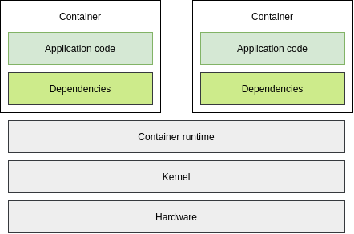
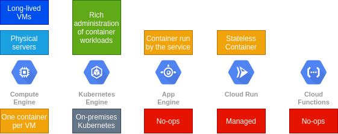
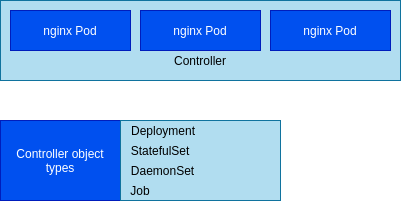

# Kubernetes

## Google Cloud Platform

- Define cloud computing.
- Identify Google Cloud's compute services.
- Understand regions and zones.
- Understand the cloud resources hierarchy.
- Administer your Google Cloud resources.

### Cloud Computing and Google Cloud

**Cloud computing has five fundamental attributes**

- On-demand self-service:
    - No human intervention needed to get resources.
- Broad network access:
    - Access from anywhere.
- Resource pooling:
    - Provider shares resources to customers.        
- Rapid elasticity:
    - Get more resources quickly as needed.
- Measured service:
    - Pay only for what you consume.

**Google Cloud offers a range of services**

- Compute:
    - Compute Engine
    - Google Kubernetes Engine (GKE)
    - App Engine
    - Cloud Functions

**Building your own database solution**


**Use a managed service**

- Storage:
    - Cloud Bigtable
    - Cloud Storage
    - Cloud SQL
    - Cloud Spanner
    - Datastore

**Google Cloud offers a range of services**

- Big Data:
    - BigQuery
    - Pub/Sub
    - Dataflow
    - Dataproc
    - Datalab
- Machine Learning:
    - Vision API
    - AI Platform
    - Speech-to-Text API
    - Cloud Translation
    - Cloud Natural Language    

### Resource Management

**Understanding regions and zones**


**Google Cloud PoPs and network**

- Edge point of presence.

**Zonal resources operate exclusively in a single zone**

- Zonal resources operate within a single zone, which means that is the zone becomes unavailable, the resources
won't be available either.
- GKE has a component called a node, and these are zonal, too.

**Regional**

- Regional resources operate across multiple zones, but within one region.

**Global**

- Global resources can be managed across multiple regions, these resources can further improve the availability
of an application.

**Resources sit in projects**

- The GCP resources you use, no matter where they reside, must belong to a project.
- A project is the base level organizing entity, for creating and using resources and services and managing
billing, APIs and permissions. Zones and regions physically organize the GCP resources you use, and projects
logically organize them.


**Resources have hierarchy**

- Each project is identified by a unique project ID and project number.
- Project ID and project number remain fixed.
- Projects can belong to a folder, which is another grouping mechanism.
- You should use folders to reflect their hierarchy of your enterprise and apply policies at the right levels within your
enterprise.
- A single organization owns all the folders beneath it.
- An organization is the root node of a GCP resource hierarchy.
- Organizations let you set policies that apply throughout your entire enterprise.
- Having organization is required for you to use folders.

**Resource have hierarchy**

- The GCP resource hierarchy, helps you manage resources across multiple departments, and multiple teams within an
organization.
- You can define a hierarchy that can create trust boundaries and resource isolation.
- Cloud IAM lets you fine tune access controls to all the GCP resources you use, you define IAM policies
that control user access to resources.
- Policies inherit downwards.
- Additional policies at lower levels of the hierarchy can grant additional permissions.
- Billing accumulates at the project level.

**Cloud security and Google Cloud**

- Upper layers of the security stack, including the securing of the data, remain your responsibility.

### Billing

**How billing works**

- Billing account pays for project resources.
- A billing account is linked to one or more projects.
- Charged automatically or invoiced every month or at threshold limit.
- Sub accounts can be used for separate billing for projects.

**How to keep your billing under control**

- Budget and alerts.
- Billing export:
    - Store detail billing information and store it where it's easy to retrieve for external analysis, such as a BigQuery.
- Reports.

**Quotas are helpful limits**

- Limits unforeseen extra billing charges.
- Designed to prevent the over-consumption or resource. Apply at GCP project level.
- Rate quota: `GKE API: 1,000 requests per 100 seconds`
- Allocation quotas: `5 networks per project`
- Many quotas are changeable.

### Interacting with Google Cloud

**Ways to interact with Google Cloud**

- Google Cloud Console: Web user interface.
- Cloud SDK and Cloud Shell: Command-line interface.
- Cloud Console mobile app: For IOS and Android.
- REST-based API: For custom apps.

**The Cloud Console**

- Web-based GUI to manage all Google Cloud resources.
- Executes common tasks using simple mouse clicks.
- Provides visibility into Google Cloud projects and resources.

**Cloud SDK**

- `gcloud`
- `kubectl`
- `gsutil`
- `bq`

**Cloud Shell**

- Command-line access to your cloud resources directly from your browser.
- Constant availability of `gcloud` command-line tool and other utilities.
- Ephemeral Compute Engine virtual machine instance.
- Built-in authorization for access to Cloud Console projects and resources.

**Cloud Shell code editor**

**Cloud Console mobile app**

- Start, stop, and SSH into Compute Engine instances.
- Get up-to-date billing information and alerts.
- Set up customizable graphs, showing key metrics.

### Summary

- Cloud computing means on-demand, pay-as-you-go resources.
- Google Cloud offers 4 compute services.
- Google Cloud is organized into regions and zones.
- The resource hierarchy helps you manage your Google Cloud use.
- Use the Cloud Console and the Cloud Shell for access.

***

## Introduction to Containers and Kubernetes

- Create a container using Cloud Build.
- Store a container in Container Registry.
- Compare and contrast Kubernetes and Google Kubernetes Engine (GKE) features.

### Introduction to Containers and Container Images

**We used to build apps on individual servers**


- Deployment ~months.
- Low utilization.
- Not portable.

**Hypervisors create and manage vistual machines**


- A hypervisor is the software layer that breaks the dependencies of an operating system with its underlying hardware and
allow several Virtual Machines to share that same hardware.
- KVM is one well-known hypervisor.
- Deployment ~days (mins).
- Improved utilization.
- Hypervisor-specific.

**Running multiple apps on a single VM**


- Deployment ~days (mins).
- Hypervisor-specific.
- **Low isolation; tied to OS**

**The VM-centric way to solve this problem**


- Deployment ~days (mins).
- Hypervisor-specific.
- **Redundant OS**

**User space abstraction and containers**


- Containers are isolated user spaces per running application code.
- Containers are lightweight because they don't carry a full OS that can be scheduled or packed tightly onto
the underlying system.
- Container can be created and shut down very quickly.

**What is a container?**


- The lightweight, stand-alone, resource efficient, portable execution packages.

**Why developers like containers**

- Safely make assumptions about the underlying hardware and software.
- With Linux kernel underneath, you no longer have code that works on your laptop, but doesn't work in prod.
- The Container is the same and runs the same anywhere.
- Containers make it easier to build apps that use the microservices design pattern that is loosely coupled,
fine-grained components.
- Modular design pattern allows the operating system to scale and also upgrade components of an app without
affecting the app as a whole.



- An Application and its dependencies are called an image.
- A container is simply a running instance of an image.
- By building software into container images, developers can easily package and ship and app without worrying about the
system it will be running on.

**Containers use a varied set of Linux technologies**

- Processes: Each Linux process has its own virtual memory address space, separate from all others, and Linux 
processes are rapidly created and destroyed.
- Linux namespaces: Containers use Linux namespaces to control what an app can see, process ID numbers, 
directory trees, IP addresses and more.
- cgroups: To control what app can use. Its maximum consumption of CPU time, memory, IO bandwidth and other resources.
- Union file system: To efficiently encapsulate apps and their dependencies into a set of clean minimal layers.

**Containers are structured in layers**


**Containers promote smaller shared images**

**How can you get containers?**

- Download containerized software from a container registry such as `gcr.io`.
- Build your own container using open-source docker command.
- Builds your own container using Cloud Build.

**Cloud Build**


***

### Kubernetes

**Challenge: Container management**

- You've embraced containers, but managing them at scale is a challenge.
- What can you do to better manage your container infrastructure?
- Kubernetes!

**What is Kubernetes?**

- Container management: It's a container centric management environment.
- Open Source: Vendor-neutral Cloud Native Computing Foundation.
- Automation: It Automates the deployment, scaling, load balancing, logging, monitoring, and other management features of
containerized apps. PaaS solutions.
- Container management: The features of an IaaS, such as allowing a wide range of user preferences and configuration
flexibility.
- Declarative configuration: When you administer your infrastructure declaratively, you describe the desired state
you want to achieve, instead of issuing a series of commands to achieve that desired state.
- Imperative configuration: You issue commands to change the system state.

**Kubernetes features**

- Supports both stateful and stateless apps
- Autoscaling
- Resource limits
- Extensibility
- Portability

### Introduction to Google Kubernetes Engine

**Challenge: Managing Kubernetes**

- Kubernetes is powerful, but managing the infrastructure is a full-time job.
- Is there a managed service for Kubernetes within Google Cloud?
- Yes! Google Kubernetes Engine.

**What is GKE?**

- GKE is a component of the GCP, compute offerings, it makes it easy to bring your Kubernetes workloads into the cloud.

**Exploring GKE features**

- Fully managed: You don't have to provision the underlying resources.
- Container-optimized OS: These OS are maintained by Google, and are optimized to scale quickly, and with a minimal
resource footprint.
- Auto upgrade: To ensure that your clusters are automatically upgraded with the latest and greatest version of
Kubernetes.
- Auto repair: The VM that host your containers inside of a GKE cluster, are called nodes. The service will 
automatically repair unhealthy nodes for you. It will make periodic health checks on each node in the cluster, if a node
is determined to be unhealthy and requires repair, GKE will drain the node (exhaust load, and restart).
- Cluster scaling: Scaling cluster itself.
- Seamless integration: Integrated with Google Cloud Build and Container Registry.
- Identity and access management: Control access through the use of accounts and role permissions.
- Integrated logging and monitoring: Stackdrive is Google Cloud system for monitoring and management for services,
containers, apps, and infrastructure.
- Integrated networking: GKE is integrated with Google virtual private clouds or VPCs, and makes use of GCP's 
networking features.
- Cloud Console: The GCP console provides insights into GKE clusters and the resources, and it allows you to
view, inspect and delete resources in those clusters.

### Computing Options

**Comparing Google Cloud computing solutions**


**Compute Engine**

- Fully customizable virtual machines.
- Persistent disks and optional local SSDs.
- Global load balancing and autoscaling.
- Per-second billing.

**Compute Engine use cases**

- Complete control over the OS and virtual hardware.
- Well suited for lift-and-shift migrations to the cloud.
- Most flexible compute solution, often used when a managed solution is too restrictive.

**App Engine**

- Provides a fully managed, code-first platform.
- Streamlines application deployment and scalability.
- Provides support for popular programming languages and application runtimes.
- Supports integrated monitoring, logging, and diagnostics.
- Simplifies version control, canary testing, and rollbacks.

**App Engine use cases**

- Websites.
- Mobile app and gaming backends.
- RESTful APIs.

**Google Kubernetes Engine**

- Fully managed Kubernetes platform.
- Supports cluster scaling, persistent disks, automated upgrades, and auto node repairs.
- Built-in integration with Google Cloud services.
- Portability across multiple environments:
    - Hybrid computing.
    - Multi-cloud computing.

**GKE use cases**

- Containerized apps.
- Cloud-native distributed systems.
- Hybrid apps.

**Cloud Run**

- Enables stateless containers.
- Abstract away infrastructure management.
- Automatically scales up and down.
- Open API and runtime environment.

**Cloud Run use cases**

- Deploy stateless containers that listen for requests or events.
- Build apps in any language using any frameworks and tools.

**Cloud Functions**

- Event-driven, serverless compute service.
- Automatic scaling with highly available and fault-tolerant design.
- Charges apply only when your code runs.
- Triggered based on events in Google Cloud services, HTTP endpoints, and Firebase.

**Cloud Functions use cases**

- Supporting microservice architecture.
- Serverless application backend:
    - Mobile and IoT backends.
    - Integrate with third-party services and APIs.
- Intelligent applications:
    - Virtual assistant and chat bots.
    - Video and image analysis.

**So how to decide?**



### Summary

- Create a container using Cloud Build.
- Store a container in Container Registry.
- Compare and contrast Kubernetes and Google Kubernetes Engine features.

***

## Kubernetes Architecture

- Understand Kubernetes objects and the Kubernetes control plane.
- Deploy a Kubernetes cluster using Google Kubernetes Engine (GKE).
- Deploy Pods to a GKE cluster.
- View and manage Kubernetes objects.

### Kubernetes Concepts

- Kubernetes Object module. Each thing Kubernetes manages is represented by an object.
    - You can view and change these object's attributes and state.
- Principle of declarative management. Kubernetes expects you to tell it what you want the state of the objects under its
management to be.

**There are two elements to Kubernetes objects**


**Containers in a Pod share resources**


- Kubernetes assigns each pod a unique IP address. 
- Every container within a pod shares the network namespace, including IP address and net ports.
- Containers within the same pod can communicate through local host `127.0.0.1`.
- A pod can also specify a set of storage volumes, to be shared amongst its containers.

**Running three nginx containers**

- You want three nginx containers running all the time.
- You declare objects that represent those containers.
- Kubernetes launches those objects and maintains them.

**Desired state compared to current state**

- Desired state: Kubernetes objects.
- Current state: ???
- Kubernetes Control Plane: Remediation actions.


### Kubernetes Control Plane

**Cooperating processes make a Kubernetes cluster work**


- etcd: Is the cluster database. Its job is to reliably store the state of the cluster. 
    - All config data. 
    - What nodes are part of cluster.
    - What pods should be running and where they should be running.
- kube-scheduler: Is responsible for scheduling pods onto nodes. To do that, it evaluates the requirements of each
individual pod and selecting which node is most suitable. But it doesn't do the work of actually launching
the pods on the nodes. 
- kube-controller-manager: It continuously monitors the state of the cluster through kube-APIserver.
- kube-cloud-manager: Manages controllers that interact with the underlying cloud providers.
- Kubelet: Kubernetes agent at each node.
- Kube-proxy: Maintain the network connectivity among the pods in a cluster. Use Linux IP tables.

### Google Kubernetes Engine Concepts

**GKE manages all the control plane components**


**GKE: More about nodes**

- Kubernetes doesn't create nodes.
- Cluster admins create nodes and add them to Kubernetes.
- GKE manages this by deploying and registering Compute Engine instances as nodes.

**GKE: More about nodes**

- You can choose your node machine type, when you create a cluster.

**Use node pools to manage different kinds of nodes**


**Zonal versus regional clusters**


- Regional cluster has a single API endpoint for the cluster.
- However, its control planes and nodes are spread across multiple Compute Engine zones within a region.
- Regional clusters ensure that the availability of the application is maintained across multiple zones in a
single region.
- The availability of the control plane is also maintained so that both app and management functionality can 
withstand the loss of one or more but not all zones.
- By default, regional cluster is spread across 3 zones.

**A regional or zonal GKE cluster can also be set up as a private cluster**


### Kubernetes Object Management

**Objects are defined in a YAML file**

```yaml
apiVersion: apps/v1
kind: Pod
metadata:
    name: nginx
    labels:
      app: nginx
spec:
    containers:
    - name: nginx
      image: nginx:latest
```

**Best practice tip: use version control on YAML files**

**Object names**

- All objects are identified by a name.
- Cannot have two of the same object types with same names.
- If an object is deleted, the name can be reused.
- All objects are assigned a unique identifier (UID) by Kubernetes.

```yaml
apiVersion: apps/v1
kind: Pod
metadata:
    name: nginx
    uid: 44dd-dd-567-a8z01
[...]
```

**Labels**

```yaml
apiVersion: apps/v1
kind: Deployment
metadata:
    name: nginx
    labels:
      app: nginx
      env: dev
      stack: frontend
spec:
    replicas: 3
    selector:
      matchLabels
      app: nginx
```

**Labels can be matched by label selectors**

- Admin issues a command.

```console
$> kubectl get pods --selector=app-nginx
```

**Pods have a life cycle**

- Pod is "born"
- Pod is running
- Pod is broken
- Pod "dies"

**Pods and Controller Objects**



**Example: Use Deployments**

- You want three nginx containers running all the time.
- How does Kubernetes maintain 3 nginx containers at any given time?

**Deployment ensure that sets of Pods are running**

```yaml
apiVersion: apps/v1
kind: Deployment
metadata:
    name: nginx-deployment
    labels:
      app: nginx
spec:
    replicas: 3
    template:
      metadata:
        labels:
          app: nginx
      spec:
        containers:
        - name: nginx
          image: nginx:latest
```

**Allocating resource quotas**

- Multiple projects run on a single cluster.
- How can I allocate resource quotas?

**Namespaces**

- Namespaces provide scope for naming resources such as pods, deployments, and controllers.
- 3 initial namespaces in cluster.
    - Default: Pods, Deployments
    - Kube-system: ConfigMap, Secrets, Controllers, Deployments
    - Kube-public: 

**Best practice tip: namespace-neytral YAML**

- Most flexible:

```console
$> kubectl -n demo apply -f mypod.yaml
```

- Legal but less flexible:

```yaml
apiVersion: v1
kind: Pod
metadata:
    name: mypod
    namespaces: demo
```

### Migrate for Anthos

**Migrate for Anthos moves VMs to containers**

- Move and convert workloads into containers.
- Workloads can start as physical servers or VMs.
- Moves workload compute to container immediately (<10 min).
- Data can be migrated all at once or "streamed" to the cloud until the app is live in the cloud.

**A migration requires an architecture to be built**

**A Migration is a multi-step process**

- Step 1: Configure processing cluster.
- Step 2: Add migration source.
- Step 3: Generate and review plan.
- Step 4: Generate artifacts.
- Step 5: Test.
- Step 6: Deploy.

**Migrate for Anthos requires a processing cluster**

```console
$> gcloud container --project $PROJECT_ID \
   clusters create $CLUSTER_NAME \
   --zone $CLUSTER_ZONE \
   --username "admin" \
   --cluster-version 1.14 \
   --machine-type "n1-standard-4" \
   --image-type "UBUNTU" \
   --num-nodes 1 \
   --enable-stackdriver-kubernetes \
   --scopes "cloud-platform" \
   --enable-ip-alias \
   --tags="http-server"
```

**Installing Migrate for Anthos uses migctl**

```console
$> migctl setup install
```

**Adding a source enables migrations from a specific environment**

```console
$> migctl source create ce my-ce-src --project my-project --zone zone
```

**Creating a migration generates a migration plan**

```console
$> migctl migration create test-migration --source my-ce-src --vm-id my-id --intent Image
```

**Executing a migration generates resources and artifacts**

```console
$> migctl migration generate-artifacts my-migration
```

**Deployment files typically need modification**

```console
$> migctl migration get-artifacts test-migration
```

*Apply the configuration to deploy the workload**

```console
$> kubectl apply -f deployment_spec.yaml
```

### Summary

- Kubernetes controllers keep the cluster state matching the desired state.
- Kubernetes consists of a family of control plane components, running on the control plane and the nodes.
- GKE abstracts away the control plane.
- Declare the state you want using manifest files.

***

## Kubernetes Workloads

- Understand the `kubectl` command.
- Understand how Deployments are used in Kubernetes.
- Understand the networking architecture of Pods.
- Understand Kubernetes storage abstractions.

### The kubectl Command

**Kubectl transforms your command-line entries into API calls**

**Use kubectl to see a list of Pods in a cluster**

- Admin issues a command.

```console
$> kubectl get pods
```


**kubectl must be configured first**

- Relies on a config file: `$HOME/.kube/config`.
- Config file contains:
    - Target cluster name.
    - Credentials for the cluster.
- Current config: `kubectl config view`.

**Connecting to a Google Kubernetes Engine cluster**

```console
$> gcloud container clusters \
   get-credentials [CLUSTER_NAME] \
   --zone [ZONE_NAME]
```

**The kubectl command syntax has several parts**


```console
$> kubectl get pods
$> kubectl get pod my-test-app

$> kubectl get pod my-test-app -o=yaml
$> kubectl get pods -o=wide
```

**The kubectl command has many uses**

- Create Kubernetes objects.
- View objects.
- Delete objects.
- View and export configurations.

### Deployments

**Deployment declare the state of Pods**

- Roll out updates to the Pods.
- Roll back Pods to previous revision.
- Scale or autoscale Pods.
- Well-suited for stateless applications.

**Deployment is a two-part process**


**Deployment object file in YAML format**

```yaml
apiVersion: apps/v1
kind: Deployment
metadata:
    name: my-app
spec:
    replicas: 3
    template:
      metadata:
        labels:
          app: my-app
      spec:
        containers:
        - name: my-app
          image: gcr.io/demo/my-app:1.0
          ports:
          - containerPort: 8080
```

**Deployment has three different lifecycle states**

- Progressing State.
- Complete State.
- Failed State.

**There are three ways to create deployment**

**(1)**

```console
$> kubectl apply -f [DEPLOYMENT_FILE]
```

**(2)**

```console
$> kubectl run [DEPLOYMENT_NAME] \
   --image [IMAGE]:[TAG] \
   --replicas 3 \
   --labels [KEY]=[VALUE] \
   --port 8080 \
   --generator deployment/apps.v1 \
   --save-config
```

**(3)**

- GCP console

**Use kubectl to inspect your Deployment**

```console
$> kubectl get deployment [DEPLOYMENT_NAME]
```

- ReplicaSet launches new pod.

```console
$> kubectl get deployment nginx-deployment
NAME                DESIRED     CURRENT     UP-TO-DATE      AVAILABLE       AGE
nginx-deployment    3           3           3               3               3m
```

**Or output the Deployment config in a YAML format**

```console
$> kubectl get deployment [DEPLOYMENT_NAME] -o yaml > this.yaml
```

**Use the 'describe' command to get detailed info**

```console
$> kubectl describe deployment [DEPLOYMENT_NAME]
```

**Use GCP console to get detailed information**

**Scaling a Deployment manually**

```console
$> kubectl scale deployment [DEPLOYMENT_NAME] -replicas=5
```

**Autoscaling a Deployment**

```console
$> kubectl autoscale deployment [DEPLOYMENT_NAME] --min=5 --max=15 --cpu-percent=75
```

**Updating a Deployment**

```yaml
apiVersion: apps/v1
kind: Deployment
metadata:
    name: my-app
spec:
    replicas: 3
    template:
      spec:
        containers:
        - name: my-app
          image: gcr.io/demo/my-app:1.0
          ports:
          - containerPort: 8080
```

```console
$> kubectl apply -f [DEPLOYMENT_FILE]

$> kubectl set image deployment [DEPLOYMENT_NAME] [IMAGE] [IMAGE]:[TAG]

$> kubectl edit deployment/[DEPLOYMENT_NAME]
```

**Updating Deployment through GCP console**

**The process behind updating a Deployment**

- Updates slowly released, which ensures the availability of the application.

**Service is a load balancing front end for Pods**


**Blue/green deployment strategy**

- Is useful when you want to deploy a new version of an application and also ensure that app services remain available,
while the deployment is updated.
- A completely new deployment is created with a newer version of the application.
- When the pods in the new deployment are ready, the traffic can be switched from the old blue version to the new 
green version.
- Kubernetes service does that.
- Services allow you to manage the network traffic flows to a selection of pods, this set of pods is selected using
a label selector.

**Applying a blue/green deployment strategy**

```yaml
[...]
kind: Service
spec:
    selector:
      app: my-app
      version: v1
[...]
```

```console
$> kubectl apply -f my-app-v2.yaml
```

```yaml
[...]
kind: Service
spec:
    selector:
      app: my-app
      version: v2
[...]
```

```console
$> kubectl patch service my-app-service -p '{"spec":{"selector":{"version":"v2"}}}'
```

- The advantage of this update strategy is that rollouts can be instantaneous and the newer versions can be tested
internally before releasing them to the entire user base.
- The disadvantage is that the research usage is doubled during the deployment

**Canary Deployments**

- The Canary method is another update strategy based on the blue-green method, but traffic is gradually shifted to the
new version.
- The main advantages of using canary deployments are that you can minimize the excess resource usage during the update.

**Applying a canary deployment**

```yaml
[...]
kind: Service
spec:
    selector:
      app: my-app
[...]
```

```console
$> kubectl apply -f my-app-v2.yaml

$> kubectl scale deploy/my-app-v2 -replicas=10

$> kubectl delete -f my-app-v1.yaml
```

**Session affinity ensures that all client requests are sent to the same Pod**

**Rolling back a Deployment**

```console
$> kubectl rollout undo deployment [DEPLOYMENT_NAME]

$> kubectl rollout undo deployment [DEPLOYMENT_NAME] --to-revision=2

$> kubectl rollout history deployment [DEPLOYMENT_NAME] --revision=2
```

**Pausing a Deployment**

```console
$> kubectl rollout pause deployment [DEPLOYMENT_NAME]
```

**Resuming a Deployment**

```console
$> kubectl rollout resume deployment [DEPLOYMENT_NAME]
```

**Monitoring a Deployment**

```console
$> kubectl rollout status deployment [DEPLOYMENT_NAME]
```

**Deleting a Deployment**

```console
$> kubectl delete deployment [DEPLOYMENT_NAME]
```

### Pod Networking

**A Pod is a group of containers with shared storage and networking**

**Your workload doesn't run in a single Pod**

**Pod-to-Pod communication on the same node**


**Nodes get Pod IP addresses from address ranges assigned to your Virtual Private Cloud**

- VPCs are logically isolated networks that provide connectivity for resources you deploy within GCP.

**Addressing the Pods**

### Volumes

**Kubernetes offers storage abstraction options**

- Volumes:
    - Volumes are the method by which you attach storage to a Pod.
    - Some Volumes are ephemeral.
    - Some Volumes are persistent.
- Persistent storage options:
    - Are block storage, or networked file systems.
    - Provide durable storage outside a Pod.
    - Are independent of the Pod's lifecycle.
    - May exist before Pod creation and be claimed.

**A Volume is a directory that's accessible to the containers in a Pod**

```console
$> kubectl create -f pod.yaml
```

**Creating a Pod with an NFS Volume**

```yaml
apiVersion: v1
kind: Pod
metadata:
    name: web
spec:
    containers:
    - name: web
      image: nginx
      volumeMounts:
      - mountPath: /mnt/vol
        name: nfs
    volumes:
    - name: nfs
      server: 10.1.1.2
      path: "/"
      readOnly: false
```


**Data saved on NFS Volumes will outlive the Pod**

**The benefits of PersistentVolumes**

- Abstracts storage provisioning from storage consumption.
- Promotes microservices architecture.
- Allows cluster administrators to provision and maintain storage.
- Developers can claim provisioned storage for app consumption.

**PersistentVolumeClaims and PersistentVolumes separate storage consumption from provisioning**


**Creating a Compute Engine persistent disk using a gcloud command**

```console
$> gcloud compute disks create
   --size=100GB
   --zone=us-central1-a demo-disk
```

**Creating and using a Compute Engine persistent disk**

```yaml
[...]
spec:
    containers:
    - name: demo-container
      image: gcr.io/hello-app:1.0
      volumeMounts:
      - mountPath: /demo-pod
        name: pd-volume
    volumes:
    - name: pd-volume
      gcePersistentDisk:
        pdName: demo-disk
        fsType: ext4
```

**Creating a Compute Engine Persistent Disk**

**Configuring Volumes in Pods makes portability difficult**

**PersistentVolumes abstraction has two components**


**PersistentVolumes must be claimed**

**PersistentVolume manifest**

```yaml
apiVersion: v1
kind: PersistentVolume
metadata:
    name: pd-volume
spec:
    storageClassName: "standard"
    capacity:
      storage: 100G
    accessModes:
    - ReadWriteOnce:
    gcePersistentDisk:
      pdName: demo-disk
      fsType: ext4
```

- PVC StorageClassName must match the PV StorageClassName.

```yaml
kind: StorageClass
apiVersion: storage.k8s.io/v1
metadata:
    name: standard
provisioner: kubernetes.io/gce-pd
parameters:
    type: pd-standard
    replication-type: none
```

**Use SSD**

```yaml
apiVersion: v1
kind: PersistentVolume
metadata:
    name: pd-volume
spec:
    storageClassName: "ssd"
    capacity:
      storage: 100G
    accessModes:
    - ReadWriteOnce:
    gcePersistentDisk:
      pdName: demo-disk
      fsType: ext4
```

```yaml
kind: StorageClass
apiVersion: storage.k8s.io/v1
metadata:
    name: ssd
provisioner: kubernetes.io/gce-pd
parameters:
    type: pd-ssd
```

### Proxies

**Forward Proxy**

- A server that sits between a client and servers and acts on behalf of the client, typically used to mask the
client's identity (IP address). Note that forward proxies are often referred to as just proxies.

**Reverse Proxy**

- A server that sits between clients and servers and acts on behalf of the servers, typically used for logging, load 
balancing or caching.

**Nginx**

- Nginx is a very popular webserver that's often used as a **severse proxy** and **load balancer**.
