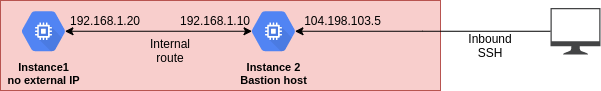
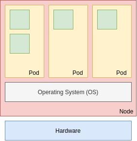

# Foundations of GCP Security

## Google Cloud Platform's approach to security

### Google Cloud Platform's approach to security

**Security at Google**

- Security empowers innovation. If you put security first, everything else will follow.
- Security is paramount at Google.
- Seven apps with more than a billion users are protected from threats everyday.

**Google's technical infrastructure**

- Heavy investment in infrastructure security and privacy.
- Global-scale technical infrastructure for:
    - Secure deployment of services.
    - Secure storage of data.
    - Secure communications between services.
    - Safe operation by administrators.
- Internet services, including Google Cloud Platform, built on this infrastructure.    

**Google's infrastructure security layers**

- Operational Security
- Internet Communication
- Storage Services
- User Identity
- Service Deployment
- Hardware Infrastructure
- **Security is**:
    - Fundamental to Google's infrastructure design.
    - Designed and built in progressive Layers.
    - Delivers true defense in depth.
    
**Secure low level infrastructure**

- State-of-the-art data centers.
- Security of physical premises.
- Hardware design and provenance.
- Secure boot stack and machine identity.
    
**Secure service deployment**

- Service identity, integrity, and isolation.
- Inter-service access management.
- Encryption of inter-service communication.
- Access management of end-user data.    
    
**Secure user identity**

- Authentication.
- Login abuse protection.
   
**Secure data storage**

- Encryption at rest.
- Hardware tracking and disposal.
- Deletion of data. 

**Secure Internet Communication**

- Google Front End (GFE) service.
- Denial of Service (DoS) protection.
- User authentication. 
    
**Operational security**

- Safe software development.
- Keeping employee devices and credentials safe.
- Reducing insider risk.
- Intrusion detection.
    
**GCP is designed for security**

- GCP benefits from running on the secure Google infrastructure:
    - Security is "backed in" to the core infrastructure.
    - Security is not something added on afterwards.
- GCP is technology with security at its code:
    - Google secures and manages the core infrastructure by default.        
    
**VPC network security**

- Google Virtual Private Cloud (VPC) is your GCP virtual private network:
    - Define your resources on a logically isolated network.
    - Control public internet ingress and egress traffic via firewall rules.    
    
**Operational monitoring**

- Logging and monitoring are the cornerstones of app and network security operations.
- Stackdriver enables debugging, monitoring, and diagnostics for apps that run on GCP.    
    
**Regulatory compliance**

- Security in the cloud is much more than encryption and firewalls.
- Often needs data protection and compliance with a variety of regulatory standards for independent third-party
certifications:
    - GDPR
    - PCI-DSS
    - HIPAA
    - FedRamp, etc.    
    
### The Shared Security responsibility Model
    
**Cloud security requires collaboration**

- Google is responsible for managing its infrastructure security.
- You are responsible for securing your data.    
    
**Data access**

- You must control who has access to your data.
- API requests for data are done via a REST service call:
    - Authentication information must be included with requests.    
    
**Security assessments**

- GCP does not require notification to perform penetration testing.
- GCP also provides some security assessment services:
    - Cloud Security Scanner
    - Forseti Security
    
### Threats mitigated by Google and GCP

- The scale of Google's infrastructure helps absorb many attacks.

```
Absorbing the largest attacks requires the bandwidth needed to watch half a million YouTube videos at the same time
... in HD.
```        
    
**Denial of Service (DoS)**

- Dyn DDoS attack: 1 Tb/sec
- Whole Internet: 200 Tb/sec
- SINGLE Google data center: 1300 Tb/sec    
- GCP global HTTP(S) load balancing provides a built-in defense against infrastructure DDoS attacks.
- No additional configuration is required to activate this DDoS defense.    
    
**Cloud Armor**

- Cloud Armor works with Cloud HTTP(S) load balancing.
- Customize defenses for your internet-facing apps.    
    
**Physical Security**

- Data centers are protected with a layered security model.
- All access is tracked and monitored:
    - Access logs, activity records, and camera footage.    
- Limited access:
    - Less than 1% of Googlers will ever enter a data center.    

**Data access security: Data at rest**

- All data at rest is chunked and encrypted automatically.
- Additional options are also available:
    - Customer managed keys (CMEK)
    - Customer supplied keys (CSEK)    
    
**Data access security: Data in transit**

- Google applies different protections to data, depending on:
    - Whether it is transmitted inside a physical boundary where we can ensure that rigorous security measures are
    in place.
    - Whether it is transmitted outside a physical boundary controlled by or on behalf of Google.    
   
**Server and software stack security**

- Homogenous custom-built servers with security in mind:
    - Purpose-built servers and network equipment.
- Stripped-down and hardened cersion of Linux software stack.
    - Continually monitored binary modifications.
- Trusted server boot:
    - Titan security chip.            
    
**CPU/hardware vulnerabilities**

```
Google's infrastructure are robust focus on security also help protect against issues like CPU/hardware
vulnerabilities. For example, in Jenuary 2018, major CPU vulnerabilities were disclosed. Most CPU customers
went about their business with no impact.
```    
    
**Data disposal**

- When data is deleted by customer:
    - The data is no longer accessible by the service.
    - Data is deleted from all Google's systems:
        - In accordance with applicable laws.
        - Within a maximum of 180 days.    
    
### Access Transparency    
  
**Data ownership**

- GCP customers own their own data.
- Google will not process data for any purpose other than to fulfill contractual obligations:
    - Data is not scanned for advertisments or sold to third parties.
- The inability to audit cloud provider access is often a barrier to moving to the cloud.

```
Cloud customers want to know:
"When do you access my data, and how will I know?"
```    
    
**Trust through Access Transparency**

- Standard access logs traditionally do not show access by the cloud provider.
- Google's Access Transparency provides near-real-time oversight over data access by either Google support or
engineering.    
    
**Exporting data**

- Data can also be exported from Google Cloud without penalty.
- Standard egress charges will apply.

**Access Approval API allows you even more control over access to your data**

- Works with Access Transparency to give customers even greater control.
- Allows you to require **explicit** approval for Google support and engineering to access your project's data.
    
**Access Approval quickly alerts you by sending messages when access is required**

- Access Approval is set up on a project level.
- Access request messages sent via email of Pub/Sub.
- Google Cloud Console or Access Approval API used to approve request.    

**Access Approval messages include important details about requested resources**

- Fields in the message include:
    - **Location** of the resource.
    - **Time** the request to access was sent.
    - **How long** access will be granted, if approved.
    - **Office or physical location** of the accessor.
    - **Reason** for the access request.
    - **Status** of the access request.    
    
**Access Approval requests will not be triggered for certain actions**

- These exclusions inculde:
    - System access to user content.
    - Accesses to lower level storage.
    - Manual access for legal reasons.
    - Manual access required to assist in solving an outage.   
    
**Things to keep in mind when using Access Approval API**

- Keep in mind the following:
    - Events that do not generate Access Transparency log entries cannot use Access Approval.
    - Requiring Access Approval may increase support times.    
    
***

## Cloud Identity

### Cloud Identity Overview

**Google Cloud Identity**

- An identity as a Service (IDaaS) solution.
- Used for managing users, groups, and domain-wide security settings:
    - From a central location.
- Tied to a unique DNS domain that is enabled for receiving email.
    
**Cloud Identity editions**

- Free
- Premium    
    
**Google Admin Console**

- Centralized console to manage users, groups, and security settings.    
- Cloud Identity allows free accounts to be created for each user.

**Support for Cloud Identity**

- Cloud Identity can be:
    - Used as a standalone service.
    - Combined with your Google Workspace services.    
    
**If you are a Google Workspace Admin**

- Sign up for Cloud Identity from the **Billing** section of the Google Admin console.
- You can create free Cloud Identity accounts for users who don't need Google Workspace.    
    
**If you are not using Google Workspace**

- Register your domain as a Cloud Identity domain.
- Then use the Google Admin console to configure users and groups.    
   
**Org Admin**

- Organization Administrator IAM role must be assigned to a user or group.
- Organization administrators have central control of all resources.    
    
**If you are a Google Cloud Admin**

- Assign roles to users or groups in Google Cloud IAM:
    - Can use any Google Workspace or Cloud Identity user or group.
    - And any Google accounts and groups (@gmail, @google).     
    
### Google Cloud Directory Sync

**Provisioning users**

- The Admin console allows admins to provision users manually.    
        
**What if you already have a different corporate directory?**

    
    
**How GCDS workd**

- Data is exported from your LDAP server to Active Directory.
- GCDS connects to the Google domain and generates a list of Google uses, groups, and shared contacts that you specify.
- GCDS compares these lists and updates your Google domain to match the data.    
- When the synchronization is complete, a report is emailed.    
  
**Google Cloud Directory Sync (GCDS)**

- One-way synchronization; the data in your directory server is never modified or compromised.    
    
**GCDS runs in your server environment**

- There is no access to your AD/LDAP server outside your perimeter.    
    
**GCDS auto-provisioning and deprovisioning**

- The GCDS auto-provisioning and de-provisioning features reduce possible security risk.   
 
**Managed Service for Microsoft Active Directory allows you to manage your cloud-based, AD-dependent workloads**

- Managed Service for Microsoft Active Directory:
    - Runs actual Microsoft AD controllers.
    - Is vistually maintenance-free.
    - Supports both hybrid cloud and standalone cloud domains.    
    
**Managed Service for Microsoft Active Directory includes many useful features**

- An actual AD domain.
- Familiar tools, such as Group Policy and RSAT.
- Highly available configurations.
- Hardened servers with snapshots and automated patching.
- Flexible, multi-regional deployments.    
    
**Managed Service for Microsoft Active Directory allows you to create the right architecture for your domain**

- Factors to consider are:
    - Alignment with existing security zones.
    - Interaction required between on-premises and Google Cloud resources.
    - Administrative autonomy.
    - Availability requirements.    
    
### Google authentication vs. SAML-based SSO    
    
**User account authentication**

- Two primary ways to handle Google user account authentication.    
  
**User account authentication**

- Google authentication.
- Single Sign-On (SSO) authentication.
    
**Setting up SSO**

- SSO configuration requires 3 links and a certificate.    
    
### Authentication Best Practices    

**Manage Google Cloud permissions with groups**

- Avoid managing permissions for individual users.
- Best to assign Google Cloud roles to groups instead.
  
**Number of Org admins**

- You should have at least two Organization admins, but not many more.
- Remove these permissions to start locking down access at a finer granurality.

**Multiple domains**

- Multiple domains can be associated with your organization's Google account.
- You can add up to 600 domains.   
    
***

## Cloud Identity and Access Management (Cloud IAM)    
   
### Resource Manager

**Identity and Access Management**

```
Who can do wjat on which resource
``` 
   
**GCP Resource Manager**

- Resources in GCP are hierarchically managed by organization, folders, and projects.
- Resource Manager enables you to programmatically manage these resource containers.   
   
**GCP Objects**

- Objects are the various resources members can access and use on GCP.
- Objects hold data and applications, and also help to organize it and secure it.   
   
**IAM objects**

- Organization
- Folders
- Projects
- Resources
- Members
- Roles

**Organization node**

- The organization node:
    - Is the root node for Google Cloud resources.
    - Contains all of your projects and resources.
   
**Folders offer flexible management**

- Folders:
    - Optionally group projects under an Organization.
    - Can contain both projects and other folders.   
- Use folder to assign policies: changes will apply across all the projects and resources.   
   
**Members can be any Google Workspace, or Cloud Identity user or group**

- Gmail accounts and Google Groups.
- Users and groups in your Google Workspace domain.
- Users and groups in your Cloud Identity domain.
- Note: Google Cloud does not create or manage users or groups.   
   
**Member roles are collections of permissions**

- Permissions are given to members by granting roles.
- Roles define which permissions are granted.
- GCP provides predefined roles and also the ability to create custom roles.   
   
**Service accounts**

- Service accounts:
    - Control server-to-server interactions:
        - Used to authenticate from one service to another.
        - Used to control provileges used by resources.   
   
**There are two types of Google Service Accounts**

| Google-managed service accounts | User-managed service accounts |
|---|---|
| All service accounts have Google-managed keys | Google only stores the public portion of a user-managed key |
| Google stores both the public and private portion of the key | Users are responsible for private key security |
| Each public key can be used for signing for a max of two weeks | Can create up to 10 user-managed service accounts keys per service |
| Private keys are never directly accessible | Can be administered via Cloud IAM API, gcloud, or the Console |   
   
**Keeping your User-managed keys safe is vital - and is the creator's responsibility**

```
Remember: Google does not save your user-managed private keys - if you lose them, Google cannot help you recover them.
```   
  
- Use the `gcloud` command-line tool to quickly list all of the keys associated with a Service Account.

```console
$> gcloud iam service-accounts keys list --iam-account user@email.com
```   
  
**Labels in Resource Manager help you organize your Google Cloud instances**

- Team or cost center labels.
- Component labels.
- Environment or stage labels.
- State labels.
- Virtual machine labels.   
   
**Labels in Resource Manager must meet certain requirements**

- No more than 64 labels per resource.
- Must be in the form of a key-value pair.
- Keys cannot be empty and must be between 1-63 characters.
- Values may be empty but cannot exceed 63 characters.
- Keys and values can contain only lowercase letters, numeric characters, underscores, and dashes.
- The key portion of a label must be unique. However, you can use the same key with multiple resources.
- Keys must start with a lowercase letter or international character.   
 
**Many Google products and services currently support the use of labels**   
   
### IAM Roles   
   
**There are three kinds of IAM roles in Google Cloud**

- Basic
- Predefined
- Custom
   
**IAM basic roles are applied at the project level**

`can do what on all resources`   

- Basic roles offer fixed, coarse-grained levels of access.    
  
**Basic roles apply across all Google Cloud services in a project**

- **Owner**:
    - Invite members
    - Remove members
    - Delete projects
    - And...:
        -  **Editor**:
            - Deploy apps
            - Modify code
            - Configure services
            - And...:
                - **Viewer**:
                    - Read-onlt access

**IAM predefined roles**

- Predefined roles are designed to map to job functions: Compute Network Admin, Security Reviewer, etc.

`can do what on Compute Engine resources in this project, or folder, or org`                      
   
**IAM predefined roles offer more fine-grained permissions on particular services**

- **InstanceAdmin Role**:
    - *compute.instances.delete*
    - *compute.instances.get*
    - *compute.instances.list*
    - *compute.instances.setMachineType*
    - *compute.instances.start*
    - *compute.instances.stop*
    - ...
    
**The predefined Browser role**

- This role provides read access to browse the hierarchy for a project, including the organization and folders.     
   
**IAM custom roles**

- IAM custom roles let you define a precise set of permissions:
- **Google Group**:
    - **PrivacyReviewer Role**:
        - *storage.buckets.list*   
        - *storage.objects.list*
        - *storage.objects.get*
        - *spanner.database.get* 
        - *spanner.database.list*
        - *bigtable.tables.get*
        - *bigtable.tables.list*
        - *bigtable.tables.readRows*
        - ...                 

### IAM Policies   

**GCP IAM policies**

- A policy consists of a list of bindings.
- A binding binds a list of members to a role.

**IAM resource hierarchy**

- Organization
- Folder
- Projects
- Resources

**Organization policies**

- An organization policy is:
    - A configuration of restrictions.
    - Defined by configuring a constraint with desired restrictions.
    - Applied to the organization node, folders or projects.
   
**Constraints**

- A constraint is a type of restriction against a GCP service. Examples:
    - Disable VM serial port access.
    - Disable service account creation.
    - Disable VM nested virtualization.
    - Define trusted image projects.   
   
### IAM recommender

**Recommender helps hone permissions for Cloud IAM and other Google Cloud services**

- Recommender compares project-level role grants with permissions used within the last 90 days.
- If a permission has not been used within that time, recommender will suggest revoking it.
- You have to review and apply recommendations; they will not be applied automatically.
   
**Recommender gives you three types of recommendations**

- Revoke an existing role.
- Replace an existing role.
- Add permissions to an existing role.   
   
**The easiest way to review and apply recommendations is to use Cloud Console**

- View existing roles by visiting the IAM page.
- Look for the "over-granted permissions" column.
- If there are recommendations, you will see a **Recommendation available** icon.
- Click the **Recommendation available** icon for details.
- Choose to "apply" or to "dismiss" a recommendation.
- You can revert your choice within 90 days.   
   
**Use caution when applying any recommendations to revoke basic roles**

- Keep the following requirements in mind when revoking basic role:
    - One person **must** have the Owner role.
    - No Owner roles means no one can manage projects.
    - If you revoke a basic role, check access controls.   
   
### IAM Troubleshooter

**Policy Troubleshooter exposes access policies that apply to a particular resource**

- Policy Troubleshooter:
    - Requires a member email, a resource name, and a permission to check.
    - Examines all IAM policies that apply to that resource.
    - Reports on whether that member's roles include that permission to that resource.
    - Reports on which policies bind that member to those roles.   
   
**Policy Troubleshooter will only access policies that the iser has permissions to view**

- Policy Troubleshooter may not always fully explain resource access.
- If you do not have access to a resource policy, it will not be analyzed.
- Maximum effectiveness requires the Security Reviewer **(roles/iam.securityReviewer)** role.   
  
**Policy Troubleshooter can be accessed via the Cloud Console, `gcloud`, or REST API**

- For simple queries, the Cloud Console is usually the best option.
- For more complicated scenarion, try the `gcloud` command-line tool or the Policy Troubleshooter REST API.   
   
### IAM Audit Logs   
   
**Cloud Audit Logs maintains theree logs for each project, folder and organization**

- Admin activity audit logs.
- Data access audit logs.
- System event audit logs.  
   
**Admin activity audit logs record API calls that modify your resources**

- Created when administrative actions modify configurations or metadata.
- Logs are always written and cannot be disabled.
- Must have Cloud IAM role Logging/Logs Viewer or Project/Viewer.
   
**Data access audit logs record read, modify, or create activity on your resource metadata or user-provided data**

- Record changes to private cloud resources.
- Do not record changes to publicly shared assets.
- Not enabled by default because they can grow quite large.   
   
**System event audit logs record activity that modifies the configuration of your resources**

- Driven by Google system events.
- Not triggered by user interaction.
- Always written and cannot be disabled.   
   
**You have several options for viewing Audit Logs on Google Cloud**

- Basic log viewer.
- Advanced log viewer.
- **gcloud** command-line tool.
- Audit Logs API.
   
### IAM Best Practices

**IAM best practices**

- Adhere to the Principle of Least Privilege, which means you should always apply only the minimal access level 
required to get the job done.   
- Use groups when configuring Google Cloud access.
- Assign roles to the groups instead of individual users.
- Utilize predefined roles offers less administrative overhead.
- Predefined roles are managed by Google.
- Custom roles are **not** maintained by Google.
- Audit logs record project-level permission changes.
- Audit policy changes.
- Export audit logs to Cloud Storage to store your logs for long periods of time.   
  
***

## Manage Security in Google Cloud Platform

### VPC Firewalls   
   
**Virtual Private Cloud (VPC)**

**Firewall rules protect VM instances from unapproved connections**

**Firewall rules can be applied to**

- All instances in the network.
- Instances with a specific target tag.
- Instances using a specific service account.  
  
**Firewall rules are stateful**

**Firewall Rules**

| Parameter | Detail |
|---|---|
| direction | Ingress or egress |
| source or destination | The source parameter is only applicable to ingress rules. 
| | The destination parameter is only applicable to egress rules |
| protocol and port | Rules can be restricted to apply to specific protocols only, or combinations of protocols and ports only |
| action | Allow or deny |
| priority | 0-65535. The order in which rules are evaluated; the first matching rule is applied |
   
**All VPCs have 2 implied firewall rules**

- **1. Allow all outgoing traffic:**
    - An egress rule, action is allow, destination is 0.0.0.0/0, and lowest priority (65535).
- **2. Block all incoming traffic:**
    - An ingress rule, action is deny, source is 0.0.0.0/0, and lowest priority (65535).
   
**Default VPCs have additional allow rules**

- `default-allow-internal`: Allow in-bound connections between VM instances in the same network.
- `default-allow-ssh`
- `default-allow-rdp`: Remote desktop protocol.
- `default-allow-icmp`
- **All with the second lowest priority (65534)**
- **These rules should be deleted or modified as needed**
   
**Some VPC network traffic is always blocked**

- There is some traffic that is always blocked.
- Firewall rules cannot be used to un-block this traffic.   

**Always blacked traffic**

- GRE traffic:
    - All sources, all destinations, including among instances using internal IP address, unless explicitly allowed
    through protocol forwarding.
- Protocols other than TCP, UDP, ICMP, ESP, AH, SCTP, and IPIP:
    - Traffic between:
        - Instances and the internet
        - Instances if they are addressed with external IP address.
        - Instances if a load balancer with an external IP address is involved.
- Egress traffic on TCP port 25 (SMTP):
    - Traffic from:
        - Instances to the internet.
        - Instances to other instances addressed by external IP address.
- Egress traffic on TCP port 465 or 587 (SMTP over SSL/TLS):
    - Traffic from:
        - Instances to the internet, except for traffic destined for known Google SMTP servers.
        - Instances to other instances addressed by external IP address.                

**Firewall rule best practices**

- **1. Use the model of the least privilege.**
- **2. Minimize direct exposure to/from the internet.**
- **3. Prevent ports and protocols from being exposed unnecessarily.**   
- **4. Develop a standard naming convention for firewall rules:**
    - For example:
        - `{direction}-{allow/dent}-{service}-{to-from-location}`
        - `ingress-allow-ssh-from-onprem`
        - `egress-allow-all-to-gcevms`
- **5. Consider service account firewall rules instead of tag-based rules.**

**Hierarchical firewall policies**

```
Let you create and enforce a consistent firewall policy across your organization.
Assign to organization as a whole or to individual folders.
Can delegate evaluation to lower-level policies or VPC network firewall rules.
Lower-level rules can't override a role from a higher place in the resource hierarchy.
By default apply to all VMs and all projects under the organization or folder where the policy is associated.
```
 
### Load balancing SSL policies

**GCP load balancers**

    

**Defining an SSL policy**

- SSL policies specify:
    - The minimum TLS version clients can connect with: TLS 1.0, 1.0, or 1.2
    - A profile of SSL policy features.
 
**Pre-configured SSL policy profiles**

- GCP offers three managed SSL profiles.
- **1. COMPATIBLE**
    - Allows the broadest set of clients.
- **2. MODERN**
    - Supports a wide set of SSL/TLS features, allowing modern clients to negotiate SSL/TLS.  
- **3. RESTRICTED**
    - Supports a reduces set of SSL/TLS features, intended to meet stricter compliance requirements.  
  
**Custom SSL policy profiles**

- Allow SSL features to be individually specified; you can specify the exact SSL features required.  
 
### Interconnect and peering options  
  
**VPC peering**

- Can connect two nonoverlapping VPC networks.  
- Networks do not need to be in the same project.
- A network can have multiple peers.

**VPC peering**

- Once networks have peered, every internal private IP is accessible across the peered networks.
- VPC network peering gives you several advantages over using external IP addresses or VPNs to connect to networks:
    - Decrease network latency.
    - Increased network security.
    - Lower network cost.
  
**Shared VPCs**

- Make a VPC network shareable across several projects in your organization.
- Require a Host project.  
  
**Connecting to Google**

- Cloud VPN.
- Cloud Interconnect. 
  
**Cloud VPN**

- Securely connects your on-premises network to your GCP VPC network.
- Supports site-to-site VPN.
  
     
 
**VPN with static routes**

- With static routing, updating the tunnel requires:
    - The addition of static routes to GCP.
    - Restarting the VPN tunnel to include the new subnet. 
  
**Dynamic routing with Cloud Router**

- A Cloud Router enables you to dynamically exchange routes between your VPC network an on-premise network by using
Border Gateway Protocol or BGP.
- Changes to the network topology would no longer have to be managed through static routes.
- New subnets added to GCP or added to on-prem network are discovered and shared, enabling connectivity between the 
two peers for the entire network.
  
**Cloud Interconnect**

- Offers two options for connecting on-premises network to GCP:
    - Dedicated Interconnect.
    - Partner Interconnect.  
  
**Dedicated Interconnect**

- Provides direct physical connections between your on-premises network and your VPC network. 
  
**Partner Interconnect**

- Provides connectivity between your on-premises network and GCP VPC networks through a supported service provider.

**Cloud Interconnect features**

| Dedicated Interconnect | Partner Interconnect |
|---|---|
| Minimum bandwidth of 10 Gbps | Minimum bandwidth of 50 Mbps |

**Cloud Interconnect setup**

| Dedicated Interconnect | Partner Interconnect |
|---|---|
| Requires routing equipment in a colocation facility that supports the region that you want to connect to. | Use any supported service provider to connect to Google. |
| Traffic flows directly between networks, not through the public internet. | Traffic flows through a service provider, not through the public internet. |

**Cloud Interconnect SLA**

- Dedicated Interconnect:
    - Google provides an end-to-end SLA for the connection.
- Partner Interconnect:
    - Google provides an SLA for the connection between Google and service provider. An end-to-end SLA for the connection depends
    on the service provider.    

### Best Practices for VPN Networks

**VPC network best practices**

- Don't use the default network for a production project.
- Place Compute Engine resources that require network communication on the same VPC network.
- Use cloud load balancing with SSL policies in front of web servers.

**Private Google API access**

- Allows Compute Engine instances without an external IP address to reach Google APIs and services.
- API call is still resolved to a public IP address, but the traffic is all internal and private.

**Private Google API access**

- Is enabled/disabled on VPC subnets.
    - Disabled by default.
- Subnet must still have a route to the default-internet-gateway set.    

**VPC Service Controls helps mitigate many security risks without sacrificing performance**

- Unauthorized access using stolen credentials.
- Data exfiltration and compromised code.
- Public exposure of private data.

**Prevent access to your Google-managed services outside of a trusted perimeter**

**Extend communication from your cloud resources to an on-premises environment**

**Restrict access to your resources from the Internet by creating custom attribute-based access levels**

**VPC Service Controls can be configured using any of three Google Cloud tools**

- Cloud Console.
- `gcloud` command-line tool.
- Access Context Manager APIs.

**Access Context Manager defines fine-grained attribute based controls for projects and resources**

**Access Context Manager reduces the size of your privileged network using defined access attributes**

- Access Policies.
- Access Levels:
    - IP address.
    - Device type.
    - User identity.

**Service Perimeter configuration takes place in four stages**

- Create an access policy.
- Secure your resources with service perimeters.
- Set up private connectivity from a VPC network.
- Grant access from outside using access levels.

**VPC Service Controls can also allow communication between two perimeters using a service perimeter bridge**

### VPC flow logs

- Record network flows sent from or received by VM instances.
- Use for network monitoring, forensics, real-time security analysis, and expense optimization.
- View in Stackdriver Logging.
- Export logs to Cloud Pub/Sub, BigQuery, etc.

**VPC Flow Logs**

- Is enabled on VPC subnets.
    - Disabled by default.
- No performance penalty.

***

## Best Practices in Compute Engine

### Service accounts, IAM roles and API scopes

**Compute Engine Identity and API access**

- Compute Engine virtual machines can run under a particular service account - or not be assigned any service account.

**Default service account**

- Created automatically when the Compute Engine is enabled.
- Assigned the Project Editor role.
- Used by default when creating a VM.

**Create service accounts using IAM**

**Assign custom service accounts to machines**

- Access to APIs controlled by the roles, not by scopes:
    - Assign 1 or more roles to those service accounts.
    - Scopes are only used by default service accounts.

**Scopes control what VMs can do**

- The default service account has Project Editor role--
    - This can be dangerous.
- Scopes are used to limit permissions when using the defualt service accounts.    

**Allow default access scope**

- The default access scope is very limited:
    - Read-only access to storage.
    - Access to Cloud Logging and Monitoring.

**Allow full access scope**

- Machines often need access to other APIs like BigQuery, Cloud Datastore, Cloud SQL, Cloud Pub/Sub, Cloud Bigtable.

### Managing VM Logins

**Connecting to Virtual Machines**

- Linux machines are accessed using SSH.
    - Requires an SSH key.
- Windows machines are accessed using RDP:
    - Requires a username and password.  
  
**SSH from the GCP Console**

- Click the SSH control:
    - Keys are automatically generated.
    - SSH terminal session opens in a new browser tab.
    - Requires the VM to have an external IP.
  
**SSH using Google Cloud SDK**

- Install and initialize the Google Cloud SDK.
- Connect with **gcloud** tool:
    - Requires the VM to have an external IP.
    - Keys are automatically generated and placed in your local home/.ssh folder.
    
```console
:~$ gcloud compute ssh web-server --zone us-central1-c
```  

**SSH from third-party SSH client**

- Can access VMs from other SSH clients:
    - Putty on Windows.
    - Terminal from Linux or Mac.
- Must supply the SSH public key to the instance:
    - Private key never leaves your infrastructure.  
  
**Adding SSH keys to projects**

- Can add SSH keys as project metadata: 
    - Provide only the public key.
    - Automatically added to all VMs by default.  
  
**Adding SSH keys to instances**

- Can configure instances to NOT use project-wide keys:
    - Can specify public key for individual instances.  
- Add SSH keys to instance metadata when creating a VM:
    - Provide access to only this machine.    
  
**Connecting to VMs without external IPs**

- Use a Bastion host:
    - Create a VM in the same network with an external IP.
    - Connect to that VM and from there, SSH to the private VM.

  
  
- Even bettern practice would be to use a VPN or some other more secure form of connection, such as Cloud
Interconnect for ordinary activity.
  
**Connecting to Windows with RDP**

- Set the username and password using the Console or gcloud.
- Can download an RDP file.  
  
### Organization Policy Controls

**Organization Policy Service**

- Allows you to set constraints that apply to all resources in your organization's hierarchy.
- All descendents inherit the policy constraints.

**Organization Policy constraint types**

- List constraint type allow or disallow from a list of values:
    - Example: `compute.vmExternalIpAccess`
- Boolean constraint type turn on or turn off policies.
    - Example: `compute.disableSerialPortAccess`
  
**Example Organization Policy constraints**

| Service | Constraint |
|---|---|
| Compute | `constraints/compute.disableNestedVirtualization` |
| | `constraints/compute.disableSerialPortAccess` |
| | `constraints/compute.trustedImageProjects` |
| | `constraints/compute.vmExternalIpAccess` |  
| IAM | `constraints/iam.disableServiceAccountCreation` |    
| | `constraints/iam.disableServiceAccountKeyCreation` |    
| GCP | `constraints/serviceuser.services` |    
  
**Trusted Images Policy**

```
Use the Trusted Images Policy to enforce which images can be used in your organization.
This allows you to host organization-approved, hardened images in your GCP environment.
```

### Compute Engine Best Practices

- Control access to resources with projects and IAM.
- Isolate machines using multiple networks.
- Securely connect to GCP networks using VPNs or cloud interconnect.
- Monitor and audit logs regularly.
- Only allow VMs to be created from approved images.
- Use the Trusted Images Policy to enforce which images can be used in your organization.
- Harden custom OS images to help reduce the surface of vulnerability for the instance. 
- Subscribe to **gce-image-notifications** to receive notifications about Compute Engine image update releases.
- Keep your deployed Compute Engine instances updated.
- Run VMs using custom service accounts with appropriate roles.
- Avoid using the default service account.
  
**Using Shield VMs helps protect workloads from remote attacks, privilege escalation, and malicious insiders**

- Protect against advanced threats with just a few clicks.
- Ensure that workloads are trusted and verifiable.
- Protect secrets against reply and exfiltration.  
- Secure boot prevents loading of malicious code during bootup:
    - Shielded VM instances accomplish this with UEFI firmware.
- Measured boot checks for modified components during bootup:
    - Measured boot uses a virtualized Trusted Platform Model (vTPM).    
  
**Shielded VMs create logged events so you can monitor your VM's integrity using Cloud Monitoring**

- clearTPMEvent
- earlyBootReportEvent
- lateBootReportEvent
- setShieldedInstanceIntegrityPolicy
- shutdownEvent
- startupEvent
- updateShieldedInstanceConfig    
    
**Shield VM is available in all of the same regions as Compute Engine, with no added charges for use**

- Shielded VM Google-curated images:
    - CentOS7
    - RedHat Enterprise 7.
    - Ubuntu 16.04 and 18.04 LTS.
    - `...`    
    
**Integrity Monitoring uses Cloud IAM Compute ENgine permissions and roles for authorization**

- `compute.instances.updateShieldedInstanceConfig`  
- `compute.instances.setShieldedInstanceIntegrityPolicy`  
- `compute.instances.getShieldedInstanceIdentity`  
- `roles/compute.instanceAdmin.v1`
- `roles/compute.securityAdmin`

> You can also grant Shielded VM permissions to custom roles.

### Encrypting Disks with CSEK

**Encryption overview**

- All data stored on GCP is encrypted at rest by default.
    - Includes data in Storage, Persistent disks, Cloud SQL etc.
    - Also includes disk snapshots and custom images.

**GCP encryption at rest**

- All data in GCP is encrypted with a unique data encryption key (DEK).

```
Data is                 Data is chunked and             Chunks are distributed across Gogle's
uploaded to     --->    each chunk              --->    storage infrastructure
GCP                     encrypted with its
                        Own key
``` 

- DEKs are encrypted with ("wrapped" by) key encryption keys (KEKs) and stored with the data.

```
Data chunk encrypted    --- Request to unwrap DEK --->  KMS storing
with DEK and stored     <-- Return unwrapped DEK  ----  KEKs
with wrapped DEK
```

- KEKs are exclusively stored and used inside Google's central Key Management Service (KMS).

**GCP encryption by default**

- By default, KEKs are fully managed by Google.
- There is nothing to enable or configure.
- The actual rotation schedule for a KEK varies by service:
    - The standard rotation period is 90 days.
- Google stores up to 20 versions.    
- Re-encryption of data is required at least once every 5 yeras.
    
**Customer-managed keys**

- Allows you to manage the KEKs:
    - Generate keys
    - Rotation periods
    - Expire keys
- KEKs still stored on Google KMS.    

**Creating keys with KMS**

- Create a key ring.
- Add a key.
- Specify type of key (symmetric, asymmetric, etc.).
- Define rotation period.

**Using customer-managed encryption keys**

- Choose your managed key when creating VMs, disks, images, storage buckets, etc.
- Grant permissions to the service account to use your key.

**Customer-supplied keys**

- You can also create keys on premises:
    - You are then responsible for all key management and rotation.
- **Google will not store the keys: Don't lose them!**

**Using customer-supplied encryption keys**

- You must provide the key when creating or using the storage resource.

#### Quiz

**1. Which of the following TWO statements about Google Cloud service accounts are TRUE?**

- Virtual Machine (VM) instances use service accounts to run API requests on your behalf.
- Service accounts are a type of identity.

**2. Which TWO recommendations below ARE considered to be Compute Engine "best practices?"**

- Utilize projects and IAM roles to control access to your VMs.
- Cloud Interconnect or Cloud VPN can be used to securely extend your data center network into Google Cloud projects. 

**3. Which TWO of the following statements is TRUE when discussing the Organization Policy Service?**

- Organization Policy Services allow centralized control for how your organization’s resources can be used.
- To define an Organization Policy, you will choose and then define a constraint against either a Google Cloud 
service or a group of Google Cloud services.

***

## Securing Cloud Data: Techniques and Best Practices

### Cloud Storage IAM permissions, and ACLs

**Cloud Storage permissions**

- Members can be granted access to Cloud Storage at the organization, folder, project, or bucket levels.
    - Permissions flow down from higher levels.
    - Cannot remove a permission at a lower level that was granted at higher level.

**Predefined storage roles**

- Roles can be added to member and service accounts at the project or bucket level.

**Storage role permissions**

| Storage Object Admin | Storage Object Creator | Storage Object Viewer |
|---|---|---|
| Full control to storage objects | Access to create objects in storage. | Read access to storage objects. |
| 9 assigned permissions. | 3 assigned permissions. | 4 assigned permissions. |

**Setting IAM permissions on buckets**

- Use IAM roles to grant permissions to Storage buckets.
    - Permissions are inherited from higher levels.

**Cloud Storage ACLs**

- Access control lists (ACLs) can be used to grant access to objects in buckets.

**Making buckets public**

- To make a bucket public, grant `allUsers` to **Storage Object Viewer** role.
- To make an object public, grant `allUsers` **Reader** access.
- Only for publicly accesible web content:
    - **Use with caution!**

### Auditing cloud data

- Cloud Storage bucket administrative activity is logged automatically:
    - Logs of bucket data access must be turned on.

**Enabling logging within a bucket**

- Make a bucket to hold the logs.
- Allow write access to the bucket.
- Set logging on and specify the log bucket:
    - Storage logs are created once a day.
    - Usage logs are created every hour.

```console
$> gsutil mb gs://example-logs-buckt

$> gsutil acl ch -g cloud-storage-analytics@google.com:W gs://example-logs-bucket

$> gsutil defacl set project-private gs://example-logs-bucket

$> gsutil logging set on -b gs://example-logs-bucket gs://example-bucket
```

**Export the logs to BigQuery for analysis**

- Create a BigQuery dataset.
- Use a load job to copy log data into BigQuery tables.

```console
$> gsutil mk storageanalysis

$> bq load --skip_leading_rows=1 storageanalysis.usage
gs://example-logs-bucket/example_bucket_usage_2021
./cloud_storage_usage_schema_v0.json

$> bq load --skip_loading_rows=1 storageanalysis.storage
gs://example-logs-bucket/example-bucket_storage_2021
./cloud_storage_storage_schema_v0.json
```

### Signed URLs and policy documents

**Signed URLs**

- Allow access to Cloud Storage without adding a user to an ACL or IAM:
    - Temporary access with a timeout.
    - Anyone with the signed URL has access.

**Creating a signed URL with gsutil**

- Create a service account with rights to storage.
- Create a service account key.
- Use signurl command, which returns a URL that allows access to the resource.
    - `-d` parameter is used to specify duration.

```console
$> gcloud iam service-accounts keys create ~/key.json --iam-account storage-admin-sa@doug-demo-project.iam.gserviceaccount.com

$> gsutil signurl -d 10m ~/key.sjon gs://super-secure-bucket/noir.jpg
```

**Signed Policy Documents**

- Signed Policy Documents specify what can be uploaded to a bucket with a form POST.
- Allow greater control over size, content type, and other upload characteristics than signed URLs.
- Created as JavaScript Object Notation (JSON).
- Example policy document:

```json
{
  "expiration": "2021-08-15T11:11:11Z",
  "conditions": [
    ["starts-with", "$key", ""],
    {"acl":  "bucket-owner-read"},
    {"bucket":  "travel-maps"},
    {"success_action_redirect":  "http://www.example.com/success.html"},
    ["eq", "$Content-Type", "image/jpeg"],
    ["content-length-range", 0, 1000000]
  ]
}
```

**Using Policy Documents**

- Ensure sure the policy document is UTF-8 encoded.
- Encode the policy document as a Base64 representation.
- Sign your policy document using RSA with SHA-256 using the secret key provided to you in the Google Cloud Platform
Console.
- Encode the message digest as a Base64 representation.
- Add the policy document information to the HTML form.

### Encrypting with CMEK and CSEK

**GCP encryption at rest**

- DEKs are encrypted with ("wrapped" by) key encryption keys (KEKs) and stored with the data.
- KEKs are exclusively stored and used inside Google's central Key Management Service (KMS).
- Desrypting data requires the unwrapped data encryption key (DEK) for that data chunk.

**GCP encryption by default**

- By default, KEKs are fully managed by Google.
- There is nothing to enable or configure.
- The actual rotation schedule for a KEK varies by service:
    - The standard rotation period is 90 days.
- Google stores up to 20 versions.
- Re-encryption of data is required at least once every 5 years.    

### Cloud HSM

**What is an HSM (hardware security module)?**

- An HSM (hardware security module) is a physical device that manages digital keys.
- The HMS encrypts and decrypts data with secure cryptoprocessor chips.
- Using an HSM adds an extra layer of security to keys and data.

**Cloud HSM**

- Cloud HSM provides an HSM hardware cluster that is managed and maintained by Google.
- Cloud HSM is available:
    - Across all US regions.
    - In multiple regions worldwide.
- Cloud HSM supports:
    - FIPS 140-2 level 3: US government computer security standard for cryptographic modules.
    - Cavium V1 and V2 attestation formats.    

**Cloud HSM leverages Cloud KSM**

- Cloud HSM is fully integrated with Cloud KSM.
- For the **Protection level**, specify **HSM**.

**Attestation statements show that keys are protected**

- For keys created in Cloud HSM, an attestation statement can be generated.
- The attestation statement:
    - Provides evidence that the key is HSM-protected.
    - Contains a token that is cryptographically signed directly by the physical hardware.
    - Can be verified by the user.
    
### BigQuery IAM roles and authorized views
    
**Permissions are granted to BigQuery datasets**

- Cannot grant permissions at the table, row or column level.
- Use IAM roles to control access to data.
- All tables in a dataset need to share the same permissions.

**BigQuery IAM roles**

| Role | Description |
|---|---|
| BigQuery Admin | Can do everything in BigQuery. Create and read data, run jobs, set IAM policies etc. |
| BigQuery Data Owner | Read/write access to data, plus can grant access to other users and groups by setting IAM policies. |
| BigQuery Data Editor | Read/write access to data. |
| BigQuery Data Viewer | Read-only access to data. |
| BigQuery Job User | Can create and run jobs, but no access to data. |
| BigQuery User | Can run jobs, create datasets, list tables, save queries. But no default access to data. |

**Using BigQuery IAM roles**

- Assign groups (or users) to BigQuery IAM roles.
    - Generally considered a best practice to manage users in groups.
- Provide groups or users with access to datasets.
    - Can be viewer, editor, or owner.
- The user who created a dataset is the owner.
    - Can add additional users and other owners.

**Authorized views**

```
What if I want admins or super users to see all the data in a table, and others to see only a subset of the data?
```

- Use views to provide row or column level permissions to datasets.
- Create a second dataset with different permissions from the first.
- Add a view to the second dataset that selects the subset of data you want to expose from the first dataset.
- In the first dataset, you have to give the view access to the data:
    - Known as an authorized view.

### Cloud Storage best practices

- Don't use personally identifible information (PII) in bucket names.
- Don't use PII in object names, because object names appeat in URLs.
- Set default object ACLs on buckets.
- Use signed URLs to provide access for users with no account.
- Don't allow buckets to be publicly writable.
- Use lifecycle rules to remove sensitive data that is no longer needed.

**BigQuery storage best practices**

- Use IAM roles to separate who can create and manage Datasets versus who can process the data:
    - Be careful when giving all authenticated users access to data.
- Use authorized views to restrict access to sensitive data:
    - Principle of least privilege.    
- Use the expiration settings to remove unneeded tables and partitions.
  
#### Quiz

**1. Which TWO of the following statements are TRUE when discussing Cloud Storage and IAM permissions?**

- Access can be granted to Cloud Storage at the organization, folder, project, or bucket levels.
- Using IAM permissions alone gives you control over your projects and buckets, but does not give control over 
individual objects.

**2. Which TWO of the following statements are TRUE when discussing storage and BigQuery best practices?**

- Do not use any personally identifiable information as object names.
- One option to serve content securely to outside users is to use signed URLs.

**3. Which TWO of the following statements is TRUE with regards to security in BigQuery and its datasets?**

- A BigQuery Authorized View allows administrators to restrict users to viewing only subsets of a dataset.
- BigQuery has its own list of assignable IAM roles. 

***

## Application Security: Techniques and Best Practices

### Types of application security vulnerabilities

**Applications are common targets**

- Developer's main objective is often features and functionality:
    - Security id often neglected.
- Applications have become the most common target of attackers.

**Common application vulnerabilities**

- Injection:
    - SQL injection.
    - LDAP injection.
    - HTML injection.
- Cross-site scripting (XSS).
- Weak authentication and access control.
- Sensitive data exposure.
- Security misconfiguration.
- Using components with known vulnerabilities.

### Cloud Security Scanner

**Cloud Security Scanner checks your applications for common vulnerabilities**

- XSS
- Flash injection.
- Mixed content.
- Clear text passwords.
- Use of insecure JavaScript libraries.

**How the scanner works**

- Navigates every link it finds (except those excluded).
- Activates every control and input.
- Logs in with specified credentials.
- User-agent and maximum QPS can be configured.
- Scanner is optimized to avoid false positives.

**Scan scheduling**

- Scans can be scheduled or manually initiated.
- Scans can be configured to run on a preset schedule.
- Scan duration scales with size and complexity of application; large apps can take hours to complete.

**Security scanner considerations**

- The scanner generates real load against your application.
- The scanner can change state data in your application.

**Avoiding unwanted impact**

- Use one or more of the following tactics:
    - :heavy_check_mark: Run scans in test environment.
    - :heavy_check_mark: Use test accounts.
    - :heavy_check_mark: Block specific UI elements.
    - :heavy_check_mark: Block specific URLs.
    - :heavy_check_mark: Use backup data.

### Types of Phishing Attacks

**Phishing attacks**

- Phishing is the fraudulent attempt to obtain sensitive information, such as usernames, passwords, and credit card details.
- Phishing attacks pose a constant threat to businesses.

**Identity phishing**

- Stealing someone's identity or credentials.
- Often carried out by creating a site that looks like a legitimate site.

**OAuth phishing**

- Phishing technique that takes advantage of the Open Authentication (OAuth) standard to gain backend access to
user accounts.

### Identity-Aware Proxy (IAP)

**Cloud Identity-Aware Proxy (Cloud IAP)**

- Provides authentication and authorization layer for your applications over HTTPS.
- Cloud IAP replaces end user VPN tunnels or the need to apply an authentication authorization layer in front of your
web application hosted on GCP.
- Controls access to your cloud applications running on GCP.
- Verifies a user's identity.
- Determines whenever that user should be allowed to access the application. 
- Simpler administration.
- Deploys in minutes:
    - No VPN to implement/maintain.
    - No VPN clients to install.
- Saves end user time:
    - Faster to sign in to than a VPN.    

### Secret Manager

**Storing credentials securely**

- Many applications require credentials to authenticate; for example, API keys, passwords, or certificates.
- Storing this information in a flat text file makes access easy but requires file protection.
- Secret Manager provides a secure, convenient way to store sensitive information.

**Secret Manager features**

- Global names and replication.
- Versioning.
- Follows principles of least knowledge.
- Audit logging.
- Strong encryption.
- Accessible from hybrid environments, using VPC Service Controls.
- Integration with Cloud KMS.

**Access control using Cloud IAM**

- By default, only project owners can create and access secrets within their project.
- Use Cloud IAM to grant roles and permissions at the level of the Google Cloud organization, folder, project, or
secret.

**Working with Cloud IAM roles**

- Cloud IAM roles:
    - **secretmanager.admin**: Can view, edit, and access a secret.
    - **secretmanager.secretAccessor**: Can only access secret data.
    - **secretmanager.viewer**: Can view a secret's metadata and its versions, but can't edit or access secret data.
- Always apply permissions at the lowest level in the resource hierarchy.

**Using Cloud Console**

- Secret Manager can be configured and used in Cloud Console.
- Before you can use Secret Manager, you must first enable the Secret Manager API.
- Only users with the appropriate role/permissions can use Secret Manager.

**Replicating secret data**

- Secret names are global.
- Secret data is regional.
- If you have no preference where secret data is stored, use **automatic replication**.
- To pick the regions in which the secret data is stored, use **manual replication**.

**Secret Manager API**

- The Secret Manager API enables access to Secret Manager features within a program.
- It is useful for automating access to secrets.
- Before Secret Manager features can be used, the Secret Manager API must first be enabled.

**Versioning**

- Secrets can be versioned.
- Each version is assigned a version ID.
- The most recent version is automatically assigned the label **latest**.
- Secrets cannot be modified, but they can ve disabled or deleted.
- Individual versions can be selected and disabled or destroyed.

**Secret rotation**

- To rotate a secret, add a new version to it.
- Any enabled version can be accessed.
- Secret Manager does not have an automatic rotation feature:
    - Use Google Cloud Functions and the Secret Manager API to perform automatic rotation.

**Admin Activity Access audit logs**

- Admin Activity Access audit logs cannot be disabled.
- All activity that creates or changes secret data is logged here.
- Setting or getting IAM policy information about secrets is logged.

**Data Access audit logs**

- Data Access audit logs are disabled by default.
- If logs are enabled, all access to the secret data is logged.

#### Quiz

**1. Which TWO of the following statements about Application Security are TRUE?**

- Applications are the most common target of cyberattack.
- Applications in general, including many web applications, do not properly protect sensitive user data.

**2. Which TWO of the following vulnerabilities are scanned for when you use Cloud Security Scanner?**

- Mixed content.
- Outdated or insecure libraries.

**3. Which TWO of the following statements are TRUE when discussing the threat of OAuth and Identity Phishing?**

- Even small, unimportant pieces of personal data need to be secured from phishing attacks.
- Being "hacked" on a social site can lead to being "hacked" on more critical websites, depending on your social 
site's account settings.

***

## Securing Kubernetes Engine: Techniques and Best Practices

### Introduction to Kubernetes/GKE

**Containers**

- Kubernetes is a virtualized environment for running, managing, and scaling applications.
    - GKE (Google Kubernetes Engine) refers to the Kubernetes offering on Google Cloud.
- Each application runs as one or more **containers**.    

**Pods and workloads**

- Containers execute within **pods**.
- A pod makes its environment available to containers; for example its:
    - Network ports.
    - IP address.
    - Namespace.
- The term **workload** is sometimes used for how to deploy a pod.    

  

**Nodes**

- Each node:
    - Is a virtual machine.
    - Has its own instance of the OS.
- Nodes provide services to the pods.    

**Clusters**

- Clusters are a set of one or more nodes.
- The **control plane**:
    - Controls the other nodes in the cluster.
- GKE manages the control plane.
    - The control plane is not visible in the console.    

**Secrets**

- Contain sensitive data, such as passwords, OAuth tokens, and SSH keys.
- Can be encrypted.
- Are used by pods to gain access to areas where they need to accomplish tasks.
- Are maintained separately from Google Cloud secrets.

### Authentication and Authorization

**Google Kubernetes supports two types of authentication**

- User accounts.
- Service accounts.

**Kubernetes and Google service accounts differ**

- Kubernetes service accounts are:
    - A part of the cluster.
    - Generally used within that cluster.
- Google service accounts:
    - Are part of the Google Cloud project.
    - Can be granted permissions to clusters and other Cloud resources.
    - Use Cloud IAM to manage permissions.

**Role-based access control (RBAC) gives your resources finer access granurality**

### Hardening Your Clusters

**Using current GKE "hardening" guidelines is crucial for good cluster security**

- Upgrade your GKE infrastructure in a timely fashion.
- Monitor cluster configurations.
- Restrict direct access to control planes and nodes.
- Consider using Group Authentication.
- Use Shielded GKE nodes.
- Restrict traffic between pods.
- Use secret management.
- Enable Workload Identity.
- Use "least privileged" Google service accounts.
- Restrict cluster discovery permissions.
- Restrict access to cluster resources.

### Securing Your Workloads

**Securing workloads limits the effect containers have on other resources**

- Limit pod container process privileges.
- Use Workload Identity.
- Enable Binary Authorization.

### Monitoring and Logging

**GKE has logging and monitoring functions built-in**

- Key cluster performance metrics.
- Clusters by infrastructure, workloads or services.
- Namespaces, workloads, services, pods, and containers.

**GKE also integrates with Cloud Audit Logging and Operations**

- GKE log entries are viewable in projects logs.
- Audit logging is GA for GKE 1.11.4 and later.
- GKE does not currently support Access Transparency Logging.

#### Quiz

**1. "Kubernetes service account" and "Google service account" are different names for the same type of service account.**

- False. Kubernetes and Google service accounts are different types of accounts with different scopes.

**2. Which ONE of the following is NOT a security best practice on Kubernetes.**

- Disable Workload Identity.

**3. GKE has logging and monitoring functions built in.**

- True. In the Kubernetes dashboard summary pane, you can view a cluster's key performance metrics, 
such as CPU utilization, memory utilization, and the number of open incidents.

***

# Mitigating Security Vulnerabilities on Google Cloud Platform

## Protecting against Distributed Denial of Service Attacks (DDoS)

### How DDos attacks work

**Distributed denial-of-service attacks**

- Distributed denial-of-service (DDoS) attacks attempt to make your online application unavailable by overwhelming it 
with traffic from multiple sources.

**Denial of service (DoS)**

### GCP mitigations

**DDoS prevention is a shared responsibility between you and Google**

**Successful DDoS mitigation strategies have many layers**

- Load balancing: Using proxy-based load balancing to distribute load across resources.
- Attack surface: Reducing the attack surface on by reducing externally facing resources.
- Internal traffic: Isolating internal traffic from the outside world by restricting access.
- API management: Monitor and manage APIs to spot and throttle DDoS attacks.
- CDN Offloading: Offloading static content to a CDN to minimize impact.
- Specialized DDoS protection: Deploying applications that specifically provide deeper DDoS protection.

**DDoS prevention on GCP**

- Leverage Google's load balancer.
- Reduce attack surface in VPCs.
- Isolate internal traffic.
- Use Cloud CDN.
- Use API management and monitoring.
- Leverage Cloud Armor.

**Leveraging Google's load balancer**

- GCP Load Balancing provides built-in defense against infrastructure DDoS attacks.
    - No additional configuration is required to activate this DDoS defense.
- Leverages Google's central DoS mitigation service.
    - If the system detects an attack, it can configure load balancers to drop or throttle traffic.    

**Reducing attack surface**

- Isolate machines within VPCs.
- Set up firewall rules to block unused ports.
- Use firewall rules to block unwanted sources.
- Use firewall tags and service account to control targets.

**Restricting public access to internal traffic**

- Don't give machines public IPs unnecessarily.
- Use bastion hosts to limit machines exposed to the internet.
- Use internal load balancers for internal services.

**Using Cloud CDN**

- Caches content between your users and your servers.
    - Requests for cached content are routed to POPs.
    - Google's massive infrastructure can absorb attacks.

**API management and monitoring**

- Create an API gateway to manage your backend services.
    - Throttle requests to limit requests from clients.
    - Control access to APIs from a single location.
    - Monitor API usage.
- Can use Cloud Endpoints or Apigee to create API gateways.

**Google Cloud Armor**

- Google Cloud Armor protection is delivered at the edge of Google's network and blocks attacks close to their source.
- Enables IP deny list/allow list security policies.

**Creating Google Cloud Armor security policies**

### Types of complementary partner products

- Data protection:
    - Governance
    - DLP & DCAP
    - Encryption & Tokenization
    - HSM
- Infrastructure Security:
    - DDoS
    - Firewall
    - IDS/IPS
    - WAF
    - Container Security
- Scanning, Logging, Monitoring:
    - Vulnerability Scanners
    - SIEM/Security Analytics
- Identity and User Protection:
    - SSO
    - IAM
    - Anti-Malware
    - MDM/MAM
    - Gateways & CASB
    
#### Quiz

**1. Choose the FOUR correct DDoS Mitigation Layers from the list below.**

- CDN Offloading. Offload static content to a CDN to minimize impact.
- Load Balancing. Use proxy-based load balancing to distribute load across resources.
- Attack Surface. Reduce the attack surface by reducing externally facing resources.
- Internal Traffic. Isolate internal traffic from the outside world by restricting access.

**2. Choose from the list below the TWO ways that Google Cloud helps mitigate the risk of DDoS for its customers.**

- Internal capacity many times that of any traffic load we can anticipate. In fact, a single Google Data Center has a 
bisection bandwidth of 1,300 terabits per second (the whole internet has a bisection bandwidth of 200 terabits per second!)
- State-of-the-art physical security for hardware and servers. Because of its scale, Google can deliver a higher level 
of security at the hardware layers than most of our customers could afford to do on their own.                                                             

**3. Which TWO of the following statements is TRUE about Google Cloud Armor?**

- Google Cloud Armor enforces access control based on IPv4 and IPv6 addresses or CIDRs. Google Cloud Armor assists you 
in customizing your defenses and mitigating multi-vector attacks.
- Google Cloud Armor protection is delivered at the edge of Google’s network. In this manner, it functions like a CDN 
and can block attacks close to their source, before they have a chance to affect your applications.
  
***

## Content-Related Vulnerabilities: Techniques and Best Practices.

### What is Ransomware?

- A prominent threat infecting enterprise networks is ransomware.
- Hackers threaten to publish the victim's data or perpetually block access to data unless a ransom is paid.
- Commonly uses cryptoviral extortion to make data inaccessible.

### Ransomware Mitigations

- GCP provides multiple layers of protection.
- Most protections are automated and available by default.

**Automated mitigations**

- Google has global visibility into malicious sites and content.
- This visibility makes the detection of incomming attacks very effective.

**End-user protection**

- Gmail automatically prevents many malicious attacks from reaching inboxes.
- Google Safe Browsing identifies dangerous links.
- Google Drive scans files for malware.

**Data-related mitigations**

- There are a few things you can do to help reduce vulnerabilities and their ramifications:
    - Make regular backups.
    - Use IAM best practices.
    - Use the Data Loss Prevention API.

**Data-related mitigations: Backups**

- Ransomware often targets backups to prevent data recovery.
- Having durable, secure backups can mitigate effects of ransomware.

**Data-related mitigations: IAM Best Practices**

- Restrict administrative access:
    - Principle of least privilege.
- Restrict code execution:
    - Use service accounts with appropriate roles.

**Data-related mitigations: Data Loss Prevention API**

- Ensure that sensitive data is not accidentally exposed.
- Leverage the Google Data Loss Prevention API:
    - Scan all documents for sensitive data before publication.

### Threats: Data misuse, privacy violations, sensitive content

**Data misuse**

- Data misuse is the inappropriate use of data:
    - Can be a legal/regulatory violation.
    - Can also be use of the data in a way that was not intended when collected.

**Types of data misuse**

- Exposing sensitive content.
- Allowing access to restricted content.
- Inadvertently including unacceptable content.

**Privacy violations**

- Accidentally exposing sensitive data can have additional ramifications:
    - Credibility loss.
    - Identity theft.
    - Legal/regulatory risk.

### Content Related Mitigations

**Mitigation Strategies**

- Classifying content.
- Scanning and redacting content.
- Detecting unacceptable content.
    
**Mitigation: Classifying content**

- Classifying content using Cloud Natural Language API:
    - Classifies content into categories along with a confidence score.    
    
**Mitigation: Detecting unacceptable content**

- Moderate contant and detect inappropriate content.
- Google Vision API easily detects different types of inappropriate content, from adult to violent content.    
    
    
**Mitigation: Scanning and redacting content**

- Leverage the Google Data Loss Prevention API:
    - Scan all documents for sensitive data before publication.
    - Redact any sensitive data.    
    
#### Quiz

**1. Which TWO of the following statements are TRUE when speaking about content-related security threats?**    
    
- Ransomware is a type of malicious software exploit that threatens to publish or perpetually block access to data 
unless money is paid.
- Screenshots or other images that are made public without redaction can trigger a content-related cyber attack threat.
    
**2. Which TWO of the following options are ways that Google Cloud automates for customers the mitigation of many 
content threats?**    

- In Google Drive, all files will undergo a malware scan prior to any file download or file sharing attempt.
- Google has global visibility into malicious sites and content, and is able to warn incoming users of suspected malware.
    
**3. Which TWO of the following tools does Google Cloud make available to customers for the mitigation of 
content-related security threats?**    
    
- Cloud Data Loss Prevention API.
- Cloud Natural Language API. The Natural Language API can help classify your content when used with other APIs, 
such as the Vision API.
   
***

## Monitoring, Logging, Auditing, and Scanning

### Security Command Center

**Security Command Center provides a single centralized dashboard for cloud resources**
 
**Security Command Center helps prevent, detect, and respond to threats**

- Gives centralized visibility into your cloud resources.
- Uncovers machines that are being used for malicious purposes.
- Integrates with both Google and third-party security tools.
- Helps meet compliance requirements.    
    
**Security Command Center works by generating "findings" associated with assets**

- Security Command Center scans for assets at least once a day.
- Dashboard displays any findings (possible security risks).
- Findings come from Google Cloud, third-party solutions, or other security detectors.    
    
**Security Command Center requires two IAM administrative permissions to set up**

- **Organization Administrator** role - roles/resourcemanager.organizationAdmin.
- **Security Center Admin** role - roles/securitycenter.admin.

**Security Command Center prices vary by the amount of data transferred**

- Data transfer (including reading logs) incurs charges.
- Using third party scanners may add to the cost.
- The Google Cloud online pricing calculator can help with estimates.    
    
### Cloud monitoring and logging

**Google Operations**

- Integrated monitoring, logging, diagnostics.
- Manages across platforms.
 
**User trust depends on incident response**

**An effective incident response includes...***

- Monitoring dashboard.
- Altering regimen.
- Plans and tools for responding to issues.

**Multiple integrated products**

- Operations:
    - Monitoring
    - Debugger
    - Trace
    - Logging
    - Error Reporting
    - Profiler

**Cloud Monitoring**

- Platform, system, and app metrics.
- Uptime/health checks.
- Dashboards
- Alerts

**Built-in monitoring**

- App Engine Flexible and Standard Environments.
- Kubernetes Engine.
- Istio.

**Cloud Monitoring Agent**

- Can install Cloud Monitoring Agent in other environments.
    - Compute Engine: Amazon EC2

**Monitoring thrid-party applications**

- Apache web server
- Cassandra
- Elasticsearch
- HBase
- Kafka
- RabbitMQ
- ...

**Cloud Debugger**

- Production debug snapshots.
- Conditional snapshots.

**Cloud Trace**

- Latency reporting.
- Per-URL latency sampling.

**Error Reporting**

- Error notifications.
- Error dashboard.

**Cloud Profiler**

- Continuous CPU and heap profiling.
- Broad platform support.

**Cloud Logging**

- Platform, system, and app logs.
- Log search/view/filter.
- Logs-based metrics.

**Cloud Logging is preconfigured in many environments**

- App Engine Flexible and Standard Environments.
- Kubernetes Engine.
- Istio.
- Cloud Functions.
- Cloud Dataflow.

**Cloud Logging Agent**

- Can install Logging agents in other environments:
    - Compute Engine: Amazon EC2.

**Log retention**

- Cloud Logging stores logs for a limited number of days.
- You can export logs for analysis or logger storage.

**Exporting logs**

- Can export log entries to:
    - Cloud Pub/Sub
    - BigQuery
    - CloudStorage

**Analyzing logs**

- Advanced logs filters.
- BigQuery.
- Third-party analysis tools.

### Cloud audit logging

- Logs written by a GCP service to record administrative or user actions.
- Who did what where and when.
- Cloud Audit Logging maintains three audit logs:
    - Admin Activity.
    - System Events.
    - Data Access.

**Admin Activity Logs**

- Record administrative actions that modify the configuration or metadata of resources.
- Always enabled.

**System Event Logs**

- Record when Compute Engine performs a system event.
- Always enabled.

**Data Access Logs**

- API calls that create, modify, or read user-provided data.
- Disabled by default.

**BigQuery Data Access Logs**

- Handled differently from other Data Access logs.
- Always enabled.

**Viewing Audit Logs**

- Log can be viewed in:
    - Project's Activity page.
    - Cloud Logging.
    - Cloud Logging API.
    - Cloud SDK.

**Audit Log retention**

| Audit log type | Retention period |
|---|---|
| Admin Activity | 400 days |
| System Events | 400 days |
| Data Access | 30 days |

**Exporting Audit Logs**

- Can export audit log entries to:
    - Cloud Pub/Sub
    - BigQuery
    - Cloud Storage

**Analyzing Audit Logs**

- Advanced logs filters.
- BigQuery.
- Third-party analysis tools.

### Deploying and using Forseti

**Forseti Security**

- Open-source security tools for GCP.

**When to use Forseti Security**

- When you need security at scale.
- To ensure that your security is governed by consistent, intelligible rules.

**Forseti Security modules**

- Inventory
- Scanner
- Enforcer
- Explain
- Notifier

**Forseti Inventory**

- Saves an inventory snapshot of your GCP resources to Cloud SQL.

**Forseti Scanner**

- Regularly compares role-based access policies for your GCP resources.

**Forseti Enforcer**

- Uses policies you create to compare the current state to the desired state.

**Forseti Explain**

- Provides visibility into your Cloud IAM policies.

**Forseti Notifier**

- Provides ability to notify:
    - Inventory summary.
    - Violations.

#### Quiz

**1. Which TWO of the following statements about Cloud Monitoring and Cloud Logging are TRUE?**

- You can analyze log data in BigQuery.
- The Cloud Logging Agent can be installed on both Compute Engine and AWS EC2 instances.

**2. Which TWO of the following statements about Cloud Audit Logs are TRUE? **

- Cloud Audit Logs maintains three audit logs for each project, folder, and organization.
- Enabling Data Access audit logs might result in your project being charged for the additional logs usage. These logs 
are disabled by default because they can become quite large and incur extra charges.

**3. Which ONE of the following statements about Forseti Security is TRUE?**

- If something in your system changes unexpectedly, Forseti Security can revert a potentially compromised resource back to a known safe state.


  