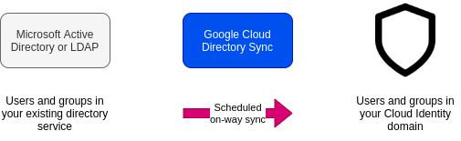
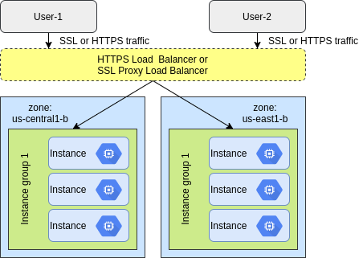
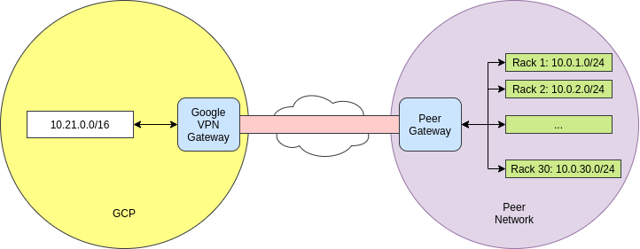

# Foundations of GCP Security

## Google Cloud Platform's approach to security

### Google Cloud Platform's approach to security

**Security at Google**

- Security empowers innovation. If you put security first, everything else will follow.
- Security is paramount at Google.
- Seven apps with more than a billion users are protected from threats everyday.

**Google's technical infrastructure**

- Heavy investment in infrastructure security and privacy.
- Global-scale technical infrastructure for:
    - Secure deployment of services.
    - Secure storage of data.
    - Secure communications between services.
    - Safe operation by administrators.
- Internet services, including Google Cloud Platform, built on this infrastructure.    

**Google's infrastructure security layers**

- Operational Security
- Internet Communication
- Storage Services
- User Identity
- Service Deployment
- Hardware Infrastructure
- **Security is**:
    - Fundamental to Google's infrastructure design.
    - Designed and built in progressive Layers.
    - Delivers true defense in depth.
    
**Secure low level infrastructure**

- State-of-the-art data centers.
- Security of physical premises.
- Hardware design and provenance.
- Secure boot stack and machine identity.
    
**Secure service deployment**

- Service identity, integrity, and isolation.
- Inter-service access management.
- Encryption of inter-service communication.
- Access management of end-user data.    
    
**Secure user identity**

- Authentication.
- Login abuse protection.
   
**Secure data storage**

- Encryption at rest.
- Hardware tracking and disposal.
- Deletion of data. 

**Secure Internet Communication**

- Google Front End (GFE) service.
- Denial of Service (DoS) protection.
- User authentication. 
    
**Operational security**

- Safe software development.
- Keeping employee devices and credentials safe.
- Reducing insider risk.
- Intrusion detection.
    
**GCP is designed for security**

- GCP benefits from running on the secure Google infrastructure:
    - Security is "backed in" to the core infrastructure.
    - Security is not something added on afterwards.
- GCP is technology with security at its code:
    - Google secures and manages the core infrastructure by default.        
    
**VPC network security**

- Google Virtual Private Cloud (VPC) is your GCP virtual private network:
    - Define your resources on a logically isolated network.
    - Control public internet ingress and egress traffic via firewall rules.    
    
**Operational monitoring**

- Logging and monitoring are the cornerstones of app and network security operations.
- Stackdriver enables debugging, monitoring, and diagnostics for apps that run on GCP.    
    
**Regulatory compliance**

- Security in the cloud is much more than encryption and firewalls.
- Often needs data protection and compliance with a variety of regulatory standards for independent third-party
certifications:
    - GDPR
    - PCI-DSS
    - HIPAA
    - FedRamp, etc.    
    
### The Shared Security responsibility Model
    
**Cloud security requires collaboration**

- Google is responsible for managing its infrastructure security.
- You are responsible for securing your data.    
    
**Data access**

- You must control who has access to your data.
- API requests for data are done via a REST service call:
    - Authentication information must be included with requests.    
    
**Security assessments**

- GCP does not require notification to perform penetration testing.
- GCP also provides some security assessment services:
    - Cloud Security Scanner
    - Forseti Security
    
### Threats mitigated by Google and GCP

- The scale of Google's infrastructure helps absorb many attacks.

```
Absorbing the largest attacks requires the bandwidth needed to watch half a million YouTube videos at the same time
... in HD.
```        
    
**Denial of Service (DoS)**

- Dyn DDoS attack: 1 Tb/sec
- Whole Internet: 200 Tb/sec
- SINGLE Google data center: 1300 Tb/sec    
- GCP global HTTP(S) load balancing provides a built-in defense against infrastructure DDoS attacks.
- No additional configuration is required to activate this DDoS defense.    
    
**Cloud Armor**

- Cloud Armor works with Cloud HTTP(S) load balancing.
- Customize defenses for your internet-facing apps.    
    
**Physical Security**

- Data centers are protected with a layered security model.
- All access is tracked and monitored:
    - Access logs, activity records, and camera footage.    
- Limited access:
    - Less than 1% of Googlers will ever enter a data center.    

**Data access security: Data at rest**

- All data at rest is chunked and encrypted automatically.
- Additional options are also available:
    - Customer managed keys (CMEK)
    - Customer supplied keys (CSEK)    
    
**Data access security: Data in transit**

- Google applies different protections to data, depending on:
    - Whether it is transmitted inside a physical boundary where we can ensure that rigorous security measures are
    in place.
    - Whether it is transmitted outside a physical boundary controlled by or on behalf of Google.    
   
**Server and software stack security**

- Homogenous custom-built servers with security in mind:
    - Purpose-built servers and network equipment.
- Stripped-down and hardened cersion of Linux software stack.
    - Continually monitored binary modifications.
- Trusted server boot:
    - Titan security chip.            
    
**CPU/hardware vulnerabilities**

```
Google's infrastructure are robust focus on security also help protect against issues like CPU/hardware
vulnerabilities. For example, in Jenuary 2018, major CPU vulnerabilities were disclosed. Most CPU customers
went about their business with no impact.
```    
    
**Data disposal**

- When data is deleted by customer:
    - The data is no longer accessible by the service.
    - Data is deleted from all Google's systems:
        - In accordance with applicable laws.
        - Within a maximum of 180 days.    
    
### Access Transparency    
  
**Data ownership**

- GCP customers own their own data.
- Google will not process data for any purpose other than to fulfill contractual obligations:
    - Data is not scanned for advertisments or sold to third parties.
- The inability to audit cloud provider access is often a barrier to moving to the cloud.

```
Cloud customers want to know:
"When do you access my data, and how will I know?"
```    
    
**Trust through Access Transparency**

- Standard access logs traditionally do not show access by the cloud provider.
- Google's Access Transparency provides near-real-time oversight over data access by either Google support or
engineering.    
    
**Exporting data**

- Data can also be exported from Google Cloud without penalty.
- Standard egress charges will apply.

**Access Approval API allows you even more control over access to your data**

- Works with Access Transparency to give customers even greater control.
- Allows you to require **explicit** approval for Google support and engineering to access your project's data.
    
**Access Approval quickly alerts you by sending messages when access is required**

- Access Approval is set up on a project level.
- Access request messages sent via email of Pub/Sub.
- Google Cloud Console or Access Approval API used to approve request.    

**Access Approval messages include important details about requested resources**

- Fields in the message include:
    - **Location** of the resource.
    - **Time** the request to access was sent.
    - **How long** access will be granted, if approved.
    - **Office or physical location** of the accessor.
    - **Reason** for the access request.
    - **Status** of the access request.    
    
**Access Approval requests will not be triggered for certain actions**

- These exclusions inculde:
    - System access to user content.
    - Accesses to lower level storage.
    - Manual access for legal reasons.
    - Manual access required to assist in solving an outage.   
    
**Things to keep in mind when using Access Approval API**

- Keep in mind the following:
    - Events that do not generate Access Transparency log entries cannot use Access Approval.
    - Requiring Access Approval may increase support times.    
    
***

## Cloud Identity

### Cloud Identity Overview

**Google Cloud Identity**

- An identity as a Service (IDaaS) solution.
- Used for managing users, groups, and domain-wide security settings:
    - From a central location.
- Tied to a unique DNS domain that is enabled for receiving email.
    
**Cloud Identity editions**

- Free
- Premium    
    
**Google Admin Console**

- Centralized console to manage users, groups, and security settings.    
- Cloud Identity allows free accounts to be created for each user.

**Support for Cloud Identity**

- Cloud Identity can be:
    - Used as a standalone service.
    - Combined with your Google Workspace services.    
    
**If you are a Google Workspace Admin**

- Sign up for Cloud Identity from the **Billing** section of the Google Admin console.
- You can create free Cloud Identity accounts for users who don't need Google Workspace.    
    
**If you are not using Google Workspace**

- Register your domain as a Cloud Identity domain.
- Then use the Google Admin console to configure users and groups.    
   
**Org Admin**

- Organization Administrator IAM role must be assigned to a user or group.
- Organization administrators have central control of all resources.    
    
**If you are a Google Cloud Admin**

- Assign roles to users or groups in Google Cloud IAM:
    - Can use any Google Workspace or Cloud Identity user or group.
    - And any Google accounts and groups (@gmail, @google).     
    
### Google Cloud Directory Sync

**Provisioning users**

- The Admin console allows admins to provision users manually.    
        
**What if you already have a different corporate directory?**

    
    
**How GCDS workd**

- Data is exported from your LDAP server to Active Directory.
- GCDS connects to the Google domain and generates a list of Google uses, groups, and shared contacts that you specify.
- GCDS compares these lists and updates your Google domain to match the data.    
- When the synchronization is complete, a report is emailed.    
  
**Google Cloud Directory Sync (GCDS)**

- One-way synchronization; the data in your directory server is never modified or compromised.    
    
**GCDS runs in your server environment**

- There is no access to your AD/LDAP server outside your perimeter.    
    
**GCDS auto-provisioning and deprovisioning**

- The GCDS auto-provisioning and de-provisioning features reduce possible security risk.   
 
**Managed Service for Microsoft Active Directory allows you to manage your cloud-based, AD-dependent workloads**

- Managed Service for Microsoft Active Directory:
    - Runs actual Microsoft AD controllers.
    - Is vistually maintenance-free.
    - Supports both hybrid cloud and standalone cloud domains.    
    
**Managed Service for Microsoft Active Directory includes many useful features**

- An actual AD domain.
- Familiar tools, such as Group Policy and RSAT.
- Highly available configurations.
- Hardened servers with snapshots and automated patching.
- Flexible, multi-regional deployments.    
    
**Managed Service for Microsoft Active Directory allows you to create the right architecture for your domain**

- Factors to consider are:
    - Alignment with existing security zones.
    - Interaction required between on-premises and Google Cloud resources.
    - Administrative autonomy.
    - Availability requirements.    
    
### Google authentication vs. SAML-based SSO    
    
**User account authentication**

- Two primary ways to handle Google user account authentication.    
  
**User account authentication**

- Google authentication.
- Single Sign-On (SSO) authentication.
    
**Setting up SSO**

- SSO configuration requires 3 links and a certificate.    
    
### Authentication Best Practices    

**Manage Google Cloud permissions with groups**

- Avoid managing permissions for individual users.
- Best to assign Google Cloud roles to groups instead.
  
**Number of Org admins**

- You should have at least two Organization admins, but not many more.
- Remove these permissions to start locking down access at a finer granurality.

**Multiple domains**

- Multiple domains can be associated with your organization's Google account.
- You can add up to 600 domains.   
    
***

## Cloud Identity and Access Management (Cloud IAM)    
   
### Resource Manager

**Identity and Access Management**

```
Who can do wjat on which resource
``` 
   
**GCP Resource Manager**

- Resources in GCP are hierarchically managed by organization, folders, and projects.
- Resource Manager enables you to programmatically manage these resource containers.   
   
**GCP Objects**

- Objects are the various resources members can access and use on GCP.
- Objects hold data and applications, and also help to organize it and secure it.   
   
**IAM objects**

- Organization
- Folders
- Projects
- Resources
- Members
- Roles

**Organization node**

- The organization node:
    - Is the root node for Google Cloud resources.
    - Contains all of your projects and resources.
   
**Folders offer flexible management**

- Folders:
    - Optionally group projects under an Organization.
    - Can contain both projects and other folders.   
- Use folder to assign policies: changes will apply across all the projects and resources.   
   
**Members can be any Google Workspace, or Cloud Identity user or group**

- Gmail accounts and Google Groups.
- Users and groups in your Google Workspace domain.
- Users and groups in your Cloud Identity domain.
- Note: Google Cloud does not create or manage users or groups.   
   
**Member roles are collections of permissions**

- Permissions are given to members by granting roles.
- Roles define which permissions are granted.
- GCP provides predefined roles and also the ability to create custom roles.   
   
**Service accounts**

- Service accounts:
    - Control server-to-server interactions:
        - Used to authenticate from one service to another.
        - Used to control provileges used by resources.   
   
**There are two types of Google Service Accounts**

| Google-managed service accounts | User-managed service accounts |
|---|---|
| All service accounts have Google-managed keys | Google only stores the public portion of a user-managed key |
| Google stores both the public and private portion of the key | Users are responsible for private key security |
| Each public key can be used for signing for a max of two weeks | Can create up to 10 user-managed service accounts keys per service |
| Private keys are never directly accessible | Can be administered via Cloud IAM API, gcloud, or the Console |   
   
**Keeping your User-managed keys safe is vital - and is the creator's responsibility**

```
Remember: Google does not save your user-managed private keys - if you lose them, Google cannot help you recover them.
```   
  
- Use the `gcloud` command-line tool to quickly list all of the keys associated with a Service Account.

```console
$> gcloud iam service-accounts keys list --iam-account user@email.com
```   
  
**Labels in Resource Manager help you organize your Google Cloud instances**

- Team or cost center labels.
- Component labels.
- Environment or stage labels.
- State labels.
- Virtual machine labels.   
   
**Labels in Resource Manager must meet certain requirements**

- No more than 64 labels per resource.
- Must be in the form of a key-value pair.
- Keys cannot be empty and must be between 1-63 characters.
- Values may be empty but cannot exceed 63 characters.
- Keys and values can contain only lowercase letters, numeric characters, underscores, and dashes.
- The key portion of a label must be unique. However, you can use the same key with multiple resources.
- Keys must start with a lowercase letter or international character.   
 
**Many Google products and services currently support the use of labels**   
   
### IAM Roles   
   
**There are three kinds of IAM roles in Google Cloud**

- Basic
- Predefined
- Custom
   
**IAM basic roles are applied at the project level**

`can do what on all resources`   

- Basic roles offer fixed, coarse-grained levels of access.    
  
**Basic roles apply across all Google Cloud services in a project**

- **Owner**:
    - Invite members
    - Remove members
    - Delete projects
    - And...:
        -  **Editor**:
            - Deploy apps
            - Modify code
            - Configure services
            - And...:
                - **Viewer**:
                    - Read-onlt access

**IAM predefined roles**

- Predefined roles are designed to map to job functions: Compute Network Admin, Security Reviewer, etc.

`can do what on Compute Engine resources in this project, or folder, or org`                      
   
**IAM predefined roles offer more fine-grained permissions on particular services**

- **InstanceAdmin Role**:
    - *compute.instances.delete*
    - *compute.instances.get*
    - *compute.instances.list*
    - *compute.instances.setMachineType*
    - *compute.instances.start*
    - *compute.instances.stop*
    - ...
    
**The predefined Browser role**

- This role provides read access to browse the hierarchy for a project, including the organization and folders.     
   
**IAM custom roles**

- IAM custom roles let you define a precise set of permissions:
- **Google Group**:
    - **PrivacyReviewer Role**:
        - *storage.buckets.list*   
        - *storage.objects.list*
        - *storage.objects.get*
        - *spanner.database.get* 
        - *spanner.database.list*
        - *bigtable.tables.get*
        - *bigtable.tables.list*
        - *bigtable.tables.readRows*
        - ...                 

### IAM Policies   

**GCP IAM policies**

- A policy consists of a list of bindings.
- A binding binds a list of members to a role.

**IAM resource hierarchy**

- Organization
- Folder
- Projects
- Resources

**Organization policies**

- An organization policy is:
    - A configuration of restrictions.
    - Defined by configuring a constraint with desired restrictions.
    - Applied to the organization node, folders or projects.
   
**Constraints**

- A constraint is a type of restriction against a GCP service. Examples:
    - Disable VM serial port access.
    - Disable service account creation.
    - Disable VM nested virtualization.
    - Define trusted image projects.   
   
### IAM recommender

**Recommender helps hone permissions for Cloud IAM and other Google Cloud services**

- Recommender compares project-level role grants with permissions used within the last 90 days.
- If a permission has not been used within that time, recommender will suggest revoking it.
- You have to review and apply recommendations; they will not be applied automatically.
   
**Recommender gives you three types of recommendations**

- Revoke an existing role.
- Replace an existing role.
- Add permissions to an existing role.   
   
**The easiest way to review and apply recommendations is to use Cloud Console**

- View existing roles by visiting the IAM page.
- Look for the "over-granted permissions" column.
- If there are recommendations, you will see a **Recommendation available** icon.
- Click the **Recommendation available** icon for details.
- Choose to "apply" or to "dismiss" a recommendation.
- You can revert your choice within 90 days.   
   
**Use caution when applying any recommendations to revoke basic roles**

- Keep the following requirements in mind when revoking basic role:
    - One person **must** have the Owner role.
    - No Owner roles means no one can manage projects.
    - If you revoke a basic role, check access controls.   
   
### IAM Troubleshooter

**Policy Troubleshooter exposes access policies that apply to a particular resource**

- Policy Troubleshooter:
    - Requires a member email, a resource name, and a permission to check.
    - Examines all IAM policies that apply to that resource.
    - Reports on whether that member's roles include that permission to that resource.
    - Reports on which policies bind that member to those roles.   
   
**Policy Troubleshooter will only access policies that the iser has permissions to view**

- Policy Troubleshooter may not always fully explain resource access.
- If you do not have access to a resource policy, it will not be analyzed.
- Maximum effectiveness requires the Security Reviewer **(roles/iam.securityReviewer)** role.   
  
**Policy Troubleshooter can be accessed via the Cloud Console, `gcloud`, or REST API**

- For simple queries, the Cloud Console is usually the best option.
- For more complicated scenarion, try the `gcloud` command-line tool or the Policy Troubleshooter REST API.   
   
### IAM Audit Logs   
   
**Cloud Audit Logs maintains theree logs for each project, folder and organization**

- Admin activity audit logs.
- Data access audit logs.
- System event audit logs.  
   
**Admin activity audit logs record API calls that modify your resources**

- Created when administrative actions modify configurations or metadata.
- Logs are always written and cannot be disabled.
- Must have Cloud IAM role Logging/Logs Viewer or Project/Viewer.
   
**Data access audit logs record read, modify, or create activity on your resource metadata or user-provided data**

- Record changes to private cloud resources.
- Do not record changes to publicly shared assets.
- Not enabled by default because they can grow quite large.   
   
**System event audit logs record activity that modifies the configuration of your resources**

- Driven by Google system events.
- Not triggered by user interaction.
- Always written and cannot be disabled.   
   
**You have several options for viewing Audit Logs on Google Cloud**

- Basic log viewer.
- Advanced log viewer.
- **gcloud** command-line tool.
- Audit Logs API.
   
### IAM Best Practices

**IAM best practices**

- Adhere to the Principle of Least Privilege, which means you should always apply only the minimal access level 
required to get the job done.   
- Use groups when configuring Google Cloud access.
- Assign roles to the groups instead of individual users.
- Utilize predefined roles offers less administrative overhead.
- Predefined roles are managed by Google.
- Custom roles are **not** maintained by Google.
- Audit logs record project-level permission changes.
- Audit policy changes.
- Export audit logs to Cloud Storage to store your logs for long periods of time.   
  
***

## Manage Security in Google Cloud Platform

### VPC Firewalls   
   
**Virtual Private Cloud (VPC)**

**Firewall rules protect VM instances from unapproved connections**

**Firewall rules can be applied to**

- All instances in the network.
- Instances with a specific target tag.
- Instances using a specific service account.  
  
**Firewall rules are stateful**

**Firewall Rules**

| Parameter | Detail |
|---|---|
| direction | Ingress or egress |
| source or destination | The source parameter is only applicable to ingress rules. 
| | The destination parameter is only applicable to egress rules |
| protocol and port | Rules can be restricted to apply to specific protocols only, or combinations of protocols and ports only |
| action | Allow or deny |
| priority | 0-65535. The order in which rules are evaluated; the first matching rule is applied |
   
**All VPCs have 2 implied firewall rules**

- **1. Allow all outgoing traffic:**
    - An egress rule, action is allow, destination is 0.0.0.0/0, and lowest priority (65535).
- **2. Block all incoming traffic:**
    - An ingress rule, action is deny, source is 0.0.0.0/0, and lowest priority (65535).
   
**Default VPCs have additional allow rules**

- `default-allow-internal`: Allow in-bound connections between VM instances in the same network.
- `default-allow-ssh`
- `default-allow-rdp`: Remote desktop protocol.
- `default-allow-icmp`
- **All with the second lowest priority (65534)**
- **These rules should be deleted or modified as needed**
   
**Some VPC network traffic is always blocked**

- There is some traffic that is always blocked.
- Firewall rules cannot be used to un-block this traffic.   

**Always blacked traffic**

- GRE traffic:
    - All sources, all destinations, including among instances using internal IP address, unless explicitly allowed
    through protocol forwarding.
- Protocols other than TCP, UDP, ICMP, ESP, AH, SCTP, and IPIP:
    - Traffic between:
        - Instances and the internet
        - Instances if they are addressed with external IP address.
        - Instances if a load balancer with an external IP address is involved.
- Egress traffic on TCP port 25 (SMTP):
    - Traffic from:
        - Instances to the internet.
        - Instances to other instances addressed by external IP address.
- Egress traffic on TCP port 465 or 587 (SMTP over SSL/TLS):
    - Traffic from:
        - Instances to the internet, except for traffic destined for known Google SMTP servers.
        - Instances to other instances addressed by external IP address.                

**Firewall rule best practices**

- **1. Use the model of the least privilege.**
- **2. Minimize direct exposure to/from the internet.**
- **3. Prevent ports and protocols from being exposed unnecessarily.**   
- **4. Develop a standard naming convention for firewall rules:**
    - For example:
        - `{direction}-{allow/dent}-{service}-{to-from-location}`
        - `ingress-allow-ssh-from-onprem`
        - `egress-allow-all-to-gcevms`
- **5. Consider service account firewall rules instead of tag-based rules.**

**Hierarchical firewall policies**

```
Let you create and enforce a consistent firewall policy across your organization.
Assign to organization as a whole or to individual folders.
Can delegate evaluation to lower-level policies or VPC network firewall rules.
Lower-level rules can't override a role from a higher place in the resource hierarchy.
By default apply to all VMs and all projects under the organization or folder where the policy is associated.
```
 
### Load balancing SSL policies

**GCP load balancers**

    

**Defining an SSL policy**

- SSL policies specify:
    - The minimum TLS version clients can connect with: TLS 1.0, 1.0, or 1.2
    - A profile of SSL policy features.
 
**Pre-configured SSL policy profiles**

- GCP offers three managed SSL profiles.
- **1. COMPATIBLE**
    - Allows the broadest set of clients.
- **2. MODERN**
    - Supports a wide set of SSL/TLS features, allowing modern clients to negotiate SSL/TLS.  
- **3. RESTRICTED**
    - Supports a reduces set of SSL/TLS features, intended to meet stricter compliance requirements.  
  
**Custom SSL policy profiles**

- Allow SSL features to be individually specified; you can specify the exact SSL features required.  
 
### Interconnect and peering options  
  
**VPC peering**

- Can connect two nonoverlapping VPC networks.  
- Networks do not need to be in the same project.
- A network can have multiple peers.

**VPC peering**

- Once networks have peered, every internal private IP is accessible across the peered networks.
- VPC network peering gives you several advantages over using external IP addresses or VPNs to connect to networks:
    - Decrease network latency.
    - Increased network security.
    - Lower network cost.
  
**Shared VPCs**

- Make a VPC network shareable across several projects in your organization.
- Require a Host project.  
  
**Connecting to Google**

- Cloud VPN.
- Cloud Interconnect. 
  
**Cloud VPN**

- Securely connects your on-premises network to your GCP VPC network.
- Supports site-to-site VPN.
  
     
 
**VPN with static routes**

- With static routing, updating the tunnel requires:
    - The addition of static routes to GCP.
    - Restarting the VPN tunnel to include the new subnet. 
  
**Dynamic routing with Cloud Router**

- A Cloud Router enables you to dynamically exchange routes between your VPC network an on-premise network by using
Border Gateway Protocol or BGP.
- Changes to the network topology would no longer have to be managed through static routes.
- New subnets added to GCP or added to on-prem network are discovered and shared, enabling connectivity between the 
two peers for the entire network.
  
**Cloud Interconnect**

- Offers two options for connecting on-premises network to GCP:
    - Dedicated Interconnect.
    - Partner Interconnect.  
  
**Dedicated Interconnect**

- Provides direct physical connections between your on-premises network and your VPC network. 
  
**Partner Interconnect**

- Provides connectivity between your on-premises network and GCP VPC networks through a supported service provider.

**Cloud Interconnect features**

| Dedicated Interconnect | Partner Interconnect |
|---|---|
| Minimum bandwidth of 10 Gbps | Minimum bandwidth of 50 Mbps |

**Cloud Interconnect setup**

| Dedicated Interconnect | Partner Interconnect |
|---|---|
| Requires routing equipment in a colocation facility that supports the region that you want to connect to. | Use any supported service provider to connect to Google. |
| Traffic flows directly between networks, not through the public internet. | Traffic flows through a service provider, not through the public internet. |

**Cloud Interconnect SLA**

- Dedicated Interconnect:
    - Google provides an end-to-end SLA for the connection.
- Partner Interconnect:
    - Google provides an SLA for the connection between Google and service provider. An end-to-end SLA for the connection depends
    on the service provider.    

### Best Practices for VPN Networks

**VPC network best practices**

- Don't use the default network for a production project.
- Place Compute Engine resources that require network communication on the same VPC network.
- Use cloud load balancing with SSL policies in front of web servers.

**Private Google API access**

- Allows Compute Engine instances without an external IP address to reach Google APIs and services.
- API call is still resolved to a public IP address, but the traffic is all internal and private.

**Private Google API access**

- Is enabled/disabled on VPC subnets.
    - Disabled by default.
- Subnet must still have a route to the default-internet-gateway set.    

**VPC Service Controls helps mitigate many security risks without sacrificing performance**

- Unauthorized access using stolen credentials.
- Data exfiltration and compromised code.
- Public exposure of private data.

**Prevent access to your Google-managed services outside of a trusted perimeter**

**Extend communication from your cloud resources to an on-premises environment**

**Restrict access to your resources from the Internet by creating custom attribute-based access levels**

**VPC Service Controls can be configured using any of three Google Cloud tools**

- Cloud Console.
- `gcloud` command-line tool.
- Access Context Manager APIs.

**Access Context Manager defines fine-grained attribute based controls for projects and resources**

**Access Context Manager reduces the size of your privileged network using defined access attributes**

- Access Policies.
- Access Levels:
    - IP address.
    - Device type.
    - User identity.

**Service Perimeter configuration takes place in four stages**

- Create an access policy.
- Secure your resources with service perimeters.
- Set up private connectivity from a VPC network.
- Grant access from outside using access levels.

**VPC Service Controls can also allow communication between two perimeters using a service perimeter bridge**

### VPC flow logs

- Record network flows sent from or received by VM instances.
- Use for network monitoring, forensics, real-time security analysis, and expense optimization.
- View in Stackdriver Logging.
- Export logs to Cloud Pub/Sub, BigQuery, etc.

**VPC Flow Logs**

- Is enabled on VPC subnets.
    - Disabled by default.
- No performance penalty.


  
  
  
  
  
    
    
    