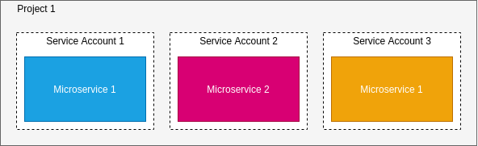
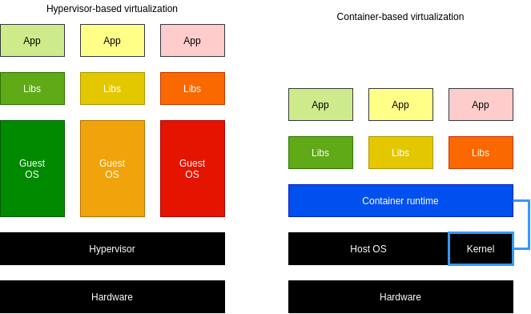

# Google Cloud.

## Core Infrastructure.

### What is Cloud Computing?

- **On-demand self-service**: No human intervention needed to get resources.
- **Broad network access**: Access from anywhere.
- **Resource pooling**: Provider shares resources to customers.
- **Rapid elasticity**: Get more resources quickly as needed.
- **Measured service**: Pay only for what you consume.

### Before cloud.

- **Physical/Collocation**:
    - Storage, Processing, Memory, Network.
    - User-configured, managed and maintained.
- **Virtualized**: 
    - Storage, Processing, Memory, Network.
    - User-configured Provider-manages and maintained.
- **Serverless**: 
    - Fully automated.

### GCP computing architectures.

- Virtualized data centers brought you infrastructure as a Service (IaaS), Platform as a Service (PaaS) offerings.


### The Google network.

- 100,000s of km of fiber cable, 8 sub-sea cables.

### GCP regions and zones.

**Google Cloud Platform organized into regions and zones.**

- A zone is a deployment area for Google Cloud Platform Resources.
- Zones grouped into regions, independent geographic areas, and you can choose what region your GCP resources are in.
- All the zones within a region have fast network connectivity among them.
- Locations within regions usually have round trip network latency of under 5 milliseconds.
- Think of a zone as a single failure domain within a region. 
- As part of building a fault-tolerant application, you can spread their resources across multiple zones in a region.


### Pricing.

- **Billing in sub-hour increments**: For compute, data processing and services.
- **Discounts for sustained use**: Automatically applied to virtual machine use over 25% of a month.
- **Discounts for committed use**: Pay less for steady, long-term workloads.
- **Discounts for preemptible use**: Pay less for interruptible workloads.
- **Custom VM instance types**: Pay only for the resources you need for your application.

### Open APIs.

- Open APIs and open source mean customers can leave.
- Open APIs, capability with open-source services:
    - Cloud Bigtable.
    - Cloud Dataproc.
- Open source for a rich ecosystem:
    - TensorFlow.
    - Kubernetes.
    - Forseti Security.
- Multi-vendor-friendly technologies:
    - Google Stackdrive.
    - Kubernetes Engine.       

### Why choose GCP?

**Why choose Google Cloud Platform?**

```
Google Cloud Platform enables developers to build, test, and deploy apps on Google's highly secure, reliable,
and scalable infrastructure.
```

**Google Cloud Platform offers a range of compute services, storage services, data services.**

- **GCP compute services**:
    - Compute Engine.
    - Kubernetes Engine.
    - App Engine.
    - Cloud Functions.
- **GCP storage services**:
    - Bigtable.
    - Cloud Storage.
    - Cloud SQL.
    - Cloud Spanner.
    - Cloud Datastore.
- **GCP Big Data services**:
    - Big Query.
    - Pub/Sub.
    - Data flow.
    - Data proc.
    - Data lab.
- **GCP Machine Learning services**:
    - Natural Language API.
    - Vision API.
    - Machine Learning.
    - Speech API.
    - Translate API.

### Multi-layered security approach.

**Google technical infrastructure.**

| Layer.                   | Security measures.                                                                   |
|--------------------------|--------------------------------------------------------------------------------------|
| Operational security.    | Intrusion detection; reduce insider risks; employee U2F use; software dev practices. |
| Internet communication.  | Google Front End; designed-in Denial of Service protection.                          |
| Storage services.        | Encryption at rest.                                                                  |
| User identity.           | Central identity service with support for U2F.                                       |
| Service deployment.      | Encryption of inter-service communication.                                           |
| Hardware infrastructure. | Hardware design and provenance; secure boot stack; premises security.                |

### Budgets and Billing.

- Budgets and alerts keep billing under control.
- Billing export allows you to store detailed billing information.
- Reports is a visual tool to monitor expenditure.
- Quotas limits:
    - **Rate quota**: 
        - GKE API: 1,000 requests per 100 seconds. 
        - Resets after specific time.
    - **Allocation quota**: 
        - 5 networks per project.
- Many quotas are changeable.

#### Quiz.

**1. Fundamental characteristics of cloud computing.**

- Resources are available from anywhere over the network.
- Computing resources available on-demand and self-service.
- Customers can scale their resource use up and down.
- Customers pay only for what they use or reserve.

**2. Fundamental characteristic of devices in a virtualized data center.**

- They are manageable separately from the underlying hardware.

**3. What type of cloud computing service lets you bind your application code to libraries that give access to the 
 infrastructure your application needs?**
 
- Platform as a Service (PaaS).

**4. What type of cloud computing service provides raw compute, storage, and network, organized in ways that are familiar 
from physical data centers?**

- Infrastructure as a Service (IaaS).

**5. Which statement is true about the zones within a region?**

- The zones within a region have fast network connectivity among them.

**6. What kind of customer benefits most from billing by the second for cloud resources such as virtual machines?**

- Customers who create and run many virtual machines.

***

## Google Cloud Platform.

**Cloud security requires collaboration.**

- Google is responsible for managing its infrastructure security.
- You are responsible for securing your data.
- Google helps with best practices, templates, products and solutions.
- Upper layers are Customers responsibility.

| Responsibilities.         | IaaS (Compute Engine). | Paas (App Engine). | Manages services. |
|---------------------------|------------------------|--------------------|-------------------|
| Content                   | Customer               | Customer           | Customer          |
| Access Policies           | Customer               | Customer           | Customer          |
| Usage                     | Customer               | Customer           | Customer          |
| Deployment                | Customer               | Customer           | Google            |
| Web app Security          | C                      | C                  | G                 |
| Identity                  | C                      | G                  | G                 |
| Operations                | G                      | G                  | G                 |
| Access and authentication | G                      | G                  | G                 |
| Network security          | G                      | G                  | G                 |
| OS, data, and content     | G                      | G                  | G                 |
| Audit logging             | G                      | G                  | G                 |
| Storage and encryption    | G                      | G                  | G                 |
| Hardware                  | G                      | G                  | G                 |

### The GCP resource hierarchy.

**Resource hierarchy levels define trust boundaries.**

- Group your resources according to your organization structure.
- Levels of the hierarchy provide trust boundaries and resource isolation.
- Policies inherited downwards in a hierarchy.


**All GCP services you use associated with a project.**

- Track resource and quota usage.
- Enable billing.
- Manage permissions and credentials.
- Enable services and APIs.
- Each project is a separate compartment and each resource belongs to exactly one.
- Projects can have different owners and users.

**Projects have three identifying attributes.**

| Attribute.      |                        |                  |            |
|-----------------|------------------------|------------------|------------|
| Project ID.     | Globally unique.       | Chosen by you.   | Immutable. |
| Project name.   | Need not to be unique. | Chosen by you.   | Mutable.   |
| Project number. | Globally unique.       | Assigned by GCP. | Immutable. |

**Folders offer flexible management.**

- Folders group projects under an organization.
- Folders can contain projects, other folders, or both.
- Use folders to assign policies.


- The resource in a folder inherit IAM policies from the folder.
- To use folders you need an organization node at the top of the hierarchy.

**The organization node organizes projects.**


- **Notable organization roles**:
    - Organization Policy Administrator: Broad controls over all cloud resources.
    - Project Creator: Fine-grained control of project creation.
- Once you have organization node you can create folders underneath it and put it in projects.    

**An example IAM resource hierarchy.**

- A policy set on a resource.
    - Each policy contains a set of roles and role members.
- Resources inherit policies from a parent.
    - Resource policies are a union of parent and resource.
- **A less restrictive parent policy overrides a more restrictive resource policy.**

#### Quiz

**1. Services and APIs are enabled on a per-Project basis.**

**2. True or false: Google manages every aspect of Google Cloud Platform customers' security.**

- False.

**3. Your company has two GCP projects, and you want them to share policies. What is the less error-prone way to set this up?**

- Place both projects into a folder, and define the policies on the folder.

***

## Identity and Access Management (IAM).

**Google Cloud Identity and Access Management defines...**

- **Who** can do **what** on **which** resource.

**IAM policies can apply to any of four types of principals.**

- **Who:**
    - Google account or Cloud Identity user: `test@gmail.com`.
    - Service account: `test@project_id.iam.gserviceaccount.com`.
    - Google group: `test@googlegroups.com`.
    - Cloud Identity or G Suite domain: `example.com`.
    
**Three types of IAM roles.**

- Primitive.
- Predefined.
- Custom.

**IAM primitive roles apply across all GCP services in a project.**

- **can do what**: **on all resources**.
- Owner, Editor, Viewer roles.

**IAM primitive roles offer fixed, coarse-grained levels of access**

| Owner.          | Editor.             | Viewer.          | Billing administrator.        |
|-----------------|---------------------|------------------|-------------------------------|
| Invite members  | Deploy applications | Read-only access | Manage Billing                |
| Remove members  | Modify code         |                  | Add and remove administrators |
| Delete projects | Configure services  |                  |                               |
| And -->         | And -->             |                  |                               |

- A project can have multiple owners, editors, viewers, and billing administrators.

**IAM predefined roles apply to a particular GCP service in a project.**

- **can do what**: On Compute Engine resources in this project, or folder, or org.

**IAM predefined roles offer more find-grained permissions on particular services.**

- Google Group, on **project_a**, **InstanceAdmin** role:
    - `compute.instance.delete`.
    - `compute.instance.get`.
    - `compute.instance.list`.
    - `compute.instance.setMachineType`.
    - `compute.instance.start`.
    - `compute.instance.stop`.
    
**IAM custom roles let you define a precise set of permissions.**    
    
- Google Group, on **project_a**, **InstanceOperator** role:
    - `compute.instance.get`.
    - `compute.instance.list`.
    - `compute.instance.start`.
    - `compute.instance.stop`.
- Custom roles can only be used at the project or organization levels. 
- They can't be used at folder level.

**Service Accounts control server-to-server interactions.**

- Provide an identity for carrying out **server-to-server** interactions in a project.
- Used to **authenticate** from one service to another.
- Used to **control privileges** used by resources:
    - So that apps can perform actions on behalf of authenticated end users.
- Identity with an **email** address:
    - `PROJECT_NUMBER-compute@developer.gserviceaccount.com`.
    - `PROJECT_ID@appspot.gserviceaccount.com`.

**Service Accounts and IAM.**

- Service accounts authenticate using keys:
    - Google manages keys for Compute Engine and App Engine.
- You can assign a predefined or custom IAM role to the service account.    


**Example: Service Accounts and IAM.**

- VMs running **component_1** are granted **Editor** access to **project_b** using **Service Account 1**.
- VMs running **component_2** are granted **objectViewer** access to **bucket_1** using **Service Account 2**.
- Service account permissions can be changed without recreating VMs.

#### Quiz.

**1. When would you choose to have an organization node?**

- When you want to create folders.
- When you want to apply organization-wide policies centrally.

**2. Order these IAM role types from broadest to finest-grained.**

- Primitive roles.
- Predefined roles.
- Custom roles.

**3. Can IAM policies that are implemented higher in the resource hierarchy take away access that is granted by 
lower-level policies?**

- No.

### Interacting with Google Cloud Platform.

**There are four ways to interact with GCP.**

- **Cloud Platform Console**: Web-based administrative user interface.
- **Cloud Shell and Cloud SDK**: Command-line interface.
- **Cloud Console Mobile App**: For iOS and Android.
- **REST-based API**: For custom applications.

**Cloud Platform Console.**

- Manage and create projects.
- Access to Google Cloud Platform APIs.
- Offers access to Cloud Shell:
    - A temporary virtual machine with Google Cloud SDK preinstalled.

**Google Cloud SDK.**

- Includes command-line tools for Cloud Platform products and services:
    - `gcloud`: Main command line interface for GCP products and services.
    - `gsutil`: Cloud Storage.
    - `bq`: BigQuery.
- Available via Cloud Shell.
- Available as docker image.

**RESTful APIs.**

- Programmatic access to products and services:
    - Typically, use JSON as an interchange format.
    - Use OAuth 2.0 for authentication and authorization.
- Enable through the Google Cloud Platform Console.
- Most APIs include daily quotas and rates (limits) that can be raised by request.
    - Important to plan ahead to manage your required capacity.    

**Use API Explorer to help you write code.**

- API Explorer is an interactive tool that lets you easily try Google APIs using a browser.
- With the API Explorer:
    - Browse through available APIs and versions.
    - See methods available for each API and what parameters they support along with inline documentation.
    - Execute requests and see responses in real time.
    - Easily make authenticated and authorized API calls.

**Client libraries to control GCP resources from within your code.**

- Cloud Client Libraries: 
    - Community-owned, hand-crafted client libraries.
- Google API Client Libraries:
    - Open source, generated.
    - Support various languages:
        - Java, Python, JS, PHP, .NET, Go, Node.js, Ruby, Objective-C, Dart.

**Cloud Console Mobile App.**

- Manage a VM and database instances.
- Manage apps in Google App Engine.
- Manage billing.
- Virtualize projects with a customizable dashboard.

### Cloud Launcher gives quick access to solutions.

- A solution marketplace containing pre-packaged, ready-to-deploy solutions:
    - Offered by Google.
    - Others by third-party vendors.

#### Quiz.

**1. True or False: In Google Cloud IAM: if a policy applied at the project level gives you Owners permissions, 
your access to an individual resource in that project might be restricted to View permission if someone applies a more 
restrictive policy directly to that resource.**

- False.

**2. True or False: All Google Cloud Platform resources associated with a project.**

- True.

**3. Service accounts are used to provide which of the following?**

- Authentication between Google Cloud Platform services.
- A way to restrict the actions a resource (such as a VM) can perform.
- A way to allow users to act with service account permissions.

**4. How do GCP customers and Google Cloud Platform divide responsibility for security?**

- Google takes care of the lower parts of the stack, and customers are responsible for the higher parts.

**5. Which of these values is globally unique, permanent, and unchangeable, but chosen by the customer?**

- Project ID.

**6. Consider a single hierarchy of GCP resources. Which of these situations is possible?**

- There is an organization node, and there are no folders.
- There is an organization node, and there is at least one folder.
- There is no organization node, and there are no folders.

**7. What is the difference between IAM primitive roles and IAM predefined roles?**

- Primitive roles affect all resources in a GCP project. 
- Predefined roles apply to a particular service in a project.

**8. Which statement is true about billing for solutions deployed using Cloud Marketplace 
(formerly known as Cloud Launcher)?**

- You pay only for the underlying GCP resources you use, with the possible addition of extra fees for commercially 
licensed software.

***

## Compute Engine.

### Virtual Private Cloud (VPC) Network.

**Virtual Private Cloud Networking.**

- Each VPC network contained in a GCP project.
- You can provision Cloud Platform resources, connect them to each other, and isolate them from one another.

**Google Cloud VPC networks are global; subnets are regional.**

- Resilient.
- Simple network layout.


#### Quiz.

**1. True or false? In Google Cloud VPCs, subnets have regional scope.**

- True.

**2. True or false: If you increase the size of a subnet in a custom VPC network, the IP addresses of virtual machines 
already on that subnet might be affected.**

- False.

### Compute Engine.

**Compute Engine offers managed virtual machines.**

- No upfront investment.
- Fast and consistent performance.
- Create VMs with GCP Console or `gcloud`.
- Run images of Linux or Windows Server.
- Pick memory and CPU, use predefined types, or make a custom VM.
- Pick GPUs if you need them.
- Pick persistent disks: standard or SSD.
- Pick local SSD for scratch space too if you need it.
- Pick a boot image, Linux or Windows Server.
- Define a startup script if you like.
- Take disk snapshots as backups or as migration tools.

**Compute Engine offers innovative pricing.**

- Per-second billing, sustained use discounts.
- Preemptilbe instances:
    - You've given compute engine permission to terminate it if it's resources needed elsewhere.
- High throughput to storage at no extra cost.
- Custom machine types: Only pay for the hardware you need.

**Scale up or scale out with Compute Engine.**

- Use big VMs for memory-and-compute-intensive applications.
- Use Autoscaling for resilient, scalable apps.

#### Quiz.

**1. True or false: You can create Compute Engine virtual machines from the command line.**

- True.

**2. True or false: You can create Compute Engine virtual machines from the command line.**

- To reduce cost. The per-hour price of preemptible VMs incorporates a substantial discount.

### Important VPC capabilities.

- VPCs have routing tables. 
- These are used to forward traffic from one instance to another instance within the same network. 
- Even across subnetworks and even between GCP zones without requiring an external IP address.

**You control the topology of your VPC network.**

- Use its route table to forward traffic within the network, even across subnets.
- Use its firewall to control what network traffic allowed.
    - Tagging FW rules example: Traffic at port 80 or 443 is allowed into all VMs with the "web" tag.
- Use Shared VPC to share a network, or individual subnets, with other GCP projects.
- Use VPC Peering to interconnect networks in GCP projects.

**With global Cloud Load Balancing, your application presents a single front-end to the world.**

- Users get a single, global any cast IP address.
- Traffic goes over the Google backbone from the closest point-of-presence to the user.
- Backends selected based on load.
- Only healthy backends receive traffic.
- No pre-warming is required.

**Google VPC offers a suite of load-balancing options.**

- **Global HTTP(S)**:
    - Layer 7 load balancing based on load.
    - Can route different URLs to different back ends.
- **Global SSL Proxy**:
    - Layer 4 load balancing of non-HTTPS SSL traffic based load.
    - Supported on specific port numbers.
- **Global TCP Proxy**:
    - Layer 4 load balancing of non-SSL TCP traffic.
    - Supported on specific port numbers.
- **Regional**:
    - Load balancing of any traffic (TCP, UDP).
    - Supported on any port number.
- **Regional internal**:
    - Load balancing of traffic inside a VPC.
    - Use for the internal tiers of multi-tier apps.                

**Cloud DNS is highly available and scalable.**

- DNS is what translates internet host names to addresses.
- Create managed zones, then add, edit, delete DNS records.
- Programmatically manage zones and records using RESTful API or command-line interface.

**Cloud CDN (Content Delivery Network).**

- Use Google's globally distributed edge caches to cache content close to your users.
- Or use CDN Interconnect if you'd prefer to use a different CDN.

**Google Cloud Platform offers many interconnect options.**

- **VPN**: 
    - Secure multi-Gbps connection over VPN tunnels. 
    - Cloud Router.
- **Direct Peering**: Private connection between you and Google for your hybrid cloud workloads.
- **Carrier Peering**: Connection through the largest partner network of service providers.
- **Dedicated Interconnect**: Connect `n x 10G` transport circuits for private cloud traffic to Google Cloud at Google POPs.

#### Quiz.

**1. True or False: Google Cloud Load Balancing allows you to balance HTTP-based traffic across multiple Compute Engine regions.**

- True.

**2. Which statement is true about Google VPC networks and subnets?**

- Networks are global; subnets are regional.

**3. An application running in a Compute Engine virtual machine needs high-performance scratch space. 
Which type of storage meets this need?**

- Local SSD.

**4. Choose an application that would be suitable for running in a Preemptible VM.**

- A batch job that can be checkpointed and restarted.

**5. How do Compute Engine customers choose between big VMs and many VMs?**

- Use big VMs for in-memory databases and CPU-intensive analytics; use many VMs for fault tolerance and elasticity.

**6. How do VPC routers and firewalls work?**

- They are managed by Google as a built-in feature.

**7. A GCP customer wants to load-balance traffic among the back-end VMs that form part of a multi-tier application. 
Which load-balancing option should this customer choose?**

- The regional internal load balancer.

**8. For which of these interconnect options is a Service Level Agreement available?**

- Dedicated Interconnect.

***

## Storage in the Cloud.

### Cloud Storage.

**Cloud Storage is binary large-object storage.**

- High performance, internet-scale.
- Simple administration:
    - Does not require capacity management.
- Data encryption at rest.
- Data encryption in transit by default from Google to endpoint.    
- Online and offline import services are available.

**Cloud Storage files organized into buckets.**

| Bucket attributes.                   | Bucket contents.            |
|--------------------------------------|-----------------------------|
| Globally unique name                 | Files (in a flat namespace) |
| Storage class                        |                             |
| Location (region or multi-region)    |                             |
| IAM policies or Access Control Lists | Access Control Lists        |
| Object versioning setting            |                             |
| Object lifecycle management rules    |                             |

- Cloud Storage is object storage rather than file storage. 
- Compute Engine virtual machines use Persistent Disk storage to contain their file systems. 

**Choosing among Cloud Storage classes.**

- Storage Classes:
    - Multi-regional.
    - Regional.
    - Nearline.
    - Coldline.


- Regional storage lets you store your data in a specific GCP region: US Central One, Europe West or Asia One.
    - It is cheaper than Multi-regional storage, but it offers less redundancy. 
    - Store data close to their Compute Engine VMs, or their Kubernetes engine clusters.
- Multi-regional cost a bit more, but it's Geo-redundant. 
    - Appropriate for storing frequently accessed data. 
    - For example, website content, interactive workloads, or data that's part of mobile and gaming apps.
- Nearline for storing infrequently accessed data. 
    - Good for a scenario where you plan to read or modify your data once a month or less on average.
- Coldline storage is a very low cost, highly durable service for data archiving, online backup, and disaster recovery.
    - Access at most once a year.
- Multi-regional: Storage price; Price Per GB stored per month highest.
- Multi-regional: Retrieval price; Total price per GB transferred lowest.

**There are several ways to bring data into Cloud Storage.**

- **Online transfer**: Self-managed copies using command-line tools or drag-and-drop.
- **Storage Transfer Service**: Scheduled, managed batch transfers.
- **Transfer Appliance (Beta)**: Rackable appliances to securely ship your data.

**Cloud Storage works with other GCP services.**


- BigQuery: Import and export tables.
- App Engine: Object storage, logs, and Datastore backups.
- Compute Engine: Startup scripts, images, and general object storage.
- Cloud SQL: Import and export tables.

#### Quiz.

**1. Your Cloud Storage objects live in buckets. Which of these characteristics do you define on a per-bucket basis?**

- A default storage class.
- A globally-unique name.
- A geographic location.

**2. True or false: Cloud Storage is well suited to providing the root file system of a Linux virtual machine.**

- False.

**3. Why would a customer consider the Coldline storage class?**

- To save money on storing infrequently accessed data.

### Cloud Bigtable.

**Cloud Bigtable is managed NoSQL.**

- A fully managed NoSQL, wide-column database service for terabyte applications.
- Accessed using HBase API.
- Native compatibility with big data, Hadoop ecosystems.

**Why choose Cloud Bigtable?**

- Manages, scalable storage.
- Data encryption in-flight and at rest.
- Control access with IAM.
- Bigtable drives major applications such as Google Analytics and Gmail.

**Bigtable Access Patterns.**

- Application API: Managed VMs, HBase REST Server, Java Server using HBase client.
- Streaming: Written event by event, Cloud Dataflow Streaming, Spark Streaming, Storm.
- Batch Processing: Hadoop MapReduce, Dataflow, Spark.

#### Quiz.

**1. Each table in NoSQL databases such as Cloud Bigtable has a single schema that is enforced by the database engine itself.**

- False.

**2. Some developers think of Cloud Bigtable as a persistent hashtable. What does that mean?**

- Each item in the database can be sparsely populated, and is looked up with a single key.

### Cloud SQL and Cloud Spanner.

**Cloud SQL is a managed RDBMS.**

- Offers MySQL and PostgreSQLBeta databases as a service.
- Automatic replication.
- Managed backups.
- Vertical scaling (read and write).
- Horizontal scaling (read).
- Google security (network firewalls, encrypted data, backups).

**Cloud SQL + App Engine.**

- Cloud SQL can be used with App Engine using standard drivers.
- You can configure a Cloud SQL instance to follow an App Engine application.

**Cloud SQL + Compute Engine.**

- Compute Engine instances can be authorized to access Cloud SQL instances using an external IP address.
- Cloud SQL instances can be configured with a preferred zone.

**Cloud SQL + External Service.**

- Cloud SQL can be used with external applications and clients.
- Standard tools can be used to administer database.
- External read replicas can be configured.

**Cloud Spanner is a horizontally scalable RDBMS.**

- Strong global consistency.
- Managed instances with high availability.
- SQL queries:
    - ANSI 2011 with extensions.
- Automatic replication.    
- Cloud Spanner offers transactional consistency at global scale.
- Financial/Inventory applications.

#### Quiz.

**1. Which database service can scale to higher database sizes?**

- Cloud Spanner.

**2. Which database service presents a MySQL or PostgreSQL interface to clients?**

- Cloud SQL.

**3. Which database service offers transactional consistency at global scale?**

- Cloud Spanner.

### Cloud Datastore.

**Cloud Datastore is a horizontally scalable NoSQL DB.**

- Designed for apps backends.
- Supports transactions.
- Includes a free daily quota.

#### Quiz.

**1. How are Cloud Datastore and Cloud Bigtable alike?**

- They are both NoSQL databases.
- They are both highly scalable.

**2. Cloud Datastore databases can span App Engine and Compute Engine applications.**

- True.

### Comparing storage options.


- **Cloud Datastore**:
  - Type: NoSQL document.
  - Transactions: Yes.
  - Complex Queries: No.
  - Capacity: Terabytes+.
  - Unit Size: 1 MB/entity.
- **Bigtable**:
  - Type: NoSQL wide column.
  - Transactions: Single-row.
  - Complex Queries: No.
  - Capacity: Petabytes+.
  - Unit Size: ~10 MB/cell, ~100 MB/row.
- **Cloud Storage**:
  - Type: Blobstore.
  - Transactions: No.
  - Complex Queries: No.
  - Capacity: Petabytes+.
  - Unit Size: 5 TB/object.
- **Cloud SQL**:
  - Type: Relational SQL for OLTP.
  - Transactions: Yes.
  - Complex Queries: Yes.
  - Capacity: Terabytes.
  - Unit Size: Determined by DB engine.
- **Cloud Spanner**:
  - Type: Relational SQL for OLTP:
  - Transactions: Yes.
  - Complex Queries: Yes.
  - Capacity: Petabytes.
  - Unit Size: 10.240 MiB/row.
- **BigQuery**:
  - Type: Relational SQL for OLAP.
  - Transactions: No.
  - Complex Queries: Yes.
  - Capacity: Petabytes+.
  - Unit Size: 10 MB/row.

- **OLTP**: Online Transaction Processes.

**Use cases.**

- Cloud Datastore:
    - Semi-structured application data, durable key-value data.
    - Getting started, App Engine apps.
- Cloud Bigtable:
    - "Flat" data, Heavy read/write, events, analytical data.
    - AdTech, Financial and IoT data.
- Cloud Storage:
    - Structured and unstructured binary or object data.
    - Images, large media files, backups.
- Cloud SQL:
    - Web frameworks, existing apps.
    - User credentials, customer orders.
- Cloud Spanner:
    - Large-scale database apps (> ~2 TB).
    - Whenever high I/O, global consistency needed.
- BigQuery:
    - Interactive querying, offline analytics.
    - Data warehousing.                    

#### Quiz.

**1. You are developing an application that transcode large video files. Which storage option is the best choice for 
your application?**

- Cloud Storage.

**2. You manufacture devices with sensors and need to stream huge amounts of data from these devices to a storage option 
in the cloud. Which Google Cloud Platform storage option is the best choice for your application?**

- Cloud BigTable.

**3. Which statement is true about objects in Cloud Storage?**

- They are immutable, and new versions overwrite old unless you turn on versioning.

**4. You are building a small application. If possible, you'd like this application's data storage to be at no additional 
charge. Which service has a free daily quota, separate from any free trials?**

- Cloud Datastore.

**5. How do the Nearline and Coldline storage classes differ from Multi-regional and Regional?**

- Nearline and Coldline assess lower storage fees.
- Nearline and Coldline use a differently-architected API.

**6. Your application needs a relational database, and it expects to talk to MySQL. Which storage option is the best 
choice for your application?**

- Cloud SQL.

**7. Your application needs to store data with strong transactional consistency, and you want seamless scaling up. 
Which storage option is the best choice for your application?**

- Cloud Spanner.

**8. Which GCP storage service  is often the ingestion point for data being moved into the cloud, and is frequently 
the long-term storage location for data?**

- Cloud Storage.

***

## Containers, Kubernetes, and Kubernetes Engine.

**Introduction.**

- **IaaS (Compute Engine)**: Servers, storage, networking.
- **PaaS (App Engine)**: Preset runtimes, managed services.

**IaaS.**


- The smallest unit of compute is VM, with App.

**App Engine.**


**Kubernetes.**

- Containers start much faster than virtual machines and use fewer resources, because each container does not 
have its own instance of the operating system.


- Process is an instance of a running program.
- A Container starts as quickly as a new process. 
- Much quicker than boot up entire OS.
- In Containers, we are virtualizing the operating system rather than the hardware.
- Orchestrate many containers, on many hosts.
- Scale them, rollout new version of them, rollback to old version when things go wrong.

**app.py**

```python
from flask import Flask
app = Flask(__name__)

@app.route("/")
def hello():
    return "Hello World!\n"

@app.route("/version")
def version():
    return "HelloWorld 1.0\n"

if __name__ == "__main__":
    app.run(host='0.0.0.0')
```

- Requirements:
    - Flask == 0.12
    - uwsgi == 2.015

**Dockerfile.**

```Dockerfile
FROM ubuntu:18.10
RUN apt-get update -y && \
    apt-get install -y python3-pip python3-dev
COPY requirements.txt /app/requirements.txt
WORKDIR /app
RUN pip3 install -r requirements.txt
COPY . /app
ENTRYPOINT ["python3", "app.py"]
```

**Build and run.**

```console
$> docker build -t py-server .
$> docker run -d py-server
```

#### Quiz.

**1. Each container has its own instance of an operating system?**

- False.

**2. Containers loosely coupled to their environments. What does that mean?**

- Containers are easy to move around.
- Deploying a containerized application consumes less resources and is less error-prone than deploying an application 
in virtual machines.
- Containers abstract away unimportant details of their environments.

### Kubernetes and GKE.

- Open source orchestrator for containers.
- Lets deploy containers on set of nodes, clusters.
- Cluster: Set of master components, that control systems as a whole, and set of nodes that runs a containers.
- Node: Computing instance. In Google Cloud nodes are VMs running in Compute Engine.


**Kubernetes pod.**


- **pod**: The smallest deployable unit in Kubernetes. 
    - Think of a pod as if it were a running process on your cluster.
- Each pod in Kubernetes gets a unique IP address and set of ports for your containers.

```console
$> kubectl run nginx --image=nginx:1.15.7
```

- Starts a deployment.
- nginx image running in pod.

**Deployment.**

- Group of replicas with the same pod. 
- Keeps pod running. 
- Contain component of your application, or entire app.

```console
# see running nginx pods
$> kubectl get pods

$> kubectl expose deployments nginx --port=80 --type=LoadBalancer
```

**Kubernetes Service.**


- Service group couple pods together. 
- Provides an endpoint for them.
- Services provide that stable endpoint you need.

```console
# shows your service's IP address
$> kubectl get services
```

- Clients can use this address to hit the nginx container remotely.


**Replicas.**

```console
$> kubectl scale nginx --replicas=3

$> kubectl autoscale nginx --min=10 --max=15 --cpu=80

$> kubectl get pods -l "app=nginx" -o yaml
```

- **Declarative way**: Instead of issuing commands, you provide a configuration file that tells Kubernetes what you want your
desired state to look like and Kubernetes figures out how to do it.

```yaml
apiVersion: v1
kind: Deployment
metadata:
    name: nginx
    labels:
      app: nginx
spec:
    replicas: 3
    selector:
      matchLabels:
        app: nginx
    template:
      metadata:
        labels:
          app: nginx
      spec:
        containers:
          - name: nginx
            image: nginx:1.15.7
            ports:
            - containerPort: 80
```

```console
$> kubectl apply -f nginx-deployment.yaml

$> kubectl get replicasets
NAME        DESIRED     CURRENT     READY       AGE
nginx-12344 5           5           5           12m

$> kubectl get pods
NAME            READY   STATUS      RESTARTS    AGE
nginx-12344-abc 1/1     Running     0           12m
nginx-12344-def 1/1     Running     0           12m
nginx-12344-ghi 1/1     Running     0           12m
nginx-12344-jkl 1/1     Running     0           12m
nginx-12344-mno 1/1     Running     0           12m

$> kubectl get deployments
NAME        DESIRED     CURRENT     UP-TO-DATA  AVAILABLE       AGE
nginx       5           5           5           5               12m
```


- Share the load and scale your service in Kubernetes.

**Kubernetes rollingUpdate.**

- Manages new-versions. 
- Spare users from experiencing downtime.
- Kubernetes will create pods of the new version one-by-one, waiting for each new version pod to become available
before destroying one of the old version pods.

```yaml
spec:
    # ...
    replicas: 5
    strategy:
      rollingUpdate:
        maxSurge: 1
        maxUnavailable: 0
      type: RollingUpdate
    # ...
```

#### Quiz.

**1. What is a Kubernetes pod?**

- A group of containers.

**2. What is a Kubernetes cluster?**

- A group of machines where Kubernetes can schedule workloads. 
- A Kubernetes cluster is a group of machines where Kubernetes can schedule containers in pods. 
- The machines in the cluster called “nodes.” 

**3. Where do the resources used to build Kubernetes Engine clusters come from?**

- Compute Engine: Because the resources used to build Kubernetes Engine clusters come from Compute Engine, 
Kubernetes Engine gets to take advantage of Compute Engine’s and Google VPC’s capabilities.

**4. Google keeps Kubernetes Engine refreshed with successive versions of Kubernetes.**

- True. The Kubernetes Engine team periodically performs automatic upgrades of your cluster master to newer stable 
versions of Kubernetes, and you can enable automatic node upgrades too.

**5. Identify two reasons for deploying applications using containers.**

- Consistency across development, testing, production environments.
- Simpler to migrate workloads.

**6. Kubernetes allows you to manage container clusters in multiple cloud providers.**

- True.

**7. Google Cloud Platform provides a secure, high-speed container image storage service for use with Kubernetes Engine.** 

- True.

**8. In Kubernetes, what does "pod" refer to?**

- A group of containers that work together.

**9. Does Google Cloud Platform offer its own tool for building containers.**

- Yes, the GCP-provided tool is an option, but customers may choose not to use it.

**10. Where do your Kubernetes Engine workloads run?**

- In clusters built from Compute Engine virtual machines.

### Hybrid and Multi-Cloud Computing (Anthos).


**Distributed systems housed on-premises are difficult to upgrade.**

- Increasing capacity means buying more servers.
- Lead time for new capacity could be up to a year or more.
- Upgrades are expensive.
- The practical life of a server is short.

**Modern distributed systems allow a more agile approach to managing your compute resources.**

- Move only some of your compute workloads to the Cloud.
- Move at your own pace.
- Take advantage of Cloud's scalability and lower costs.
- Add specialized services to your compute resources stack.

**Anthos is Google's modern solution for hybrid and multi-cloud systems and services management.**

- Kubernetes and GKE On-Prem create the foundation.
- On-premises and Cloud environments stay in sync.
- A rich set of tools provided for:
    - Managing services on-premises and in the Cloud.
    - Monitoring systems and services.
    - Migrating apps from VMs into your clusters.
    - Maintaining consistent policies across all clusters, whether on-premises ot in the Cloud.

**Steps.**

- **Google Kubernetes Engine** for production ready apps.
- **GKE On-Prem** is turn-key production-grade Kubernetes.
- Marketplace apps are available to all clusters.
- Service Meshes make apps more secure & observable.
- Stackdriver Logging and Monitoring watches all sides.
- Configuration Manager is the single source of truth.

***

## App Engine.

- When you do not want to focus on infrastructure at all, only focus on your code.

**App Engine is a PaaS for building scalable applications.**

- App Engine makes deployment, maintenance, and scalability easy so you can focus on code.
- Especially suited for building scalable web apps and mobile backends.
- App Engine offers two environments: standard and flexible.

#### Quiz.

**1. App Engine is a better choice for a web application than for long-running batch processing.**

- True.

**2. App Engine just runs applications; it doesn't offer any services to the applications it runs.**

- False.

### App Engine Standard Environment.

- Easily deploy your apps.
- Autoscale workloads.
- Free daily quota.
- Usage based pricing.
- SDKs for development, testing and deployment.

**App Engine standard environment: Requirements.**

- Specific versions of Java, Python, PHP and Go supported.

**Sandbox constraints.**

- "Sandbox" software construct that's independent of the hardware, operating system, or physical location of the server
it runs on.
- No writing to local files.
- All requests time out at 60 s.
- Limits on third-party software.
 
**App Engine standard workflow: Web apps.**
 
 - **1**: Develop & test the web app locally.
 - **2**: Use the SDK to deploy to App Engine.
 - **3**: App Engine automatically scales & reliably serves your web app.
    - App Engine can access a variety of services using dedicated APIs.

### App Engine Flexible Environment.

- Build and deploy containerized apps with a click.
- No sandbox constraints.
- Can access App Engine resources.
- Your application runs inside Docker containers on Google Cloud Compute Engine VMs.

**Comparing the App Engine environments.**

|                                 | Standard Environment.                                                  | Flexible Environment.                                   |
|---------------------------------|------------------------------------------------------------------------|---------------------------------------------------------|
| Instance startup.               | Milliseconds.                                                          | Minutes.                                                |
| SSH access.                     | No.                                                                    | Yes (although not by default).                          |
| Write to local disk.            | No.                                                                    | Yes (but writes are ephemeral).                         |
| Support for 3rd-party binaries. | No.                                                                    | Yes.                                                    |
| Network access.                 | Via App Engine services.                                               | Yes.                                                    |
| Pricing model.                  | After free daily use, pay per instance class, with automatic shutdown. | Pay for resource allocation per hour; no auto shutdown. |

**Deploying Apps: Kubernetes Engine vs App Engine.**

|                   | Kubernetes Engine.         | App Engine Flexible.                            | App Engine Standard.   |
|-------------------|----------------------------|-------------------------------------------------|------------------------|
| Language support. | Any.                       | Any.                                            | Java, Python, Go, PHP. |
| Service model.    | Hybrid.                    | PaaS.                                           | PaaS.                  |
| Primary use case. | Container-based workloads. | Web and mobile apps, container-based workloads. | Web and mobile apps.   |

#### Quiz.

**1. Which of these criteria would make you choose App Engine Flexible Environment, rather than Standard Environment, 
for your application?**

- Wider range of choices for application language. 
- App Engine Standard Environment supports Java, Python, PHP, and Go, but in the Flexible Environment, you upload your 
own runtime to run code in a language of your choice.
- Ability to ssh in.  

**2. App Engine Flexible Environment applications let their owners control the geographic region where they run.**

- True.

### Cloud Endpoints and Apigee Edge.

- **API hide detail, enforce contracts**.

**Cloud Endpoints helps you create and maintain APIs.**

- Distributed API management through an API console.
- Expose your API using a RESTful interface.
- Control access and validate calls with JSON Web Tokens and Google API keys:
    - Identify web, mobile users with Auth0 and Firebase Authentication.
- Generate client libraries.    

**Cloud Endpoints: Supported platforms.**

| Runtime environments.            |
|----------------------------------|
| App Engine Flexible Environment. |
| Kubernetes Engine.               |
| Compute Engine.                  |

| Clients.    |
|-------------|
| Android.    |
| iOS.        |
| Javascript. |

**Apigee Edge helps you secure and monetize APIs.**

- A platform for making API available to your customers and partners.
- Contains analytics, monetization, and a developer portal.

#### Quiz.

**1. Which statements are true about App Engine?**

- It is possible for an App Engine application's daily billing to drop to zero.
- App Engine manages the hardware and networking infrastructure required to run your code. 

**2. Name 3 advantages of using the App Engine Flexible Environment over App Engine Standard.**

- You can install third-party binaries.
- You can SSH in to your application.
- Your application can write to local disk.

**3. Name 3 advantages of using the App Engine Standard Environment over App Engine Flexible.**

- Billing can drop to zero if your application is idle.
- Scaling is finer-grained.
- Google provides and maintains runtime binaries.

**4. You want to do business analytics and billing on a customer-facing API. Which GCP service should you choose?**

- Apigee Edge.

**5. You want to support developers who are building services in GCP through API logging and monitoring.**

- Cloud Endpoints.

**6. You want to gradually decompose a pre-existing monolithic application, not implemented in GCP, into microservices. 
Which GCP service should you choose?**

- Apigee Edge.

***

## Development in the Cloud.

**Cloud Source Repositories.**

- Fully featured Git repositories hosted on Google Cloud Platform.

**Cloud Functions (Beta).**

- Create single-purpose functions that respond to events without a server or runtime.
- Written in Javascript; execute in managed Node.js environment on Google Cloud Platform.

#### Quiz.

**1. Why would a developer choose to store source code in Cloud Source Repositories?**

- To reduce work. 
- Cloud Source Repositories manages the hosting infrastructure for you.
- To keep code private to a GCP project. 
- Cloud Source Repositories integrates with Google Cloud IAM.

### Deployment: Infrastructure as code.

**Deployment Manager.**

- Provides repeatable deployments.
- Create a `.yaml` template describing your environment and use Deployment Manager to create resources.

#### Quiz.

**1. What is the advantage of putting event-driven components of your application into Cloud Functions?**

- Cloud Functions handles scaling these components seamlessly. 
- Your code executes whenever an event triggers it, no matter whether it happen rarely or many times per second. 
- That means you don't have to provision compute resources to handle these operations.

### Monitoring: Proactive instrumentation.

**Stackdriver.**

- Stackdriver is GCP's tool for monitoring, logging and diagnostics.
- Monitoring.
- Logging.
- Debug.
- Error Reporting.
- Trace.

**Stackdriver offers capabilities in six areas.**

- **Monitoring**:
    - Platform, system, and app metrics.
    - Uptime / health checks.
    - Dashboards and alerts.
- **Logging**:
    - Platform, system, and app logs.
    - Log search, view, filter, and export.
    - Log-based metrics.
- **Trace**:
    - Latency reporting and sampling.
    - Per-URL latency and statistics.
- **Error Reporting**:
    - Error notifications.
    - Error dashboard.
- **Debugger**:
    - Debug apps.
- **Profiler (Beta)**:
    - Continuous profiling of CPU and memory consumption.                    

#### Quiz.

**1. Why might a GCP customer choose to use Cloud Source Repositories?**

- They don't want to host their own git instance, and they want to integrate with IAM permissions.

**2. Why might a GCP customer choose to use Cloud Functions?**

- Their application contains event-driven code that they don't want to have to provision compute resources for.

**3. Why might a GCP customer choose to use Deployment Manager?**

- Deployment Manager is an infrastructure management system for GCP resources.

**4. You want to define alerts on your GCP resources, such as when health checks fail. 
Which is the best GCP product to use?**

- Stackdriver Monitoring.

**5. Which statements are true about Stackdriver Logging?**

- Stackdriver Logging lets you define metrics based on your logs.
- Stackdriver Logging lets you view logs from your applications, and filter and search on them.

***

## BigData and MachineLearning.

### Google Cloud BigData Platform.

**Google Cloud's big data services fully managed and scalable.**

- **Cloud Dataproc**: Managed Hadoop MapReduce, Spark, Pig, and Hive service.
- **Cloud Dataflow**: Stream and batch processing; unified and simplified pipelines.
- **BigQuery**: Analytics database; stream data at 100,000 rows per second.
- **Cloud Pub/Sub**: Scalable and flexible enterprise messaging.
- **Cloud Datalab**: Interactive data exploration.

**Cloud Dataproc is managed Hadoop.**

- Fast, easy, managed way to run Hadoop and Spark/Hive/Pig on GCP.
- Create clusters in 90 seconds or less on average.
- Scale clusters up and down even when jobs are running.

**Why use Cloud Dataproc?**

- Easily migrate on-premises Hadoop jobs to the cloud.
- Save money with preemptible instances.
- Use Spark Machine Learning Libraries (MLlib) to run classification algorithms.

### Cloud Dataflow.

**Cloud Dataflow offers managed data pipelines.**

- Processes data using Compute Engine instances:
    - Clusters sized for you.
    - Automated scaling, no instance provisioning required.
- Write code once and get batch and streaming.
    - Transform-based programming model.
- **Dataflow pipeline flow data from a source through transforms.**

**Why use Cloud Dataflow?**

- ETL (extract/transform/load) pipelines to move, filter, enrich, shape data.
- Data analysis: Batch computation or continuous computation using streaming.
- Orchestration: Create pipelines that coordinate services, including external services.
- Integrates with GCP services like Cloud Storage, Cloud Pub/Sub, BigQuery and Bigtable:
    - Open source Java and Python SDKs.
    
### BigQuery.

**BigQuery is a fully managed data warehouse.**

- Provides near real-time interactive analysis of massive datasets (hundreds of TBs) using SQL syntax (SQL 2011).
- No cluster maintenance is required.

**BigQuery runs on Google's infrastructure.**

- Compute and storage separated with a terabit network in between.
- You only pay for storage and processing used.
- Automatic discount for long-term data storage.

### Cloud Pub/Sub & Cloud Datalab.
    
**Cloud Pub/Sub is scalable, reliable messaging.**

- Supports many-to-many asynchronous messaging.
- Application components make push/pull subscriptions to topics.
- Includes support for offline consumers.

**Why use Cloud Pub/Sub?**

- A building block for data ingestion in Dataflow, IoT, Marketing Analytics.
- Foundation for Dataflow streaming.
- Push notifications for cloud-based apps.
- Connect apps across GCP (push/pull between Compute Engine and App Engine).

**Cloud Datalab offers interactive data exploration.**

- An interactive tool for large-scale data exploration, transformation, analysis and visualization.
- Integrated, open source:
    - Built in Jupyter (formerly IPython).
- Analyze data in BigQuery, Compute Engine, and Cloud Storage using Python, SQL, and JavaScript.
- Easily deploy models to BigQuery.    

### Google Cloud Machine Learning Platform.

**Machine Learning APIs enable apps that see, hear, and understand.**

- Open source tool to build and run neural network models:
    - Wide platform support: CPU or GPU; mobile, server, or cloud.
- Fully managed machine learning service:
    - Familiar notebook-based developer experience.
    - Optimized for Google infrastructure; integrates with BigQuery and Cloud Storage.
- Pre-trained machine learning models built by Google:
    - Speech: Stream result in real time, detects 80 languages.
    - Vision: Identify objects, landmarks, text, and content.
    - Translate: Language translation including detection.
    - Natural language: Structure, meaning of text.        

**Why use the Cloud Machine Learning platform?**

- **For structured data**:
    - Classification and regression.
    - Recommendation.
    - Anomaly detection.
- **For unstructured data**:
    - Image and video analytics.
    - Text analytics.

### Machine Learning API.

**Cloud Vision API.**

- Analyze images with a simple REST API:
    - Logo detection, label detection, etc.
- Gain insight from images.
- Detect inappropriate content.
- Analyze sentiment.
- Extract text.

**Cloud Natural Language API.**

- Can return text in real time.
- High accurate, even in noisy environment.
- Access from any device.
- Uses ML models to reveal structure and meaning of text.
- Extract info about items mentioned in text docs, news articles, and blog posts.

**Cloud Translation API.**

- Translate arbitrary strings between thousands of language pairs.
- Programmatically detect a document's language.
- Support for dozens of languages.

**Cloud Video Intelligence API (Beta).**

- Annotate the contents of videos.
- Detect scene changes.
- Flag inappropriate content.
- Support for a variety of video formats.

#### Quiz.

**1. Name two use cases for Google Cloud Dataproc.**

- Migrate on-premises Hadoop jobs to the cloud.
- Data mining and analysis in datasets of known size.

**2. Name two use cases for Google Cloud Dataflow.**

- Extract, Transform, and Load (ETL).
- Orchestration.

**3. Name three use cases for the Google Cloud Machine Learning Platform.**

- Fraud detection.
- Sentiment analysis.
- Content personalization.

**4. Which statements are true about BigQuery?**

- BigQuery lets you run fast SQL queries against large databases.
- BigQuery is a good choice for data analytics warehousing.

**5. Name three use cases for Cloud Pub/Sub.**

- Internet of Things applications.
- Analyzing streaming data.
- Decoupling systems.

**6. What is TensorFlow?**

- An open-source software library that’s useful for building machine learning applications.

**7. What does the Cloud Natural Language API do?**

- It analyzes text to reveal its structure and meaning.

**Terms.**

- **Datasets**: 
    - A dataset is a grouping mechanism that holds zero or more tables. 
    - A dataset is the lowest level unit of access control. 
    - Datasets owned by GCP projects. 
    - Each dataset can be shared with individual users.
- **Tables**: 
    - A table is a row-column structure that contains actual data. 
    - Each table has a schema that describes strongly typed columns of values. 
    - Each table belongs to a dataset.

### Summary.

- Continuum between managed infrastructure and dynamic infrastructure. 
- GCP Compute Services arranged along this continuum.
- Choose Compute Engine if you want to deploy your application in VMs that run on Google's infrastructure.
- Choose Kubernetes Engine if you want instead to deploy your app in containers that run on Google's infrastructure. 
- In a Kubernetes cluster you're defining control.
- Choose App Engine instead if you just want to focus on your code, leaving most infrastructure and provisioning to Google.
    - App Engine flexible environment lets you use any runtime you want, and gives you full control of the environment
    in which your app runs.
    - App Engine standard environment lets you choose from a set of standard runtimes and offers finer-grained scaling and 
    scaled to zero.
- Cloud Functions, you supply chunks of code for business logic, and your code get spun up on demand in response to events.
- Variety of ways to load balance inbound traffic:
    - Global HTTP(S) LB to put your Web app behind a single any cast IP to the entire internet. 
    - It load balances traffic among all your backend instances in regions around the world. 
    - It's integrated with GCP's Content Delivery Network.
    - Global TCP or SSL Proxy for traffic on many ports. 
    - For other ports or UDP traffic, use a regional LB.
    - To load balance the internal tiers of a multi-tier application, use the internal load balancer.
- Variety of ways for you to interconnect your on-premises or other network with your Google VPC.
    - Setup VPN and use Cloud Router to make it dynamic.
    - Peer with Google in Point of Presence either directly or through a carrier partner.
    - SLA and adopt one of the required network topologies, use Dedicated Interconnect.
- Storage:
    - Cloud Datastore if you need to store structured objects, or if you require support for transactions and SQL-like
    queries.
    - Cloud Bigtable if you need to store a large amount of single-keyed data, especially structured objects.
    - Cloud Storage if you need to store immutable binary objects.
    - Cloud SQL or Cloud Spanner if you need full SQL support for an online transaction processing system. 
    - Cloud SQL provides terabytes of capacity while Cloud Spanner provides petabytes and horizontal scalability.
    - BigQuery if you need interactive querying in an online analytical processing system with petabytes of scale. 
- Cloud Storage, Four Storage Class:
    - Multi-regional and Regional are the classes for warm and hot data. 
    - Use Multi-regional especially for content that being served to a global Web audience. 
    - Use Regional for working storage for compute operations.
    - Nearline and Coldline are the classes for: 
        - Nearline for backups and for infrequently accessed content. 
        - Coldline for archiving and disaster recovery.
    
#### Quiz.

**1. Which compute service lets customers run virtual machines that run on Google's infrastructure?**

- Compute Engine.

**2. Which compute service lets customers deploy their applications in containers that run in clusters on 
Google's infrastructure?**

- Kubernetes Engine.

**3. Which compute service lets customers focus on their applications, leaving most infrastructure and provisioning 
to Google, while still offering various choices of runtime?**    

- App Engine.

**4. Which compute service lets customers supply chunks of code, which get run on-demand in response to events, 
on infrastructure wholly managed by Google?**

- Cloud Functions.

**5. For what kind of traffic would the regional load balancer be the first choice?**

- TCP traffic on arbitrary port numbers.
- UDP traffic.

**6. Choose a simple way to let a VPN into your Google VPC continue to work in spite of routing changes.**

- Cloud Router.

**7. Which of these storage needs is best addressed by Cloud Datastore?**

- Structured objects, with transactions and SQL-like queries.

**8. Which of these storage needs is best addressed by Cloud Spanner?**

- A relational database with SQL queries and horizontal scalability. 

**9. Which of these storage needs is best addressed by Cloud Bigtable?**

- Structured objects, with lookups based on a single key.

**10. Which of these storage needs is best addressed by Cloud Storage?**

- Immutable binary objects.
    
***

# Developing Applications.

## Loosely Coupled Microservices and API Gateways.

**Build for the Cloud.**

- Global Reach.
- Scalability and High Availability.
- Security.

**Implement best practice to build scalable, secure and highly available applications.**

- Code and Environment Management.
- Scalability and Reliability.
- Design and Development.
- Migration.

**Manage your apps code and environment.**

- Code Repository.
- Dependency Management.
- Configuration Settings:
    - Configurations as environment variables.

**Consider implementing microservices.**

- Monolithic application:
    - Codebase becomes large.
    - Packages have tangled dependencies.
- Microservices:
    - Service boundaries match business boundaries.
    - Codebase is modular.
    - Each service can be independently updated, deployed, and scaled.    

**Perform asynchronous operations.**

- Keep UI responsive, perform backend operations asynchronously.
- Use event-driven processing.
    - Cloud Storage: User uploads image, Cloud Function triggered.
    - Cloud Function: Uploads output image.

**Design for loose coupling.**

- Publishers and subscribers are loosely coupled.


- Consumers of HTTP APIs should bind loosely with publisher payloads (use only email and name in email service). 


**Implement stateless components for scalability.**

- Worker pattern: 
    - Workers perform compute tasks without sharing state. 
    - Can scale up and down reliably.
    - IoT data streams into Pub/Sub topic, Cloud Function triggered.


**Cache content.**

- Cache application data.


**Cache frontend content.**

- Cloud CDN.
- Cache load-balanced frontend content comes from Compute Engine VM instance group.
- Cache static content is served from Cloud Storage.

**Implement API gateway to make backend functionality available to consumer apps.**

- **apigee.**

### Security, Reliability, and Migration.

**Use federated identity management.**


- Firebase Authentication: Authenticate users by using external providers.

**Implement health-check endpoints.**

- Health Monitoring Agent (Stackdriver Monitoring):
    - `/health`:
        - Storage.
        - Database.
        - Network connections.

**Set up logging and monitor your application's performance.**

- Google Cloud's operations suite:
    - Debugging.
    - Error reporting.
    - Tracing.
    - Logs-based metrics.
    - Monitoring.
- Stackdriver is Google Cloud's operations suite.

**Handle transient and long-lasting errors gracefully.**

- Transient errors: Retry with an exponential backoff.
- Service availability errors: Implement a circuit breaker.

**Consider data sovereignty and compliance requirements.**

- EU-U.S. & Swiss-U.S Privacy Shield Framework.

**Perform high availability testing and develop disaster recovery plans.**

- In addition to functional and performance testing, perform high-availability testing and develop disaster recovery plans.
- Testing:
    - Identify failure scenarios.
    - Create disaster recovery plans (people, processes, tools).
    - Perform tabletop tests. 
    - Team discuss how to react of unexpected situations.
- Production:
    - Perform canary testing and blue/green deployments.
    - Validate your disaster recovery plan.    

**Example failure Scenario.**

- Connectivity failure.
- On-premises data center or other cloud-provider failure.
- GCP zonal or regional failure.
- Deployment rollback.
- Data corruption caused by network or application issues.

**Implement CI and delivery pipelines.**


**Use the strangler pattern to re-architect applications.**

- Strangler pattern: Incrementally replace components of the old application with new services.

#### Quiz.

**1. You need to design a social application to reach a much broader audience than before. You want to achieve scalability, 
reliability, and security. Select two best practices that you can implement to build scalable, more secure, 
and highly available applications?**

- Design for loose coupling between application components.
- Manage your application’s code and environment by using a code repository and a dependency management system.

**2. You have a mission-critical application that is accessed globally. You must make sure that your application 
is able to serve traffic reliably. What is the best way to check if your application is ready to serve traffic?**

- Implement a health-check endpoint for each service.

**3. Which of the following statements is true?**

- For transient network errors, applications should implement retry logic with an exponential backoff and fail gracefully 
if the errors persist.

**4. Identify two key aspects of this application's architecture.**

- The application will require longer development and QA cycles as the system grows in features and complexity.
- The application is monolithic because all layers need to be deployed as a single unit.

**5. Identify three key aspects of a cloud architecture for a continuous integration and delivery (CI / CD) system.**

- When a developer commits code into the code repository, a continuous integration tool such as Jenkins builds a 
container image for the application. 
- Builds tested in the development environment and canary deployment before promoting to the production deployment.
- Canary deployments can help catch unexpected issues before they affect many users in production.

**6. Which of the following considered a best practice when developing cloud-native applications?**

- Implement API gateways to make backend functionality available to consumer applications.

### Cloud SDK, Cloud Client Libraries and Firebase SDK.

**The Cloud Client Libraries.**

- Are the latest and recommended way to make requests to the server.
- Provide idiomatic code in each language.
- Receive performance benefits from gRPS APIs (Google Remote Procedure Calls).

**Languages supported by the Cloud Client Libraries.**

```
.NET, Go, Java, Node.js, PHP, PYTHON, Ruby
```

**Get started with the Cloud Client Libraries.**

- GitHub repos:
    - Provided for each supported language and individual services.
    - Contain installation instructions and Client Library code.
- Reference libraries:
    - Link to documentation.
    - Link to relevant StackOverflow posts.
    - Provide code examples.    

**Import the Datastore client library using Python.**

```python
from google.cloud import datastore      # import libs

datastore_client = datastore.Client()   # instantiate client

kind = 'Task'
name = 'task1'      # The kind and name/ID for the new entity
task_key = datastore_client.key(kind, name) # Creates a Cloud Datastore key for the new entity

task = datastore.Entity(key=task_key)   # Prepares the new entity
task['description'] = 'Go running'

datastore_client.put(task)              # Saves the entity

print('Saved {}: {}'.format(task.key.name, task['description']))
```

**Cloud SDK is a set of command-line tools.**

- The SDK:
    - Allows you to access GCP products and services.
    - Consists of:
        - `gcloud`.
    - Allows to run tools:
        - Interactively.
        - In automated scripts.         

**Cloud SDK: `gcloud`.**

- Is a command-line tool.
- Allows you to perform common tasks on GCP.
- Allows you to create and manage GCP resources.

```console
$> gcloud compute instances list

NAME            ZONE            MACHINE_TYPE    INTERNAL_IP     EXTERNAL_IP     STATUS
example-1       us-central1-a   n1-standard-1   10.240.95.198   10.167.182.XX   RUNNING
example-2       eu-west1-c      n1-standard-1   10.240.173.253  23.251.148.XX   RUNNING
```

**Cloud SDK: `bq`.**

- Is a command-line tool to work with BigQuery.
- Allows you to manage datasets, tables, and other BigQuery entities.
- Allows you to run queries.

```console
$> bq query "SELECT word, SUM(word_count) as count FROM data:sample.ferris WHERE word CONTAINS 'Arnold' GROUP BY word"
```

**Cloud SDK: `gsutil`.**

- Is a command-line tool to perform tasks in Cloud Storage.
- Allows you to:
    - Create and manage buckets.
    - Upload, download, and delete objects.
    - Move, copy, and rename objects.
    - Manage access to stored data.
    
```console
$> gsutil cp /home/mike/pictures/cloud-logo.png gs://my-bucket
```    

**Installing and configuring Cloud SDK.**

- Initialize: `gcloud init`.
- Manage components.
- Use `gcloud` Interactive Shell.
- Script `gcloud` commands.

**Cloud Shell.**

- A browser-based command-line tool.
- Gives access to a temporary VM instance with:
    - 5 GB of persistent disk storage.
    - The Cloud SDK is pre-installed.
- Provides built-in authorization on Cloud Console projects and resources.
- Has a built-in code editor.    

**Cloud developer tools are available for various IDEs.**

- Android Studio.
- Eclipse.
- IntelliJ.
- PowerShell.
- Visual Studio.

**Firebase.**

- Is a mobile and web app development platform.
- Supported platforms:
    - Android.
    - iOS.
    - Web.
    - C++.
    - Unity.
    - Node.js.
- Integration with GCP includes:
    - Firebase SDKs for Cloud Storage.
    - App Engine standard environment + Firebase.
    - Trusted execution added to Firebase app.
    - User authentication.
    - Cloud Functions for Firebase.
    - Cloud Vision API.
    - Cloud Speech API.    
    
#### Quiz.

**1. What are some uses for the API Explorer?**

- View details about the API request and response.
- Search for services and methods.
- Execute an API method with some test parameter values.

**2. What tools does the Google Cloud SDK include?**

- `bq`, `gsutil`, `gcloud`.
    
**3. What is the `gcloud` command to list compute instances?**

- `gcloud compute instances list`.

**4. Which of the following statements about Google Cloud Client Libraries are accurate?**

- Cloud Client Libraries handle low-level communication, retry logic, and authentication.
- Cloud Client Libraries are helpful because they support a language's natural conventions and styles.
- Cloud Client Libraries are the latest and recommended approach to making requests to the server. 

**5. Your code throws errors because the actual response from a Google Cloud API is not what you expect. 
You want to quickly find the response values for a set of test parameter values. How can you execute the API with 
minimal effort to determine the response data?**

- Use the API Explorer to invoke the API with test parameter values.
    
### Summary.

- Use API Explorer as a sandbox to try out Google Cloud APIs.
- When you are ready to write your app, use Google Cloud Client Libraries to programmatically interact with GCP services. 
- If you need to write quick scripts to work with GCP services use the Google Cloud SDK.
- Implement Federated identity management using Firebase Authentication.
    
### Run Java App.

- This command to configure the IP tables redirects requests on Port 80 to Port 8080 - 
the Java Web application listens on Port 8080.

```
sudo iptables -t nat -A PREROUTING -p tcp --dport 80 -j REDIRECT --to-port 8080

mvn clean install

mvn spring-boot:run
```

***

## Cloud Storage, Datastore, Cloud Bigtable, Cloud SQL, and Cloud Spanner.

### Overview of Data Storage Options.

**Google Cloud provides a full suite of storage service options.**

- Cloud Storage.
- Firestore. 
- Datastore. 
- Cloud Bigtable.
- Cloud SQL.
- Cloud Spanner.
- BigQuery.

**Characteristics.**

- Cost-effective
- Varied choices based on your:
    - Application.
    - Workload.

**Cloud Storage.**

| Overview.                                   | Ideal for.              |
|---------------------------------------------|-------------------------|
| Fully managed, highly reliable.             | Images and videos.      |
| Cost-effective, scalable object/blob store. | Objects and blobs.      |
| Objects access via HTTP requests.           | Unstructured Data.      |
| Object name is the only key.                | Static website hosting. |

**Firestore.**

| Overview.                               | Ideal for.                            |
|-----------------------------------------|---------------------------------------|
| Fully managed, serverless, NoSQL.       | Native mobile and web clients.        |
| Scalable.                               | Document-oriented data.               |
| Native mobile and web client libraries. | Large collections of small documents. |
| Real-time updates and offline features. | Durable key-value data.               |
|                                         | Hierarchical data.                    |
|                                         | Managing multiple indexes.            |
|                                         | Transactions.                         |

**Datastore (Firestore in Datastore mode).**

| Overview.                           | Ideal for.                 |
|-------------------------------------|----------------------------|
| Fully managed NoSQL.                | Server applications.       |
| Scalable.                           | Semi-structured app data.  |
| No mobile and web client libraries. | Durable key-value data.    |
| No real-time and offline features.  | Hierarchical data.         |
|                                     | Managing multiple indexes. |
|                                     | Transactions.              |

**Cloud Bigtable.**

| Overview.                                               | Ideal for.                                  |
|---------------------------------------------------------|---------------------------------------------|
| High performance wide column NoSQL database service.    | Operational applications.                   |
| Sparsely populated table.                               | Analytical applications.                    |
| Can scale to billions of rows and thousands of columns. | Storing large amounts of single-keyed data. |
| Can store TB to PB of data.                             | MapReduce operations.                       |

**Cloud SQL.**

| Overview.                                                                                                 | Ideal for.                                     |
|-----------------------------------------------------------------------------------------------------------|------------------------------------------------|
| Managed service (replication, failover, backups).                                                         | Web frameworks.                                |
| MySQL, PostgreSQL, and SQL Server.                                                                        | Structured data.                               |
| Relational database service.                                                                              | OLTP workloads (Online Transaction Processes). |
| Proxy allows for secure access to your Cloud SQL Second Generation instances without setting Allow rules. | Applications using MySQL/PGS.                  |

**Cloud Spanner.**

| Overview.                                     | Ideal for.                          |
|-----------------------------------------------|-------------------------------------|
| Mission-critical relational database service. | Mission-critical applications.      |
| Transactional consistency.                    | High transactions.                  |
| Global scale.                                 | Scale and consistency requirements. |
| High availability.                            |                                     |
| Multi-region replication.                     |                                     |
| 99.999% SLA.                                  |                                     |

**BigQuery.**

| Overview.                                         | Ideal for.                                      |
|---------------------------------------------------|-------------------------------------------------|
| Low-cost enterprise data warehouse for analytics. | Online Analytical Processing (OLAP) workloads.  |
| Fully-managed.                                    | Big data exploration and processing.            |
| Petabyte scale.                                   | Reporting via Business Intelligence (BI) tools. |
| Fast response times.                              |                                                 |
| Serverless.                                       |                                                 |

**Run Microsoft SQL Server on Google Cloud.**

- SQL images on Google Compute Engine.
- Compute Engine VMs can be preloaded with SQL Server.
- Licensing from Microsoft included automatically.
- Supported versions:
    - SQL Server Standard.
    - SQL Server Web.
    - SQL Server Enterprise.

### Storage options for mobile.

**Cloud Store for Firebase.**

- Overview:
    - Mobile and web access to Google Cloud Storage.
    - Serverless third-party authentication and authorization.
- Ideal for:
    - Images, pictures and videos.
    - Objects and blobs.
    - Unstructured data.
    
**Firebase Relational Database.**

- Overview:
    - Realtime.
    - NoSQL JSON database.
- Ideal for:
    - Mobile and web applications.
    - Realtime.
    
**Firebase Hosting.**

- Overview:
    - Web and mobile content hosting.
    - Production-grade.
- Ideal for:
    - Atomic release management.
    - JS app support.
    - Firebase integration.

**Cache your application data.**

- MemoryStore automates complex tasks for Redis and Memcached caching engine.
- Fully protocol compatible with each engine.
- Ideal for high-performance, scalable web applications, gaming, and stream processing.
- Fully managed service.
- Google-grade security.

**Summary.**

| Product.       | Description.                                     | Ideal for.                                     | Not ideal for.                        |
|----------------|--------------------------------------------------|------------------------------------------------|---------------------------------------|
| Cloud Storage. | Binary/Object store.                             | Large or rarely accessed unstructured data.    | Structured data, building fast apps.  |
| Firestore.     | Real-time NoSQL database to store and sync data. | Mobile, web, multi-user, IoT & real-time apps. | Analytic data, heavy writes.          |
| Datastore.     | Scalable store for structured data.              | App Engine and server apps, heavy read/write.  | Relational or analytic data.          |
| BigTable.      | High-volume, low-latency database.               | "Flat", heavy read/write, or analytic data.    | High structure or transactional data. |
| Cloud SQL.     | Well-understood VM-based RDBMS.                  | Web frameworks, existing apps.                 | Scaling, analytics, heavy writes.     |
| Spanner.       | Relational database service.                     | Low-latency transactional systems.             | Analytic data.                        |
| BigQuery.      | Auto-scaling analytic data warehouse.            | Interactive analysis of static datasets.       | Building fast apps.                   |

| Product.       | Read/Write latency.  | Typical size. | Storage type. |
|----------------|----------------------|---------------|---------------|
| Cloud Storage. | Medium (100s of ms). | Any.          | Object.       |
| Firestore.     | Medium (10 of ms).   | <200 TB.      | Document.     |
| Datastore.     | Medium (10s of ms).  | <200 TB.      | Document.     |
| Bigtable.      | Low (ms).            | 2 TB - 10 PB. | Key-Value.    |
| Cloud SQL.     | Low (ms).            | < 30 TB.      | Relational.   |
| Spanner.       | Low (ms).            | Any.          | Relational.   |
| BigQuery.      | High(s).             | Any.          | Columnar.     |

#### Quiz.

**1. A restaurant in your neighborhood wants to put up a website that displays a menu, restaurant hours, 
and location on a map. You want to help set up the website. What is the best way to host the website on 
Google Cloud Platform?**

- Serve the website's content from a Cloud Storage bucket.

**2. You are building a banking application that is expected to have a very large number of users across the world. 
When users make a deposit, they want to see the result of this deposit reflected immediately when they view their balance. 
What data storage option is ideal for storing account balance information for users?**

- Cloud Spanner is ideal because it supports strongly consistency reads in addition to horizontal scalability, 
low latency, and high throughput.

**3. You have a very large database that you are primarily using for queries in a business intelligence application. 
You want to move the data to a fully-managed solution. Which data storage option is ideal for such use cases?**

- BigQuery.

### Summary.

- Store files in Cloud Storage, use reader labs, Memcached Cloud to cache app data.
- Cloud Datastore use it to store structured app data.
- Bigtable is a high-performance, wide column NoSQL database. High volume flat data such as sensor readings and data from
IoT devices.
- CloudSQL is a managed service for MySQL and PostgreSQL.
- CloudSQL Proxy to easily and securely connect to your Cloud SQL instance.
- If your apps relational data will exceed the volume that can be optimally handled in Cloud SQL, or you need global reach,
use Spanner.
- Spanner is a fully managed relational database service that offers both strong consistency and horizontal scalability.
- Spanner supports global automatic synchronous replication with low latency.
- BigQuery is a fully managed data warehouse solution. Use for analytics workloads. 

***

## Datastore Concepts and Indexes.

**Datastore = Firestore in Datastore mode.**

- Fully backward compatible with original Datastore but uses Firestore's improved storage layer.
- The Datastore page used to manage the database.
- A project can have only a Firestore Native mode database or Datastore mode database, but not both.
- How to decide:
    - Choose Datastore mode when creating a new server application.
        - Automatically scales to millions of writes per second.
    - Choose Native mode for new mobile and web apps or when requiring real-time and offline features.
        - Automatically scales to millions of concurrent clients.        

**Datastore concepts.**

- Data objects called entities.
- Entities made up of one or more properties.
- Each entity has a key that uniquely identifies it, composed of:
    - Namespace.
    - Entity kind.
    - Identifier (either a string or numeric ID).
    - Ancestor Path (optional).
- Operations on one more entities are called transactions.    


**You can specify ancestors of an entity.**


- Complete key of Pencil entity:

```yaml
[Customer: John, Invoice: April, Product: Pencil]
```

**Datastore has two types of indexes.**

| Built-in indexes.                                                        | Composite indexes.                                 |
|--------------------------------------------------------------------------|----------------------------------------------------|
| Automatically pre-defined indexes for each property of each entity kind. | Index multiple property values for indexed entity. |
| Are suitable for simple types of queries.                                | Support complex queries.                           |
|                                                                          | Are defined in an index configuration file.        |

**Create and delete your composite indexes.**

- Defined in configuration file named `index.yaml`.
- To create a composite index:
    - Add index definition to `index.yaml`.
    - Run: `gcloud datastore indexes create`
- To delete a composite index:
    - Remove indexes you no longer need from `index.yaml`.
    - Run: `gcloud datastore indexes cleanup`    

**Datastore as compared to relational databases.**

- Datastore:
    - Is designed to automatically scale to very large data sets.
    - Doesn't support join operations, inequality filtering on multiple properties, or filtering on database on 
    results of a subquery.
    - Doesn't require entities of the same kind to have a consistent property set.
    
| Concept.                       | Datastore. | Relational database. |
|--------------------------------|------------|----------------------|
| Category of an object.         | Kind.      | Table.               |
| One object.                    | Entity.    | Row.                 |
| Individual data for an object. | Property.  | Field.               |
| Unique ID for an object.       | Key.       | Primary Key.         |    

### Design Considerations & Sharding.

**Design your app with these considerations in mind.**

- Use UTF-8 characters for:
    - Namespace names.
    - Kind names.
    - Property names.
    - Key names.
- Avoid forward slash (/) in:
    - Kind names,
    - Custom key names,
    
**OK.**

```
key = client.key('Task', 'hard_task')
```

**Not OK.**

```
key = client.key('Task', 'hard/task')
```

**Use sharding to increase rate of writes.**

- Datastore will shard entities automatically.
- You can shard manually if the number of writes exceeds Datastore limits.

**Shard counters to avoid contention with high writes.**

- Reduce contention by building a shared counter, breaking the counter up into N different counters in N entities.
- To increment, pick a shard at random and increment its counter.
- To retrieve the count, read all the sharded entities and sum their individual counts.

**Use replication to read a portion of the key range.**

- Use replication to read a portion of the key range at higher rate.
- You can store N copies of the same entity, allowing an N times higher rate of reads.

### Replication, Query Types, Transactions, and Handling Errors.

- Use batch operations for reads, writes, and deletes.
- Roll back failed transactions.
- Use asynchronous calls.

**Use query types based on needs.**

- Keys-only:
    - Retrieve only the key.
    - Return results at lower latency and cost (free).
    - `SELECT __key__ FROM Task`.
- Projection:
    - Retrieve specific properties from an entity.
    - Retrieve only the properties included in the query filter.
    - Return results at lower latency and cost (free).
    - `SELECT priority, percent_complete FROM Task`.  
- Ancestor:
    - Limit results to the specified entity and its descendants.
    - `SELECT * FROM Task WHERE __key__ HAS ANCESTOR KEY(TaskList, 'default')`.
- Entity:
    - Retrieve an entity kind, zero or more filters, and zero or more sort orders.
    - `SELECT * FROM Task WHERE done = FALSE`.    

**Improve query latency by using cursors instead of offsets.**

- Integer offsets:
    - Don't return skipped entities to your application.
    - Still retrieve the entities internally.
    - Cause your app to be billed for read operations.
- Query cursors:
    - Retrieve a query's results in convenient batches.
    - Don't incur the overhead of query offset.    

**Numeric IDs as keys.**

- Do not use a negative number.
- Do not use the value 0.
- If you wish to manually assign numeric IDs to your entities, get a block of IDs using the `allocateIds()` method.
- Avoid monotonically increasing values.

**Transaction design considerations.**

- Atomic:
    - All are applied or.
    - None applied.
- Max duration: 270 sec.
- Idle expiration: 60 sec.
- Can fail when:
    - Too many concurrent modifications attempted on the same entity.
    - A resource limits exceeded.
    - Datastore encounters an internal error.

> Make your Datastore transaction idempotent whenever possible!

**Design app to handle errors.**     

#### Quiz.

**1. What best practices can you apply when creating a Cloud Datastore entity with a numeric key?**

- Avoid sequential numbering of keys.
- When creating keys manually, get a block of IDs using the `allocateIds()` method.
- Let Cloud Datastore automatically assign the numeric ID for the key.
 
**2. Which one of the following statements about Cloud Datastore is accurate?**

- Cloud Datastore supports atomic transactions.

**3. You receive the following error code from a Cloud Datastore request: INTERNAL. What action should you take?**

- Retry only once.

**4. Which of the following statements about Cloud Datastore entities are accurate?**

- Entity keys can have manually generated numeric ids.
- Entities of the same kind can have different properties.

**5. Your expense report application allows users to submit multiple expenses in a single report. 
You want to add each expense as a separate entity in Cloud Datastore. How can you reduce latency when adding expenses 
to Cloud Datastore?**

- Use a batch operation to add multiple entities in one request.

**6. An employee can have multiple expense exports and each expense report can have multiple expenses. 
You need to store expense report information in Cloud Datastore. What is the best way to structure the data?**

```
Create entities with the following ancestor relationship: 

Root entity is Employee: Key = John Doe
Child entity of Employee is ExpenseReport: Key = 2018_06
Child entity of ExpenseReport is Expense: Key = 11111
```

### Summary.

- Cloud Datastore is a fully managed, NoSQL database service that you can use to store structured or semi-structured app data.
- Data objects in Cloud Datastore called entities. 
- Each entity is of a particular kind.
- You can specify ancestor path relationships between entities to create entity groups.
- Ancestor queries of entity groups give you a strongly consistent view of the data.
- By creating entity group you can ensure that all related entities can be updated in a single transaction.
- Cloud Datastore automatically build indexes for individual properties in an entity. 
- Composite index for more complex queries.
- Cloud Datastore can scale seamlessly with zero downtime, make sure to ramp up traffic gradually.
- General guideline is to use the 500-50-5 rule to ramp up traffic. 
    - 500 write per minute, increase 50% every 5 minutes.
- Distribute your writes across a key range.

***

## Cloud Storage Concepts & Classes.

**Google Cloud Storage Concepts.**

- Resources are entities in Google Cloud Platform including:
    - Projects.
    - Buckets: The basic Cloud Storage container.
    - Objects: The individual pieces of data that you store in Google Cloud Storage.

### Storage Classes.

**Multi-Regional.**

- Characteristics:
    - 99.95% availability.
    - Geo-redundant.
- Use Cases:
    - Serving website content.
    - Streaming videos.
    - Mobile apps.
- Price (per GB per month):
    - $0.026.
- APIs name:    
    - `multi_regional`.
    
**Regional Storage.**

- Characteristics:
    - 99.9% availability,
    - Data stored in a narrow geographic region.
- Use Cases:
    - Data analytics,
- Price (per GB per month):
    - $0.02.    
- APIs name:
    - `regional`.    
    
**Nearline Storage.**

- Characteristics:
    - 99.0% availability.
    - Data retrieval costs.
    - Higher per-operation costs.
    - 30-day minimum storage duration.
- Use Cases:
    - Back-up.
    - Serving long-tail multimedia content.
- Price (per GB per month):
    - $0.01.
- APIs name:
    - `nearline`.
    
**Coldline Storage.**

- Characteristics:
    - 99.0% availability.
    - Data retrieval costs.
    - Higher per-operation costs.
    - 90-day minimum storage duration.
- Use Cases:
    - Disaster recovery.
    - Data archiving.
- Price (per GB per month):
    - $0.007.
- APIs name:
    - `coldline`.
    
### Bucket / Object Operations and Truncated Exponential Backoff.

**The following operations are strongly consistent.**

```
Strongly consistent: When you perform an operation in Cloud Storage and receive a success response, the object is
immediately available for download and metadata operations.
```

- Read-after-write.
- Read-after-metadata-update.
- Read-after-delete.
- Bucket listing.
- Object listing.
- Granting access to resources.

**The following operations are eventually consistent.**

```
Eventually consistent: When you perform an operation, it may take some time for the operations to take effect.
```

- Revoking access from objects.
- Accessing publicly readable cached objects.
                          
**Use the following request endpoints.**

- Typical API requests: 
    - XML.
    - JSON.
- `CNAME` redirects: 
    - Use the following URI in the host name portion of your CNAME record: `c.storage.googleapis.com`.
- Authenticated browser downloads:
    - To download an object using cookie-based authentications.
- Content-based load balancing:
    - Create backend Cloud Storage buckets and serve content based on the URL sent to an external HTTPS load balancer.                    

**Composite objects and parallel uploads.**

- Combine up to 32 objects into a single new object.
- Use cases include:
    - Dividing your data and uploading each chunk to a distinct object, composing your final object, and deleting
    any temporary objects.
    - Uploading data to a temporary new object, composing it with the object you want to append to it, and delete
    the temporary object.
- Compose an object of smaller chunks using `gsutil`:

```
gsutil compose gs://example-bucket/component-obj-1
gs://example-bucket/component-obj-2
gs://example-bucket/composite-object
```

**Design your app to handle network failures with truncated exponential backoff.**

- Truncated exponential backoff:
    - Is a standard error-handling strategy for network applications.
    - Periodically retries failed requests with increasing delays between requests.
    - Should be used for all requests to Cloud Storage that return HTTP 5xx and 429 response codes.

```python
@retry(wait_exponential_multiplier=1000, wait_exponential_max=10000)
def wait_exponential_1000():
    print "Wait 2^x * 1000 milliseconds between each retry, up to 10 seconds, then 10 seconds afterwards"
```    

### Best Practices for Cloud Storage.

**Follow these best practices for naming.**

- Use globally unique names: `eu-west1-app-bucket01`.
- Use GIDs or the equivalent if your application needs a lot of buckets.
- Confirm to standard DNS naming conventions: `app-unique-bucket01`.

**Don't.**

- Use personally identifiable information (PII): `majkiseba`.
- Use user IDs, email, project names/IDs, etc: `majki`, `project-gcp-marketing`.
- Use IP address notation: `192.169.0.1`.
- Use the **goog** prefix or include any spelling or close misspelling to google: `goog_backet56555`.

**Follow these best practices for Cloud Storage traffic.**

- Consider:
    - Operations per second.
    - Bandwidth.
    - Cache control.
- Design your app to minimize spikes in traffic.
- Use an exponential backoff if you get an error.
- For request rates > `1000 write requests/second` or `5000 read requests/second`:
    - Start with a request rate below or near the threshold.
    - Double the request rate no faster than every 20 minutes.   

**Consider the location and availability of your data.**

**Consider the characteristics of your data.**

- Standard Storage:
    - Use for data served at a high rate with high availability.
    - No minimum storage duration and lowest operation charges.
- Nearline Storage and Coldline Storage:
    - Use for infrequently accessed data that tolerates slightly lower availability.
    - 30 and 90 day minimum storage durations respectively with proportionate operation and storage charges.
- Archive Storage:
    - Use for data accessed less than once a year with no availability SLA.
    - 365 days minimum storage duration and lowest per-month storage charges.        

**Secure buckets using the following options.**

- Use Cloud Identity and Access Management (Cloud IAM) permissions to grant:
    - Access to buckets.
    - Bulk access to a bucket's objects.
- Use Access Control Lists (ACLs) to grant:
    - Read or write access to users for individual buckets or objects.
    - Access when fine-grained control over individual objects required.
- Signed URLs (query string authentication):
    - Provide time-limited read or write access to an object through a generated URL.        
    - Can be created using `gsutil` or programmatically.
- Use Signed Policy Documents to:
    - Specify what can be uploaded to a bucket.
    - Control size, content type, and other upload characteristics.
- Firebase Security Rules provide:
    - Granular, attribute-based access control to mobile and web apps using the Firebase SDKs for Cloud Storage.
    
**Consider these additional security best practices.**

- Use TLS (HTTPS) to transport data.
- Use an HTTPS library that validates server certificates.
- Revoke authentication credentials for apps that no longer need access to data.
- Securely store credentials.
- Use groups instead of large numbers of users.
- Bucket and object ACLs are independent for each other.
- Avoid making buckets publicly readable or publicly writable.            

**Consider retention policies and retention policy locks.**

- Add a retention policy to a bucket to specify a retention period.
    - If no policy exists, you can delete or replace objects.
    - If a policy exists, objects can only be deleted or replaced once their age is greater than the policy.
    - Applies retroactively to existing and new objects added to the bucket.
- Lock a retention policy to permanently set it on the bucket:
    - Once set, you cannot remove or reduce the retention period.
    - A bucket cannot be deleted unless every object in the bucket has met the retention period.
    - The retention period of a locked object can be increased.
    - Locking a retention policy can help with data compliance regulations.

**Uniformly control access to Cloud Storage resources.**

- Uniform bucket-level access allows you to uniformly control access to Cloud Storage resources.
- The feature disables ACLs. Only IAM permissions grant access to the bucket, and it's objects.
- Uniform bucket-level access recommended, because it unifies and simplifies how you grant access to your 
Cloud Storage resources.

**Best practices for uploading data.**

- If using `XMLHttpRequests:`
    - Don't close and re-open the connection.
    - Set reasonably long timeouts for upload traffic.
- Make the request to create the resumable upload URL from the same region as the bucket and upload location.    
- Avoid breaking transfers into smaller chunks.
- Avoid uploading content that has both:
    - `content-encoding gzip`.
    - `content-type that is compressed`.

**Consider the following when using gsutil for Cloud Storage.**

- `gsutil -D` will include OAuth2 refresh and access tokens in the output.
- `gsutil --trace-token` will include OAuth2 tokens, and the contents of any files accessed during the trace.
- Customer-supplied encryption key information in **.boto** config security-sensitive.
- In a production environment, use a service account for `gsutil`.

**Validate your data.**

- Data can be corrupted during upload or download by:
    - Noisy network links.
    - Memory errors on:
        - Client computer.
        - Server computer.
        - Routes along the path.
    - Software bugs.
- Validate data transferred to/from bucket using:
    - CRC32c Hash:
        - Is available for all cloud storage objects.
        - Can be computed using these libraries:
            - Boost for C++.
            - crcmod for Python.
            - digest-crc for Ruby.
        - `gsutil` automatically performs integrity checks on all uploads and downloads.
    - MD5 Hash:
        - Is supported for non-composite objects.
        - Cannot be used for partial downloads.                                

**You can host static websites.**

- You can allow scripts hosted on other websites to access static resources stored in a Cloud Storage bucket.
- You can also allow scripts hosted in Cloud Storage to access static resources hosted on a website external to
Cloud Storage.

#### Quiz.

**1. Which of the following bucket names are valid?**

- `vanilla-bucket:`
    - A bucket name can contain lowercase alphanumeric characters, hyphens, and underscores. 
    - It can contain dots (.) if it forms a valid domain name with a top-level domain (such as .com). 
    - Bucket names must start and end with an alphanumeric character.
- `bucket_for_my_web_app`

**2. What are the advantages of hosting static websites on Google Cloud Storage?**

- You get automatic scaling with no additional effort.
- You don't need to set up and run Compute Engine instance.

**3. Review the following gsutil command. What is the result when the command executed?**

```console
$> gsutil mb -c regional -l us-central1  gs://parent-bucket
```

- The command creates a bucket called "parent-bucket" in the "us-central1" location with "regional" storage class.

**4. You are tasked with designing a disaster recovery system in your organization. You need to make sure all 
applications recover and become available as quickly as possible. What storage class is ideal for storing backups of 
your data if the data is to be stored for two years and is unlikely to be accessed?**

- Archive.

**5. Identify two key aspects of this build system's architecture.**

- The build system stores build artifacts in Cloud Storage.
- As the build artifacts get older, they move through various storage classes to limit their retention cost.

**6. Review the following `gsutil` command. What is the result when the command executed?**

```console
$> gsutil mb -c regional -l us-central1  gs://parent-bucket
```

- The command creates a bucket called "parent-bucket" in the "us-central1" location with "regional" storage class.

**7. Before transferring data to you, a third-party breaks up each large data file into 15 small chunks because of 
network bandwidth issues. You want to use Google BigQuery to directly query Cloud Storage data. 
What is the best way to combine the chunks into a single file?**

- Use the "gsutil compose" command to build a composite object from smaller chunks.

### Summary.

- Cloud Storage is the ideal solution for file storage in the Cloud.
- Storage classes and object lifecycle management enable you to optimally store and archive data depending on frequency
of access.
- You can compose large objects using smaller fragments that are uploaded separately. 
- With this approach, you don't have to worry about intermittent network failures during uploads. 
- Leverage parallel uploads to speed up the upload process.
- Cloud Storage enables you to secure and so rich content such as audio and video with high availability and throughput.
- Use Cloud Storage as a key component of your data analytics pipelines and ML apps.
- Cloud Storage is an object store.
- Cloud Datastore is a scalable store for structured or semi-structured data.
- Bigtable is a High-volume, low-latency database.
- CloudSQL is a managed service for MySQL and PostgresQL database.
- Spanner is GCP's fully managed relational database service offering both strong consistency and horizontal scalability.
- BigQuery is a fully managed data warehouse that you can use for analytics.

***

# Securing and Integrating Components of App.

## Handling Authentication and Authorization.

**Cloud Identity and Access Management.**


**Specify who has access with IAM members.**

- Types of IAM members:
    - Google account: Developer, Administrator, Person using GCP.
    - Service account: Application.
    - Google group: Collection of Google accounts and Service accounts.
    - Google Workspace domain: Virtual group of all the members in an organization.
    - Cloud Identity domain: Virtual group of all the members in an organization but doesn't provide access to Google
    Workspace apps and features.

**Specify what resources the member have access to.**

- Grant access to users for specific Google Cloud resources.
- Resources include:
    - Google Cloud projects.
    - Compute Engine instances.
    - Cloud Storage buckets.
    - Pub/Sub topics.

**Specify what operations allowed on resources.**

- Permissions represented with the following syntax:
    - `<service>.<resource>.<verb>`.
- Examples:
    - `pubsub.subscriptions.consume`.
    - `storage.objects.list`.
    - `compute.disktypes.list.`

**Assign permissions using roles: Basic, predefined, or custom.**


**Apply basic roles at the project level.**

| Role name.     | Role title. | Permissions.                                               |
|----------------|-------------|------------------------------------------------------------|
| `roles/viewer` | Viewer      | Read-only actions that preserve state.                     |
| `roles/editor` | Editor      | Viewer permissions plus actions that modify state.         |
| `roles/owner`  | Owner       | Editor permissions plus ability to:                        |
|                |             | Manage access control for a project and all its resources. |
|                |             | Set up billing for a project.                              |

**Apply predefined roles for granular access to Google Cloud resources.**


**roles/bigtable.admin.**
- Role Title: Cloud Bigtable Admin.
- Description: Administers all instances within a project, including the data stored in table. Can create new instances.
Intended for project administrators.
- Resource Type: Organization, Project, Instance.

**roles/bigtable.user.**
- Role Title: Cloud Bigtable User.
- Description: Provides read-write access to the data stored in tables. Intended for app developers or service accounts.
- Resource Type: Organization Project Instance.

**roles/bigtable.reader.**
- Role TypeTitle: Cloud Bigtable Reader.
- Description: Provides read-only access to the data stored in tables. Intended for data scientists, dashboard generators,
and other data-analysis scenarios.
- Resource Type: Organization Project Instance.

**IAM custom roles let you define a precise set of permissions**

- `InstanceOperatorRole`:
    - `compute.instances.get`.
    - `compute.instances.list`.
    - `compute.instances.start`.
    - `compute.instances.stop`.

**Define who has what type of access using policies.**

**Cloud IAM Policy example.**

```json
{
  "bindings": [
  {
    "role": "roles/owner",
    "member": [
      "user:bob@example.com",
      "group:admins@example.com",
      "Domain:example.com",
      "serviceAccount:my-app@appspot.gserviceaccount.com"
    ] 
  },
  {
    "role": "roles/viewer",
    "members": ["user:alice@example.com"]
  }]
}
```

- Cloud IAM API methods:
    - `setIAMPolicy()`.
    - `getIAMPolicy()`.
    - `testIamPermissions()`.

### Cloud IAM Best Practices.

**Use service accounts to authenticate your applications when invoking Google APIs.**

- Service accounts:
    - Belong to your app or VM.
    - Are used by your app to call the Google API or service so users aren't directly involved.
    - Are identified by their unique email address.
    - Are associated with a key pair.
    - Can have up to 10 keys associated with them to facilitate key rotation (done daily by Google).
    - Are supported by all GCP APIs.
    - Enable authentication and authorization: you can assign specific IAM rules to a service account.

**Use external keys to use from outside GCP.**

- Can be created for use from outside GCP.
- Require that you be responsible for security of the private key and other management operations such as key rotation.
- Are manageable through the:
    - IAM API.
    - `gcloud` command-line tool.
    - Service Accounts page in the GCP Console.

**You can define many service accounts in a project.**



**To use a service account in your app follow these steps.**

- Create the service account via the console.
- Generate and download your credentials file.
- Set an environment variable to provide credentials to your app.
    - `export GOOGLE_APPLICATION_CREDENTIALS=<path_to_service_account_file>`.    
- Authenticate in your code with the default credentials.

**Use Application Default Credentials (ADC) to authenticate between applications.**

- ADC check for credentials in the following order:
    - Checks for `GOOGLE_APPLICATION_CREDENTIALS` environment variable.
    - Checks for default service accounts.
    - If 1 and 2 aren't found, an error is thrown.
    
```python
from google.cloud import storage
def implicit():
    storage_client = storage.Client()
    buckets = list(storage_client.list_buckets())
    print(buckets)
```    
    
**Remember the following best practices when using Cloud IAM.**

- Follow the principle of least privilege.
- Rotate service account keys.
- Manager user-managed service account keys.
- Don't check in service accounts keys.
- Use Cloud Audit Logging and export logs to Cloud Storage.
- Set organization-level IAM policies.
- Grant roles to a Google group when possible.

### OAuth2.0, IAP, & Firebase Authentication.

**Use OAuth 2.0 to access resources on behalf of a user.**

- Use cases include:
    - Your app needs to access BigQuery datasets that belong to users.
    - Your app needs to authenticate as a user to create projects on their behalf.
    
**Identity-Aware Proxy (IAP).**

- Controls access to your cloud apps running on Google Cloud.
- Verifies a user's identity.
- Determines whether that user should be allowed to access the app.    


**Follow these precautions when using IAP.**

- Configure your firewall and load balancer to protect against traffic that doesn't come from the serving infrastructure.
- Use signed headers to the App Engine standard environment Users API.

**Identity Platform provides authentication as a service.**

- Provides a federated login that integrates with many common providers.
- Used to provide sign-up and sign-in for your end users applications.

**Differences between Identity Platform and Firebase Authentication.**

- Identify Platform offers additional capabilities for enterprise customers.
- Upgrading the Identity Platform does not present any issues for your apps which will continue to work with existing
Firebase services.
- Both support a collection of Client and Admin SDKs.

**Notes.**

- A service account is a special Google accounts that belongs to your application, or a VM instance, 
instead of to an individual end user. 
- Use a service account to call the Google API of a service.

#### Quiz.

**1. Review the following permission: `bigquery.jobs.create`.**

- This permission related to the BigQuery service, "jobs" resource, and "create" action. 
- Cloud IAM permissions have the following format: `<service>.<resource>.<verb>`. 
- This permission related to the Google BigQuery service, its "jobs" resource, and its "create" action. 
- IAM members with this permission can create new jobs in BigQuery.
                                                                                            
**2. What mechanism should you use to authenticate your applications when invoking Google APIs?**

- Service account. 
- A service account is a special Google accounts that belongs to your application, or a VM instance, instead of to 
an individual end user. 
- Use a service account to call the Google API of a service.

**3. Your enterprise has an online expense reporting application. Employees must be able to access the application 
without having to log into the corporate VPN. How can you enable this type of access?**

- You can use Cloud Identity-Aware Proxy (IAP) to provide application-level access.

**4. Your photo-sharing application requires user login. You don't want to build a custom user authentication system 
that stores usernames and passwords. What is the best way to authenticate your users?**

- You can leverage federated identity management by using Firebase authentication.

**5. What is the best way to apply the principle of least privilege when granting access to Google Cloud Platform resources?**

- Grant restricted permissions at the top of the resource hierarchy. 
- Then, for specific users, grant additional granular permissions as you go down the hierarchy.

### Summary.

- You can control user access to the resources in your app by creating IAM members with the appropriate permissions.
- App access to GCP APIs controlled using service accounts.
- Your app assumes the identity of the service account to invoke GCP APIs.
- You can create one or more service accounts to restrict access to different resources in your app.
- Cloud Identity Aware Proxy, enables you to control access to your app. 
- It verifies the user's identity and checks whether that user should be allowed to access the app.
- End users, simply use an internet accessible URL to access Cloud IAP secured apps. No more VPN.
- Use Firebase Authentication to authenticate your users using their preferred identity provider such as; 
GitHub, Google, Facebook, or Twitter.

***

## Google Cloud Pub/Sub.

**Organizations have to rapidly ingest, transform, and analyze massive amounts of data.**

**Organizations have to orchestrate complex business processes.**

**Pub/Sub is a fully managed real-time messaging architecture.**

- Pub/Sub delivers each message to every subscription at-least-once.


**Pub/Sub supports pull and push subscriptions.**


- Use pull subscription model when you need to process a very large volume of messages with high-throughput.


- Use push subscription in environments where Google Cloud dependencies, such as credentials and the Client Library can't
be configured or multiple topics must be processed by the same web-hook.
- When an HTTP endpoint will be invoked by Pub/Sub and other apps.

**Choice of execution environments for subscribers.**

- Develop highly-scalable subscribers with Cloud Functions or Dataflow.
- Deploy a subscriber on Compute Engine, Google Kubernetes Engine, or App Engine flexible environment. 
- Autoscale based on Cloud Monitoring metrics.

### Pub/Sub use cases.

**Use Cloud Pub/Sub for asynchronous processing and loose coupling.**


**Use Cloud Pub/Sub to buffer incoming data.**


**Use Cloud Pub/Sub to fan out messages.**


**Handle duplicate messages.**

- Ensure that messages contain identifying attributes that subscribers can use to perform idempotent operations.
- Publish messages that contain a unique ID.
- Check previously saved messages to see whether the incoming message is new and needs to be processed.
- Store information about messages that have already been processed. 
- Use the unique ID as key.

**For scalability, reduce, or eliminate dependencies on message ordering.**

- **Scenarios**:
    - Ordering is irrelevant:
        - Collections of statistics about an event.
        - Notification when somebody comes online.
    - Final order is important; processed message order is not:
        - Log messages.
    - Processed message order is important:
        - Transactional data such as financial transactions.
        - Multi-player network games.   

**Handle message ordering for transactional data.**

- Subscriber knows the order in which messages must be processed.
- Subscriber check oldest unacknowledged message in Cloud Monitoring metrics.

```
mvn compile exec:java@worker
```

#### Quiz.

**1. Sales data published to a Cloud Pub/Sub topic called SalesTopic. The Finance application subscribes to the topic 
and begins receiving sales data messages. Later, the Inventory team creates another subscription to the topic to receive 
the Sales data as well. However, the Inventory team's data does not tally with the Finance team's data. 
What could the reason be?**

- The Inventory team's subscriber only receives messages that are published after the subscription created.

**2. Why is Cloud Pub/Sub used in the architecture of an application that performs real-time data analysis 
of Twitter data?**

- Cloud Pub/Sub is used to buffer the high volume of incoming tweets.

**3. When a new employee joins your organization, HR needs to notify the security, facilities, and training teams so that 
those teams can perform their tasks related to new employees. You need to design an application architecture that 
notifies all teams promptly and reliably. Select the four steps that create the most effective design for this scenario.**

- Create a Cloud Pub/Sub topic called NewEmployee.
- Create a separate subscription for security, facilities, and training.
- Create an HRPublisher service that publishes messages to the NewEmployee topic.
- Create SecuritySubscriber, FacilitiesSubscriber, and TrainingSubscriber services that subscribe to messages in 
the NewEmployee topic.

**4. How does Cloud Pub/Sub enable you to build scalable and reliable applications?**

- Cloud Pub/Sub enables you to scalable and reliably ingest large volumes of data.
- By using Cloud Pub/Sub, you can avoid brittle point-to-point connections between applications.

**5. Review the following diagram. Which of the following statements is accurate?**

- Multiple instances of the Orders service are publishing unique orders.
- The Orders service publishes orders to the Orders topic.
- Subscribers can process orders at a reasonable pace because the Orders topic acts as a buffer to hold data that is 
coming in rapidly. 

**6. Review the following diagram. Which of the following statements is accurate?**

- Each subscriber processes every order in the Orders topic.
- The architecture solves the problem of point-to-point connections between applications.

### Summary.

- In general avoid point-to-point communications between applications:
    - Such integrations can make your system brittle and difficult to manage.
- Use Cloud Pub/Sub to simplify integrations between scalable distributed systems.
- You can build a more scalable and resilient architecture when the components of all are loosely couples and
communicate asynchronously.
- Use Cloud Pub/Sub to rapidly and reliably ingest large volumes of incoming data and to fan out messages to multiple
subscribers.
- You can run your subscriber app in any execution environment such as Compute Engine, GKE, or App Engine.
- You can also perform event-driven processing of Cloud Pub/Sub messages by using a Cloud functions.
- With Cloud Pub/Sub, you can build highly scalable and resilient architectures.

***

## Adding Intelligence.

**Use pre-trained machine learning (ML) models to add intelligence to your apps.**

- Use pre-trained ML models:
    - Vision API: Complex image detection.
    - Speech API: Convert audio to text.
    - Video Intelligence API.
    - Translation API.
    - Natural Language API.
- Use your own data to train models:
    - TensorFlow.
    - Cloud API Platform.    

**Invoke REST APIs to use machine learning APIs; no machine learning knowledge required.**

**Analyze images**

- Label Detection.
- Optical character recognition (OCR).
- Landmark Detection.
- Logo Detection.
- Face Detection.
- Explicit Content Detection.

#### Quiz.

**1. Which of the following statements about the Vision API are accurate?**

- The Vision API can categorize objects under labels and perform optical character recognition (OCR).
- The Vision API can detect landmarks, logos, faces, and explicit content.

**2. What API would you use to transcribe audio into text?**

- Cloud Speech API.
 
**3. What API would you use in an Expense Report application to extract text from images of receipts?**

- Cloud Vision API.

**4. Identify two ways to invoke the pre-trained machine learning APIs such as the Vision API or Natural Language API 
in your application?**

- Use Cloud Client Libraries when available for production use.
- Use the REST API.

**5. What pre-trained machine learning APIs would you use in this image processing pipeline?**

- Cloud Vision API, Cloud Speech API, Cloud Video Intelligence API.

**6. Your support database contains feedback data from customers. You want to analyze customer sentiment for the 
last quarter. What property and pre-trained machine learning API can you use to gauge customer sentiment?**

- Sentiment score and magnitude from Cloud Natural Language API.

### Summary.

- Invoke Google's machine learning APIs, using Google Cloud Client Libraries in programming language you choose.

***

## Cloud Functions.

- Google Cloud services emit "events" (file uploaded to google cloud storage bucket etc).
- External services invoke functions.
- Your functions respond to event.
- Functions can write back to the cloud or call other APIs.

**Cloud Functions enable event-driven, serverless, highly scalable microservices.**

- Each function is a lightweight microservice.

**Cloud Functions use cases.**

- Cloud functions can serve as webhooks:
    - You can set up a webhook that is invoked automatically after each commit to a Git repository.
    - External and internal clients can make direct HTTP calls to invoke microservices that are deployed as cloud functions.
- For lightweight extract, transform, load or ETL operations:
    - File uploaded to Cloud Storage, a cloud function can be triggered to transform and upload the contents to a database.
- Process IoT streaming data or other application messages that are published to a pub/sub topic.

**Cloud Functions features.**

- Pay as you go.
- No servers to provision, manage or upgrade.
- Highly scalable, automatically scaling based on load.
- Pay for your function's execution time, pay nothing when it's idle.
- Write your functions in Node.js, Python, Go or Java.

**Cloud Functions can have asynchronous and synchronous triggers.**

- Background functions - Asynchronous.
- HTTP function - Synchronous.

**Write a Cloud Function (Node.js example).**

- Background function.

*index.js*

```
            Event
Function
            Callback
```

- Http function.

*index.js*

```
            Request
Function
            Response
```

- Specify dependencies in a package.json file.

**Deploy your Cloud Function.**


**Cloud Functions support logging, error reporting, and monitoring.**

**Cloud Logging.**
- 
- INFO log level: `console.log(...)`.
- ERROR log level: `console.error(...)`.
- DEBUG log level: `internal system messages`.

**Error Reporting.**

- Errors thrown or reported manually.

**Cloud Functions.**

- Number of invocations, execution time, memory usage.

#### Quiz.

**1. Identify two ways of invoking Cloud Functions.**

- Invoke synchronously as a web hook.
- Invoke asynchronously when triggered by an event.

**2. Cloud Functions is ideal for which of the following use cases?**

- Light-weight, event-driven, serverless, microservices.

**3. You can view the output from your `console.log` and `console.error` messages in which of the following services?**

- Cloud Logging.

**4. Identify the events that trigger Cloud Functions in the following architecture.**

- Media assets uploaded to a Cloud Storage bucket.
- A message received in Cloud Pub/Sub.

**5. Identify two key aspects of this application's architecture.**

- When media content uploaded to a Cloud Storage bucket, the system generates a Cloud Pub/Sub notification message 
and sends it to the configured Cloud Pub/Sub topic. This message triggers Cloud Functions.
- Cloud Storage can generate notification messages based on events in a Cloud Storage bucket.
- Cloud Functions save classification information in BigQuery.
- Cloud Functions invoke the Vision API and Cloud Video Intelligence API to classify the uploaded media based on logos, 
labels, text, and safe search results.

**6. Which one of the following statements is accurate?**

- You can deploy Cloud Functions directly from a Google Cloud Source Repository.

### Summary.

- Cloud Functions are ideal for lightweight microservices and event-driven processing.
- Cloud Functions can serve as WebHooks when invoked by using the direct HTTP request response method.
- You can use Cloud Functions to develop microservices that perform lightweight extract transform load. ETL operations
or process IoT Streaming Data.
- Cloud Functions provides a highly scalable serverless environment.

***

## Cloud Endpoints.

**Implement an API gateway to make backend functionality available to consumer apps.**

**Deploying and managing APIs can be difficult.**

- API management:
    - Interface definition.
    - Authentication and authorization.
    - Management and scalability.
    - Logging and monitoring.

**Cloud Endpoints makes it easier to deploy and manage APIs.**

- Cloud Endpoints:
    - Interface definition:
        - OpenAPI.
        - gRPC API.
    - Authentication and authorization:
        - Service-to-service authentication.
        - User authentication.
    - Management and scalability:
        - Extensible Service Proxy, Service Management, Service Control.
    - Logging and monitoring:
        - Cloud Logging.
        - Cloud Trace.

**Cloud Endpoints supports REST APIs and gRPC APIs.**

- Cloud Endpoints for REST APIs:
    - JSON/REST API:
        - Popular.
        - Easy to use.
    - API configuration: OpenAPI specification.
- Cloud Endpoints for gRPC APIs:
    - gRPC API:
        - Newer technology.
        - Fast.
        - Can generate client libraries for programming languages.
        - Enables type safety.
    - API configuration:
        - Service definition: Protocol buffers.
        - Service configuration: gRPC API specification.

### Cloud Endpoints for REST APIs.

**Develop and deploy your API configuration as API backend.**

- Develop API Backend.
- Develop API conf.
- Deploy API conf.
- Deploy API backend.

**Use the OpenAPI specification as the Interface Definition Language.**

```
swagger: "2.0"
info:
    description: "My new API."
    title: "Cloud Endpoints Example"
    version: "1.0.0"
host: "quiz-api.endpoints.PROJECT-ID.cloud.goog:
basePath: ...
paths: ...
securityDefinitions: ...
```

**Service Management API, Service Control API, and Extensible Service Proxy form the core of Cloud Endpoints.**


**Enable user authentication and service-to-service authentication.**

- Create a service account for service-to-service authentication.
- Use a Google ID Token to sign the token.

**You can restrict API access.**

- Service Consumer, `[Service Controller, Viewer, Editor, Owner]`:
    - Assign Cloud IAM roles to users.
    - Grant permissions for specific APIs.

**You can deploy multiple versions of your API in production.**

**You can deploy your API in multiple environments.**

- Development: `quiz-api.endpoints.mike-dev-project.cloud.goog/v1/extract`.
- Staging: `quiz-api.endpoints.staging-project.cloud.goog/v1/extract`.
- Prod Alpha: `quiz-api.endpoints.prod-alpha-project.cloud.goog/v1/extract`.
- Prod: `quiz-api.endpoints.prod-project.cloud.goog/v1/extract`.

**You can view error logs and metrics from the Cloud Endpoints dashboard.**

**You can allow users to test and explore your API using an Endpoint Developer Portal.**

#### Quiz.

**1. To create an order, a client application must send requests to create an order entry, update inventory, and send a 
transaction to a payment gateway. The client must be updated and redeployed each time any of backend services changes. 
What is the best way to streamline the client's requests to the backend services?**

- Create an API gateway called "order" that acts as a facade and handles all the backend API invocations.
  
**2. You’ve updated your API backend. The changes are not backward compatible and will break consumers of your current API. 
What approach would best serve your customers?**  

- Deploy two versions of your Cloud Endpoints API by creating a separate API configuration for each version.
  
**3. A few customers are reporting that your API gateway is slow. What data can you view to begin 
troubleshooting the problem?**

- In the Cloud Endpoints dashboard, review the latency for the median, 95th, and 98th percentile of requests.

### Summary.

- With Cloud Endpoints you can deploy REST or gRPC-based APIs.
- You can define the API configuration using industry standard open formats such as OpenAPI for REST APIs and
protocol buffers for gRPC-based apis. These APIs can invoke functionality in an API backend that runs on any GCP
compute environment, such as Compute Engine, GKE or App Engine.
- Deploying gRPC APIs in order to take advantage of bidirectional streaming with HTTP to based transport, but still want
to allow clients to make REST API calls, you can specify special mapping roles.
- The Extensible Server Proxy for gRPC translates RESTful JSON over HTTP into gRPC requests. This approach gives greater 
flexibility when integrating with other systems.

### Course Summary.

- Federated identity management by using Firebase Authentication.
- Use Cloud Pub/Sub to build loosely coupled apps.
- With Cloud Pub/Sub, you can rapidly ingest large volumes of data in big data apps and fan out messages to multiple
subscribers.
- Cloud Pub/Sub scaled automatically depending on the volume of messages and enables you to securely integrate distributed systems.
- Use cloud functions to build lightweight, highly scalable microservices and perform event-driven processing in 
response to events in Cloud Pub/Sub and other GCP services.
- Create API gateways by using cloud endpoints.
- ML models, including the vision, speech and natural language APIs.

***

# App Deployment, Debugging, and Performance.

## Deploying Applications Using Cloud Build, Container Registry, and Deployment Manager.

### Deploying Applications.

**Implement continuous integration and delivery for reliable releases.**


**Containers: an efficient way to isolate code and manage workloads.**



- In Linux and Windows the memory address spaces of running processes have long been isolated from one another.
- Take advantage of additional OS features that give processes the capability to have own name spaces and that give
a supervisor process the ability to limit other processes. Access to resource is containers start much faster than
virtual machines and use fewer resources is because each container does not have its own instance of the OS.
- The container runtime also determines the image format Google Kubernetes Engine uses the docker container
runtime.

**Why use containers?**

- Simplify deployments.
- Rapid availability. 
- Abstract just OS instead of whole physical computer.
- The ability to create microservices.

**Container features.**

- Consistency:
    - Across development, testing, and prod environment.
- Loose Coupling:
    - Between app and OS layers.
- Workload Migration:
    - Simplified between on-premises and cloud environments.
- Agility:
    - Agile development and operations.
- **Kubernetes can be used to manage your containers.**                

**Why use Kubernetes?**

- Automation:
    - Automates deployment, scaling, load balancing, logging, monitoring.
- Efficient:
    - Places container based on their requirements to efficiently use compute resources (CPU, memory).
- Declarative Configuration:
    - Maintains the desired state.
- Self-healing:
    - Automatically replaces unhealthy or failed containers.
    
```
Google Kubernetes Engine (GKE) is Google Cloud's fully managed service
for managing containers and the compute nodes they run on.
```    

**Use Cloud Build and Container Registry to create application images.**


**cloudbuild.yaml**

```yaml
steps:
- name: 'grc.io/cloud-builders/docker'
  args: [ 'build', '-t', 'grc.io/$PROJECT_ID/cb-demo-img', '.' ]
images:
- 'gcr.io/$PROJECT_ID/cb-demo-img'
tags:
- "test"
- "2.0b35"
```            

**Use Deployment Manager to launch your Google Cloud Platform resources.**

- Deployment Configuration (YAML file).

```yaml
imports:
- path: path/to/template.jinja
  name: my-template
- path: path/to/another/template.py

resources:
  - name: resource-a
    type: type-of-resource
    properties:
      property-a: value
      property-b: value
      ... 
```

- Define template properties and environment variables.
- Define conditions to create different deployments based on a single configuration.
- Specify dependencies between resources.
- Specify startup scripts to run when VM launches.
- Define outputs.

#### Quiz.

**1. Which of the following statements about continuous integration and delivery are accurate?**

- Continuous integration is a developer workflow in which developers frequently pull from the master and commit their 
changes into a feature branch in a source code repository.
- Continuous delivery is a workflow that is triggered when changes pushed to the master repository.

**2. How can Container Builder and Container Registry help you build a continuous integration and delivery pipeline?**

- Container Builder is a fully managed service. You do not need to download all build tools and container images 
to a build machine or manage build infrastructure.
- By using Container Registry and Container Builder, you can create build pipelines that are automatically triggered 
when you commit code to a repository. 

**3. What is the primary use case for Deployment Manager?**

- Deployment Manager enables you to stand up Google Cloud Platform infrastructure. You can treat infrastructure as code.

**4. Review the following Container Builder build configuration file. Which of the following statements accurately 
describes the build steps in this configuration?**

```yaml
steps:
- name: gcr.io/cloud-builders/git
  args: ['clone', 'https://github.com/GoogleCloudPlatform/cloud-builders']
  env: ['PROJECT_ROOT=hello']
- name: gcr.io/cloud-builders/docker
  args: ['build', '-t', 'gcr.io/my-project-id/myimage', '.']
```

- There are two steps. The first step clones a GitHub repository. The second step builds a Docker image based on the 
contents of the repository.

**5. Review the following Deployment Manager configuration. Which of the following statements are accurate?**

```yaml
imports:
- path: vm_template.jinja

resources:
- name: my-vm
  type: vm_template.jinja
  properties:
    zone: us-central1-a
    startup-script: |
      #!/bin/bash
      python -m SimpleHTTPServer 8080
```

- The deployment configuration launches a Google Compute Engine instance.
- A web server will be launched and server traffic at port 8080.
- The "zone" property passed to the template.

**6. Which of the following statements about a Container Builder, Container Registry, and Deployment Manager are accurate?**

- Build triggers can be helpful when building a continuous integration and delivery pipeline using 
Container Builder and Container Registry.
- Cloud Container Builder and Deployment Manager enable you to treat infrastructure as code.

### Summary.

- Implement CI and CD pipelines to enable repeatable and reliable deployments treat your infrastructure as code.
- This approach will enable you to create and store versions of your infrastructure.
- In case of unexpected problems you can roll back to a previous version of the infrastructure and app image that works.
- Using cloud build you can build Docker images for your app from source code located in cloud storage,
cloud source repo, GitHub or Bitbucket.
- Cloud build automatically pushes these images to container registry.
- You can use deployment manager to stand up your GCP infrastructure, including Compute Engine VMs, GKE and more.

***

## Introduction to Execution Environments in Google Cloud.

**You have a choice of app execution environments.**

- Google Cloud Dataflow: Fully Managed.
- Google Cloud Functions.
- Cloud Run.
- Google App Engine Flexible Environment.
- Google Kubernetes Engine.
- Google Compute Engine: Highly customizable.

### Dataflow.

**Create serverless, elastic data pipelines with Cloud Dataflow.**

- Apache Beam SDK (Java and Python).

**Cloud Dataflow removes operational overhead.**

- Autoscaling:
    - Based on metrics: CPU utilization, throughput and the amount of work remaining.
    - Rate of Game Events.
    - Number of Workers.
- Dynamic Workload Rebalancing.    

**Use Dataflow for high-volume data processing.**

- (Batch, Stream) :arrow_right: Dataflow:
    - Any Combination of basic and custom transformations.
    - Filtered.
    - Filtered and Grouped.
    - Filtered, Grouped and Windowed.
- Use cases:
    - Click-stream point of sale and segmentation analysis in the retail industry.
    - Fraud detection in the financial service industry.
    - Personalized user experience in the gaming industry.
    - IoT Analytics in manufacturing, healthcare and logistics industries.

**Consider other compute environments.**

```
Apache Beam SDK 2.x for Java and Python
```

### Cloud Functions.

**Develop event-driven, serverless, highly scalable microservices with Cloud Functions.**


**Use Cloud Functions to enable event-driven processing or to develop lightweight microservices.**

- Lightweight ETL:
    - Cloud Storage.
    - Cloud Functions.
    - Datastore.
- Messaging:
    - Pub/Sub.
    - Cloud Functions.
- Webhooks:
    - HTTP.
    - Cloud Functions.        

**Focus on code: Node.js and Cloud Client Library.**

*index.js*

```js
exports.subscribe = function subscribe(event, callback) {
    // The Cloud Pub/Sub Message object.
    const pubsubMessage = event.data;

    console.log(Buffer.from(pubsubMessage.data, 'base64').toString());

    callback();
};
```

*package.json*

```json
{
  "name": "simple-pubsub",
  "version": "0.0.1"
}
```

**Consider other compute environment.**

- Large or complex codebase.
- Languages other than Node.js, Python, Go, or Java.

### App Engine Flexible Environment.

**Deploy a scalable web and mobile backends in any language with App Engine flexible environment.**

**Develop and deploy microservices.**

**Go from code to production with a single command.**

```console
$> gcloud app deploy
```

- Sets up LB.
- 3 zones.
- Autoscale.

**Deploy safely with zero downtime.**

**Use App Engine flexible environment for highly scalable web-focused apps.**

- Applications that are based on HTTP/s request-responses.
- Applications that deploy public endpoints.
- Continuous integration and delivery (CI/CD) pipelines with Jenkins or Spinnaker.

**Consider other compute environment.**

- Protocol Other Than HTTP/S.
- Persistent Disks.
- Spiky or Very Low Traffic.

**App Engine standard environment is an option for apps with spiky or very low traffic.**

- App Engine Standard Environment:
    - App Engine Standard APIs.
- App Engine flexible environment:
    - Google Cloud Client Library.    

### Google Kubernetes Engine.

**Kubernetes is an open-source platform for deploying, scaling and operating containers.**


- Provides a framework to run distributed, containerized systems resiliently and at scale.
- It takes care of many operational tasks, such as: scaling app components, providing stable network abstractions, 
orchestrating failovers, rolling out deployments, Storage Orchestration, and management of secrets and configs.
- A Kubernetes cluster contains control plane and worker nodes.
- The nodes in the cluster are the machines such as virtual machines, physical servers etc. that run your apps.
- The Kubernetes control-plane manages the worker nodes and the pods in the cluster. 
- A pod is a group of containers that share networking and storage resources on the node.

**GKE is managed service for Kubernetes.**

- Google maintains:
    - Operating systems.
    - Nodes (including control plane).
    - Monitoring and logging.
    - Kubernetes upgrades.

**GKE features.**

- Fully managed.
- Container-optimized OS.
- Auto upgrade.
- Auto repair.
- Cluster scaling.
- Seamless integration: Cloud Build, Container Registry.
- Identity and Access Management.
- Integrated logging and monitoring.
- Integrated networking.
- Cloud Console.

**Use GKE for complex, portable apps.**

- Any app runtime packaged as a Docker container image.
- Hybrid or multi-cloud apps.
- Protocol other than HTTP/S.

**GKE simplifies infrastructure service provisioning for your apps.**

- Google Cloud persistent disks.
- Google Cloud network load balancers.
- Integration with Google Cloud's operations suite.

**Use GKE for greater control over how Google Cloud resources are deployed for your apps.**

```console
$> gcloud container cluster create
    --machine-type=MACHINE_TYPE
    --disk-size=DISK_SIZE
    --num-nodes=NUM_NODES

$> gcloud container cluster create
    --num-nodes 30
    --enable-autoscaling
    --min-nodes 15
    --max-nodes 50
```

**Deploy apps using standard Kubernetes tools.**

*frontend-deployment.yaml*

```yaml
apiVersion: apps/v1beta1
kind: Deployment
metadata:
    name: quiz-frontend
spec:
    replicas: 3
    template:
      spec:
        containers:
        - name: quiz-frontend
          image: gcr.io/.../quizapp
          ports:
          - name: http-server
            containerPort: 8080
```

```console
$> kubectl create -f ./frontend-deployment.yaml
```

**Use GKE as a part of your CI/CD pipeline.**

- Cloud Build, Container Registry, and GKE can be used to create a strong CI/CD system.

**Consider other compute environments.**

- If your app cannot be packaged as a container.

### Cloud Run.

**Cloud Run lets you focus on development.**

- Run stateless containers that are invokable via web requests or Cloud Pub/Sub events.
- Cloud Run is serverless, it abstracts away all infrastructure management.
- Built on K native.

**Cloud Run doesn't restrict the way you code.**

**Focus on writing code.**

- Charges for the resources you use calculated down to the nearest 100 milliseconds.

**Deploy automatically scaled containerized apps with a single command.**

```console
$> gcloud beta run deploy --image gcr.io/PROJECT-ID/helloworld --platform managed
```

**Consider other compute environments.**

- If your app cannot be packaged as a container.
- If your app is not stateless, or must respond to requests or events delivered using protocol other than HTTP.

### Compute Engine.

- Gives you the greatest amount of control over your infrastructure.

**Run your app on high-performance, scalable VMs with Compute Engine.**

- Predefined and Custom Machine Types.
- Persistent Disks and Local SSDs.
- Preemptible VMs.
- Windows, Linux OS, or your own.

**Use Compute Engine for full control of infrastructure.**

- Machine Type and OS.
- Software.
- Instance Groups with Global Load Balancing.

**Use Compute Engine for maximum flexibility.**

- Third-party software.
- Graphics Processing Unit.
- TensorFlow Processing Unit (TPU).

**Use Compute Engine for lift-and-shift migration.**

**Consider startup time.**


- Profile startup scripts.
- Consider custom image.
- Set appropriate target usage levels in autoscaling policy.

#### Quiz.

**1. What is the programming framework used with Cloud Dataflow?**

- Apache Beam SDK.

**2. For what types of applications should you consider an execution environment other than Cloud Functions?**

- Applications that have a large and complex codebase. 
- Applications that are written in a programming framework other than Node.js.

**3. Your application requires highly customized VMs for specialized applications that have specific operating system 
requirements. Which execution environment should you consider?**

- Google Compute Engine.

**4. Your application executes parallel data processing pipelines to analyze IoT manufacturing data. 
Which would be the ideal execution environment for your application?**

- Cloud Dataflow.

**5. Your application will create and save a thumbnail of an image every time the user initiates an upload. 
What execution environment should you consider?**

- Google Cloud Functions.

**6. Your application uses network protocols other than HTTP/S, and the application run partially on-premises 
and partially in the cloud. What execution environment should you consider?**

- Google Kubernetes Engine.

### Summary.

- Google Cloud Client Libraries are the recommended way to programmatically interact with GCP services.
- With this approach, you are not boxed into one execution environment.

***

## Debugging, Monitoring, and Performance Tuning.

**Google Cloud's operations suite, a multi-cloud service.**

- Cloud Logging:
    - Platform/system/app logs.
    - Log search/view/filter.
    - Log-based metrics.
- Cloud Monitoring:
    - Platform/system/app metrics.
    - Uptime/health checks.
    - Dashboards.
    - Alerts.
- Error Reporting:
    - Error notifications.
    - Error dashboard.
- Cloud Trace:
    - Latency reporting.
    - Per-URL latency sampling.
- Cloud Debugger:
    - Production debug snapshots.
    - Conditional snapshots.
    - IDE integration.
- Cloud Profiler:
    - Low-impact profiling of apps in production.     

```
Error Reporting displays errors that have occurred in your applications. 
You can view the stack trace to determine where the error occurred. 
```

**Cloud Monitoring enables you to increase app reliability.**

- Monitor Google Cloud, AWS, and multi-cloud environments.
- Identify trends and prevent issues.
- Reduce monitoring overhead.
- Improve signal-to-noise.
- Fix problems faster.

### Debugging Application.

**Application Performance Management (APM) tools.**

- Cloud Trace.
- Cloud Debugger.
- Cloud Profiler.

**Cloud Trace - Distributed tracing for everyone.**

**Cloud Trace can help answer questions.**

- How long does it take my application to handle a given request?
- Why is it taking my app so long to handle a request?
- Why do some of my requests take longer than others?
- What is the overall latency of requests to my app?
- Has latency from my app increased or decreased over time?
- What can I do to reduce app latency?
- What are my app's dependencies?

**View and analyze trace data in the Cloud Trace interface.**

**Cloud Profiler - Continuous profiling to improve performance and reduce costs.**

**The Cloud Profiler UI provides flame charts to correlate statistics with app areas and components.**

**Debug your app in development and production.**

**Debugger automatically creates debug snapshots.**

### Logging.

**Install the Cloud Logging agent to capture logs.**

- Compute Engine.
- Amazon EC2.

```
Fluentd

You can install Cloud Logging Agent on Compute Engine and Amazon EC2 instances to stream logs from third-party 
applications into Cloud Logging.
```

**Cloud Logging is preconfigured in other compute environments.**

- Dataflow.
- App Engine (Flexible and standard environments).
- Cloud Functions.
- Google Kubernetes Engine.

**Set up log-based metrics and alerts.**

- Cloud Logging and Cloud Monitoring.

### Monitoring and Tuning Performance.

**Monitor to analyze long-term trends.**

**Monitor to compare results over time or between experimental configurations.**

**Monitor to raise alerts when something is broken or about to be broken.**

**Monitor to perform ad hoc retrospective analysis.**

**Identify APIs and resources that you want to monitor.**

- Public and private endpoints.
- Multi-cloud resources, such as Compute Engine VM instances, Cloud Storage buckets, Amazon EC2 instances, and
Amazon RDS databases.

**Identify service-level indicators and objectives.**

- Service-Level Indicator (SLI): Latency.
- Service-Level Objective (SLO): 99.9% of requests over 30 days have latency <100ms.

**Create dashboards that include four golden signals.**

- Latency: Amount of time it takes to serve a request.
- Traffic: How much demand placed on your system.
- Error: Indicate the number of failed requests.
- Saturation: How full your app is, or what resources being stretched in reaching target capacity.

### Identifying and Troubleshoot Performance Issues.

**Monitor performance in development and production.**

**In Development: Add performance tests to your test suite.**

**In Development: Check performance watchpoints related to incoming requests.**

- A watch point is a potential area of configuration or app code that could indicate a performance issue.
- Web authoring:
    - Web page design and implementation.
- Cloud-boot performance:
    - Operations during initial boot of VM.
- Self-inflicted load:
    - Service-to-service or browser-to-service calls.
    - cron jobs, batch, ajax.

**In Development: Review application code and logs.**

- Application errors:
    - HTTPs error and other exceptions.
- Runtime code generation:
    - Aspect-oriented programming. 
    - Consider compile time code generated itself.
- Static resources:
    - Static web pages, images.
- Caching:
    - Database retrieval and computation.
- One-at-a-time retrieval:
    - Multiple serial requests.
- Error-handling:
    - Exponential backoff.    
    - Circuit braker after some number of retries.
    - No retry in case 5xx errors and malformed URL errors.

**In Production: Check performance watchpoints related to incoming requests in production.**

- External user load:
    - Most frequent and slowest requests.
- Periodic load:
    - Traffic over an extended period.    
- Malicious load:
    - Source of traffic expected and legitimate.

**In Production: Review deployment settings.**

- Scaling:
    - Autoscaling.
- Region:
    - Source of traffic.
- Cron Jobs:
    - Schedule.

**Traditional SRE blessing.**

```
May the queries flow, and the pager stay silent.
```

#### Quiz.

**1. Users are encountering errors in your application. You want to view the stack trace to determine where the error 
occurred. What service would help you view the error?**

- Error Reporting.

**2. You want to stream logs into Cloud Logging from third-party applications running on Compute Engine instances. 
What service should you consider?**

- Cloud Logging Agent. You can install Cloud Logging Agent on Compute Engine and Amazon EC2 instances to stream logs 
from third-party applications into Cloud Logging.

**3. What are the benefits of monitoring your application?**

- You can analyze long-term trends in performance.
- You can compare results over time or between experimental configurations.
- You can raise alerts when something is broken, or about to be broken.

**4. You want to set up monitoring for your mission-critical application. What signals should you monitor in your 
dashboards?**

- Saturation, Latency, Traffic, Errors.

**5. After a few minor releases, certain aspects of your application seem to be running slower than before in production. 
What is the best way to detect performance issues earlier in the release cycle?**

- You can add performance tests to your test suite.

**6. You can execute the gRPC calls for Cloud Datastore and Cloud Pub/Sub in series.**

- You can execute the gRPC calls for Cloud Datastore and Cloud Pub/Sub in parallel.
 
### Summary.

- Google Cloud's operation suite is a multi cloud service.
- You can use error reporting and cloud debugger to debug and troubleshoot your app in development and production.
- Develop a strong suite of performance tests to monitor your app performance as it evolves.
- Identify service level indicators an objectives.
- Setup dashboards with the four golder signals, latency, traffic, errors, and saturation.
