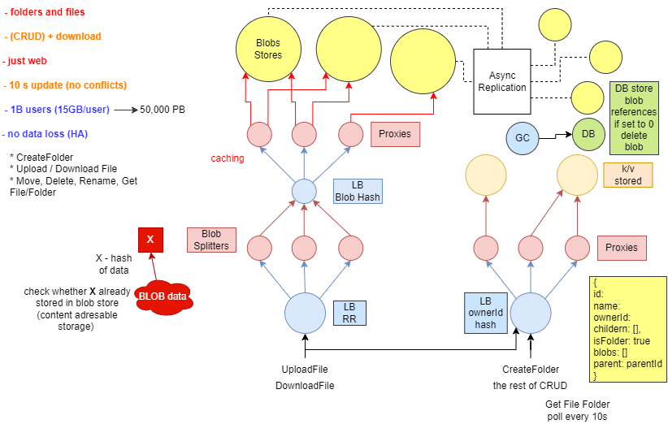

# System Design

## Design Fundamentals

***

### Client - Server Model


```
1. DNS query (google.com)
2. google.com IP address
3. HTTP request to google.com (we know what google.com address is from step 2)
4. Response from google.com (google.com know where to send response based on source IP address from step 3)
```

**DNS queries**

- `dig:` DNS queries.

```console
$> dig pandtronik.com

$> nc -l 8081           // computer listen on port 8081

$> nc 127.0.0.1 8081    // another computer, create communication channel at this machine port 8081
```

**Client**

- A machine or process that requests data or service from a server.
- Note that a single machine or piece of software can be both a client, and a server at the same time. 
- For instance, a single machine could act as a server for end user and as a client for a database.

**Server**

- A machine or process that provides data or service for a client, usually by listening for incoming network calls.
- Note that a single machine or piece of software can be both a client, and a server at the same time. 
- For instance, a single machine could act as a server for end user and as a client for a database.

**Client-Server Model**

- The paradigm by which modern systems designed, which consists of clients requesting data or service from servers
and servers providing data or service to clients.

**IP Address**

- An address given to each machine connected to public internet. 
- IPv4 addresses consist of four numbers separated by dots: `a.b.c.d` where all four numbers are between `0` and `255`. 
- Special values include:
    - **127.0.0.1:**
        - Your own local machine. 
        - Also, referred to as **localhost**.
    - **192.168.x.x:**
        - Your private network. 
        - For instance, your machine and all machines on your private **wifi** network will usually have the **192.168** prefix.

**Port**

- In order for multiple programs to listen for new network connections on the same machine without colliding, they pick a
**port** to listen on. 
- A port is an integer between `0` and `65,535` (`2^16` ports total).
- Typically, ports `0-1023` are reserved for system ports (also called well-known ports) and shouldn't be used by user-level processes. 
- Certain ports have pre-defined uses, and although you usually won't be required to have them memorized, they can sometimes come in handy. 
- Below are some examples:
    - `22:` Secure Shell
    - `53:` DNS lookup
    - `80:` HTTP
    - `443:` HTTPS
    
**DNS**

- Short for Domain Name System, it describes the entities and protocol involved in translation from domain names to IP Addresses. 
- Typically, machines make a DNS query to a well-known entity which is responsible for returning the IP address (or multiple ones) 
of the requested domain name in the response.

***

### Network Protocols

- **Protocol:** An agreed upon set of rules for an interconnection between two parties.

**IP (packets)**


```
Header:
    - Source of IP packet.
    - Destination IP address.
    - Total size of packet.
    - Version of Internet Protocol that this IP packet operation by (IPv4, IPv6).
Data:
    - Information that one machine send to another is stored.
    - Limiting size (2^16 bytes - 65k bits).
    - Bigger data has to be separated in multiple IP packets.
```

**IP**
- Stands for **Internet Protocol**. 
- This network protocol outlines how almost all machine-to-machine communications should happen in the world. 
- Other protocols like **TCP**, **UDP** and **HTTP** are built on top of IP.

**TCP**

```
Ment to solve issue with separate data into multiple IP packets:
    - Guaranteen order of packet sent.
    - Reliable way, guaranteed that those packets actually received by the destination.
    - Error free way, resend failed packets.

TCP connection established, handshake.
```


- Network protocol built on top of the Internet Protocol (IP). 
- Allows for ordered, reliable data delivery between machines over the public internet by creating a **connection**.
- TCP usually implemented in the kernel, which exposes **sockets** to applications that they can use to stream
data through an open connection.

**HTTP**

- The HyperText Transfer Protocol is a very common network protocol implemented on top of TCP. 
- Clients make HTTP requests, and servers respond with a response.
- Requests typically have the following schema:

```
host: string (example: designpatterns.com)
port: integer (example: 80 or 443)
method: string (example: GET, PUT, POST, DELETE, OPTIONS or PATCH)
headers: pair list (example: "Content-Type" => "application/json")
body: opaque sequence of bytes
```

- Responses typically have the following schema:

```
status code: integer (example: 200, 401)
headers: pair list (example: "Content-Length" => 1238)
body: opaque sequence of bytes
```

```js
const httpRequest = {
    host: 'localhost',
    port: 8080,
    mathod: 'POST',
    path: 'payments',
    headers: {
        'content-type': 'application/json',
        'content-length': 51,
    },
    body: '{"data": "This is a piece of data in JSON format."}'
}

const httpResponse = {
    statusCode: 200,
    headers: {
        'access-control-allow-origin': 'https://designpatterns.com',
        'content-type': 'application/json',
    },
    body: '{}'
}
```

**IP Packet**

- Sometimes more broadly referred to as just a (network) **packet**, and IP packet is effectively the smallest unit
used to describe data sent over **IP**, aside from bytes. 
- An IP packet consists of:
    - An **IP header**, which contains the source and destination **IP addresses** as well as other information
    related to the network.
    - A **payload**, which is just the data sent over the network.

***

### Storage


**Databases**

- Databases are programs that either use disk or memory to do 2 cores things: **record** data and **query** data.
- In general, they are themselves servers that are long-lived and interact with the rest of your app through network
calls, with protocols on top of TCP or even HTTP.
- Some databases only keep records in memory, and the users of such databases are aware of the fact that those records
may lost forever if the machine or process dies.
- For the most part though, databases need persistence of those records, and thus cannot use memory. 
- This means that you have to write your data to disk. 
- Anything written to disk will remain through power loss or network partitions, so  that's what is used to keep permanent records.
- Since machines dies often in a large scale system, special disk partitions or volumes used by the database processes,
and those volumes can get recovered even if the machine were to go down permanently.

**Disk**

- Usually refers to either **HDD (hard-disk drive)** or **SSD (solid-state drive)**. 
- Data written to disk will persist through power failures and general machine crashes. 
- Disk also referred to as **non-volatile storage**.
- SSD is far faster than HDD but also far more expensive from financial point of view. 
- Because of that, HDD will typically be used for data that's rarely accessed or updated, but that's stored for long time, 
and SSD will be used for data that's frequently accessed and updated.

**Memory**

- Short of **Random Access Memory (RAM)**. 
- Data stored in memory will be lost when the process that has written that data dies.

**Persistent Storage**

- Usually refers to disk, but in general it is any form of storage that persists if the process in charge of 
managing it dies. 

***

### Latency And Throughput

- Measure of performance of system.

**Latency**

- The time it takes for a certain operation to complete in a system. 
- Most often this measure is a time duration, like milliseconds or seconds. 
- You should know these orders of

```
- Reading 1MB from RAM: 250 us (0.25 ms)
- Reading 1MB from SSD: 1,000 us (1 ms)
- Transfer 1MB over Network: 10,000 us (10 ms)
- Reading 1MB from HDD: 20,000 us (20 ms)
- Inter-Continental Round Trip: 150,000 us (150 ms)
```

**Throughput**

- The number of operations that a system can handle properly per time unit. 
- For instance the throughput of a server can often be measured in request per second (RPS or QPS).     

***

### Availability

**Availability**

- The odds of a particular server or service being up and running at any point in time, usually measured in percentages.
- A server that has 99% availability will be operational 99% of the time (this would be described as having two nines of
availability).

**High Availability**

- Used to describe systems that have particular high levels of availability, typically 5 nines or more; sometimes
abbreviated "HA".

**Nines**

- Typically, refers to percentages of uptime. For example, 5 nines of availability means an uptime of 99.999%.
Below are the downtimes expected per year depending on those 9s:

```
- 99% (two 9s): 87.7 hours
- 99.9% (three 9s): 8.8 hours
- 99.99%: 52.6 minutes
- 99.999%: 5.3 minutes
```

**Redundancy**

- The process of replicating parts of a system in an effort to make it more reliable.

**SLA**

- Short for "service-level-agreement", an SLA is a collection of guarantees given to a customer by a service provider.
- SLAs typically make guarantees on a system's availability, amongst other things. 
- SLAs are made up of one or multiple SLOs.

**SLO**

- Short for "service-level objective", an SLO is a guarantee given to a customer by a service provider. 
- SLOs typically make guarantees on a system's availability, amongst other things. 
- SLOs constitute an SLA.

***

### Caching

**Cache**

- A piece of hardware or software that stores data, typically meant to retrieve that data faster than otherwise.
- Caches often used to store responses to network requests as well as result of computationally-long operations.
- Note that data in a cache can become stale if the main source of truth for that data (i.e. the main database
behind the cache) gets updated, and the cache doesn't.

**Cache Hit**

- When requested data found in a cache.

**Cache Miss**

- When requested data could have been found in a cache but isn't. 
- This is typically used to refer to a negative consequence of a system failure or of a poor design choice. 
- For example:
    - If a server goes down, our load balancer will have to forward requests to a new server, which will result in
    cache misses.

**Cache Eviction Policy**

- The policy by which values get evicted or removed from a cache. 
- Popular cache eviction policies include:
    - **LRU** (least-recently used)
    - **FIFO** (first in first out)
    - **LFU** (least-frequently used).

**Content Delivery Network**

- CDN is a third-party service, acts like a cache for your servers. 
- Sometimes, web apps can be slow for users in a particular region if your servers located only in another region. 
- A CDN has servers all around the world, meaning the latency to a CDN's servers will almost always be far better than 
the latency of your servers. 
- A CDN's servers often referred to as PoPs (Points of Presence). 
- Two of the most popular CDNs are Cloudflare and Google Cloud Platform.    

***

### Proxies 

**Forward Proxy**

- A server that sits between a client and servers and acts on behalf of the client.
- Typically, used to mask the client's identity (IP address).
-  Note that forward proxies often referred as just proxies.

**Reverse Proxy**

- A server that sits between clients and servers and acts on behalf of the servers.
- Typically, used for logging, load balancing, or caching.

**Nginx**

- Nginx is very popular webserver that's often used as a **reverse proxy** and **load balancer**.


```
events {}

http {
    upstream nodejs-backend {
        server localhost:3000;
    }

    server {
        listen 8081;

        location / {
            proxy_set_header systemexpert-tutorial true;
            proxy_pass http://nodejs-backend;
        }
    }
}
```

***

### Load Balancers


**Reverse Proxy**

- A server that sits between clients and servers and acts on behalf of the servers, typically used for logging,
load balancing or caching.

**Load Balancer**

- A type of **reverse proxy** that distributes traffic across servers. Load balancers can be found in many part of the 
systems, from the DNS layer all the way to the database layer.

**Server-Selection Strategy**

- How a **load balancer** chooses servers when distributing traffic amongst multiple servers. Commonly used strategies
include round-robin, random selection, performance-based selection (choosing server with the best performance metrics,
like the fastest response time or the least amount of traffic), and IP-based routing.

**Hot Spot**

- When distributing a workload across a set of servers, that workload might be spread unevenly. This can happen if your 
**sharding key** or **hashing function** are suboptimal, or if your workload is naturally skewed; some servers will receive
more traffic than other, thus creating a "hot spot".

**Nginx**

- Nginx is very popular webserver that's often used as a **reverse proxy** and **load balancer**.

***

### Hashing


**Consistent Hashing**


**Consistent Hashing**

- A type of hashing that minimizes the number of keys that need to be remapped when a hash table gets resized.
- It's often used by load balancers to distribute traffic to servers; it minimizes the number of requests that
get forwarded to different servers when new servers added or when existing servers brought down.

**Randezvous Hashing**

- A type of hashing also coined **highest random weight** hashing. Allows for minimal re-distribution of 
mappings when a server goes down.

**SHA**

- Short for "Secure Hash Algorithms", the SHA is collection of cryptographic hash functions used in the industry.
- These days, SHA-3 is a popular choice to use in a system.

***

### Relational Databases

| customer_name | processed_at | amount |
|--|--|--|
| Seb | 2021-12-21 | 100 |
| Pusz | 2022-01-11 | 50 |

- Structured, rigorous, well-structured.
- Support SQL.
- ACID transaction.
- Database index.

**Relational Database**

- A type of structured database in which data stored following a tabular format.
- Often supports powerful querying using SQL.

**Non-Relational Database**

- In contrast with a relational database (DQL databases), a type of database that is free of imposed, 
tabular-like structure.
- Non-relational databases often referred to as NoSQL databases.

**SQL**

- Structured Query Language.
- Relational databases can be used using a derivative of SQL such as PostgreSQL in case of Postgres.

**SQL Database**

- Any database that supports SQL.
- This term often used synonymously with "Relational Database", though in practice, 
not every relational database supports SQL.

**NoSQL Database**

- Any database that is not SQL-compatible is called NoSQL.

**ACID Transaction**

- A type of database transaction that has four important properties:
    - **Atomicity:** The operations that constitute the transaction will either all succeed or all fail. 
    There is no in-between state.
    - **Consistency:** The transaction cannot bring the database to an invalid state. After the transaction
    committed or rolled back, the rules for each record will still apply, and all future transactions will see the
    effect of the transaction. Also, named **Strong Consistency**. 
    - **Isolation:** The execution of multiple transactions concurrently will have the same effect as if they had
    been executed sequentially.
    - **Durability:** Any committed transaction written to non-volatile storage. It will not be undone by a crash,
    power loss, or network partition.
    
**Database Index**

- A special auxiliary data structure that allows your database to perform certain queries much faster.
- Indexes can typically only exist to reference structured data, like data stored in a relational database.
- In practice, you create an index on one or multiple columns in your database to greatly speed up **read** 
queries that you run very often, with the downside of slightly longer **writes** to your database, since writes
have to also take place in a relevant index.
    
**Strong Consistency**

- Strong Consistency usually refers to the consistency of ACID transactions, as opposed to **Eventual Consistency**.

**Eventual Consistency**

- A consistency model which is unlike **Strong Consistency**.
- In this model, reads might return a view of the system that is stale.
- An eventually consistent datastore will give guarantees that the state of the database will eventually reflect writes
within a time period (could be 10 seconds, or minutes).    
    
***

### Key-Value Stores

```
Key     Value

foo     9001
bar     SystemExpert
baz     1, two, 3
```

**Key-Value Store**

- A Key-Value Store is a flexible NoSQL database that's often used for caching and dynamic configuration.
- Popular options include DynamoDB, Etcd, Redis, and ZooKeeper.

**Etcd**

- Etcd is a strongly consistent and highly available key-value store that often used to implement leader election
in system.

**Redis**

- An in-memory key-value store.
- Does offer some persistent storage options but is typically used as a really fast, best effort caching solution.
- Redis is also often used to implement **rate limiting**.

**ZooKeeper**

- ZooKeeper is a strongly consistent, highly available key-value store.
- It is often used to store important configuration or to perform leader election.

### Specialized Storage Paradigms

**Blob Storage**

- A widely used kind of storage, in small and large scale systems.
- They don't really count as database per se, partially because they only allow the user to store and retrieve data based
on the name of the blob.
- This is sort of like a key-value store but usually blob stores have different guarantees.
- They might be slower than KV store but values can be megabytes large (or sometimes gigabytes large).
- Usually people use this to store things like **large binaries, database snapshots, or images** and other static asset
that a website might have.
- Blob storage complicated to have on a premise, and only giant companies like Google and Amazon have infrastructure
to support it.
- So usually in the context of System Design interviews you can assume that you will be able to use **GCS** or **S3**.
- These are blob storage services hosted by Google and Amazon respectively, that cost money depending on how much storage
you use and how often you store and retrieve blobs from that storage.

**Time Series Database**

- A **TSDB** is a special kind of database optimized for storing and analyzing time-indexed data: data points that specifically
occur at a given moment in time.
- Examples of TSDBs are InfluxDB, Prometeus, and Graphite.

**Graph Database**

- A type of database that stores data following the graph data model.
- Data entries in a graph database can have explicitly defined relationships, much like nodes in a graph can have edges.
- Graph databases take advantage of their underlying graph structure to perform complex queries on deeply connected data 
very fast.
- Graph databases thus often preferred to relational databases when dealing with systems where data points naturally
from a graph and have multiple levels of relationships - for example, social networks.

**Cypher**

- A **graph query language** that was originally developed for the Neo4j graph database, but that has since been
standardized to used with other graph databases in an effort to make it "SQL for graphs".
- Cypher queries are often much simpler than their SQL counterparts.
- Example Cypher query find data in **Neo4j**, a popular graph database.

```
MATCH (some_node:SomeLabel)-[:SOME_RELATIONSHIP]->(some_other_node:SomeLabel{some_property:'value'})
```

**Spatial Database**

- A type of database optimized for storing and quering spatial data like locations on a map.
- Spatial databases rely on spatial indexes like **quadtrees** to quickly perform spatial queries like finding all
locations in the vicinity of a region.

**Quadtree**

- A tree data structure most commonly used to index two-dimensional spatial data.
- Each node in a quadtree has either zero children nodes (and is therefore a leaf node) or exactly four children nodes.
- Typically, quadtree nodes contain some form of spatial data - for example, locations on a map - with a maximum capacity
of some specified number **n**.
- So long as nodes aren't at capacity, they remain leaf nodes; once they reach capacity, they're given four children nodes,
and their data entries split across the four children nodes.
- A quadtree lends itself well to storing spatial data because it can be represented as a grid filled with rectangles that
are recursively subdivided into four sub-rectangles, where each quadtree node represented by a rectangle and each
rectangle represents a spatial region.
- Assuming we're storing locations in the world, we can imagine a quadtree with a maximum node-capacity **n** as follows:
    - The root node, which represents the entire world, is the outermost rectangle.
    - If the entire world has more than **n** locations, the outermost rectangle divided into four quadrants, 
    each representing a region of the world.
    - So long as a region has more than **n** locations, its corresponding rectangle subdivided into four quadrants
    (the corresponding node in the quadtree given four children nodes).
    - Regions that have fewer than **n** locations are undivided rectangles (leaf nodes).
    - The parts of the grid that have many subdivided rectangles represents densely populated areas (like cities),
    while the parts of the grid that have few subdivided rectangles represent sparsely populated areas (like rural areas).
- Finding a given location in a perfect quadtree is an extremely fast operation that runs in **log4(x)** time
(where **x** is the total number of locations), since quadtrees nodes have four children.

**Google Cloud Storage**

- GCS is a blob storage service provided by Google.

**S3**

- S3 is a blob storage provided by Amazon through **Amazon Web Services (AWS)**.

**InfluxDB**

- A popular open-source time series database.

**Prometheus**

- A popular open-source time series database, typically used for monitoring purposes.

**Neo4j**

- A popular graph database that consists of **nodes**, **relationships**, **properties**, and **labels**.

***

### Replication And Sharding


**Replication**

- The act of duplicating the data from one database server to others.
- This is sometimes used to increase the redundancy of your system and tolerate regional failures for instance.
- Other times you can use replication to move data closer to your clients, thus decreasing the latency of accessing
specific data.

**Sharding**

- Sometimes called **data partitioning**, sharding is the act of splitting a database into two or more pieces called
**shards** and typically done to increase the throughput of your database.
- Popular sharding strategies include:
    - Sharding based on a client's region.
    - Sharding based on the type of data stored (e.g. user data gets stored in one shard, payments data gets stored
    in another shard).
    - Sharding based on the hash of a column (only for structured data).

**Hot Spot**

- When distributing a workload across a set of servers, that workload might spread unevenly.
- This can happen if your **sharding key**, or your **hashing function** are suboptimal, or if workload is naturally
skewed: some servers will receive a lot more traffic than others, thus creating a "hot spot".

***

### Leader Election


**Leader Election**

- The process by which nodes in a cluster (for instance, servers in a set of servers) elect so-called "leader" amongst
them, responsible for the primary operations of the service these nodes support.
- When correctly implemented, leader election guarantees that all nodes in the cluster know which one is the leader
at any given time and can elect a new leader if the leader dies for whatever reason.

**Consensus Algorithm**

- A type of complex algorithms used to have multiple entities agree on a single data value, like who the "leader" is
amongst a group of machines.
- Two popular consensus algorithms are **Paxos** and **Raft**.

**Paxos & Raft**

- Two consensus algorithms that, when implemented correctly, allow for the synchronization of certain operations, 
even in a distributed setting.

**Etcd**

- Etcd is a strongly consistent and highly available key-value store, often used to implement leader election in
a system.

**ZooKeeper**

- ZooKeeper is strongly consistent, highly available key-value store.
- It's often used to store important configuration or to perform leader election.

***

### Peer-To-Peer Network


**Peer-To-Peer Network**

- A collection of machines referred to as peers that divide a workload between themselves to presumably complete
the workload faster than would otherwise be possible.
- Peer-to-peer networks often used in file-distribution systems.

**Gossip Protocol**

- When a set of machines talk to each other in uncoordinated manner in a cluster to spread information through a system
without requiring a central source of data.

***

### Polling And Streaming

**Polling**

- The act of fetching a resource or piece of data regularly at an interval to make sure your data is not too stale.

**Streaming**

- In networking, it usually refers to the act of continuously getting a feed of information from a server by keeping 
an open connection between the two machines or processes.

***

### Configuration

- A set of parameters or constants that are critical to system.
- Configuration typically written in **JSON** or **YAML** and can be either **static**, meaning it's hard-coded in 
and shipped with your system's application code (like frontend code, for instance), or **dynamic**, meaning that
it lives outside of your system's application code.

***

### Rate Limiting


**Rate Limiting**

- The act of limiting the number of requests sent to or from a system.
- Rate limiting is most often used to limit the number of incoming requests in order to prevent **DoS attacks**
and can be enforced at the IP-address level, at the user-account level, or at the region level, for example.
- Rate limiting can also be implemented in tiers; for instance, a type of network request could be limited to 1
per second, 5 per 10 second, and 10 per minute.

**DoS Attack**

- Short for "denial-of-service attack", a DoS attack is an attack in which a malicious user tries to bring down or
damage a system in order to render it unavailable to users.
- Much of the time, it consists of flooding it with traffic.
- Some DoS attacks are easily preventable with rate limiting, while others can be far trickier to defend against.

**DDos Attack**

- Short for "distributed denial-of-service attack", a DDoS attack is a DoS attack in which the traffic flooding 
the target system comes from many sources (like thousands of machines), making it much harder to defend
against.

**Redis**

- An in-memory key-value store.
- Does offer some persistent storage options but is typically used as a really fast, best effort caching solution.
- Redis is also often used to implement **rate limiting**.

***

### Logging And Monitoring

**Logging**

- The act of collecting and storing logs, useful information about events in your system.
- Typically, your programs will output log messages to its STDOUT or STDERR pipes, which will automatically get
aggregated into a **centralized logging solution**.

**Monitoring**

- The process of having visibility into a system's key metrics, monitoring typically implemented by collecting 
important events in a system and aggregating them in human-readable charts.

**Alerting**

- The process through which system administrators get notified when critical system issues occur.
- Alerting can be set up by defining specific thresholds on monitoring charts, past which alerts are sent to
a communication channel like Slack.

***

### Publish/Subscribe Pattern


**Publish/Subscribe Pattern**

- Often shortened as **Pub/Sub**, Publish/Subscribe pattern is a popular messaging model consists of 
**publishers** and **subscribers**.
- Publishers publish messages to special **topics** (sometimes called **channels**) without caring about or even 
knowing who will read those messages, and subscribers subscribe to topics and read messages coming through
those topics.
- Pub/Sub system often come with very powerful guarantees like **at-least-once delivery, persistent storage,
ordering** of messages, and **re-playability** of messages.

**Idempotent Operation**

- An operation that has the same ultimate outcome regardless of how many times it's performed.
- If an operation can be performed multiple times without changing its overall effect, it's idempotent.
- Operations performed through a **Pub/Sub** messaging system typically have  to be idempotent, since Pub/Sub
systems tend to allow the same messages to be consumed multiple times.
- For example, increasing an integer value in a database is not an idempotent operation, since repeating this 
operation will not have the same effect as if it had been performed only once.
- Conversely, setting a value to "COMPLETE" is an idempotent operation, since repeating this operation will always
yield the same result: the value will be "COMPLETE".

**Apache Kafka**

- A distributed messaging system created by LinkedIn.
- Very useful when using the **streaming** paradigm as opposed to **polling**.

**Cloud Pub/Sub**

- A highly-scalable Pub/Sub messaging service created by Google.
- Guarantees **at-least-once delivery** of messages and supports "rewinding" in order to reprocess messages.

***

### MapReduce


**MapReduce**

- A popular framework for processing very large datasets in distributed setting efficiently, quickly, and in a
fault-tolerant manner.
- A MapReduce job comprised of 3 main steps:
    - the **Map** step, which runs a **map function** on the various chunks of the dataset and transforms these chunks 
    into intermediate **key-value pairs**.
    - the **Shuffle** step, which recognizes the intermediate **key-value pairs** such that pairs of the same key 
    routed to the same machine in the final step.
    - the **Reduce** step, which runs a **reduce function** on the newely shuffled **key-value pairs** and transforms 
    them into more meaningful data.
- The canonical example of a MapReduce use case is counting the number of occurrences of words in a large text file.
- When dealing with a MapReduce library, engineers and/or systems administrators only need to worry about the map and
reduce functions, as well as their inputs and outputs.
- All other concerns, including the parallelization of tasks, and the fault-tolerant of the MapReduce job, are 
abstracted away and taken care of by the MapReduce implementation. 

**Distributed File System**

- A Distributed File System is an abstraction over a (usually large) cluster of machines that allows them to act like
one large file system.
- The two most popular implementation of a DFS is the **Google File System** (GFS) and the **Hadoop Distributed File
System** (HDFS).
- Typically, DFSs take care of the classic **availability** and **replication** guarantees that can be tricky to obtain
in a distributed-system setting.
- The overarching idea is that files split into chunks of a certain size (4MB or 64MB, for instance), and those
chunks shared across a large cluster of machines.
- A central control plane is in charge of deciding where each chunk resides, routing reads to the right nodes, 
and handling communication between machines.
- Different DFS implementations have slightly different APIs and semantics, but they achieve the same common goal:
extremely large-scale persistent storage.

**Hadoop**

- A popular, open-source framework that supports MapReduce jobs and many other kinds of data-processing pipelines.
- Its central component is **HDFS** (Hadoop Distributed File System), on top of which other technologies have been 
developed.

***

### Security And HTTPS


**Man In The Middle Attack**

- An attack in which the  attacker intercepts a line of communication that thought to be private by its two 
communicating parties.
- If a malicious actor intercepted and mutated an IP packet on its way from a client to a server, that would be a
man-in-the-middle attack.
- MITM attacks are the primary threat that encryption and **HTTPS** aim to defend against.

**Symmetric Encryption**

- A type of encryption that relies on only a single key to both encrypt and decrypt data.
- The key must be known to all parties involved in communication and must therefore typically be shared between 
the parties at one point or another.
- Symmetric-key algorithms tend to be faster than their asymmetric counterparts.
- The most widely used symmetric-key algorithms are part of the Advanced Encryption Standard (**AES**).

**Asymmetric Encryption** 

- Also known as public-key encryption, asymmetric encryption relies on two keys -- a public key, and a private key --
to encrypt and decrypt data.
- The keys are generated using cryptographic algorithms and are mathematically connected such that data encrypted  with
the public key can only be decrypted with the private key.
- While the private key must be kept secure to maintain the fidelity of this encryption paradigm, the public key can be
openly shared.
- Asymmetric-key algorithms tend to be slower than their symmetric counterparts.

**AES**

- Standard for **Advanced Encryption Standard**.
- AES is a widely used encryption standard that has three symmetric-key algorithms (AES-128, AES-192, and AES-256).
- Of note, AES considered to be the "gold standard" in encryption and is even used by the U.S. National Security
Agency to encrypt top secret information.

**HTTPS**

- The HyperText Transfer Protocol is an extension of **HTTP** that's used for secure communication online.
- It requires servers to have trusted certificates (usually **SSL certificates**) and uses the Transport Level Security
(**TLS**), a security protocol built on top of **TCP**, to encrypt data communicated between a client and a server.

**TLS**

- The Transport Layer Security is a security protocol over which **HTTP** runs in order to achieve secure communication
online.
- "HTTP over TLS" is also known as **HTTPS**.

**SSL Certificate**

- A digital certificate granted to a server by a **certificate authority**.
- Contains the server's public key, to be used as part of the **TLS handshake** process in an **HTTP** connection.
- An SSL certificate effectively confirms that a public key belongs to the server claiming it belongs to them.
- SSL certificates are a critical defense against **man-in-the-middle-attacks**.

**Certificate Authority**

- A trusted entity that signs digital certificates - namely, SSL certificates that are relied on in **HTTPS** connections.

**TLS Handshake**

- The process through which a client, and a server communicating over **HTTPS** exchange encryption-related information 
and establish a secure communication.
- The typical steps in a TLS handshake are roughly as follows:
    - The client sends a **client hello**, a string of random bytes, to the server.
    - The server responds with a **server hello**, another string of random bytes, as well as its **SSL certificate**,
    which contains its **public key**.
    - The client verifies that the certificate issued by a **certificate authority** and sends a **pre-master secret**
    yet another string of random bytes, this time encrypted with the server's public key to the server.
    - The client and the server use the client hello, the server hello, and the pre-master secret to then generate the
    same **symmetric-encryption** session keys, to be used to encrypt and decrypt all data communicated during the 
    reminder of the connection.

***

### API Design

```
# API Definition

## Entity Definitions
### Charge:
- id: uuid
- customer_id: uuid
- amount: integer
- currency: string (or currency-code enum)
- status: enum ["succeeded", "pending", "failed"]

### Customer:
- id: uuid
- name: string
- address: string
- email: string
- card: Card

### Card

## Endpoint Definitions
### Charges
CreateCharge(charge: Charge)
    => Charge
GetCharge(id: uuid)
    => Charge
UpdateCharge(id: uuid, updatedCharge: Charge)
    => Charge
ListCharges(offset: integer, limit: integer)
    => Charge[]
CaptureCharge(id: uuid)
    => Charge

### Customers
CreateCustomer(customer: Customer)
    => Customer
GetCustomer(id: uuid)
    => Customer
UpdateCustomer(id: uuid, updatedCustomer: Customer)
    => Customer
DeleteCustomer(id: uuid)
    => Customer
ListCustomers(offset: integer, limit: integer)
    => Customer[]
```

**Pagination**

- When a network request potentially warrants a really large response, the relevant API might be designed to return 
only a single **page** of that response (i.e. a limited portion of the response), accompanied by an identifier or token
for the client to request the next page if desired.
- Pagination often used when designing **List** endpoints.
- For instance, an endpoint to list videos on the YouTube Trending page could return a huge list of videos.
- This wouldn't perform very well on mobile devices due to the lower network speed and simply wouldn't be optimal, since
most users will only ever scroll through the first ten or twenty videos.
- So, the API could be designed to respond when only the first few videos of that list; in this case, we would say that 
the API response is **paginated**.

**CRUD Operations**

- Stands for **Create, Read, Update, Delete** Operations.
- These four operations often serve as the bedrock of a functioning system and therefore find themselves at the core
of many APIs.
- The term **CRUD** is very likely to come up during an API-design interview.

***

## Design A Code-Deployment System


***

## Design AlgoExpert


***

## Design A Stockbroker


***

## Design Amazon


 
***

## Design The Reddit API

- User | userId: string, ...
- Subreddit | subredditId: string, ...

```
POST(postId: string, creatorId: string, subredditId: string, title: string, desc: string,
      createdAt: timestamp, votesCount: int, commentsCount: int, currentVole?: enum(UP/DOWN), awardsCount: int)

Create(userId: string, subredditId: string, title: string, desc: string)
    => POST

GET(userId: string, postId: string)
    => POST

Edit(userId: string, postId: string, title: string, desc: string)
    => POST

Delete(userId: string, postId: string)
    => POST

List(userId: string, subredditId: string, pageSize?: int, pageToken?: int)
    => POST[], nextPageToken
```

```
COMMENT(commentId: string, creatorId: string, postId: string, createdAt: timestamp, 
        votesCount: int, content: string, parentId?: string, isDeleted: bool)

Create(userId: string, postId: string, content: string, parentId?: string)
    => COMMENT

**Below similar to POST**
Get

Edit

Delete

List
```

```
VOTE(voteId: string, creatorId: string, targetId: string, type: enum(UP/DOWN))

Create(userId: string, targetId: string, type: enum(UP/DOWN))

Edit(userId: string, voteId: string, type: enum(UP/DOWN))

Delete(userId: string, voteId: string)
```

```
BuyAward(userId: string, paymentToken: string, quantity: int)

GiveAward(userId: string, targetId: string)
```

***

## Design Facebook News Feed


***

## Design Google Drive



***

## Design Netflix


***

## Design The Uber API

**Passenger**

```
PoolRide:
- driveInfo
- rider: Ride[]

Ride                            CreateRide(userId: string, pickup: L, dest: L)
- rideId: string                    |     
- passengerId: string               +-> FindDriver
- driverInfo: DriverInfo                    |
- estimatedPrice: int                       +-> EditRide
- timeValues
- rideStatus: RideStatus        GetRide(userId: string)
                                CancelRide(userId: string)
RideStatus:
- CREATED
- MATCHED
- STARTED
- FINISHED
- CANCELLED

StreamDriverLocation(userId: string)
```

**Driver**

```
DriverStatus:
- UNAVAILABLE
- INRIDE    -> done (check PoolRide)
- STANDBY

SetDriverStatus(userId: string, driverStatus: DriverStatus)
    |
    +-> FindRide
    |       |
    |       +-> Ride | null
    |
    +-> AcceptRide(userId: string)
    |
    +-> EditRide

PushLocation(userId: string, location: L)
```

***

## Design Tinder


***

## Design Slack


***

## Design Airbnb


***

## Design The Twitch API

- channel info
- follow
- subscribe (SubInfo)
- live chat 
- live stream video (VideoInfo)
- concurrent viewers (~30s)
- ~~recommended channels~~
- user token passed by default

```
GetChannelInfo(channelId: string)
    => ChannelInfo { name: str, desc: str, currentStrTitle: str, followerCount: int }

ToggleFollow(channelId: str)
    => FollowState (UN/FOLLOWING)

CreateSub(channelId: str, subInfo: SubInfo, payInfo: PayInfo)
    => Sub
CancelSub(channelId: str)
    => Sub

StreamChat(channelId: str)
    => Message { sender: str, text: str, timestamp: str (ISO) }

SendMessage(channelId: str, message: str)
    => str | Err

StreamVideo(channelId: str, videoQual: VideoQual)
    => VideoInfo

GetConcViewers(channelId: str)
    => int

GerRelToChannel(channelId: str)
    => RelToChannel { isBanned: bool, isFollowing: bool, subscription: Sub | null }
```

***

**Q1: The following is often used as an index for spatial data that needs to be queried with low latency:**

- A quadtree

**Q2: The following statements are correct (check all that apply):**

- HTTP is a network protocol built on top of TCP.
- TCP is a network protocol built on top of IP.
- HTTP is a network protocol that exposes a more human-readable interface than those exposed by protocols like TCP and IP.

**Q3: The following is an example of horizontal scaling:**

- Increasing the number of machines performing a task to improve throughput.

**Q4: A typical TLS handshake can be best summarized as:**

- Generating symmetric-encryption session keys, to be used by both the server and the client to encrypt and decrypt 
future communication.

**Q5: Consistent hashing is used to:**

- Minimize the number of requests that get forwarded to different servers when new servers are added or when existing 
servers are brought down.

**Q6: The following are actual types of databases (check all that apply):**

- Graph database.
- Time series database.

**Q7: If you wanted to minimize latency in a system, you would want to do the following (check all that apply):**

- Move system servers closer to clients.
- Maximize cache hits.

**Q8: A man-in-the-middle attack is:**

- An attack where the attacker secretly intercepts communications between two parties.

**Q9: Pub/Sub systems typically come with the following guarantees (check all that apply):**

- At-least-once delivery of messages.
- Replayability of messages.
- Ordering of messages.

**Q10: You're designing Facebook News Feed—specifically, the system that handles sharing new posts on relevant people's 
news feeds in real time. You're most likely to support this functionality by using:**

- A Pub/Sub pipeline.

**Q11: You're designing Dropbox, a service that allows users to store "primary" data like video files, images, 
text documents, etc., as well as metadata about the primary data like how large the data is, who uploaded it, 
when it was last edited, etc.. You're most likely to use the following storage solutions to store the primary data 
and its accompanying metadata:**

- A blob store for the primary data and a key-value store for the metadata.

**Q12: You're designing a system; the following questions are worth asking before diving in (check all that apply):**

- What kind of latencies are we targeting for the various parts of this system?
- What kind of availability are we targeting for the various parts of this system?
- Are we designing this system for a global audience or for a region-specific one?
- How many users are we designing this system for?

**Q13: The following statement is correct:**

- Idempotent operations aren't problematic in a Pub/Sub system.

**Q14: The following system is most likely to be highly available:**

- A messaging system used by air traffic controllers to communicate with pilots while they're in flight.

**Q15: The following statements are correct (check all that apply):**

- Without proper defense, an entire system can be taken down by a DoS attack.
  
**Q16: Caching is less likely to be advisable if:**

- Accessed data is frequently updated.

**Q17: The following are common server-selection strategies for load balancers (check all that apply):**

- Client-IP-based.
- Server-health-based.
- Round-robin.

**Q18: The following pair is an outlier amongst the rest:**

- Polling | availability. 

**Q19: The following are typically decent sharding strategies (check all that apply):**

- Sharding based on the type of data being stored.
- Sharding based on a client's region.
- Sharding based on a customer's username.
  
**Q20: Leader election is used in systems to achieve the following goal:**

- High availability.

**Q21: The following are realistic examples of config (check all that apply):**

```yaml
locations:
  - us-central-1
  - europe-west-1
  - europe-west-2
restrictionsOn: true
```

```json
{
  "apiKey": "HgebdkUGFkkwrl148jD",
  "displayAccountExpiration": true,
  "expirationDate": "2020-09-15T00:00:00Z",
  "updatePollInterval": 100000
}
```

**Q22: The following are reasons to replicate a database in a system (check all that apply):**

- To move data closer to a set of clients so as to improve latency for those clients.
- To make the system more fault-tolerant.
  
**Q23: The following are the three primary entities in a SQL database:**

- Tables, rows, and columns.

**Q24: You're designing a chat application like WhatsApp. You're most likely to have the following things 
in this system (check all that apply):**

- A persistent-storage solution to store all historical messages.
- One or multiple load balancers to handle read and write requests of messages.
- A Pub/Sub system to send and receive messages and read-receipts.

**Q25: The following technologies are storage solutions (check all that apply):**

- MySQL.
- Neo4j.
- Prometheus.

**Q26: When designing an API endpoint to list some arbitrary entities, like comments on a video or posts on a news feed, 
you typically want the endpoint to support:**

- Pagination.

**Q27: You would likely want to use a cache in the following systems-design scenarios (check all that apply):**

- Users accessing static content on the home page of a website.
- Users accessing their saved credit-card information on Amazon.
  
**Q28: A hot spot can occur in a system when (check all that apply):**

- A sharding key for a set of databases is suboptimal.
- A hashing function for a set of destination servers is suboptimal.
- The system's workload is naturally skewed.
  
**Q29: The following statement is correct:**

- With asymmetric encryption, the private key is used to encrypt data and the public key is used to decrypt it. 
  
**Q30: The following statement is correct:**

- Hitting the same API endpoint every ten minutes is an example of polling.

**Q31: The following are legitimate use cases of proxies (check all that apply):**

- Logging client information.
- Load balancing requests across servers.
- Masking a client's identity.
- Caching server responses.
  
**Q32: The following functionality is not typically supported in a standard CRUD API:**

- Move
  
**Q33: The following statements are correct (check all that apply):**

- SLAs are made up of one or multiple SLOs.
- SLA stands for "service-level agreement".
- SLO stands for "service-level objective".
  
**Q34: The following operations are ordered from fastest to slowest:**

- Reading 1 MB from RAM `<` Reading 1 MB from SSD `<`  Transferring 1 MB over Network `<` Douing an Inter-Continental Round Trip.  

**Q35: An asynchronous MapReduce job would likely be used to (check all that apply):**

- Aggregate North-American YouTube-channel view counts.
- Find the most commonly-occuring errors in a web application.
  
**Q36: The following are properties of peer-to-peer systems (check all that apply):**
  
- They remove throughput bottlenecks that centralized solutions have.
- They're able to use a lot more of a network's bandwidth.
  
**Q37: The following are examples of idempotent operations (check all that apply):**

- Updating a phone number in a bank account.
- Making a Slack channel private.
- Marking an email as read.
- Unsubscribing from a email list.
  
**Q38: The following is a popular use case for a peer-to-peer network:**

- Sending a large file to thousands of machines at once.

**Q39: The following statement is correct:**

- An eventually consistent database might return stale data on reads.
  
**Q40: You're designing a stock-trading platform where users need to get immediate stock-price updates as well 
as immediate feedback that their trades have been executed. You want the system to have especially low:**

- Latency

**Q41: The following statements are correct (check all that apply):**

- Paxos and Raft are consensus algorithms.
- Etcd and ZooKeeper are key-value stores.
  
**Q42: The following technologies are key-value stores (check all that apply):**

- Redis
- ZooKeeper
- Etcd

**Q43: The following features lend themselves well to streaming (check all that apply):**

- Sending and receiving messages on Slack.
- Watching videos on YouTube.
  
**Q44: The following are scenarios that could realistically introduce a hot spot in a system (check all that apply):**

- The system gets a sudden surge of traffic from a particular region in the world.
- A new social-media trend encourages everyone named "Alex" or "Alexa" to tweet "Hello World!".
  
**Q45: Google Cloud Storage (GCS) and Amazon S3 are both storage solutions best used to store:**
  
- Large, unstructured data.

**Q46: The following API endpoint makes the most sense to be rate-limited:**

- An endpoint to post a comment.

**Q47: The following concepts are fake and don't exist (check all that apply):**

- Relational idempotency.
- Distributed denial-of-sharding attack.
- Rendezvous caching.
  
**Q48: When designing an API, you should always (check all that apply):**

- Think of the functionality that the API needs to support.
- Think of who will be consuming the API.
  
**Q49: The following are all real acronyms in the field of systems design (check all that apply):**

- TCP, SLO, S3, and HDFS.
- CDN, SQL, DNS, and IP.
- DoS, YAML, PoP, and RAM.
  
**Q50: The following is an example of load balancing software:**

- NginX  
  
  

  
  


  
  