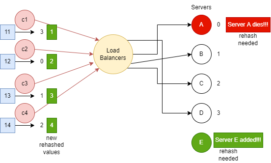
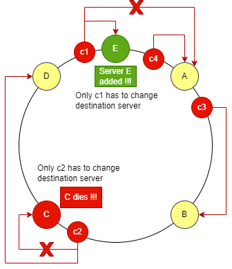
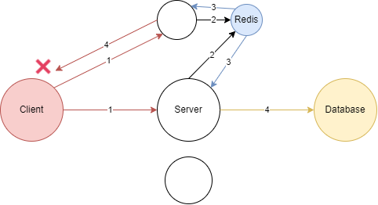
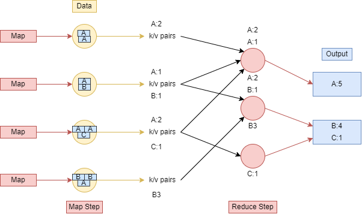
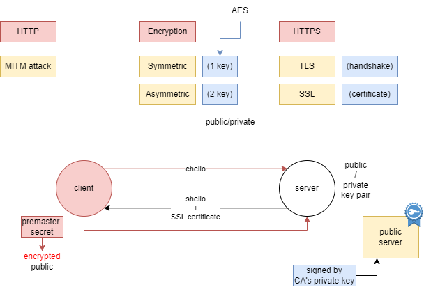
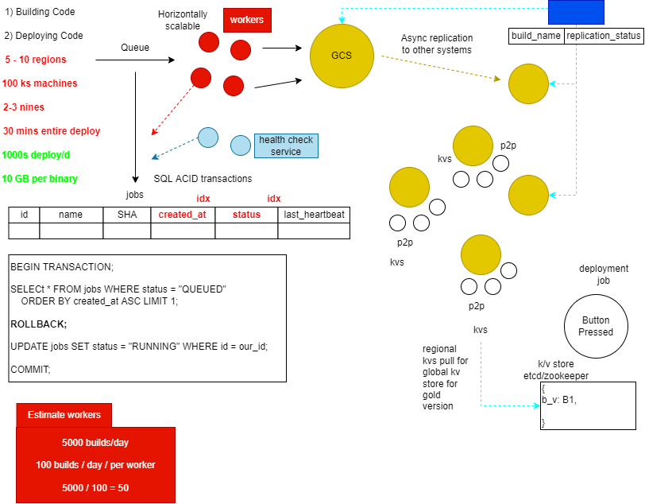
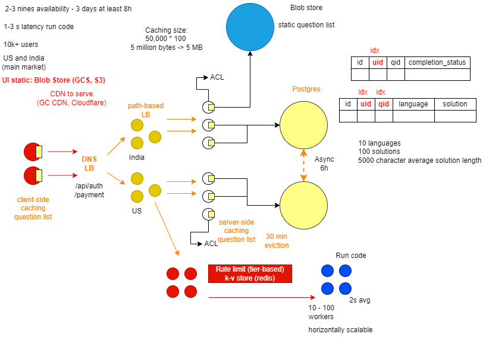
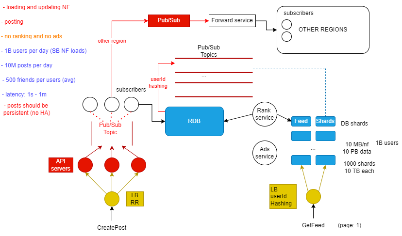

# System Design

## GFS

- Google File System (GFS) is a distributed file system designed to provide efficient, reliable access to large data sets.
- It was developed by Google and used in their data centers to store and process large amounts of data.
- GFS is designed to scale to petabytes of data and thousands of machines and provides a simple file interface that
  enables applications to read and write large files.
- The file system also includes a number of features such as versioning, fault tolerance, and automatic data replication
  to ensure data availability and reliability.

**How GFS works**

- Google File System (GFS) works by dividing large files into smaller chunks called chunkservers and storing these chunks
  across many machines in a distributed manner.
- The file system is managed by a master node that keeps track of the location of all chunks and coordinates the placement
  of new data and retrieval of existing data.
- When a client wants to write a file, it sends the request to the master node which then allocates a chunk for the file
  and assigns the write request to a chunkserver.
- The chunkserver then stores the data and acknowledges the write request to the master node.
- The master node updates its metadata to reflect the new data.
- When a client wants to read a file, it sends a request to the master node which then locates the required chunks on the
  chunkservers and returns the data to the client.
- The data is returned in parallel from multiple chunkservers to improve read performance.
- GFS also includes automatic data replication for fault tolerance and data availability.
- The master node regularly replicates chunks to multiple chunkservers to ensure that data is available even in the event
  of a single chunkserver failure.

**Key characteristics**

- Google File System (GFS) has several key characteristics, including:
  - Distributed Storage:
    - GFS stores large data sets across many machines in a distributed manner, which allows for scalability to
      petabytes of data and thousands of machines.
  - Simple File Interface:
    - GFS provides a simple file interface that enables applications to read and write large files, making it easy
      to use for a wide range of applications.
  - High Availability:
    - GFS includes automatic data replication to ensure data availability and fault tolerance.
    - The master node replicates chunks to multiple chunkservers to ensure that data is still accessible even in the
      event of a single chunkserver failure.
  - Efficient Data Retrieval:
    - GFS is designed to efficiently retrieve large amounts of data in parallel, which can improve read performance
      for large data sets.
  - Dynamic Resource Allocation:
    - GFS dynamically allocates chunks and balances the load across chunkservers to ensure efficient resource
      utilization and prevent performance bottlenecks.
  - Large Chunk Size:
    - GFS uses large chunk sizes (64 MB or 128 MB) to minimize the overhead of metadata management and to improve
      write performance.
  - Versioning:
    - GFS supports versioning of files, allowing multiple versions of a file to be stored and retrieved over time.

### How Does GFS scale?

- GFS scales by adding ChunkServers to the cluster.
- The master gradually moves data from existing ChunkServers to newly added servers.

### How does GFS ensure fault-tolerance and reliability of data?

- Replication: GFS replicates data to multiple nodes for reliability and fault tolerance.
- Operation log: For fault tolerance and to handle master crash, all metadata changes written to the disk onto
  an operation log.
- Checkpointing: Master's state periodically serialized to disk and then replicated, so that on recovery, a master
  may load the checkpoint into memory, reply any subsequent operations from the log, and be available again very
  quickly.

### How does GFS manage high availability?

- Each chunk replicated onto multiple ChunkServers to ensure high availability.
- To ensure maximum data availability, master distributed replicas on different racks, so that clients can still
  read or write in case of a rack failure.
- To handle master server crash, GFS stores the checkpoint in a compact **B-tree** like form that can be directly mapped
  into memory and used for namespace lookup without extra parsing.

### How does GFS perform master failover?

- GFS relies on an **external monitoring infrastructure** to detect the master failure and switch the traffic to a backup
  master server.

### What benefits does GFS get from a single master?

- The benefit of having a single, centralized master is that it has a global view of the file-system, and hence, it can
  make optimum management decisions, for example, related to chunk placement and replication.

### What problems does GFS face by having a single master?

- As the number of files grows, it becomes impossible to store all files' metadata in a single master's RAM.
- Secondly, as the number of clients grows, the single master becomes a performance bottleneck as it does not have
  enough CPU power to serve them.

### How does GFS ensure file data integrity?

- GFS uses **checksumming** to detect the corruption of stored data.
- Each chunk is broken down into 64 KB blocks, and each block has a corresponding 32-bit checksum.
- Like other metadata, checksums are kept in memory and stored persistently with logging, separate from file data.
- ChunkServer verifies the checksum of data blocks that overlap the read/write range before performing the operation.

### How does GFS decouple control flow from data flow, and what benefits does it provide?

- Client communicates with the master for all metadata-related operations like creating or deleting files,
  looking up files, etc., but all data transfer happen directly between the client and ChunkServers.
- Minimizes the master involvement in reads and writes.
- While performing write operation, GFS separates control flow from data flow to ensure data consistency.

### How does lazy space allocation help GFS?

- Each chunk replica is stored as a plain Linux file on a ChunkServer.
- GFS does not allocate the whole 64 MB of disk space when creating a chunk.
- Instead, as the client appends data, the ChunkServer, **lazily** extends the chunk.
- This lazy space allocation avoids wasting space due to the internal fragmentation.
- Internal fragmentation refers to having unused partitions of the 64 MB chunk.
- For example, if we allocate a 64 MB chunk and only fill up 20 MB, the remaining space is unused.

### Can GFS handle small files efficiently?

- GFS can store small files efficiently as it lazily extends chunks based on the data size.
- GFS has a large chunk size (64MB), which can have its disadvantage while reading.
- Since a small file will have one or a few chunks, the ChunkServers storing these chunks can become hotspots if a lot
  of clients are accessing the same file.
- To handle this scenario, GFS stores such files with a higher replication factor and also adds a random delay in the
  start times of the applications accessing these files.

### What are reference counts in context of snapshotting?

- Reference counts are part of the implementation of copy-on-write for snapshots.
- Snapshots in GFS are initially zero-copy.
- This means that when GFS creates a snapshot, it does not copy the chunks' data.
- Instead, it increases the reference counter of each chunk.
- Later, when a client makes a request to write to one of these chunks, the master notices its reference count is
  greater than one.
- At this point, the master asks each ChunkServer holding the replica to make a copy of the chunk so that the client
  can update the copy.
- It makes creating a snapshot inexpensive, as GFS is not making the copy of the data.
- It delays the copy until it is absolutely required, hoping that not all chunks will be modified, and hence, GFS
  can avoid making some copies.

### Two primaries chunks?

```
Let’s assume C1 is the primary replica ChunkServer of a chunk, and there is a network partition between the master 
and C1. When the master notices this, it will designate some other ChunkServer as primary, say C2. 
Since C1 did not actually fail, are there now two primaries for the same chunk?
```

- If we have two primaries, both maight apply different updates to the same chunk, making the chunk inconsistent.
- To prevent this, GFS uses leases.
- C1 knows to stop being primary when its lease expires.
- The master will not grant a lease to C2 until a previous lease to C1 expires.
- Hence, C2 will not start acting as primary until after C1 stops.

### How does GFS handle data consistency?

- Master guarantees data consistency by ensuring the order of mutations on all replicas and using chunk version
  numbers.
- If a replica has an incorrect version, it is garbage collected.
- GFS guarantees at-least-once write for writers.
- This means that the records could be written more than once.
- It is responsibility of the readers to deal with these duplicate chunks.
- This is achieved by having checksums and serial numbers in the chunks, which help readers to filter and discard
  duplicate data.
- GFS does not guarantee strong consistency.
- GFS preferred performance and simplicity of design over data correctness.

### As GFS preferred performance and simplicity over correctness, how did it work for GFS?

- GFS optimizes for MapReduce applications, which need high performance for large files and are fine to deal
  with duplicate records or inconsistent reads.
- GFS would not be a good fit for systems requiring consistent data, for example, stockbroker or bank transactions.

### Quiz

- In GFS, files are divided into **Fixed size** chunks.
- To detect data corruption, GFS compares the contents of chunks on multiple ChunkServers:
  - False. Instead GFS uses checksum.
- File naming (or renaming) operation is atomic.
  - True. All metadata operations are atomic.
- To collect ChunkServer's state, GFS master sends regular **HeartBeat** messages to each ChunkServer.
- Does GFS uses time-based leases to reduce the network traffic>
  - True.
    - For write operations, the primary replica, after getting the lease from master, becomes responsible for
      maintaining a consistent mutation across replicas until the lease expires.
    - This reduces the network traffic as the lease is valid for a specific time.
- Which two strategies are used to keep GFS highly available?
  - Fast Recovery and Chunk Replication.
- Random writes into files in GFS are.
  - Less Frequent.
- Distributing replicas onto different racks causes following side effect.
  - Slow writes.
- Distributing replicas onto different racks has following benefits.
  - Faster reads.
  - Better reliability.
- What does a ChunkServer store?
  - Chunk data (one file per chunk).
  - Chunk metadata (version number, checksum).

***

## BigTable

- BigTable is a distributed storage system designed for managing large amounts of structured data.
- It was developed by Google and is used in many of their services, including Google Earth, Google Maps, and Google Finance.
- BigTable is a NoSQL database that provides a flexible and scalable solution for storing and processing large amounts
  of semi-structured data.
- It uses a sparse, distributed, and column-oriented data model that allows for efficient querying and data retrieval.
- BigTable also provides high performance and reliability through the use of distributed systems techniques,
  such as automatic data replication and load balancing.
- BigTable is well-suited for a wide range of applications, including data warehousing, web indexing,
  and scientific simulations.
- It is often used as a back-end storage system for high-performance, large-scale web applications that require
  fast access to large amounts of data.

**How BigTable works**

- BigTable works by dividing data into rows and columns and storing it across many machines in a distributed manner.
- The data is organized into tables, where each table consists of a set of rows, each with a unique row key.
- Each row can have multiple columns, and each column can have multiple versions with different timestamps.
- BigTable uses a cluster of machines to store and manage the data.
- Each machine in the cluster runs a BigTable tablet server that manages a portion of the data.
- The tablet servers communicate with a master server, which coordinates the distribution of data across the tablet
  servers and manages the overall operation of the cluster.
- When a client wants to write data to BigTable, it sends a request to the master server, which then assigns the write
  request to a tablet server responsible for the portion of the table that contains the target row.
- The tablet server stores the data and acknowledges the write request to the master server.
- When a client wants to read data from BigTable, it sends a request to the master server, which then locates the tablet
  servers that contain the desired data and retrieves the data from the tablet servers in parallel.
- The data is then returned to the client.
- BigTable also includes features for managing data consistency and availability, such as automatic data replication
  and load balancing.
- The tablet servers automatically replicate data to multiple machines for fault tolerance, and the master server
  balances the load across the tablet servers to ensure efficient resource utilization.

**Key characteristics**

- Distributed Storage:
  - BigTable stores data across many machines in a distributed manner, which allows for scalability to petabytes of
    data and thousands of machines.
- Flexible Data Model:
  - BigTable uses a flexible, column-oriented data model that allows for efficient querying and data retrieval,
    and supports the storage of semi-structured data.
- High Performance:
  - BigTable is designed for high performance and provides fast access to large amounts of data through the use of
    distributed systems techniques, such as automatic data replication and load balancing.
- Scalability:
  - BigTable is designed to scale to handle large amounts of data and a high number of queries, and can dynamically
    add and remove machines from the cluster to balance the load.
- High Availability:
  - BigTable includes automatic data replication to ensure data availability and fault tolerance.
  - The tablet servers automatically replicate data to multiple machines for fault tolerance, and the master server
    balances the load across the tablet servers to ensure efficient resource utilization.
- Simple API:
  - BigTable provides a simple API for storing and retrieving data, making it easy to use for a wide range of applications.
- Column-Oriented:
  - BigTable uses a column-oriented data model, which allows for efficient querying and data retrieval of subsets of
    columns in a row, rather than entire rows.
- Versioning:
  - BigTable supports versioning of columns, allowing multiple versions of a column to be stored and retrieved over time.

### How does BigTable scale?

- BigTable breaks a table into a number of Tablets, where each Tablet contains data associated with a contiguous
  range of rows.
- Initially, each table consists of just one table.
- As the table grows, it is split into multiple Tablets.
- BigTable master is responsible for assigning Tablets to Tablet servers.
- Tablet servers are responsible for handling read and write requests to the Tablets that they are assigned as well as
  splitting Tablets that have grown too large.
- Any newly added Tablet server is assigned Tablets either from the pool of unassigned Tablets or from other Tablet
  servers.

### How does BigTable ensure fault-tolerance and reliability of data?

- BigTable uses GFS, which replicates data to multiple ChunkServers for reliability and fault tolerance.
- BigTable master is responsible for detecting Tablet server failures.
- It does this by periodically checking the status of the Chubby lock against each Tablet server.
- When the master finds out that a Tablet server has gone dead, it reassigns the tablets of the failing Tablet server.

### How does BigTable ensure durability?

- BigTable ensures durability by replicating data across multiple replicas through GFS, which stores the data on the disk.

### What BigTable components can become Single Point of Failure (SPOF), and how does BigTable handle them?

- BigTable master:
  - BigTable uses Chubby to ensure that there is only one active master.
  - If Chubby becomes unavailable for an extended period, BigTable will also become unavailable.
  - BigTable is not involved in the core task of mapping tablets onto underlying files in GFS
    (this is handled by Tablet servers).
  - This means that BigTable clients do not need to communicate with the master at all.
  - This significantly reduces the load on the master and enables clients to read data even when the master is
    not available.
- Chubby master:
  - Chubby becomes unavailable if its master dies.
  - Chubby uses PAXOS to elect a new master from other replicas.
  - The new master loads the system state from the database and the transaction log before serving requests.
- GFS master:
  - GFS cannot work without its master.
  - GFS relies on an external monitoring infrastructure to detect the master failure and switch the traffic to
    the backup master server.
  - GFS uses Operation Log and Checkpointing to save the current master state.
  - A newely elected master may load the checkpoint into memory, reply any subsequent operations from
    the Operation Log, and start serving the traffic.

### Does BigTable become unavailable if its master is down?

- The master is responsible for all metadata operations and other control operations like monitoring and load balancing
  Tablet servers.
- Therefore, if the master is down, the cluster will become unhealthy, and clients will not be able to perform and
  schema changes.
- During this time, clients can still access data as the data transfer happens directly between clients
  and Tablet servers.

### How does BigTable perform load-balancing of Tablet servers?

- BigTable master is responsible for assigning Tablets to Tablet servers and thus maintains a global view of the system.
- Also, the master periodically asks Tablet servers about their current load and based on this information, moves
  Tablets around to balance the load between Tablet servers.

### How does BigTable manage the separation between the data and control flow?

- BigTable clients talk to the Master for all metadata operations, wheras all data access happens directly between
  the Clients and the Tablet servers.

### Quiz

- In terms of CAP theorem, BigTable is **CP** system.
- BigTable is indexed by a unique key which is made up of.
  - Row key, Column Key, and timestamp.
- How does BigTable split a table to store on to multiple servers?
  -  By rows, which a contiguous set of rows placed on different servers.
- Why is choosing a good row key important in BigTable?
  - To take advantage of the locality of adjacent rows. BigTable keeps its data sorted by the row key.
    Rows are stored next to each other in a tablet - except occasionally when have to jump to the next Tablet.
- What is the unit of distribution and load-balancing in BigTable?
  - Tablet.
- What are the different compaction strategies that are used in BigTable?
  - Converting MemTables to SSTables.
  - Merging some SSTables and MemTables into a new SSTable.
  - Merging all SSTables into a single SSTable.
- What are the responsibility of the master server?
  - Handling metadata operations.
  - Garbage collection of underlying files in GFS.
  - Assigning Tablets to Tablet servers.
- BigTable uses which of the following schemes to enhance read performance?
  - Bloom filters.
  - Locality Group.
  - Cache.
- How can we describe BigTable's MemTable?
  - It stores recently committed changes to BigTable stored on a Tablet server.
- What is the use of Metadata Tablets?
  - To enable clients to find the tablet server responsible for a row.

***

## Kafka

- Apache Kafka is a distributed publish-subscribe messaging system.
- It provides a high-throughput, fault-tolerant, and scalable architecture for handling real-time data streams.
- Kafka is commonly used for building real-time data pipelines and streaming applications, enabling the creation
  of data-driven applications and workflows.

**How Apache Kafka works**

- Apache Kafka works as a publish-subscribe messaging system.
- Producers write data to topics, and consumers subscribe to topics to receive data.
- Data is stored on multiple Kafka brokers as a series of logs or partitions, providing fault tolerance and
  high availability.
- When a consumer subscribes to a topic, it reads data from the logs in the order they were written, and consumers can
  also track their own position in the logs.
- This enables parallel processing and allows multiple consumers to read from the same topic in parallel.
- Additionally, consumers can start from any position in the logs, providing the ability to rewind and replay data as needed.

**Key characteristics**

- Distributed: Apache Kafka is designed to be run in a cluster of multiple nodes, providing scalability and high
  availability.
- Publish-Subscribe Model: It uses a publish-subscribe messaging pattern, where producers write data to topics,
  and consumers subscribe to topics to receive data.
- High-Throughput: Kafka is designed to handle high volumes of data and millions of events per second,
  making it suitable for large-scale data streaming.
- Durable: Messages are persisted on disk and replicated within the cluster, providing durability and fault tolerance.
- Real-Time: Kafka provides real-time data streaming, enabling real-time data processing and analysis.
- Partitioned: Topics in Kafka are divided into partitions, allowing parallel processing and enabling scalability.
- Supports Multiple Consumers: Multiple consumers can read from the same topic in parallel, enabling parallel processing
  and load balancing.
- Scalable: Kafka is horizontally scalable, allowing it to handle increasing loads by adding more nodes to the cluster.

### How does Kafka scale its brokers, topics, producers and consumers?

- Topics: Kafka scales topics by spreading them over many partitions. Each partition can be placed on a separate broker.
- Producers: By having multiple partitions of a topic, Kafka producers can publish a huge number of messages to that topic.
  Multiple producers can publish messages on the same topic.
- Consumers: Kafka scales consumers by partition such that each consumer gets its share of partitions.
  A consumer can have more than one partition, but a partition can only be used by one consumer in a consumer group at a
  time.
- Broker: Adding or removing brokers is very easy. Whenever a new broker is added or removed, Kafka rebalances topic
  partitions. Kafka tries to distribute leaders and followers of a partition on separate brokers.

### How does Kafka ensure fault-tolerance and reliability of controller broker, topic partition leader and ZooKeeper?

- Broker & Partition: Kafka is designed in such a way that a broker failure is detectable by ZooKeeper and other brokers
  in the cluster. Because each topic can have multiple followers running on different brokers, the cluster can recover from
  any broker failures and continue to work without any disruption of service.
- Controller & Leader: Whenever a controller broker or a partition leader stops, ZooKeeper detects the failure and initiates
  a new leader election.
- ZooKeeper: Since all the critical information is stored in the ZooKeeper, and it replicates this data across its cluster,
  ZooKeeper's failure does not affect the state of the Kafka cluster. Kafka will restore the state, once the ZooKeeper
  restarts after failure.

### What message-delivery guarantees does Kafka provide to producers?

- Async: Producer sends a message to Kafka and does not wait for an acknowledgment from the server.
- Committed to Leader: Producer waits for an acknowledgment from the partition leader.
  = Committed to Leader and Quorum: Producer waits for an acknowledgment from the partition leader and the full set of
  in-sync replicas.

### What message-delivery guarantees does Kafka provide to consumers?

- At-most-once: Messages may be lost but are never redelivered.
- At-least-once: Messages are never lost but may be redelivered.
- Exactly-once: Each message is delivered once and only once.

### How does Kafka ensure consistency as far as message delivery is concerned?

- To ensure data consistency, leader brokers never return messages which have not been replicated to a minimum set of
  in-sync replicas (ISR).
- Brokers keep track of the **high-water mark offset**, which is the largest offset that a minimum set of ISRs of a
  particular partition share.

### How does Kafka ensure durability?

- Kafka ensures durability by replicating messages across multiple brokers, as well as storing them on the disk.

### How Kafka manages high throughput for consumers?

- By using consumer group, consumers can be parallelized, so that multiple consumers can read from multiple partitions
  on a topic, allowing a very high message processing throughput.

### How does Kafka manage high availability?

- Each topic partition can have multiple replicas (called followers).
- If the leader of a partition stops, a follower can take over to make the partition available.
- If a broker dies, Kafka distributes its partitions to other available brokers.
- If the controller broker dies, ZooKeeper initiates a leader election to choose a new controller broker.

### How does Kafka throttle its producers and consumers?

- Kafka throttles its clients using **quotas**, which are byte-rate thresholds defined per client-ID.
- A client-ID logically identifies an application making a request.
- A single client-ID can span multiple producers and consumers instances.
- The quota is applied for all instances as a single entity.
- When the broker calculates that a client has exceeded its quota, it slows the client down by holding back the response
  to the client for enough time to keep the client under the quota.

### How does Kafka perform failover for consumers within a consumer group?

- If a consumer in a consumer group dies, the partitions assigned to that consumer are distributed to the remaining
  consumers in that group.

### How does Kafka perform failover for brokers?

- If a broker dies, Kafka divides up the leadership of its topic partitions to the remaining brokers in the cluster.

### Quiz

- In Kafka, messages are published to.
  - A topic
- Once a message is written to Kafka, it can be changed.
  - Never
- How many brokers will be marked as leaders of a partition?
  - One
- What is the default partition strategy for producers without using a key?
  - Round-robin
- Within a partition, a message is uniquely identified by its.
  - Offset
- Can two consumers from two different consumer groups consume the same message?
  - Yes
- Which of the following statement is true about a Kafka topic?
  - Multiple consumers can subscribe to the messages written to a topic.
- Does each consumer group have its own offset for every partition of a topic?
  - Yes. For each consumer group, Kafka stores the current offset for every partition of a topic.
- Which statement about consumer group is not true?
  - Within a consumer group, Kafka ensures that each consumer receives at least one partition of a topic.
    Kafka **does not** guarantee that each consumer receives at least one partition of a topic within a consumer group.
    For example, when the number of consumers exceeds the number of partitions in a topic, all new consumers
    **wait in idle mode** until an existing consumer unsubscribes from that partition.
- What is the optimum number of consumers within a consumer group?
  - Equal to the number of partitions of the topic they are consuming.
- Does Kafka guarantee that messages with the same 'key' are written to the same partition?
  - Yes
- Kafka can use the following criteria to delete old messages.
  - Time-based limits
  - Size-based limits
  - Compaction

***

## Dynamo

- Amazon DynamoDB is a fully managed NoSQL database service provided by Amazon Web Services (AWS).
- It is a highly scalable and reliable key-value and document database that provides fast and predictable performance
  with seamless scalability.
- DynamoDB supports both document and key-value data models, and can be used to store structured and semi-structured data.
- It allows developers to create, update, and delete tables, as well as insert, retrieve, and update items and perform
  complex queries and transactions.
- Some key features of DynamoDB include:
  - High Scalability: DynamoDB is designed to scale automatically, with the ability to handle millions of requests
    per second.
  - Low Latency: DynamoDB provides fast and predictable performance, with low latency and high throughput.
  - Managed Service: DynamoDB is fully managed by AWS, eliminating the need for manual setup, configuration,
    and maintenance.
  - Global Availability: DynamoDB provides global access to your data, with the ability to deploy tables in multiple
    regions for low latency and high availability.
  - Integration with other AWS services: DynamoDB inte  grates with other AWS services, such as AWS Lambda,
    Amazon Kinesis, and Amazon S3, for seamless and efficient data processing.

**How Dynamo works**

- DynamoDB is a distributed NoSQL database that stores data as key-value pairs or documents.
- Here's a high-level overview of how DynamoDB works:
  - Data is stored in tables: Tables are a collection of items, where each item is a set of key-value pairs.
  - Each item is uniquely identified by a primary key: The primary key can be a simple primary key or a composite
    primary key.
  - Partitioning: DynamoDB uses partitioning to spread data across multiple nodes in the cluster,
    providing high availability and scalability.
  - Replication: Data is replicated across multiple availability zones within a region for durability and fault tolerance.
  - Data access: DynamoDB provides fast and predictable performance, with low latency and high throughput,
    using primary keys to retrieve data.
  - Read and write capacity: DynamoDB allows for manual or automatic provisioning of read and write capacity,
    so you can adjust performance as needed.
  - Indexing: DynamoDB supports both local and global secondary indexes, allowing for flexible querying and efficient
    access to data.
  - Eventual consistency: DynamoDB provides eventual consistency for read operations, meaning that read operations may
    not immediately reflect the results of a write operation.
- In summary, DynamoDB works by partitioning data across multiple nodes, replicating data for durability
  and fault tolerance, and providing fast and predictable performance for data retrieval through primary keys and indexes.

**Key characteristics**

- DynamoDB has several key characteristics that make it a popular choice for a variety of use cases:
  - Managed Service: DynamoDB is a fully managed NoSQL database service provided by Amazon Web Services (AWS),
    eliminating the need for manual setup, configuration, and maintenance.
  - Scalability: DynamoDB is designed to scale automatically, with the ability to handle millions of requests per second.
  - Performance: DynamoDB provides fast and predictable performance, with low latency and high throughput.
  - Durability: DynamoDB replicates data across multiple availability zones within a region, ensuring high availability
    and data durability.
  - Flexible Data Modeling: DynamoDB supports both key-value and document data models, allowing for flexible data
    modeling to meet the needs of different applications.
  - Indexing: DynamoDB supports both local and global secondary indexes, allowing for efficient querying and flexible
    access to data.
  - Security: DynamoDB integrates with other AWS security services, such as AWS Identity and Access Management (IAM)
    and Amazon Virtual Private Cloud (VPC), for secure data access and management.
  - Integration with other AWS services: DynamoDB integrates with other AWS services, such as AWS Lambda, Amazon Kinesis,
    and Amazon S3, for seamless and efficient data processing.
  - Cost-effective: DynamoDB provides a pay-per-request pricing model, making it cost-effective for applications with
    varying levels of traffic.
  - Global Access: DynamoDB provides global access to your data, with the ability to deploy tables in multiple regions
    for low latency and high availability.

### How does Dynamo scale?

- Dynamo uses **consistent hashing** to scale.
- Furthermore, with the help of Vnodes, adding nodes to the cluster is quite easy.
- For distributing the load, any newly added node receives Vnodes from existing nodes.

### How does Dynamo ensure fault-tolerance and reliability of data?

- Dynamo replicates data to multiple nodes for reliability and fault-tolerance.

### How does Dynamo provide an "always writable" experience?

- While writing data, if the required node is unreachable, another node can accept writes on its behalf.
- The write is then kept in a local buffer and sent out once the destination node is healthy again.
- This process is called **Hinted handoff**, and it makes Dynamo "always writable" even in the extreme case where only
  a single node is alive, write requests will still get accepted and eventually processed.

### How does Dynamo ensure durability?

- Dynamo ensures durability by replicating data across multiple replicas, as well as storing them on the disk.

### How can Dynamo be configured for faster reads or faster writes?

- Dynamo uses a consistency protocol similar to quorum systems:
  - If `R` is the minimum number of nodes that must participate in a successful read operation.
  - `W` is the same as `R`, except it's for write operation.
  - Then `R + W > N` yields a quorum-like system, where `N` is the total number of replicas.
- If `N = 3`, we can have the following configurations:
  - For faster writes, we can use `R = 3`, `W = 1`. This also means that read will be slower, and data is not very durable.
  - For faster reads, we can use `R = 1`, `W = 3`. This also means that writes will be slower, but data will be durable.

### How does Dynamo manage high availability?

- Using **sloppy quorum** and **hinted handoff**, Dynamo is always available for writes even if the first `N` nodes in the
  preference list are not healthy.

### How does Dynamo perform anti-entropy?

- Dynamo uses **Merkle trees** to compare replicas of a data.
- The principal advantage of using the Merkle tree is that each branch of the tree can be compared independently
  without requiring nodes to download the entire tree or the whole data set.
- Merkle trees minimize the amount of data that needs to be transferred for synchronization and reduce the number of
  disk reads performed during the anti-entropy process.

### Given a key, how do nodes find out which node is responsible for managing key?

- Dynamo uses **gossip protocol** which enables each node to keep track of state information about the other nodes in
  the cluster, like which nodes are reachable, what key ranges they are responsible for, etc.
- Nodes share state information with each other to stay in-sync.
- Gossip protocol is a peer-to-peer communication mechanism in which nodes periodically exchange state information about
  themselves and about other nodes they know about.
- Each node initiates a gossip round every second to exchange state information about itself and other nodes with one
  other random node.
- This means that any new events will eventually propagate through the system, and all nodes quickly learn about all other
  nodes in a cluster.

### Quiz

- In CAP theorem, Dynamo is **AP (Available and Partition Tolerant)** system.
- Amazon Dynamo is called a zero-hop DHT because:
  - Clients know the complete set of servers and can directly contact the server that holds the data they need.
- Does Dynamo always write data to `N` nodes in the preference list?
  - False. Dynamo replicates writes to a sloppy quorum of other nodes in the system (which are the first N healthy
    nodes from the preference list, instead of a strict majority quorum).
- How does Dynamo resolve conflicts between different versions of data?
  - Vector clock
- What strategies can be used to resolve data conflicts?
  - Last write wins
  - Conflict-free replicated data types (CRDTs).
  - Vector clock
- How does Dynamo handle temporary node failures?
  - Hinted handoff
  - Sloppy quorum
- What are the benefits of Vnodes in Dynamo?
  - Vnodes help spread the load more evenly across the physical nodes on the cluster. This speeds up the rebalancing
    process after adding or removing nodes.
  - Vnodes make it easier to maintain a cluster containing heterogeneous machines.
  - Use of Vnodes decreases the probability of hotspots, as Vnodes help assign smaller ranges to each physical node.
- What is optimistic replication in Dynamo?
  - Replicas may diverge and are not guaranteed to be identical all the times. Dynamo employs an eventually
    consistent model.
-  Dynamo uses Vector clock to:
  - Identify conflicting versions of the same object stored on different servers.
- Dynamo optimizes key lookups via:
  - Storing the table of all nodes in the system at each node. Clients and nodes have the full list of nodes in the system.
    This enables `O(1)` lookup without the need to forward a quary to another node.

***

## Casandra

- Apache Cassandra is a free and open-source, NoSQL database management system designed to handle large amounts of data
  across many commodity servers, providing high availability with no single point of failure.
- It was initially developed at Facebook and was released as an open-source project in 2008.
- Cassandra is used by many companies, including Netflix, eBay, and Twitter, to store and manage large amounts of data.

**How Casandra works**

- Apache Cassandra works based on a distributed architecture, where data is divided into multiple nodes and stored across
  the network.
- Each node in a Cassandra cluster contains a full copy of the data, allowing the system to continue operating even if
  one or more nodes fail.
- Cassandra uses a data model based on column families, which are similar to tables in a relational database.
- Data is partitioned and distributed across nodes using a partitioning key, allowing for efficient data retrieval and
  distribution.
- Cassandra also uses a consensus algorithm called Paxos to maintain data consistency across nodes and handle node failures.
- It provides tunable consistency levels, allowing for trade-off between consistency and availability.
- Additionally, Cassandra has built-in support for data compression, caching, and indexing, which helps to improve performance.

**Key characteristics**

- Apache Cassandra has the following key characteristics:
  - Distributed Architecture:
    - Cassandra is designed to run on a cluster of nodes, where each node holds a copy of the entire data set.
    - This allows for high availability, as well as scalability as the cluster can be easily expanded by adding more nodes.
  - High Performance:
    - Cassandra is designed for fast read and write operations, even at scale.
    - It uses in-memory caching, data compression, and efficient indexing to improve performance.
  - Fault Tolerance:
    - Cassandra has a "no single point of failure" architecture, meaning that the system can continue to operate
      even if one or more nodes fail.
  - Consistency:
    - Cassandra provides tunable consistency, allowing users to choose the right balance between consistency and
      availability.
  - Scalability:
    - Cassandra can scale horizontally by adding more nodes to the cluster, making it easy to handle increasing
      amounts of data and workloads.
  - Data Model:
    - Cassandra uses a column-family data model, which is similar to a table in a relational database.
  - Easy Data Management:
    - Cassandra provides built-in support for data compression, caching, and indexing, making it easier to manage
      and maintain large amounts of data.
  - Cross-Datacenter Replication:
    - Cassandra provides support for replicating data across multiple datacenters, allowing for disaster recovery
      and geographical distribution of data.

### How does Cassandra scale?

- Casandra uses **consistent hashing**, and with the help of **Vnodes**, adding nodes to the cluster is quite easy.
- When a new node is added, it receives many Vnodes from the existing nodes to maintain a balanced cluster.

### How does Cassandra ensure fault-tolerance and reliability of data?

- Cassandra replicates data to multiple nodes for reliability and fault-tolerance.

### What write consistency levels does Cassandra provide to its clients?

- For write operations, the consistency level specifies how many replica nodes must respond for the write to be
  reported as successful to the client.
- Cassandra offers different write consistency levels: **One**, **Two**, **Three**, **Quorum**, **ALL**, **Local_quorum**,
  **Each_quorum**, and **Any**.

### What read consistency level does Cassandra provide to its clients?

- The consistency level for read queries specifies how many replica nodes must respond to a read request before returning
  the data.
- For example, for a read request with a consistency level of quorum and replication factor of three, the coordinator
  waits for successful replies from at least two nodes.
- For read requests, Cassandra has the same consistency levels as that of write operations except **Each_quorum**.

### How does Cassandra ensure strong sata consistency?

- To achieve strong consistency in Cassandra: `R + W > RF => strong consistency`.
- In this equation, `R`, `W` and `RF` are the read replica count, the write replica count, and the replication factor
  respectively.
- All clients 'reads' will see the most recent 'write' in this scenario, and we will have strong consistency.

### How does Cassandra ensure durability?

- Cassandra ensures durability by replicating data across multiple replicas, as well as storing them on disk.

### How does Cassandra manage high availability?

- Each piece of data is replicated to multiple nodes to ensure high availability.
- The replication factor is the number of nodes that will receive the copy of the same data.
- This means, if a cluster has a replication factor of 3, each row will be stored on three different nodes.
- In this case, the data will still be available even if nodes fail.

### What is the use of Bloom Filter in Cassandra?

- On a read request, before doing any I/O, Bloom filter is used to check whether the requested data exist in an SSTable.

### How is an SSTable stored on the disk?

- SSTable consist of mainly two files:
  - Index file (Bloom filter & Key offset pairs).
  - Data file (actual columns data).

### Quiz

- In CAP theorem terms, Cassandra is **AP (Available and Partition Tolerant)** system.
- Read repair ALWAYS happend when the consistency level is set to.
  - All
- Nodes can only gossip with soecific other nodes in the cluster.
  - False
- Cassandra automatically assigns tokens to Vnodes.
  - True
- Snith is used for.
  - Determining each node's rack and datacenter.
- When does a client acknowledge the write?
  - After writing to the commit log and MemTable
- Which of the following are stored and sorted by the clustering columns?
  - SSTable
  - MemTable
- Which of the following structures are accessed from the disk?
  - SSTable
  - Partition index
- The partition summary.
  - Stores the byte offset into the partition index.
- All tombstones are discarded during compaction.
  - False
- With Cassandra consistency level means a majority of the replicas in each datacenter must respond?
  - EACH_QUORUM
- What is the role of the partitioner?
  - To Hash the partition key to determine the partition token.

***

## Chubby

- Chubby is a distributed lock service developed by Google for managing distributed systems.
- It provides a simple API for acquiring and releasing locks, allowing multiple processes to coordinate access to shared
  resources.
- Chubby is designed to be reliable and highly available, even in the presence of node failures.
- It uses a Paxos consensus algorithm to maintain consistency across nodes, ensuring that locks are properly acquired
  and released, even if some nodes fail.
- Chubby is also designed to be scalable, allowing the number of nodes to be increased as the size of the system grows.
- The Chubby lock service has been used by Google for many years and has proven to be an important component in the
  management of their large-scale distributed systems.

**How Chubby works**

- Chubby works by providing a centralized service for acquiring and releasing locks.
- Clients request locks by connecting to the Chubby service and sending a request to acquire a lock.
- If the lock is available, Chubby grants the lock to the client and returns a handle to the client.
- The client can then use the handle to release the lock when it is no longer needed.
- Chubby uses a Paxos consensus algorithm to manage lock state and ensure consistency across all nodes in the system.
- When a client requests a lock, the Chubby service creates a new Paxos instance to manage the lock state.
- The Paxos instance is used to ensure that the lock is acquired by exactly one client, and that the lock state
  is properly updated if a client fails.
- Chubby also provides a mechanism for monitoring the health of clients and detecting client failures.
- If a client fails, Chubby will automatically release any locks held by the client and make them available for other
  clients to acquire.
- Chubby provides a simple API for acquiring and releasing locks, making it easy for developers to integrate with their
  applications.
- Additionally, Chubby provides strong consistency guarantees, ensuring that locks are properly acquired and released,
  even in the presence of failures.
- This makes Chubby an important component in the management of large-scale distributed systems.

**Key characteristics**

- Centralized Lock Service: Chubby provides a centralized service for acquiring and releasing locks, allowing multiple
  processes to coordinate access to shared resources.
- Consistency: Chubby uses a Paxos consensus algorithm to manage lock state and ensure consistency across all nodes in
  the system, even in the presence of node failures.
- Availability: Chubby is designed to be reliable and highly available, even in the presence of node failures.
- Scalability: Chubby can be scaled horizontally by adding more nodes, allowing the service to handle increasing amounts
  of traffic and load.
- Monitoring and Failure Detection: Chubby provides a mechanism for monitoring the health of clients and detecting
  client failures, automatically releasing locks if a client fails.
- Simple API: Chubby provides a simple API for acquiring and releasing locks, making it easy for developers to integrate
  with their applications.
- Strong Consistency Guarantees: Chubby provides strong consistency guarantees, ensuring that locks are properly acquired
  and released, even in the presence of failures.
- Proven Track Record: Chubby has been used by Google for many years and has proven to be an important component in the
  management of their large-scale distributed systems.

### How does Chubby ensure fault tolerance and reliability of data?

- Fault tolerance in Chubby is achieved through data replication and maintaining a transaction log for the master.
- **Checkpointing**: For recovery in case of failure, all database transactions are stored in a transaction log.
- As this transaction log can become very large over time, every few hours, the master of each Chubby cell writes a
  snapshot of its database to a GFS server in a different building for dault tolerance.

### How does Chubby ensure high availability in case of master failure?

- When a master fails, Chubby uses PAXOS to elect a new master.
- The new master loads the system state from the database and the transaction log/snapshot before serving requests.

### How does Chubby ensure file data integrity?

- Chubby uses a 64-bit checksum to detect if a file replica is different.

### What happens when a Chubby replica fails permanently?

- If a replica fails and does not recover for a few hours, a simple replacement system allocates a new server from a
  free pool of free machines and starts the Chubby binary on it.
- It then updates the DNS tables, replacing the IP address of the failed replica with that of the new one.
- The current master polls the DNS periodically and eventually notices the change.
- It then updates the list of the cell's members in the cell's database.
- This list is kept consistent across all the members via the normal replication protocol.
- In the meantime, the new replica obtains a recent copy of the database from a combination of backups stored on file
  servers and updates from active replicas.
- Once the new replica has processed a request that the current master is waiting to commit, the replica is permitted
  to vote in the elections for a new master.

### How does clients find the master using Chubby?

- All Chubby replicas are stored in DNS.
- Client contacts DNS to know the listed Chubby replicas.
- Client then calls any server directly in the Chubby cell via RPC.
- If that replica is not the master, it returns the address of the current master.
- Once the master is located, the client maintains a session with it and sends all requests to it until it indicates that
  it is not the master anymore or stops responding.

### During cache invalidation, while the master is waiting for acknowledgments from clients, can other clients still read the file?

- During the time the master is waiting for the acknowledgments from clients, the file is treated as 'unreachable'; this
  means that the clients can still read the file but will not cache it.
- This approach ensures that reads always get processed without any delay.
- To handle a client who bombards Chubby to read an 'uncached' file, an alternative design could be to block all read
  requests during invalidations, or a hybrid scheme can be implemented combining the two above-mentioned approaches.

### How does Chubby avoid cyclic dependency if GFS cluster depends upon Chubby electing its master?

- The master of each Chubby cell writes a snapshot of its database to a GFS server in a different building.
- The use of a separate building ensures that the backup will survive building damage, and the backups introduce no cyclic
  dependencies in the system.
- A GFS cell in same building potentially might rely on the Chubby cell for electing its master.

### Quiz

- Chubby is typically deployed as a set of 3-5 servers to provide.
  - Fault tolerance in case of failure.
- The design of Google Chubby can best be described as.
  - One active master with multiple replicas as backups that do not process client requests.
- What is Chubby's fault-tolerance model?
  - Active-passive. Only one server processes requests and propagates state to replica.
- Chubby clients maintain a constant session with Chubby cell using.
  - KeepAlive
- Which of the following operation in not possible in Chubby?
  - Appending to a file.
- Which of the following statement best describes a client's interaction with Chubby?
  - A client contacts the Chubby master which handles all client requests.
- Which of the following is not a property of Chubby?
  - Uses load balancing across all replicas to respond to multiple clients requests.
- What is the use of 'Sequencer' in Chubby?
  - To handle receiving messages out of order.
- Chubby does not support.
  - Partial file reads. Chubby was designed to store small files (e.g., configuration data), provide locking, and
    notifications. Since files are small, file I/O is only entire file reads & writes.

***

## HDFS

- Hadoop Distributed File System (HDFS) is a distributed file system designed to run on commodity hardware.
- It is an integral part of the Apache Hadoop ecosystem and is used to store large amounts of data in a scalable and
  reliable manner.
- HDFS is designed for high availability and fault tolerance, making it suitable for large-scale data processing applications.
- HDFS stores data across multiple nodes in a cluster, providing redundancy and ensuring that data is not lost if a
  single node fails.
- HDFS also supports data replication, where multiple copies of data are stored across the cluster, further increasing
  the reliability and availability of data.
- HDFS provides a simple file system interface, allowing applications to interact with data stored in the file system as
  if it were stored on a single node.
- HDFS also provides efficient data access through the use of data blocks, where large files are divided into smaller
  blocks and stored across multiple nodes in the cluster.
- Overall, HDFS is a scalable, reliable, and flexible solution for storing large amounts of data in a distributed environment.
- It is widely used in big data and data science applications and is an important component in the Hadoop ecosystem.

**How HDFS works**

- HDFS works by dividing large files into smaller blocks and storing these blocks across multiple nodes in a cluster.
- The HDFS architecture consists of two main components: NameNode and DataNode.
  - NameNode:
    - The NameNode is the master node in the HDFS cluster and is responsible for managing the file system namespace
      and mapping file blocks to the DataNodes that store the blocks.
    - The NameNode maintains metadata about the file system, including the location of blocks, file and directory
      permissions, and replication factors.
  - DataNode:
    - The DataNode is responsible for storing the actual data blocks and responding to read and write requests from
      clients.
    - DataNodes store blocks on local disk and periodically send block reports to the NameNode to update the metadata.
- When a client wants to write a file to HDFS, it first sends a request to the NameNode to create a new file.
- The NameNode then determines where the blocks of the file should be stored and sends instructions to the DataNodes.
- The client then writes the data directly to the DataNodes, which store the data on disk.
- When a client wants to read a file, it sends a request to the NameNode, which returns the location of the blocks.
- The client then reads the data directly from the DataNodes.
- HDFS also supports data replication, where multiple copies of each block are stored across the cluster.
- The replication factor can be configured to provide a desired level of data redundancy and availability.
- The NameNode is responsible for managing the replication of data blocks, ensuring that multiple copies are available
  for reading in case of a node failure.
- Overall, HDFS provides a scalable and reliable solution for storing and processing large amounts of data.
- The architecture is designed for high availability and fault tolerance, making it suitable for use in large-scale data
  processing applications.

**Key characteristics**

- HDFS (Hadoop Distributed File System) is a key component of the Apache Hadoop ecosystem and has the following key
  characteristics:
  - Distributed: HDFS splits large data files into smaller blocks and stores them across multiple nodes in a cluster,
    providing high-availability and fault tolerance.
  - Scalable: HDFS can easily scale up to handle big data processing by adding more nodes to the cluster.
  - High Throughput: HDFS is designed to provide high data throughput, enabling faster processing of large data sets.
  - Replication: HDFS replicates data blocks to ensure data reliability and availability, even in the event of node failure.
  - Data locality: HDFS stores data close to where it is processed, reducing network overhead and speeding up processing times.
  - Simple coherency model: HDFS has a write-once, read-many model for files, simplifying the coherency model and enabling high-throughput data access.

### How does HDFS scale?

- HDFS scales by adding DataNodes in the cluster.
- HDFS allows DataNodes to be added to a running cluster and offers tools to manually rebalance the data blocks when
  cluster nodes are added, which can be done without shutting the file system down.
- Since NameNode stores all metadata in memory (for faster operations), HDFS is limited by how much memory the
  NameNode has.
- This limitation is handled through HDFS Federation, which was introduced in the 2.x release.
- HDFS Federation allows a cluster to scale by adding NameNodes, each of which manages a portion of the filesystem
  namespace.

### How does HDFS ensure fault-tolerance and reliability of data?

- Fault tolerance in HDFS is achieved through data replication and maintaining a metadata transactions log for the
  NameNode.
- **Replication:** HDFS replicates data to multiple nodes for reliability and fault tolerance. By default, each block has
  three replicas.
- **EditLog:** For fault tolerance and in the event of NameNode crash, all metadata changes are written to the disk onto
  an edit log. This EditLog can also be replicated on a remote filesystem (e.g., NFS) or a secondary NameNode.
- **FsImage:** The NameNode state is periodically serialized to disk and then replicated, so that on recovery, a NameNode
  may load the checkpoint into memory, replay and subsequent operations from the edit log, and be available again very quickly.

### How does HDFS manage high availability?

- Each block is replicated onto multiple DataNode to ensure high availability. By default, HDFS makes three replicas of
  each block.
- To ensure maximum data availability. NameNode distributed replicas on different racks, so that clients can still
  read or write in case of a rack failure.
- **HDFS High Availability:** To achieve high availability in case of a NameNode failure, Hadoop, in its 2.0 release,
  added support for HDFS High Availability (HA).
- In this implementation, there are two (or more) NameNodes in an active-standby configuration with a hot standby(s).
- At any point in time, exactly one of the NameNode is in an active state, and the others are in standby state.
- The active NameNode is responsible for all client operations in the cluster, while the standby is simply acting as a
  follower of the active, maintaining enough state to provide a fast failover when required.

### How does HDFS perform NameNode failover?

- Older releases of HDFS require manual intervention for NameNode failover.
- After Hadoop 2.0, ZooKeeper is used to automatically failover in case of a NameNode crash.
- The ZKFailoverController (ZKFC) is a ZooKeeper client that runs on each NameNode (active and standbys) and is responsible
  for coordinating with the Zookeeper and also monitoring and managing the state of the NameNode.

### How does HDFS ensure file data integrity?

- Data Integrity refers to ensuring the correctness of the data.
- The data received by a client from a DataNode could be corrupted.
- This corruption might happen due to problems in a storage device,  network faults, or the software itself.
- HDFS uses checksum to verify the contents of files.
- When a client creates an HDFS file, it computes a checksum of each block of the file and stores these checksums
  in a separate hidden file in the same HDFS namespaces.
- HDFS client, when retrieving file contents, first verifies that the data received from each DataNaode matches the checksum
  stored in the associated checksum file.
- And if not, the client can opt to retrieve that block from another replica.

### What is the use of Eraser Coding (EC) in HDFS?

- HDFS, by default, stores three copies of each block, resulting in a 200% overhead (to store two extra copies) in storage
  space and other resources (e.g., network bandwidth).
- Compared to this replication scheme, EC provides the same level of fault-tolerance with much less storage space.
- In a typical EC setup, the storage overhead iis no more than 50%.
- This fundamentally doubles the storage space capacity by bringing down the replication factor from 3x to 1.5x.
- Under EC, data is broken down into fragments, expanded, encoded with redundant data pieces, and stored across different
  DataNode.
- If, at some point, data is lost on a DataNode due to corruption, etc., then it can be reconstructed using the other
  fragments stored on other DataNodes.
- Although EC is more CPU intensive, it greatly reduces the storage needed for reliability storing a large data set.

### Can HDFS handle small files efficiently?

- Because of its high-throughput design, HDFS lacks the ability to support the efficient random reading of small files.
- HDFS is designed to be used with large block sizes (128MB and larger).
- It is meant to take large files (hundreds of megabytes, gigabytes, or terabytes) and divide them into blocks,
  which can then be fed into MapReduce jobs for parallel processing.
- HDFS is inefficient when the actual file size are small (in the kilobyte range).
- Having a large number of small files places additional stress on the NameNode, which has to maintain metadata for all
  the files in the file system.
- Additionally, when there are a large number of files, there will be a lot of seeks on the disks ad frequent hopping
  from data node to data node will be done, increasing the file read/write time.
- Typically, HDFS users combine many small files into larger ones using techniques such as sequence files.
- A sequence file can be understood as a container of binary key-value pair, where the file name is the key, and the
  file contents are the value.

### How does HDFS handle DatNode failuers?

- NameNode receives Heartbeat and BlockReport from each DataNode.
- Heartbeat receipt implies that the DataNode is alive and functioning correctly, and the BlockReport contains
  a list of all blocks on a DataNode.
- When NameNode observes that DataNode has not sent a heartbeat message after a certain amount of time, the DataNode is
  marked as dead.
- The NameNode replicates the blocks of the dead node to another DataNode.
- Hence, NameNode can easily handle DataNode failure.

### How does HDFS separate control flow from data flow?

- HDFS is designed in such a way that clients never read or write data through the NameNode.
- Instead, a client asks the NameNode which DataNode it should contact for reading a block.
- The client then contacts those DataNode to access the data directly.
- Besides that, all communication between NameNode and DataNode, e.g., DataNode registration, BlockReport, Heartbeat,
  etc., is initiated by the DataNode, and responded to by the NameNode.

### Quiz

- In HDFS, files are divided into **Fixed size** blocks.
- Random writes into files in HDFS are.
  - Not possible
- What kind of consistency model does HDFS offer?
  - Strong consistency
- Does a file in HDFS smaller that a single block occupy a block's full storage?
  - No
- What is the purpose of secondary NameNode?
  - Secondary NN periodically merges the EditLog and FsImage and sends the merged image to primary NN.
- HDFS is designed after GFS but does not support.
  - Concurrent appends. Multiple clients cannot write into an HDFS file at the same time.
- What is the default replication policy in HDFS?
  - No DataNode will contain more than one replica of any block.
  - If there are enough racks available, no rack will contain more than two replicas of the same block.

***

## Design Fundamentals

### Client - Server Model


```
1. DNS query (google.com)
2. google.com IP address
3. HTTP request to google.com (we know what google.com address is from step 2)
4. Response from google.com (google.com know where to send response based on source IP address from step 3)
```

**DNS queries**

- `dig:` DNS queries.

```console
$> dig pandtronik.com

$> nc -l 8081           // computer listen on port 8081

$> nc 127.0.0.1 8081    // another computer, create communication channel at this machine port 8081
```

**Client**

- A machine or process that requests data or service from a server.
- Note that a single machine or piece of software can be both a client, and a server at the same time. 
- For instance, a single machine could act as a server for end user and as a client for a database.

**Server**

- A machine or process that provides data or service for a client, usually by listening for incoming network calls.
- Note that a single machine or piece of software can be both a client, and a server at the same time. 
- For instance, a single machine could act as a server for end user and as a client for a database.

**Client-Server Model**

- The paradigm by which modern systems designed, which consists of clients requesting data or service from servers
and servers providing data or service to clients.

**IP Address**

- An address given to each machine connected to public internet. 
- IPv4 addresses consist of four numbers separated by dots: `a.b.c.d` where all four numbers are between `0` and `255`. 
- Special values include:
    - **127.0.0.1:**
        - Your own local machine. 
        - Also, referred to as **localhost**.
    - **192.168.x.x:**
        - Your private network. 
        - For instance, your machine and all machines on your private **wifi** network will usually have the **192.168** prefix.

**Port**

- In order for multiple programs to listen for new network connections on the same machine without colliding, they pick a
**port** to listen on. 
- A port is an integer between `0` and `65,535` (`2^16` ports total).
- Typically, ports `0-1023` are reserved for system ports (also called well-known ports) and shouldn't be used by user-level processes. 
- Certain ports have pre-defined uses, and although you usually won't be required to have them memorized, they can sometimes come in handy. 
- Below are some examples:
    - `22:` Secure Shell
    - `53:` DNS lookup
    - `80:` HTTP
    - `443:` HTTPS
    
**DNS**

- Short for Domain Name System, it describes the entities and protocol involved in translation from domain names to IP Addresses. 
- Typically, machines make a DNS query to a well-known entity which is responsible for returning the IP address (or multiple ones) 
of the requested domain name in the response.

***

### Network Protocols

- **Protocol:** An agreed upon set of rules for an interconnection between two parties.

**IP (packets)**


```
Header:
    - Source of IP packet.
    - Destination IP address.
    - Total size of packet.
    - Version of Internet Protocol that this IP packet operation by (IPv4, IPv6).
Data:
    - Information that one machine send to another is stored.
    - Limiting size (2^16 bytes - 65k bits).
    - Bigger data has to be separated in multiple IP packets.
```

**IP**
- Stands for **Internet Protocol**. 
- This network protocol outlines how almost all machine-to-machine communications should happen in the world. 
- Other protocols like **TCP**, **UDP** and **HTTP** are built on top of IP.

**TCP**

```
Meant to solve issue with separate data into multiple IP packets:
    - Guaranteen order of packet sent.
    - Reliable way, guaranteed that those packets actually received by the destination.
    - Error free way, resend failed packets.

TCP connection established, handshake.
```


- Network protocol built on top of the Internet Protocol (IP). 
- Allows for ordered, reliable data delivery between machines over the public internet by creating a **connection**.
- TCP usually implemented in the kernel, which exposes **sockets** to applications that they can use to stream
data through an open connection.

**HTTP**

- The HyperText Transfer Protocol is a very common network protocol implemented on top of TCP. 
- Clients make HTTP requests, and servers respond with a response.
- Requests typically have the following schema:

```
host: string (example: designpatterns.com)
port: integer (example: 80 or 443)
method: string (example: GET, PUT, POST, DELETE, OPTIONS or PATCH)
headers: pair list (example: "Content-Type" => "application/json")
body: opaque (nieprzejrzysty) sequence of bytes
```

- Responses typically have the following schema:

```
status code: integer (example: 200, 401)
headers: pair list (example: "Content-Length" => 1238)
body: opaque sequence of bytes
```

```js
const httpRequest = {
    host: 'localhost',
    port: 8080,
    mathod: 'POST',
    path: 'payments',
    headers: {
        'content-type': 'application/json',
        'content-length': 51,
    },
    body: '{"data": "This is a piece of data in JSON format."}'
}

const httpResponse = {
    statusCode: 200,
    headers: {
        'access-control-allow-origin': 'https://designpatterns.com',
        'content-type': 'application/json',
    },
    body: '{}'
}
```

**IP Packet**

- Sometimes more broadly referred to as just a (network) **packet**, and IP packet is effectively the smallest unit
used to describe data sent over **IP**, aside from bytes. 
- An IP packet consists of:
    - An **IP header**, which contains the source and destination **IP addresses** as well as other information
    related to the network.
    - A **payload**, which is just the data sent over the network.

***

### Storage


**Databases**

- Databases are programs that either use disk or memory to do 2 cores things: **record** data and **query** data.
- In general, they are themselves servers that are long-lived and interact with the rest of your app through network
calls, with protocols on top of TCP or even HTTP.
- Some databases only keep records in memory, and the users of such databases are aware of the fact that those records
may lost forever if the machine or process dies.
- For the most part though, databases need persistence of those records, and thus cannot use memory. 
- This means that you have to write your data to disk. 
- Anything written to disk will remain through power loss or network partitions, so  that's what is used to keep permanent records.
- Since machines dies often in a large scale system, special disk partitions or volumes used by the database processes,
and those volumes can get recovered even if the machine were to go down permanently.

**Disk**

- Usually refers to either **HDD (hard-disk drive)** or **SSD (solid-state drive)**. 
- Data written to disk will persist through power failures and general machine crashes. 
- Disk also referred to as **non-volatile storage**.
- SSD is far faster than HDD but also far more expensive from financial point of view. 
- Because of that, HDD will typically be used for data that's rarely accessed or updated, but that's stored for long time, 
and SSD will be used for data that's frequently accessed and updated.

**Memory**

- Short of **Random Access Memory (RAM)**. 
- Data stored in memory will be lost when the process that has written that data dies.

**Persistent Storage**

- Usually refers to disk, but in general it is any form of storage that persists if the process in charge of 
managing it dies. 

***

### Latency And Throughput

- Measure of performance of system.

**Latency**

- The time it takes for a certain operation to complete in a system. 
- Most often this measure is a time duration, like milliseconds or seconds. 
- You should know these orders of

```
- Reading 1MB from RAM: 250 us (0.25 ms)
- Reading 1MB from SSD: 1,000 us (1 ms)
- Transfer 1MB over Network: 10,000 us (10 ms)
- Reading 1MB from HDD: 20,000 us (20 ms)
- Inter-Continental Round Trip: 150,000 us (150 ms)
```

**Throughput**

- The number of operations that a system can handle properly per time unit. 
- For instance the throughput of a server can often be measured in request per second (RPS or QPS).     

***

### Availability

**Availability**

- The odds (szanse) of a particular server or service being up and running at any point in time, usually measured in percentages.
- A server that has 99% availability will be operational 99% of the time (this would be described as having two nines of
availability).

**High Availability**

- Used to describe systems that have particular high levels of availability, typically 5 nines or more; sometimes
abbreviated (skrócony) "HA".

**Nines**

- Typically, refers to percentages of uptime. For example, 5 nines of availability means an uptime of 99.999%.
Below are the downtimes expected per year depending on those 9s:

```
- 99% (two 9s): 87.7 hours
- 99.9% (three 9s): 8.8 hours
- 99.99%: 52.6 minutes
- 99.999%: 5.3 minutes
```

**Redundancy**

- The process of replicating parts of a system in an effort to make it more reliable.

**SLA**

- Short for "service-level-agreement", an SLA is a collection of guarantees given to a customer by a service provider.
- SLAs typically make guarantees on a system's availability, amongst other things. 
- SLAs are made up of one or multiple SLOs.

**SLO**

- Short for "service-level objective", an SLO is a guarantee given to a customer by a service provider. 
- SLOs typically make guarantees on a system's availability, amongst other things. 
- SLOs constitute an SLA.

***

### Caching

**Cache**

- A piece of hardware or software that stores data, typically meant to retrieve that data faster than otherwise.
- Caches often used to store responses to network requests as well as result of computationally-long operations.
- Note that data in a cache can become stale if the main source of truth for that data (i.e. the main database
behind the cache) gets updated, and the cache doesn't.

**Cache Hit**

- When requested data found in a cache.

**Cache Miss**

- When requested data could have been found in a cache but isn't. 
- This is typically used to refer to a negative consequence of a system failure or of a poor design choice. 
- For example:
    - If a server goes down, our load balancer will have to forward requests to a new server, which will result in
    cache misses.

**Cache Eviction Policy**

- The policy by which values get evicted or removed from a cache. 
- Popular cache eviction policies include:
    - **LRU** (least-recently used)
    - **FIFO** (first in first out)
    - **LFU** (least-frequently used).

**Content Delivery Network**

- CDN is a third-party service, acts like a cache for your servers. 
- Sometimes, web apps can be slow for users in a particular region if your servers located only in another region. 
- A CDN has servers all around the world, meaning the latency to a CDN's servers will almost always be far better than 
the latency of your servers. 
- A CDN's servers often referred to as PoPs (Points of Presence). 
- Two of the most popular CDNs are Cloudflare and Google Cloud Platform.    

***

### Proxies 

**Forward Proxy**

- A server that sits between a client and servers and acts on behalf of the client.
- Typically, used to mask the client's identity (IP address).
-  Note that forward proxies often referred as just proxies.

**Reverse Proxy**

- A server that sits between clients and servers and acts on behalf of the servers.
- Typically, used for logging, load balancing, or caching.

**Nginx**

- Nginx is very popular webserver that's often used as a **reverse proxy** and **load balancer**.


```
events {}

http {
    upstream nodejs-backend {
        server localhost:3000;
    }

    server {
        listen 8081;

        location / {
            proxy_set_header systemexpert-tutorial true;
            proxy_pass http://nodejs-backend;
        }
    }
}
```

***

### Load Balancers


**Reverse Proxy**

- A server that sits between clients and servers and acts on behalf of the servers, typically used for logging,
load balancing or caching.

**Load Balancer**

- A type of **reverse proxy** that distributes traffic across servers. Load balancers can be found in many part of the 
systems, from the DNS layer all the way to the database layer.

**Server-Selection Strategy**

- How a **load balancer** chooses servers when distributing traffic amongst multiple servers. Commonly used strategies
include round-robin, random selection, performance-based selection (choosing server with the best performance metrics,
like the fastest response time or the least amount of traffic), and IP-based routing.

**Hot Spot**

- When distributing a workload across a set of servers, that workload might be spread unevenly. This can happen if your 
**sharding key** or **hashing function** are suboptimal, or if your workload is naturally skewed; some servers will receive
more traffic than other, thus creating a "hot spot".

**Nginx**

- Nginx is very popular webserver that's often used as a **reverse proxy** and **load balancer**.

***

### Hashing



**Consistent Hashing**



**Consistent Hashing**

- A type of hashing that minimizes the number of keys that need to be remapped when a hash table gets resized.
- It's often used by load balancers to distribute traffic to servers; it minimizes the number of requests that
get forwarded to different servers when new servers added or when existing servers brought down.

**Randezvous Hashing**

- A type of hashing also coined **highest random weight** hashing. Allows for minimal re-distribution of 
mappings when a server goes down.

**SHA**

- Short for "Secure Hash Algorithms", the SHA is collection of cryptographic hash functions used in the industry.
- These days, SHA-3 is a popular choice to use in a system.

***

### Relational Databases

| customer_name | processed_at | amount |
|--|--|--|
| Seb | 2021-12-21 | 100 |
| Pusz | 2022-01-11 | 50 |

- Structured, rigorous, well-structured.
- Support SQL.
- ACID transaction.
- Database index.

**Relational Database**

- A type of structured database in which data stored following a tabular format.
- Often supports powerful querying using SQL.

**Non-Relational Database**

- In contrast with a relational database (DQL databases), a type of database that is free of imposed (narzucony), 
tabular-like structure.
- Non-relational databases often referred to as NoSQL databases.

**SQL**

- Structured Query Language.
- Relational databases can be used using a derivative of SQL such as PostgreSQL in case of Postgres.

**SQL Database**

- Any database that supports SQL.
- This term often used synonymously with "Relational Database", though in practice, 
not every relational database supports SQL.

**NoSQL Database**

- Any database that is not SQL-compatible is called NoSQL.

**ACID Transaction**

- A type of database transaction that has four important properties:
    - **Atomicity:** The operations that constitute the transaction will either all succeed or all fail. 
    There is no in-between state.
    - **Consistency:** The transaction cannot bring the database to an invalid state. After the transaction
    committed or rolled back, the rules for each record will still apply, and all future transactions will see the
    effect of the transaction. Also, named **Strong Consistency**. 
    - **Isolation:** The execution of multiple transactions concurrently will have the same effect as if they had
    been executed sequentially.
    - **Durability:** Any committed transaction written to non-volatile storage. It will not be undone by a crash,
    power loss, or network partition.
    
**Database Index**

- A special auxiliary data structure that allows your database to perform certain queries much faster.
- Indexes can typically only exist to reference structured data, like data stored in a relational database.
- In practice, you create an index on one or multiple columns in your database to greatly speed up **read** 
queries that you run very often, with the downside of slightly longer **writes** to your database, since writes
have to also take place in a relevant index.
    
**Strong Consistency**

- Strong Consistency usually refers to the consistency of ACID transactions, as opposed to **Eventual Consistency**.

**Eventual Consistency**

- A consistency model which is unlike **Strong Consistency**.
- In this model, reads might return a view of the system that is stale.
- An eventually consistent datastore will give guarantees that the state of the database will eventually reflect writes
within a time period (could be 10 seconds, or minutes).    
    
***

### Key-Value Stores

```
Key     Value

foo     9001
bar     SystemExpert
baz     1, two, 3
```

**Key-Value Store**

- A Key-Value Store is a flexible NoSQL database that's often used for caching and dynamic configuration.
- Popular options include DynamoDB, Etcd, Redis, and ZooKeeper.

**Etcd**

- Etcd is a strongly consistent and highly available key-value store that often used to implement leader election
in system.

**Redis**

- An in-memory key-value store.
- Does offer some persistent storage options but is typically used as a really fast, best effort caching solution.
- Redis is also often used to implement **rate limiting**.

**ZooKeeper**

- ZooKeeper is a strongly consistent, highly available key-value store.
- It is often used to store important configuration or to perform leader election.

### Specialized Storage Paradigms

**Blob Storage**

- A widely used kind of storage, in small and large scale systems.
- They don't really count as database per se, partially because they only allow the user to store and retrieve data based
on the name of the blob.
- This is sort of like a key-value store but usually blob stores have different guarantees.
- They might be slower than KV store but values can be megabytes large (or sometimes gigabytes large).
- Usually people use this to store things like **large binaries, database snapshots, or images** and other static asset
that a website might have.
- Blob storage complicated to have on a premise, and only giant companies like Google and Amazon have infrastructure
to support it.
- So usually in the context of System Design interviews you can assume that you will be able to use **GCS** or **S3**.
- These are blob storage services hosted by Google and Amazon respectively, that cost money depending on how much storage
you use and how often you store and retrieve blobs from that storage.

**Time Series Database**

- A **TSDB** is a special kind of database optimized for storing and analyzing time-indexed data: data points that specifically
occur at a given moment in time.
- Examples of TSDBs are InfluxDB, Prometeus, and Graphite.

**Graph Database**

- A type of database that stores data following the graph data model.
- Data entries in a graph database can have explicitly defined relationships, much like nodes in a graph can have edges.
- Graph databases take advantage of their underlying graph structure to perform complex queries on deeply connected data 
very fast.
- Graph databases thus often preferred to relational databases when dealing with systems where data points naturally
from a graph and have multiple levels of relationships - for example, social networks.

**Cypher**

- A **graph query language** that was originally developed for the Neo4j graph database, but that has since been
standardized to used with other graph databases in an effort to make it "SQL for graphs".
- Cypher queries are often much simpler than their SQL counterparts.
- Example Cypher query find data in **Neo4j**, a popular graph database.

```
MATCH (some_node:SomeLabel)-[:SOME_RELATIONSHIP]->(some_other_node:SomeLabel{some_property:'value'})
```

**Spatial Database**

- A type of database optimized for storing and quering spatial data like locations on a map.
- Spatial databases rely on spatial indexes like **quadtrees** to quickly perform spatial queries like finding all
locations in the vicinity of a region.

**Quadtree**

- A tree data structure most commonly used to index two-dimensional spatial data.
- Each node in a quadtree has either zero children nodes (and is therefore a leaf node) or exactly four children nodes.
- Typically, quadtree nodes contain some form of spatial data - for example, locations on a map - with a maximum capacity
of some specified number **n**.
- So long as nodes aren't at capacity, they remain leaf nodes; once they reach capacity, they're given four children nodes,
and their data entries split across the four children nodes.
- A quadtree lends itself well to storing spatial data because it can be represented as a grid filled with rectangles that
are recursively subdivided into four sub-rectangles, where each quadtree node represented by a rectangle and each
rectangle represents a spatial region.
- Assuming we're storing locations in the world, we can imagine a quadtree with a maximum node-capacity **n** as follows:
    - The root node, which represents the entire world, is the outermost rectangle.
    - If the entire world has more than **n** locations, the outermost rectangle divided into four quadrants, 
    each representing a region of the world.
    - So long as a region has more than **n** locations, its corresponding rectangle subdivided into four quadrants
    (the corresponding node in the quadtree given four children nodes).
    - Regions that have fewer than **n** locations are undivided rectangles (leaf nodes).
    - The parts of the grid that have many subdivided rectangles represents densely populated areas (like cities),
    while the parts of the grid that have few subdivided rectangles represent sparsely populated areas (like rural areas).
- Finding a given location in a perfect quadtree is an extremely fast operation that runs in **log4(x)** time
(where **x** is the total number of locations), since quadtrees nodes have four children.

**Google Cloud Storage**

- GCS is a blob storage service provided by Google.

**S3**

- S3 is a blob storage provided by Amazon through **Amazon Web Services (AWS)**.

**InfluxDB**

- A popular open-source time series database.

**Prometheus**

- A popular open-source time series database, typically used for monitoring purposes.

**Neo4j**

- A popular graph database that consists of **nodes**, **relationships**, **properties**, and **labels**.

***

### Replication And Sharding


**Replication**

- The act of duplicating the data from one database server to others.
- This is sometimes used to increase the redundancy of your system and tolerate regional failures for instance.
- Other times you can use replication to move data closer to your clients, thus decreasing the latency of accessing
specific data.

**Sharding**

- Sometimes called **data partitioning**, sharding is the act of splitting a database into two or more pieces called
**shards** and typically done to increase the throughput of your database.
- Popular sharding strategies include:
    - Sharding based on a client's region.
    - Sharding based on the type of data stored (e.g. user data gets stored in one shard, payments data gets stored
    in another shard).
    - Sharding based on the hash of a column (only for structured data).

**Hot Spot**

- When distributing a workload across a set of servers, that workload might spread unevenly.
- This can happen if your **sharding key**, or your **hashing function** are suboptimal, or if workload is naturally
skewed: some servers will receive a lot more traffic than others, thus creating a "hot spot".

***

### Leader Election


**Leader Election**

- The process by which nodes in a cluster (for instance, servers in a set of servers) elect so-called "leader" amongst
them, responsible for the primary operations of the service these nodes support.
- When correctly implemented, leader election guarantees that all nodes in the cluster know which one is the leader
at any given time and can elect a new leader if the leader dies for whatever reason.

**Consensus Algorithm**

- A type of complex algorithms used to have multiple entities agree on a single data value, like who the "leader" is
amongst a group of machines.
- Two popular consensus algorithms are **Paxos** and **Raft**.

**Paxos & Raft**

- Two consensus algorithms that, when implemented correctly, allow for the synchronization of certain operations, 
even in a distributed setting.

**Etcd**

- Etcd is a strongly consistent and highly available key-value store, often used to implement leader election in
a system.

**ZooKeeper**

- ZooKeeper is strongly consistent, highly available key-value store.
- It's often used to store important configuration or to perform leader election.

***

### Peer-To-Peer Network


**Peer-To-Peer Network**

- A collection of machines referred to as peers that divide a workload between themselves to presumably complete
the workload faster than would otherwise be possible.
- Peer-to-peer networks often used in file-distribution systems.

**Gossip Protocol**

- When a set of machines talk to each other in uncoordinated manner in a cluster to spread information through a system
without requiring a central source of data.

***

### Polling And Streaming

**Polling**

- The act of fetching a resource or piece of data regularly at an interval to make sure your data is not too stale.

**Streaming**

- In networking, it usually refers to the act of continuously getting a feed of information from a server by keeping 
an open connection between the two machines or processes.

***

### Configuration

- A set of parameters or constants that are critical to system.
- Configuration typically written in **JSON** or **YAML** and can be either **static**, meaning it's hard-coded in 
and shipped with your system's application code (like frontend code, for instance), or **dynamic**, meaning that
it lives outside of your system's application code.

***

### Rate Limiting



**Rate Limiting**

- The act of limiting the number of requests sent to or from a system.
- Rate limiting is most often used to limit the number of incoming requests in order to prevent **DoS attacks**
and can be enforced at the IP-address level, at the user-account level, or at the region level, for example.
- Rate limiting can also be implemented in tiers; for instance, a type of network request could be limited to 1
per second, 5 per 10 second, and 10 per minute.

**DoS Attack**

- Short for "denial-of-service attack", a DoS attack is an attack in which a malicious user tries to bring down or
damage a system in order to render it unavailable to users.
- Much of the time, it consists of flooding it with traffic.
- Some DoS attacks are easily preventable with rate limiting, while others can be far trickier to defend against.

**DDos Attack**

- Short for "distributed denial-of-service attack", a DDoS attack is a DoS attack in which the traffic flooding 
the target system comes from many sources (like thousands of machines), making it much harder to defend
against.

**Redis**

- An in-memory key-value store.
- Does offer some persistent storage options but is typically used as a really fast, best effort caching solution.
- Redis is also often used to implement **rate limiting**.

***

### Logging And Monitoring

**Logging**

- The act of collecting and storing logs, useful information about events in your system.
- Typically, your programs will output log messages to its STDOUT or STDERR pipes, which will automatically get
aggregated into a **centralized logging solution**.

**Monitoring**

- The process of having visibility into a system's key metrics, monitoring typically implemented by collecting 
important events in a system and aggregating them in human-readable charts.

**Alerting**

- The process through which system administrators get notified when critical system issues occur.
- Alerting can be set up by defining specific thresholds on monitoring charts, past which alerts are sent to
a communication channel like Slack.

***

### Publish/Subscribe Pattern


**Publish/Subscribe Pattern**

- Often shortened as **Pub/Sub**, Publish/Subscribe pattern is a popular messaging model consists of 
**publishers** and **subscribers**.
- Publishers publish messages to special **topics** (sometimes called **channels**) without caring about or even 
knowing who will read those messages, and subscribers subscribe to topics and read messages coming through
those topics.
- Pub/Sub system often come with very powerful guarantees like **at-least-once delivery, persistent storage,
ordering** of messages, and **re-playability** of messages.

**Idempotent Operation**

- An operation that has the same ultimate outcome regardless of how many times it's performed.
- If an operation can be performed multiple times without changing its overall effect, it's idempotent.
- Operations performed through a **Pub/Sub** messaging system typically have  to be idempotent, since Pub/Sub
systems tend to allow the same messages to be consumed multiple times.
- For example, increasing an integer value in a database is not an idempotent operation, since repeating this 
operation will not have the same effect as if it had been performed only once.
- Conversely, setting a value to "COMPLETE" is an idempotent operation, since repeating this operation will always
yield the same result: the value will be "COMPLETE".

**Apache Kafka**

- A distributed messaging system created by LinkedIn.
- Very useful when using the **streaming** paradigm as opposed to **polling**.

**Cloud Pub/Sub**

- A highly-scalable Pub/Sub messaging service created by Google.
- Guarantees **at-least-once delivery** of messages and supports "rewinding" in order to reprocess messages.

***

### MapReduce



**MapReduce**

- A popular framework for processing very large datasets in distributed setting efficiently, quickly, and in a
fault-tolerant manner.
- A MapReduce job comprised of 3 main steps:
    - the **Map** step, which runs a **map function** on the various chunks of the dataset and transforms these chunks 
    into intermediate **key-value pairs**.
    - the **Shuffle** step, which recognizes the intermediate **key-value pairs** such that pairs of the same key 
    routed to the same machine in the final step.
    - the **Reduce** step, which runs a **reduce function** on the newely shuffled **key-value pairs** and transforms 
    them into more meaningful data.
- The canonical example of a MapReduce use case is counting the number of occurrences of words in a large text file.
- When dealing with a MapReduce library, engineers and/or systems administrators only need to worry about the map and
reduce functions, as well as their inputs and outputs.
- All other concerns, including the parallelization of tasks, and the fault-tolerant of the MapReduce job, are 
abstracted away and taken care of by the MapReduce implementation. 

**Distributed File System**

- A Distributed File System is an abstraction over a (usually large) cluster of machines that allows them to act like
one large file system.
- The two most popular implementation of a DFS is the **Google File System** (GFS) and the **Hadoop Distributed File
System** (HDFS).
- Typically, DFSs take care of the classic **availability** and **replication** guarantees that can be tricky to obtain
in a distributed-system setting.
- The overarching (nadrzędna) idea is that files split into chunks of a certain size (4MB or 64MB, for instance), and those
chunks shared across a large cluster of machines.
- A central control plane is in charge of deciding where each chunk resides, routing reads to the right nodes, 
and handling communication between machines.
- Different DFS implementations have slightly different APIs and semantics, but they achieve the same common goal:
extremely large-scale persistent storage.

**Hadoop**

- A popular, open-source framework that supports MapReduce jobs and many other kinds of data-processing pipelines.
- Its central component is **HDFS** (Hadoop Distributed File System), on top of which other technologies have been 
developed.

***

### Security And HTTPS



**Man In The Middle Attack**

- An attack in which the  attacker intercepts a line of communication that thought to be private by its two 
communicating parties.
- If a malicious (złośliwy) actor intercepted and mutated an IP packet on its way from a client to a server, that would be a
man-in-the-middle attack.
- MITM attacks are the primary threat that encryption and **HTTPS** aim to defend against.

**Symmetric Encryption**

- A type of encryption that relies on only a single key to both encrypt and decrypt data.
- The key must be known to all parties involved in communication and must therefore typically be shared between 
the parties at one point or another.
- Symmetric-key algorithms tend to be faster than their asymmetric counterparts (odpowiedniki).
- The most widely used symmetric-key algorithms are part of the Advanced Encryption Standard (**AES**).

**Asymmetric Encryption** 

- Also known as public-key encryption, asymmetric encryption relies on two keys -- a public key, and a private key --
to encrypt and decrypt data.
- The keys are generated using cryptographic algorithms and are mathematically connected such that data encrypted  with
the public key can only be decrypted with the private key.
- While the private key must be kept secure to maintain the fidelity (wierność) of this encryption paradigm, the public key can be
openly shared.
- Asymmetric-key algorithms tend to be slower than their symmetric counterparts.

**AES**

- Standard for **Advanced Encryption Standard**.
- AES is a widely used encryption standard that has three symmetric-key algorithms (AES-128, AES-192, and AES-256).
- Of note, AES considered to be the "gold standard" in encryption and is even used by the U.S. National Security
Agency to encrypt top secret information.

**HTTPS**

- The HyperText Transfer Protocol is an extension of **HTTP** that's used for secure communication online.
- It requires servers to have trusted certificates (usually **SSL certificates**) and uses the Transport Level Security
(**TLS**), a security protocol built on top of **TCP**, to encrypt data communicated between a client and a server.

**TLS**

- The Transport Layer Security is a security protocol over which **HTTP** runs in order to achieve secure communication
online.
- "HTTP over TLS" is also known as **HTTPS**.

**SSL Certificate**

- A digital certificate granted to a server by a **certificate authority**.
- Contains the server's public key, to be used as part of the **TLS handshake** process in an **HTTP** connection.
- An SSL certificate effectively confirms that a public key belongs to the server claiming it belongs to them.
- SSL certificates are a critical defense against **man-in-the-middle-attacks**.

**Certificate Authority**

- A trusted entity that signs digital certificates - namely, SSL certificates that are relied on in **HTTPS** connections.

**TLS Handshake**

- The process through which a client, and a server communicating over **HTTPS** exchange encryption-related information 
and establish a secure communication.
- The typical steps in a TLS handshake are roughly as follows:
    - The client sends a **client hello**, a string of random bytes, to the server.
    - The server responds with a **server hello**, another string of random bytes, as well as its **SSL certificate**,
    which contains its **public key**.
    - The client verifies that the certificate issued by a **certificate authority** and sends a **pre-master secret**
    yet another string of random bytes, this time encrypted with the server's public key to the server.
    - The client and the server use the client hello, the server hello, and the pre-master secret to then generate the
    same **symmetric-encryption** session keys, to be used to encrypt and decrypt all data communicated during the 
    reminder of the connection.

***

### API Design

```
# API Definition

## Entity Definitions
### Charge:
- id: uuid
- customer_id: uuid
- amount: integer
- currency: string (or currency-code enum)
- status: enum ["succeeded", "pending", "failed"]

### Customer:
- id: uuid
- name: string
- address: string
- email: string
- card: Card

### Card

## Endpoint Definitions
### Charges
CreateCharge(charge: Charge)
    => Charge
GetCharge(id: uuid)
    => Charge
UpdateCharge(id: uuid, updatedCharge: Charge)
    => Charge
ListCharges(offset: integer, limit: integer)
    => Charge[]
CaptureCharge(id: uuid)
    => Charge

### Customers
CreateCustomer(customer: Customer)
    => Customer
GetCustomer(id: uuid)
    => Customer
UpdateCustomer(id: uuid, updatedCustomer: Customer)
    => Customer
DeleteCustomer(id: uuid)
    => Customer
ListCustomers(offset: integer, limit: integer)
    => Customer[]
```

**Pagination**

- When a network request potentially warrants a really large response, the relevant API might be designed to return 
only a single **page** of that response (i.e. a limited portion of the response), accompanied by an identifier or token
for the client to request the next page if desired.
- Pagination often used when designing **List** endpoints.
- For instance, an endpoint to list videos on the YouTube Trending page could return a huge list of videos.
- This wouldn't perform very well on mobile devices due to the lower network speed and simply wouldn't be optimal, since
most users will only ever scroll through the first ten or twenty videos.
- So, the API could be designed to respond when only the first few videos of that list; in this case, we would say that 
the API response is **paginated**.

**CRUD Operations**

- Stands for **Create, Read, Update, Delete** Operations.
- These four operations often serve as the bedrock (podłoże) of a functioning system and therefore find themselves at the core
of many APIs.
- The term **CRUD** is very likely to come up during an API-design interview.

***

## Design A Code-Deployment System



***

## Design AlgoExpert



***

## Design A Stockbroker


***

## Design Amazon


 
***

## Design The Reddit API

- User | userId: string, ...
- Subreddit | subredditId: string, ...

```
POST(postId: string, creatorId: string, subredditId: string, title: string, desc: string,
      createdAt: timestamp, votesCount: int, commentsCount: int, currentVole?: enum(UP/DOWN), awardsCount: int)

Create(userId: string, subredditId: string, title: string, desc: string)
    => POST

GET(userId: string, postId: string)
    => POST

Edit(userId: string, postId: string, title: string, desc: string)
    => POST

Delete(userId: string, postId: string)
    => POST

List(userId: string, subredditId: string, pageSize?: int, pageToken?: int)
    => POST[], nextPageToken
```

```
COMMENT(commentId: string, creatorId: string, postId: string, createdAt: timestamp, 
        votesCount: int, content: string, parentId?: string, isDeleted: bool)

Create(userId: string, postId: string, content: string, parentId?: string)
    => COMMENT

**Below similar to POST**
Get

Edit

Delete

List
```

```
VOTE(voteId: string, creatorId: string, targetId: string, type: enum(UP/DOWN))

Create(userId: string, targetId: string, type: enum(UP/DOWN))

Edit(userId: string, voteId: string, type: enum(UP/DOWN))

Delete(userId: string, voteId: string)
```

```
BuyAward(userId: string, paymentToken: string, quantity: int)

GiveAward(userId: string, targetId: string)
```

***

## Design Facebook News Feed (kanał informacyjny)



***

## Design Google Drive


***

## Design Netflix


***

## Design The Uber API

**Passenger**

```
PoolRide:
- driveInfo
- rider: Ride[]

Ride                            CreateRide(userId: string, pickup: L, dest: L)
- rideId: string                    |     
- passengerId: string               +-> FindDriver
- driverInfo: DriverInfo                    |
- estimatedPrice: int                       +-> EditRide
- timeValues
- rideStatus: RideStatus        GetRide(userId: string)
                                CancelRide(userId: string)
RideStatus:
- CREATED
- MATCHED
- STARTED
- FINISHED
- CANCELLED

StreamDriverLocation(userId: string)
```

**Driver**

```
DriverStatus:
- UNAVAILABLE
- INRIDE    -> done (check PoolRide)
- STANDBY

SetDriverStatus(userId: string, driverStatus: DriverStatus)
    |
    +-> FindRide
    |       |
    |       +-> Ride | null
    |
    +-> AcceptRide(userId: string)
    |
    +-> EditRide

PushLocation(userId: string, location: L)
```

***

## Design Tinder


***

## Design Slack


***

## Design Airbnb


***

## Design The Twitch API

- channel info
- follow
- subscribe (SubInfo)
- live chat 
- live stream video (VideoInfo)
- concurrent viewers (~30s)
- ~~recommended channels~~
- user token passed by default

```
GetChannelInfo(channelId: string)
    => ChannelInfo { name: str, desc: str, currentStrTitle: str, followerCount: int }

ToggleFollow(channelId: str)
    => FollowState (UN/FOLLOWING)

CreateSub(channelId: str, subInfo: SubInfo, payInfo: PayInfo)
    => Sub
CancelSub(channelId: str)
    => Sub

StreamChat(channelId: str)
    => Message { sender: str, text: str, timestamp: str (ISO) }

SendMessage(channelId: str, message: str)
    => str | Err

StreamVideo(channelId: str, videoQual: VideoQual)
    => VideoInfo

GetConcViewers(channelId: str)
    => int

GerRelToChannel(channelId: str)
    => RelToChannel { isBanned: bool, isFollowing: bool, subscription: Sub | null }
```

***

**Q1: The following is often used as an index for spatial data that needs to be queried with low latency:**

- A quadtree

**Q2: The following statements are correct (check all that apply):**

- HTTP is a network protocol built on top of TCP.
- TCP is a network protocol built on top of IP.
- HTTP is a network protocol that exposes a more human-readable interface than those exposed by protocols like TCP and IP.

**Q3: The following is an example of horizontal scaling:**

- Increasing the number of machines performing a task to improve throughput.

**Q4: A typical TLS handshake can be best summarized as:**

- Generating symmetric-encryption session keys, to be used by both the server and the client to encrypt and decrypt 
future communication.

**Q5: Consistent hashing is used to:**

- Minimize the number of requests that get forwarded to different servers when new servers are added or when existing 
servers are brought down.

**Q6: The following are actual types of databases (check all that apply):**

- Graph database.
- Time series database.

**Q7: If you wanted to minimize latency in a system, you would want to do the following (check all that apply):**

- Move system servers closer to clients.
- Maximize cache hits.

**Q8: A man-in-the-middle attack is:**

- An attack where the attacker secretly intercepts communications between two parties.

**Q9: Pub/Sub systems typically come with the following guarantees (check all that apply):**

- At-least-once delivery of messages.
- Replayability of messages.
- Ordering of messages.

**Q10: You're designing Facebook News Feed—specifically, the system that handles sharing new posts on relevant people's 
news feeds in real time. You're most likely to support this functionality by using:**

- A Pub/Sub pipeline.

**Q11: You're designing Dropbox, a service that allows users to store "primary" data like video files, images, 
text documents, etc., as well as metadata about the primary data like how large the data is, who uploaded it, 
when it was last edited, etc.. You're most likely to use the following storage solutions to store the primary data 
and its accompanying (towarzyszące) metadata:**

- A blob store for the primary data and a key-value store for the metadata.

**Q12: You're designing a system; the following questions are worth asking before diving in (check all that apply):**

- What kind of latencies are we targeting for the various parts of this system?
- What kind of availability are we targeting for the various parts of this system?
- Are we designing this system for a global audience or for a region-specific one?
- How many users are we designing this system for?

**Q13: The following statement is correct:**

- Idempotent operations aren't problematic in a Pub/Sub system.

**Q14: The following system is most likely to be highly available:**

- A messaging system used by air traffic controllers to communicate with pilots while they're in flight.

**Q15: The following statements are correct (check all that apply):**

- Without proper defense, an entire system can be taken down by a DoS attack.
  
**Q16: Caching is less likely to be advisable (wskazane) if:**

- Accessed data is frequently updated.

**Q17: The following are common server-selection strategies for load balancers (check all that apply):**

- Client-IP-based.
- Server-health-based.
- Round-robin.

**Q18: The following pair is an outlier (odstające) amongst the rest:**

- Polling | availability. 

**Q19: The following are typically decent sharding strategies (check all that apply):**

- Sharding based on the type of data being stored.
- Sharding based on a client's region.
- Sharding based on a customer's username.
  
**Q20: Leader election is used in systems to achieve the following goal:**

- High availability.

**Q21: The following are realistic examples of config (check all that apply):**

```yaml
locations:
  - us-central-1
  - europe-west-1
  - europe-west-2
restrictionsOn: true
```

```json
{
  "apiKey": "HgebdkUGFkkwrl148jD",
  "displayAccountExpiration": true,
  "expirationDate": "2020-09-15T00:00:00Z",
  "updatePollInterval": 100000
}
```

**Q22: The following are reasons to replicate a database in a system (check all that apply):**

- To move data closer to a set of clients so as to improve latency for those clients.
- To make the system more fault-tolerant.
  
**Q23: The following are the three primary entities in a SQL database:**

- Tables, rows, and columns.

**Q24: You're designing a chat application like WhatsApp. You're most likely to have the following things 
in this system (check all that apply):**

- A persistent-storage solution to store all historical messages.
- One or multiple load balancers to handle read and write requests of messages.
- A Pub/Sub system to send and receive messages and read-receipts.

**Q25: The following technologies are storage solutions (check all that apply):**

- MySQL.
- Neo4j.
- Prometheus.

**Q26: When designing an API endpoint to list some arbitrary entities, like comments on a video or posts on a news feed, 
you typically want the endpoint to support:**

- Pagination.

**Q27: You would likely want to use a cache in the following systems-design scenarios (check all that apply):**

- Users accessing static content on the home page of a website.
- Users accessing their saved credit-card information on Amazon.
  
**Q28: A hot spot can occur in a system when (check all that apply):**

- A sharding key for a set of databases is suboptimal.
- A hashing function for a set of destination servers is suboptimal.
- The system's workload is naturally skewed (nierównomierne).
  
**Q29: The following statement is correct:**

- With asymmetric encryption, the private key is used to decrypt data and the public key is used to encrypt it. 
  
**Q30: The following statement is correct:**

- Hitting the same API endpoint every ten minutes is an example of polling.

**Q31: The following are legitimate use cases of proxies (check all that apply):**

- Logging client information.
- Load balancing requests across servers.
- Masking a client's identity (tożsamości).
- Caching server responses.
  
**Q32: The following functionality is not typically supported in a standard CRUD API:**

- Move
  
**Q33: The following statements are correct (check all that apply):**

- SLAs are made up of one or multiple SLOs.
- SLA stands for "service-level agreement".
- SLO stands for "service-level objective".
  
**Q34: The following operations are ordered from fastest to slowest:**

- Fastest to slowest:
  - Reading 1 MB from RAM. 
  - Reading 1 MB from SSD.
  - Transferring 1 MB over Network.
  - Doing an Inter-Continental Round Trip.  

**Q35: An asynchronous MapReduce job would likely be used to (check all that apply):**

- Aggregate North-American YouTube-channel view counts.
- Find the most commonly-occurring errors in a web application.
  
**Q36: The following are properties of peer-to-peer systems (check all that apply):**
  
- They remove throughput bottlenecks that centralized solutions have.
- They're able to use a lot more of a network's bandwidth.
  
**Q37: The following are examples of idempotent operations (check all that apply):**

- Updating a phone number in a bank account.
- Making a Slack channel private.
- Marking an email as read.
- Unsubscribing from a email list.
  
**Q38: The following is a popular use case for a peer-to-peer network:**

- Sending a large file to thousands of machines at once.

**Q39: The following statement is correct:**

- An eventually consistent database might return stale data on reads.
  
**Q40: You're designing a stock-trading platform where users need to get immediate stock-price updates as well 
as immediate feedback that their trades have been executed. You want the system to have especially low:**

- Latency

**Q41: The following statements are correct (check all that apply):**

- Paxos and Raft are consensus algorithms.
- Etcd and ZooKeeper are key-value stores.
  
**Q42: The following technologies are key-value stores (check all that apply):**

- Redis
- ZooKeeper
- Etcd

**Q43: The following features lend themselves well to streaming (check all that apply):**

- Sending and receiving messages on Slack.
- Watching videos on YouTube.
  
**Q44: The following are scenarios that could realistically introduce a hot spot in a system (check all that apply):**

- The system gets a sudden surge of traffic from a particular region in the world.
- A new social-media trend encourages everyone named "Alex" or "Alexa" to tweet "Hello World!".
  
**Q45: Google Cloud Storage (GCS) and Amazon S3 are both storage solutions best used to store:**
  
- Large, unstructured data.

**Q46: The following API endpoint makes the most sense to be rate-limited:**

- An endpoint to post a comment.

**Q47: The following concepts are fake and don't exist (check all that apply):**

- Relational idempotency.
- Distributed denial-of-sharding attack.
- Rendezvous caching.
  
**Q48: When designing an API, you should always (check all that apply):**

- Think of the functionality that the API needs to support.
- Think of who will be consuming the API.
  
**Q49: The following are all real acronyms in the field of systems design (check all that apply):**

- TCP, SLO, S3, and HDFS.
- CDN, SQL, DNS, and IP.
- DoS, YAML, PoP, and RAM.
  
**Q50: The following is an example of load balancing software:**

- NginX  
  
  

  
  


  
  